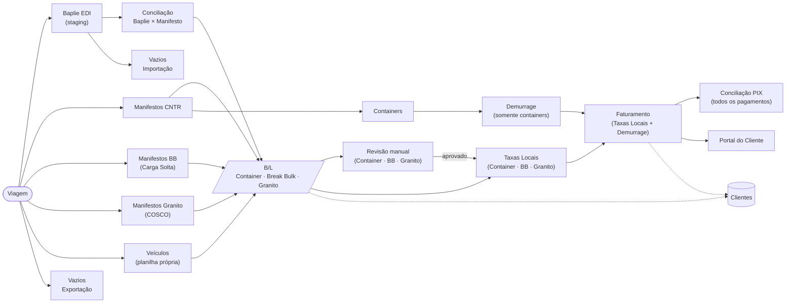
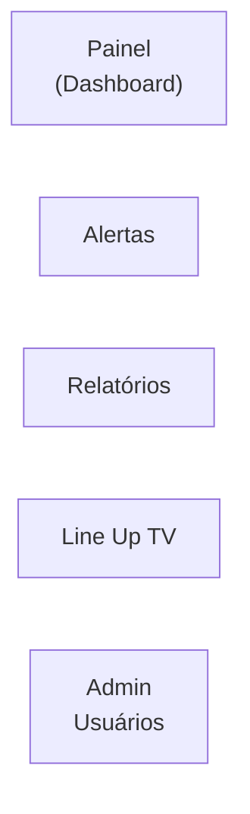

# Arquitetura do Sistema — Espinha Dorsal

Atualizado em 2026-05-23.

> Diagrama validado contra o comportamento real do código (rotas, services, schema)
> e contra a definição operacional do dono do produto. Substitui versões anteriores
> que continham imprecisões de fluxo.

---

## Fluxo principal

---

## Notas de implementação

- **B/L é o conceito unificado**, mas vive em duas tabelas: `bls` (`cargo_mode='container'|'carga_solta'`) e `granite_bls` (separada por origem do parser COSCO). Revisão, Taxas Locais, Faturamento e Conciliação PIX tratam ambas as tabelas no mesmo fluxo.
- **Vazios Importação** aceita duas fontes: o importador Baplie EDI (`importVaziosFromBaplie`) — caminho principal — e uma planilha avulsa por Viagem (`importVaziosImportacaoManifest`). Ambas escrevem em `vazios_importacao_manifests` / `vazios_importacao_containers`.
- **Veículos** são criados pela planilha própria (`vehicleImport.ts`, colunas CHASSI/MARCA/MODELO/CONTAINER/BL/...) e vinculados via FK ao `bl_id` e ao `bl_containers.id`. Não há derivação a partir do manifesto CNTR; a relação com `bl_containers` existe apenas para localizar o container físico onde o veículo foi embarcado.
- **Demurrage** trabalha exclusivamente sobre containers (`bl_containers`) e os B/Ls de container correspondentes; gera invoices em `demurrage_invoices` / `demurrage_invoice_items`. O **Faturamento** agrega tanto invoices regulares (Taxas Locais e Granito, ambos na tabela `invoices`) quanto invoices de demurrage; o **Portal do Cliente** consome ambos via RPCs próprias.
- **Conciliação PIX** processa pagamentos contra `invoices` (cobre Container, Break Bulk e Granito) e contra `demurrage_invoices` numa única passada (`matchUnifiedPixTransactions`). Não é restrita à Demurrage.
- **Taxas Locais** suporta `cargo_mode` `'container'`, `'carga_solta'` e `'granito'`. Para Granito, a página exibe os B/Ls de granito junto com os demais, e a geração de cobranças continua usando o motor próprio (`graniteCharges`) — a unificação é no ponto de entrada operacional e no schema (`charge_tables.cargo_mode`).
- **Revisão Manual** consulta `bls` (Container + BB, filtro `review_status='pending_review'`) e `granite_bls` (entrada quando o cliente não está vinculado). As três modalidades aparecem na mesma fila.
- A página antiga **`/granito/taxas`** (gestão de tarifas weight-based) permanece para administração da tabela `granite_rates`. A operação do dia-a-dia (calcular, marcar pronto, faturar) é feita pelos módulos unificados.

---

## Módulos de suporte (sem dependência de Viagem)

| Módulo | Rota | Descrição |
|---|---|---|
| Painel | `/painel` | Dashboard operacional com visão geral |
| Alertas | `/alertas` | Notificações e alertas do sistema |
| Relatórios | `/relatorios` | Exportação e consulta de relatórios |
| Line Up TV | `/line-up-tv` · `/line-up-tv/display` | Painel de TV para o terminal portuário |
| Admin Usuários | `/admin/usuarios` | Gestão de usuários (acesso admin) |

---

## Mapa de rotas completo

| Rota | Módulo | Seção |
|---|---|---|
| `/painel` | Painel | Principal |
| `/viagens` | Viagens | Principal |
| `/baplie` | Baplie EDI | Importação |
| `/manifestos` | Manifestos CNTR | Importação |
| `/manifestos/:blId` | Detalhe B/L | Importação |
| `/carga-solta` | Manifestos BB | Importação |
| `/containers` | Containers | Importação |
| `/veiculos` | Veículos | Importação |
| `/vazios-importacao` | Vazios Importação | Importação |
| `/revisao` | Revisão manual | Importação |
| `/granito` | Granito | Exportação |
| `/granito/taxas` | Taxas Granito | Exportação |
| `/embarquevazios` | Vazios Exportação | Exportação |
| `/clientes` | Clientes | Principal |
| `/clientes/:cnpj` | Ficha do Cliente | Principal |
| `/taxas-locais` | Taxas Locais | Financeiro |
| `/faturamento` | Faturamento (Invoices + Demurrage) | Financeiro |
| `/demurrage` | Demurrage | Financeiro |
| `/demurrage/taxas` | Taxas Demurrage | Financeiro |
| `/reconciliacao` | Conciliação PIX | Financeiro |
| `/alertas` | Alertas | Principal |
| `/relatorios` | Relatórios | Principal |
| `/line-up-tv` | Line Up TV | Principal |
| `/line-up-tv/display` | Display TV | Principal |
| `/admin/usuarios` | Admin Usuários | Admin |
| `/portal/login` | Login Portal | Portal |
| `/portal/billing` | Faturamento Portal | Portal |

---

## Correções aplicadas vs versão anterior do diagrama

| # | Problema na versão anterior | Correção |
|---|---|---|
| 1 | `Viagem → Vazios Importação` direto | `Baplie EDI → Vazios Importação` (caminho principal; planilha avulsa permanece como fallback) |
| 2 | `Manifestos CNTR → Veículos` | `Viagem → Veículos → B/L` (planilha própria; FK direto para `bls` e `bl_containers`) |
| 3 | Demurrage isolado, sem ligação com Faturamento | `Demurrage → Faturamento → Portal` (Faturamento agora agrega invoices de demurrage também) |
| 4 | `Demurrage → Conciliação PIX` (escopo restrito) | `Faturamento → Conciliação PIX` (cobre Container, BB, Granito e Demurrage) |
| 5 | Granito como fluxo paralelo desligado de Revisão e Taxas Locais | Granito participa de Revisão e Taxas Locais; `granite_bls` aparece na mesma fila operacional |
| 6 | `Manifestos BB` embutido em CNTR | `Carga Solta` separado, com rota e página próprias (`/carga-solta`) |
| 7 | Containers/Veículos ausentes | Containers como saída do manifesto CNTR; Veículos como fluxo independente alimentado por planilha |
| 8 | `Cliente` como nó terminal | `Clientes` é um módulo de gestão com relacionamento (tracejado) ao B/L e ao Faturamento |
