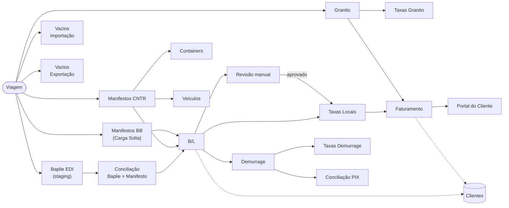
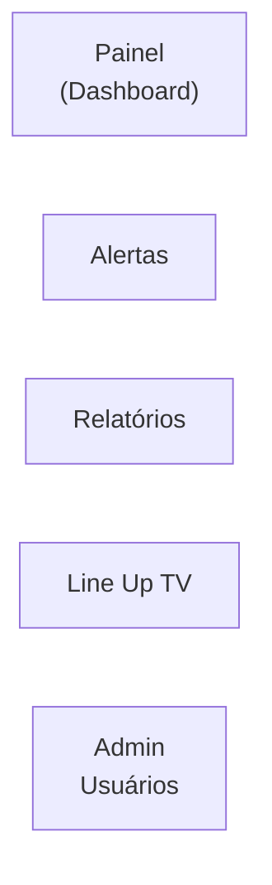

# Arquitetura do Sistema — Espinha Dorsal

Atualizado em 2026-05-22.

> Diagrama gerado a partir da estrutura real de rotas e módulos em `src/pages/` e `App.tsx`.
> Substitui o diagrama manual anterior que continha imprecisões documentadas abaixo.

---

## Fluxo principal

---

## Módulos de suporte (sem dependência de Viagem)

| Módulo | Rota | Descrição |
|---|---|---|
| Painel | `/painel` | Dashboard operacional com visão geral |
| Alertas | `/alertas` | Notificações e alertas do sistema |
| Relatórios | `/relatorios` | Exportação e consulta de relatórios |
| Line Up TV | `/line-up-tv` · `/line-up-tv/display` | Painel de TV para o terminal portuário |
| Admin Usuários | `/admin/usuarios` | Gestão de usuários (acesso admin) |

---

## Mapa de rotas completo

| Rota | Módulo | Seção |
|---|---|---|
| `/painel` | Painel | Principal |
| `/viagens` | Viagens | Principal |
| `/baplie` | Baplie EDI | Importação |
| `/manifestos` | Manifestos CNTR | Importação |
| `/manifestos/:blId` | Detalhe B/L | Importação |
| `/carga-solta` | Manifestos BB | Importação |
| `/containers` | Containers | Importação |
| `/veiculos` | Veículos | Importação |
| `/vazios-importacao` | Vazios Importação | Importação |
| `/revisao` | Revisão manual | Importação |
| `/granito` | Granito | Exportação |
| `/granito/taxas` | Taxas Granito | Exportação |
| `/embarquevazios` | Vazios Exportação | Exportação |
| `/clientes` | Clientes | Principal |
| `/clientes/:cnpj` | Ficha do Cliente | Principal |
| `/taxas-locais` | Taxas Locais | Financeiro |
| `/faturamento` | Faturamento | Financeiro |
| `/demurrage` | Demurrage | Financeiro |
| `/demurrage/taxas` | Taxas Demurrage | Financeiro |
| `/reconciliacao` | Conciliação PIX | Financeiro |
| `/alertas` | Alertas | Principal |
| `/relatorios` | Relatórios | Principal |
| `/line-up-tv` | Line Up TV | Principal |
| `/line-up-tv/display` | Display TV | Principal |
| `/admin/usuarios` | Admin Usuários | Admin |
| `/portal/login` | Login Portal | Portal |
| `/portal/billing` | Faturamento Portal | Portal |

---

## Divergências corrigidas em relação ao diagrama anterior

| # | Problema no diagrama antigo | Correção aplicada |
|---|---|---|
| 1 | `Conciliação Baplie × Manifesto → Cliente` (seta errada) | Fluxo correto: Conciliação alimenta o B/L, não o módulo de Clientes |
| 2 | `Vazios IMP/EXP` como nó único | Separados em `Vazios Importação` e `Vazios Exportação` (módulos independentes) |
| 3 | `Manifestos BB` embutido em CNTR | `Carga Solta` tem página e rota próprias (`/carga-solta`) |
| 4 | `Containers` e `Veículos` ausentes | Adicionados como sub-módulos de Manifestos CNTR |
| 5 | Conexão `Revisão → Taxas Locais` ausente | B/Ls aprovados na revisão seguem para Taxas Locais |
| 6 | Origem do `Demurrage` não mostrada | Demurrage nasce de B/Ls dentro de uma Viagem |
| 7 | Módulos de suporte ausentes | Adicionados: Alertas, Relatórios, Line Up TV, Painel, Taxas Granito, Taxas Demurrage, Admin Usuários |
| 8 | `Cliente` como nó terminal | `Clientes` é um módulo de gestão com relacionamento ao B/L e Faturamento (vínculo tracejado) |
