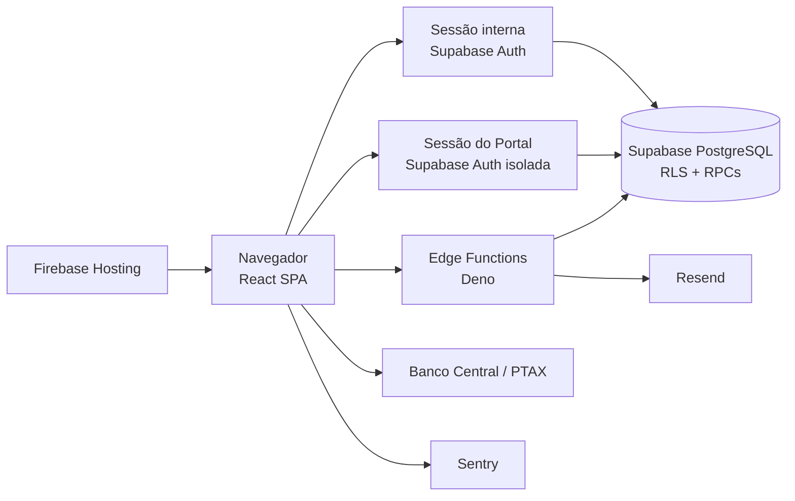
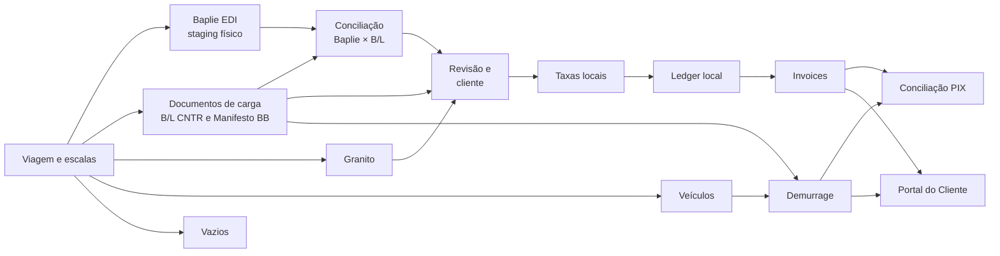

# Arquitetura do Transhipping Desk

Verificado contra o código, a configuração e as migrations em 2026-06-20.

Este é o mapa canônico da arquitetura atual. Termos de negócio vivem em
[`CONTEXT.md`](../CONTEXT.md); decisões e supersessões vivem no
[índice de ADRs](./adr/README.md).

## Visão geral



O frontend é uma SPA estática. A segurança real não depende do roteador: tabelas,
views e funções do Supabase aplicam escopo e autorização por RLS, grants e
validações dentro das RPCs.

## Fronteiras de autenticação

O projeto cria dois clientes em `src/services/supabase.ts`:

- `supabase`: sessão dos usuários internos;
- `supabasePortal`: sessão do cliente, com `storageKey` próprio.

As duas sessões podem coexistir no navegador sem que um logout derrube a outra.

### Acesso interno

O usuário autentica pelo Supabase Auth e precisa de perfil ativo em
`user_profiles`. A interface usa o perfil para navegação e UX; RLS e RPCs
continuam responsáveis pela autorização.

### Portal do Cliente

O Portal usa exclusivamente sessão do Supabase Auth. O login visível aceita
somente CNPJ e senha; a Edge Function `portal-login` resolve a identidade
técnica no servidor e devolve apenas a sessão. `portal_resolve_login(text)` não
é executável por `anon`/`authenticated`.

Essa resolução é a exceção pré-autenticação documentada para `anon`, limitada
por tentativas e erro genérico. RPCs de dados do Portal exigem sessão
autenticada e resolvem o cliente por `auth.uid()`. Veja a
[ADR 0013](./adr/0013-portal-auth-identificador-resolvido-e-excecao-anon.md).

O `PortalAuthProvider` também assina `supabasePortal.auth.onAuthStateChange`.
Eventos `SIGNED_OUT` limpam o overview local e removem todos os caches TanStack
Query com chave iniciada por `portal-`, cobrindo logout em outra aba e falha de
refresh de token. Eventos `SIGNED_IN` e `TOKEN_REFRESHED` reidratam o overview
quando necessário, sem compartilhar estado com a sessão interna.

O provisionamento operacional mantém decisão e situação da conta em eixos
separados em `customer_portal_accounts`. Convites, tentativas/eventos de email,
supressões e histórico append-only vivem respectivamente em
`portal_invites`, `portal_email_attempts`, `portal_email_events`,
`portal_suppressed_emails` e `portal_provisioning_events`. RPCs internos
autorizam transições, pré-voo/backfill e expiração idempotente; nenhum token ou
senha em claro é persistido.

## Camadas do frontend

```text
src/App.tsx
  -> páginas lazy em src/pages/
     -> hooks de estado remoto e mutations em src/hooks/
     -> serviços, parsers e regras em src/services/
     -> componentes compartilhados em src/components/
```

Essa separação é uma direção arquitetural, não uma afirmação de pureza absoluta
do código legado. Páginas ainda executam alguns comandos de serviço e operações
de importação/exportação diretamente. Novas mudanças devem reutilizar o menor
dono existente da operação, sem criar uma segunda implementação.

As páginas são carregadas sob demanda (`React.lazy`) e bibliotecas pesadas como
`@e965/xlsx` entram por `await import(...)`, fora do grafo estático da rota. Cada
rota tem um orçamento de **50 ms** de parse/compile de JS, verificável por
`scripts/perf/measure-page-load.mjs` — ver [setup/testing.md](./setup/testing.md#orçamento-de-carga-das-rotas-performance).

### Responsabilidades

- `src/pages/`: composição de rotas, estado visual e fluxos de tela;
- `src/hooks/`: queries e mutations reutilizáveis com TanStack Query;
- `src/services/`: acesso ao Supabase, parsers, importadores e domínio;
- `src/components/ui/`: primitivas visuais;
- `src/components/shared/`: componentes reutilizados por módulos;
- `src/lib/`: utilitários puros, datas, status, PIX e telemetria;
- `src/types/database.ts`: tipos gerados e complementos tipados do banco.

### Como rastrear uma interação

Use [`docs/RASTREABILIDADE.md`](./RASTREABILIDADE.md) para partir de uma rota ou
ação e localizar o componente, hook/serviço, contrato Supabase, efeitos de cache,
testes e evidência de runtime. A explicação completa permanece no documento vivo
do módulo proprietário.

## Fluxo operacional e financeiro



### Importações

- Baplie entra em staging por viagem e pode alimentar Vazios de Importação.
- Arquivos de B/L alimentam os B/Ls e cargas de container; Manifestos BB mantêm
  seu fluxo próprio. A importação de Manifesto CNTR e a geração local de EDI
  Mercante foram removidas conforme a ADR 0025.
- Granito mantém tabelas próprias, integradas downstream.
- Veículos são importados por planilha e vinculados a B/L/container.
- CE Mercante e datas operacionais têm importadores específicos.
- Arquivos de planilha usam `@e965/xlsx` e devem passar pelo limite de upload
  antes do parsing.

### Revisão e auto-faturamento

Revisão resolve pendências operacionais e de cliente. O banco calcula o gate por
estado real: cliente vinculado, e-mail cadastrado, portal ativo com
`auth_user_id` e peso BB quando aplicável. `save_bl_review` é o único autor do
status e de sua auditoria; importação, promoção para `ready_for_billing` e
invoice recalculam o mesmo contrato. Ao zerar as pendências, o sistema tenta
recalcular cobranças e emitir a invoice. A correção não executa backfill nem
reabre B/Ls históricos já faturados.

### Taxas locais e ledger

Taxas locais geram recebíveis por B/L. `bl_receivables`,
`invoice_receivable_links`, `ledger_settlements` e eventos de ciclo de vida são
a fonte de saldo, reemissão e consolidação.

### Demurrage

Demurrage depende de descarga, devolução, free time e tarifa por equipamento.
Permanece em tabelas próprias, mas aparece nas mesmas superfícies de faturamento,
Portal e conciliação.

### Documentos imprimíveis

Invoices são componentes React preparados para impressão. Cabeçalho, título,
cliente e rodapé compartilhados vivem em
`src/components/shared/InvoiceDocumentKit.tsx`; regras de impressão vivem em
`src/index.css`. A geração do arquivo é feita pelo diálogo de impressão do
navegador via `window.print()`.

## Programação de navios

`/chegadas-saidas` cria ou anexa a própria `voyage` operacional e marca
`voyages.show_on_portal` para publicar a programação no Dashboard do Portal. O
widget não lê mais `vessel_schedules`; ele chama a RPC allowlisted
`portal_ship_schedule`, que projeta viagens ativas e visíveis sobre a constante
única de portos-vitrine. As tabelas legadas `vessel_schedules` e
`ended_vessels` permanecem no histórico de schema, mas não são fonte do fluxo
atual.

## Supabase

### Migrations

`supabase/migrations/` contém a história completa do schema, com arquivos
sequenciais antigos e arquivos por timestamp. O número de arquivos não é um
contrato. O estado de um ambiente é definido pelo histórico aplicado, não por
um intervalo fixo documentado.

### Segurança

- RLS protege tabelas expostas;
- helpers como `is_active_user()` e `is_admin()` sustentam policies;
- operações financeiras e destrutivas usam RPCs ou policies restritas;
- funções privilegiadas têm `search_path` controlado e grants explícitos;
- `anon` segue default-deny, exceto funções pré-autenticação documentadas;
- Edge Functions com service role validam chamador, origem ou segredo.

### Edge Functions

- `portal-login`: resolve CNPJ para a identidade técnica e devolve a sessão;
- `portal-invite-send` e `portal-invite-activate`: enviam o convite de uso
  único e criam a identidade técnica Auth somente na ativação;
- `portal-password-recovery` e `portal-password-reset`: recuperação de senha
  por link de uso único;
- `portal-recovery-email-change`: troca do email de recuperação com
  confirmação;
- `portal-account-suspend`: suspensão/reativação de conta do Portal;
- `portal-email-webhook` e `portal-daily-digest`: eventos de entrega do Resend
  e resumo diário interno;
- `recalc-demurrage-ptax`: recálculo diário do BRL das invoices de demurrage;
- `notify-invoice-issued`: implementada para enviar email via Resend na
  emissão de invoice, mas **não está ativa**. Não há Database Webhook
  configurado, o `RESEND_API_KEY` não está provisionado e, por decisão atual,
  o projeto não dispara email para clientes. A notificação ao cliente acontece
  in-app (gatilho `trg_notify_invoice_issued`). Reativar é trabalho futuro,
  fora do escopo atual.

O Portal não participa do gate financeiro de revisão/faturamento. As migrations
188–190 criam alertas preventivos e exceções críticas por fatura, mantendo a
pendência geral separada do ciclo da fatura.

## Integrações externas

- **Resend:** email de invoice emitida — código presente, porém **inativo**
  (sem webhook, sem chave, sem plano atual de envio ao cliente);
- **Banco Central:** cotação PTAX;
- **Sentry:** erros do frontend em produção;
- **Firebase Hosting:** distribuição da SPA;
- **PIX:** payload persistido e QR renderizado nos documentos financeiros.

### Telemetria do Portal

Erros globais de queries e mutations TanStack Query são reportados ao Sentry via
`reportCaughtException`, com `context=TanStack Query` e a `queryKey` ou
`mutationKey` serializada em `extra`. O `PortalAuthProvider` define
`Sentry.setUser({ id: customer_id })` e a tag `area=portal` quando o overview do
cliente é carregado; no logout ou `SIGNED_OUT`, limpa o usuário com
`Sentry.setUser(null)`. O projeto mantém `sendDefaultPii: false` e não envia
email, nome, documento ou contato do cliente como identidade Sentry.

Domínios usados pelo navegador precisam permanecer compatíveis com a CSP de
`firebase.json`.

## Mapa de rotas

Redirecionamentos ativos: `/vazios → /embarquevazios`, `/demurrage/invoices → /demurrage`, `/demurrage/reconciliacao → /reconciliacao`.

### Públicas e autenticação

| Rota | Destino |
|---|---|
| `/login` | Login interno |
| `/portal/login` | Login do Portal |
| `/portal/esqueci-senha` | Solicitação de recuperação |
| `/portal/recuperar-senha` | Definição de nova senha |
| `/portal/ativar` | Ativação de convite sem login automático |
| `/clientes/portal` | Console operacional de provisionamento do Portal |

### Portal autenticado

| Rota | Destino |
|---|---|
| `/portal` | Dashboard do cliente |
| `/portal/billing` | Faturas de taxas locais e demurrage |
| `/portal/operacao` | B/Ls e containers |
| `/portal/perfil` | Contatos e perfil |

### Aplicação interna

| Rota | Destino |
|---|---|
| `/painel` | Dashboard operacional |
| `/viagens` | Lista e seleção de viagens |
| `/viagens/:voyageId` | Detalhe master-detail deep-linkável |
| `/baplie` | Importação e conciliação Baplie |
| `/manifestos` | Lista de B/Ls CNTR; importação documental por arquivo de B/L |
| `/manifestos/:blId` | Detalhe do B/L |
| `/carga-solta` | Manifestos breakbulk |
| `/containers` | Containers |
| `/veiculos` | Veículos RoRo |
| `/vazios-importacao` | Vazios de importação |
| `/embarquevazios` | Bookings de vazios de exportação |
| `/granito` | Operação de Granito |
| `/granito/taxas` | Tarifas de Granito |
| `/revisao` | Revisão operacional |
| `/clientes` | Clientes |
| `/clientes/:cnpj` | Ficha do cliente |
| `/taxas-locais` | Tabelas e overrides |
| `/faturamento` | Validação, invoices e ledger |
| `/demurrage` | Operação e invoices de demurrage |
| `/demurrage/taxas` | Tarifas de demurrage |
| `/reconciliacao` | Conciliação PIX |
| `/alertas` | Alertas internos |
| `/relatorios` | Relatórios e exportações |
| `/line-up-tv` | Administração do Line Up |
| `/line-up-tv/display` | Display protegido para TV |
| `/chegadas-saidas` | Programação exibida no Portal |
| `/admin/usuarios` | Administração de usuários |

### Redirecionamentos de compatibilidade

| Rota | Redireciona para |
|---|---|
| `/vazios` | `/embarquevazios` |
| `/demurrage/invoices` | `/demurrage` |
| `/demurrage/reconciliacao` | `/reconciliacao` |

Rotas desconhecidas redirecionam para `/painel`.

Emails transacionais passam por `portalEmail.ts` e seus templates, com
idempotência, retries de falhas transitórias e supressão. As Edge Functions
`portal-email-webhook` e `portal-daily-digest` usam `RESEND_WEBHOOK_SECRET`,
`RESEND_API_KEY`, `PORTAL_FROM_EMAIL` e `PORTAL_REPLY_TO`; sem chave Resend o
envio fica em dry-run. Domínio próprio verificado continua sendo gate para
envio real.

### Console de provisionamento pré-piloto

`/clientes/portal` é uma fila dedicada, alimentada por `portal_list_provisioning_console` (migrations `196` e `197`) e com gestão inline reutilizada na ficha de Cliente. A RPC projeta dados completos para Administrativo, Documentação e Financeiro; Operações recebe situação resumida e os booleanos `has_open_invoice`/`has_active_process`.

## Fontes relacionadas

- [`docs/README.md`](./README.md): mapa e autoridade documental;
- [`WORKFLOW.md`](../WORKFLOW.md): execução, desenvolvimento, testes e deploy;
- [`docs/ROADMAP.md`](./ROADMAP.md): baseline, evolução e riscos;
- [`docs/operations/validacao.md`](./operations/validacao.md): provas funcionais e técnicas;
- [`docs/adr/README.md`](./adr/README.md): decisões arquiteturais.
