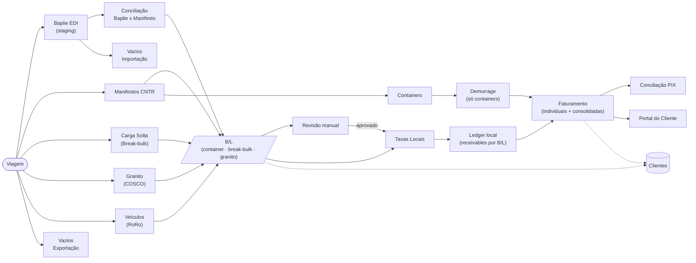

# Arquitetura do Sistema

> **Atualizado:** 2026-06-18 · Fonte de verdade técnica: stack, camadas, estrutura de pastas e fluxo operacional canônico.

Para navegar a documentação, comece pelo [índice](README.md). Para termos de domínio, ver [Glossário](GLOSSARIO.md).

---

## 1. Stack real

| Camada | Tecnologia |
|---|---|
| Frontend | React **19** + TypeScript ~6 + Vite **8** + Tailwind **v4** + React Router **v7** |
| Data layer | `@tanstack/react-query` v5 · `@supabase/supabase-js` v2 · Zod v4 |
| Backend | Supabase — PostgreSQL + RLS + Auth (JWT) + Edge Functions (Deno) |
| Planilhas / QR | `@e965/xlsx` (fork SheetJS) · `qrcode.react` (PIX) |
| Observabilidade | Sentry (`@sentry/react`) |
| Hosting / CI-CD | Firebase Hosting + GitHub Actions |

Banco com **127 migrations** sequenciais, **~120 RPCs** (`SECURITY DEFINER`), **~49 services** TypeScript e **2 Edge Functions**. O domínio e a UI são em **português**; o código estrutural é em **inglês**.

---

## 2. Camadas (page → hook → service)

```
NAVEGADOR (SPA)
  pages/        Uma página por rota. Consome hooks, renderiza UI. Export nomeado.
    │ usa
  hooks/        React Query (useQuery/useMutation): cache, invalidação, estado de domínio.
    │ chama
  services/     Funções puras de acesso ao Supabase + parsers de arquivo. Lançam em erro.
    │ HTTPS / WSS
SUPABASE
  Postgres + RLS    Autorização real (políticas por role).
  RPCs (PL/pgSQL)   Lógica financeira transacional (invoices, ledger, PIX, numeração).
  Auth (JWT)        Duas fronteiras: interna e portal.
  Edge Functions    provision-portal-user · notify-invoice-issued.
```

**Princípios aplicados:**

- **Separação service/hook/page** — convenção codificada na skill `.claude/skills/react-query-pattern.skill`. Chaves de cache centralizadas em `src/services/queryKeys.ts`.
- **Segurança no banco (RLS-first)** — a fronteira de autorização vive em RLS + funções `SECURITY DEFINER`. Checagens no cliente (`can()`, `isAdmin`) são apenas UX. Ver [Segurança](operations/seguranca.md).
- **Lógica financeira transacional no banco** — criação de invoice, numeração, consolidação e PIX são RPCs atômicas. Ver [Regras de negócio](operations/regras-de-negocio.md).
- **Lazy loading por rota** — cada página é um chunk dinâmico (`lazyPage()`); libs pesadas (`xlsx`) entram via `await import()`.

---

## 3. Fluxo operacional canônico



**Notas do fluxo:**

- **B/L é o conceito operacional unificado**, mas vive em duas origens: `bls` (`cargo_mode = 'container' | 'carga_solta'`) e `granite_bls` (parser COSCO). Revisão, Taxas Locais, Faturamento e PIX tratam ambas no mesmo fluxo.
- **Gate de faturamento:** revisão de pendências + reconciliação de cliente antes de emitir invoice (ADR 0006).
- **Ledger local** (`bl_receivables`, `invoice_receivable_links`, `ledger_settlements`, `invoice_lifecycle_events`) é a fonte de saldo de taxas locais. Demurrage mantém persistência própria (ADR 0008).
- **Conciliação PIX** unifica invoices locais/Granito/Demurrage; no ledger local, concilia por TXID.

---

## 4. Mapa de rotas → módulo → doc

| Rota | Módulo | Doc |
|---|---|---|
| `/painel` | Painel | [operacao-suporte](modules/operacao-suporte.md) |
| `/viagens` · `/viagens/:voyageId` | Viagens (master-detail) | [viagens](modules/viagens.md) |
| `/manifestos` · `/manifestos/:blId` | Manifestos CNTR · BlDetalhe | [manifesto-edi](modules/manifesto-edi.md) |
| `/carga-solta` | Carga Solta (break-bulk) | [manifesto-edi](modules/manifesto-edi.md) |
| `/containers` | Containers | [manifesto-edi](modules/manifesto-edi.md) |
| `/veiculos` | Veículos (RoRo) | [manifesto-edi](modules/manifesto-edi.md) |
| `/baplie` | Baplie EDI | [manifesto-edi](modules/manifesto-edi.md) |
| `/vazios-importacao` | Vazios Importação | [manifesto-edi](modules/manifesto-edi.md) |
| `/embarquevazios` (`/vazios` →) | Vazios Exportação | [manifesto-edi](modules/manifesto-edi.md) |
| `/chegadas-saidas` | Chegadas/Saídas (schedule de navios) | [chegadas-saidas](modules/chegadas-saidas.md) |
| `/revisao` | Revisão manual | [operacao-suporte](modules/operacao-suporte.md) |
| `/granito` · `/granito/taxas` | Granito | [granito](modules/granito.md) |
| `/clientes` · `/clientes/:cnpj` | Clientes · ClienteFicha | [clientes](modules/clientes.md) |
| `/taxas-locais` | Taxas Locais | [taxas-locais](modules/taxas-locais.md) |
| `/faturamento` | Faturamento | [faturamento](modules/faturamento.md) |
| `/demurrage` · `/demurrage/taxas` | Demurrage | [demurrage](modules/demurrage.md) |
| `/reconciliacao` | Conciliação PIX | [reconciliacao-pix](modules/reconciliacao-pix.md) |
| `/alertas` · `/relatorios` | Alertas · Relatórios | [operacao-suporte](modules/operacao-suporte.md) |
| `/line-up-tv` · `/line-up-tv/display` | Line-Up TV | [operacao-suporte](modules/operacao-suporte.md) |
| `/admin/usuarios` | Admin Usuários | [operacao-suporte](modules/operacao-suporte.md) |
| `/portal/login` · `/portal/esqueci-senha` · `/portal/recuperar-senha` | Portal — auth | [portal-cliente](modules/portal-cliente.md) |
| `/portal` · `/portal/billing` · `/portal/operacao` · `/portal/perfil` | Portal do Cliente | [portal-cliente](modules/portal-cliente.md) |

Redirecionamentos ativos: `/vazios → /embarquevazios`, `/demurrage/invoices → /demurrage`, `/demurrage/reconciliacao → /reconciliacao`.

---

## 5. Estrutura de pastas do código

```
src/
  App.tsx              Rotas + lazy loading de todas as páginas (guards: ProtectedRoute, PortalProtectedRoute)
  main.tsx             Bootstrap: QueryClient, providers, ErrorBoundary
  index.css            Tailwind v4 + design tokens (variáveis CSS de tema)
  pages/               Uma página por rota (export nomeado) + helpers *Helpers.ts
  components/
    ui/                Primitivos: Button, Input/Field, Modal, Badge, Card, Toast, ConfirmDialog, Combobox, Skeleton
    layout/            AppLayout, HeaderInfoBar, ProtectedRoute, PortalLayout, PortalProtectedRoute, appLayoutNav.ts
    shared/            Componentes de domínio entre páginas (modais de import, voyage modals)
    billing/           Documentos de invoice (taxas locais) + ValidacaoTab + tabelas
    demurrage/         Documento de invoice de demurrage
    taxasLocais/       Abas de tabelas e overrides
    voyages/           VoyageCard, VoyageRail, VoyageFilters
    portal/            DisputeModal, NotificationBell, PortalConsolidatedModal, ShipScheduleWidget
    lineup/ · bl/      Tabela de line-up · abas do BlDetalhe
  hooks/               use* — React Query + lógica de domínio
  services/            Acesso ao Supabase + parsers
    charges/           Sub-módulo de taxas locais (rate/operations/table/recon)
    demurrage/         Sub-módulo de demurrage (containers/invoices/rates/kpis)
    __tests__/         Testes unitários + fixtures
  lib/                 Utilitários sem UI: pix, containerCounts, utils, fileGuard, dates, csv, telemetry
  config/              Constantes (company.ts)
  types/               database.ts (GERADO — não editar) + tipos de domínio
  integration/         Testes de integração opt-in (Supabase real)

supabase/
  migrations/          127 migrations sequenciais (schema + RLS + RPCs)
  functions/           Edge Functions Deno (notify-invoice-issued, provision-portal-user)
  scripts/             reset_operational_data.sql
  seeds/               validation_seed.sql

public/templates/      Modelos de importação (csv/xlsx) servidos ao usuário
.github/workflows/     ci.yml · auto-merge-prs.yml · firebase-deploy.yml
docs/                  Esta documentação
```

---

## 6. Modelo de dados (núcleo)

```
carriers ──< vessels ──< voyages ──< bls ──< bl_containers
                                       │        └──< vehicles
                                       ├──< bl_breakbulk_items
                                       ├──< charge_calculations ──> charge_tables ──< charge_table_items
                                       └──< invoice_bls / invoice_receivable_links ──> invoices ──< payments
customers ──< customer_contacts
          ──< customer_portal_accounts ──< customer_portal_sessions
          ──< customer_rate_overrides
          ──< customer_reconciliation_queue

Granito:   granite_manifests ──< granite_bls ──< granite_bl_charges ; granite_rates ; invoice_granite_bls
Demurrage: demurrage_rates ; demurrage_invoices ──< demurrage_invoice_items
Vazios:    vazios_manifests ──< vazios_bookings (export) ; vazios_importacao_manifests ──< vazios_importacao_containers (import) ; baplie_containers (staging EDI)
Ledger:    bl_receivables ──< invoice_receivable_links ; ledger_settlements ; invoice_counters ; invoice_lifecycle_events ; invoice_refunds ; billing_runs ──< billing_run_logs ; billing_batches
Schedule:  vessel_schedules ; voyage_export_schedules ; ended_vessels
Suporte:   user_profiles ; audit_logs ; alerts ; ports ; import_batches ──< import_errors ;
           portal_notifications ; portal_login_attempts ; portal_login_resolution_attempts ; portal_rate_limits ;
           provision_rate_limit_log ; pricing_rule_versions
```

Detalhes por módulo nos docs de [modules/](README.md#módulos).

---

## 7. Integrações externas

| Serviço | Uso | Onde |
|---|---|---|
| **Resend** | Email de invoice emitida | Edge Function `notify-invoice-issued` |
| **Banco Central** (`olinda.bcb.gov.br`) | Cotação ROE / câmbio | `src/hooks/useExchangeRates.ts` |
| **PIX** | Payload de pagamento | `src/lib/pix.ts` + RPC `build_transshipping_pix_payload` |
| **Firebase Hosting** | Hospedagem da SPA | CI/CD |
| **Sentry** | Telemetria de erros | `src/lib/telemetry.ts` |

Domínios externos precisam estar na **CSP** do `firebase.json` (`connect-src`). Ver [Deploy](setup/deploy.md) e [Segurança](operations/seguranca.md).

---

## 8. Documentação relacionada

- [Decisões arquiteturais (ADRs)](adr/) — decisões numeradas e aceitas.
- [Roadmap](ROADMAP.md) — estado atual e backlog.
- [Changelog](CHANGELOG.md) — histórico de entregas.
- [Regras de negócio](operations/regras-de-negocio.md) · [Segurança](operations/seguranca.md)
- [Setup](setup/development.md) · [Deploy](setup/deploy.md) · [Testes](setup/testing.md)
