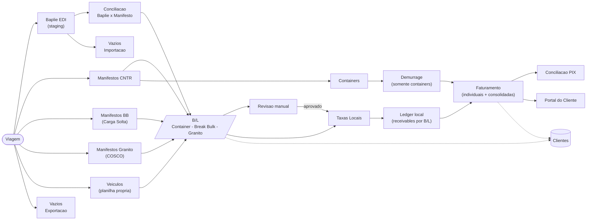

# Arquitetura do Sistema - Espinha Dorsal

Atualizado em 2026-06-01.

Este documento descreve a fonte de verdade operacional do codigo atual: rotas, servicos, schema Supabase e fluxo financeiro.

## Fluxo principal

## Notas de implementacao

- **B/L e o conceito operacional unificado**, mas vive em duas origens: `bls` (`cargo_mode='container'|'carga_solta'`) e `granite_bls` para o parser COSCO.
- **Vazios Importacao** aceita Baplie EDI (`importVaziosFromBaplie`) e planilha avulsa por viagem (`importVaziosImportacaoManifest`). As duas fontes escrevem em `vazios_importacao_manifests` / `vazios_importacao_containers`.
- **Vazios Exportacao** usa planilha propria e grava `vazios_manifests` / `vazios_bookings`.
- **Veiculos** sao criados por planilha propria (`vehicleImport.ts`) e vinculados ao B/L e ao container fisico quando aplicavel. Nao sao derivados do manifesto CNTR.
- **Taxas Locais** suporta `container`, `carga_solta` e `granito`. A pagina `/taxas-locais` administra tabelas e overrides; a operacao de validacao/faturamento fica em `/faturamento`.
- **Revisao Manual** combina `bls` e `granite_bls` numa fila operacional para pendencias de cliente, CE Mercante, peso e inconsistencias de calculo.
- **Ledger local** usa `bl_receivables`, `invoice_receivable_links`, `ledger_settlements` e `invoice_lifecycle_events` como fonte de saldo para taxas locais. Invoices individuais e consolidadas sao documentos ligados a receivables.
- **Faturamento** agrega invoices locais (`invoices`), invoices de Granito e invoices de Demurrage. Pagamentos locais elegiveis passam pela RPC transacional de ledger; Demurrage permanece em fluxo proprio.
- **Conciliacao PIX** usa fluxo unificado para invoices locais/Granito/Demurrage e, no ledger local, conciliacao por TXID.
- **Portal do Cliente** consome saldos locais a partir do ledger e tambem expoe documentos financeiros emitidos.

## Modulos de suporte

| Modulo | Rota | Descricao |
|---|---|---|
| Painel | `/painel` | Dashboard operacional com visao geral |
| Alertas | `/alertas` | Notificacoes e alertas do sistema |
| Relatorios | `/relatorios` | Exportacao e consulta de relatorios |
| Line Up TV | `/line-up-tv`, `/line-up-tv/display` | Painel de TV para o terminal portuario |
| Admin Usuarios | `/admin/usuarios` | Gestao de usuarios (acesso admin) |

## Mapa de rotas

| Rota | Modulo | Secao |
|---|---|---|
| `/painel` | Painel | Principal |
| `/viagens` | Viagens | Principal |
| `/baplie` | Baplie EDI | Importacao |
| `/manifestos` | Manifestos CNTR | Importacao |
| `/manifestos/:blId` | Detalhe B/L | Importacao |
| `/carga-solta` | Manifestos BB | Importacao |
| `/containers` | Containers | Importacao |
| `/veiculos` | Veiculos | Importacao |
| `/vazios-importacao` | Vazios Importacao | Importacao |
| `/revisao` | Revisao manual | Importacao |
| `/granito` | Granito | Exportacao |
| `/granito/taxas` | Taxas Granito | Exportacao |
| `/embarquevazios` | Vazios Exportacao | Exportacao |
| `/clientes` | Clientes | Principal |
| `/clientes/:cnpj` | Ficha do Cliente | Principal |
| `/taxas-locais` | Taxas Locais | Financeiro |
| `/faturamento` | Faturamento | Financeiro |
| `/demurrage` | Demurrage | Financeiro |
| `/demurrage/taxas` | Taxas Demurrage | Financeiro |
| `/reconciliacao` | Conciliacao PIX | Financeiro |
| `/alertas` | Alertas | Principal |
| `/relatorios` | Relatorios | Principal |
| `/line-up-tv` | Line Up TV | Principal |
| `/line-up-tv/display` | Display TV | Principal |
| `/admin/usuarios` | Admin Usuarios | Admin |
| `/portal/login` | Login Portal | Portal |
| `/portal/billing` | Faturamento Portal | Portal |

## Documentacao viva

- `docs/ROADMAP.md`: estado atual, evolucao e backlog priorizado.
- `docs/VALIDACAO.md`: roteiro de validacao tecnica e funcional.
- `docs/RESET_AMBIENTE.md`: reset de dados operacionais de teste.
