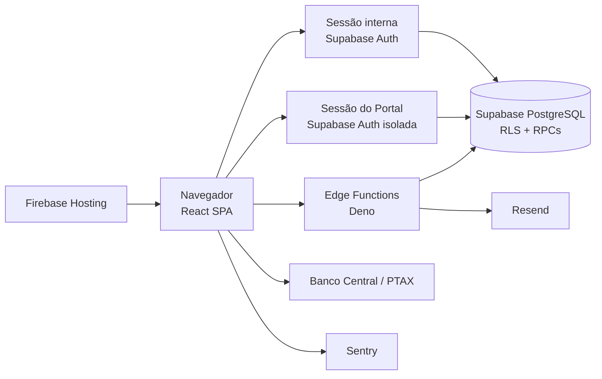
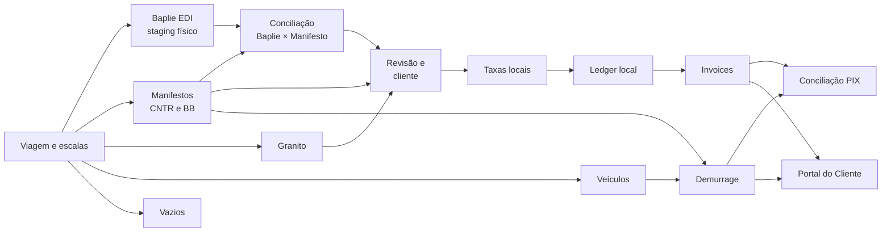

# Arquitetura do Transhipping Desk

Verificado contra o código, a configuração e as migrations em 2026-06-20.

Este é o mapa canônico da arquitetura atual. Termos de negócio vivem em
[`docs/GLOSSARIO.md`](./GLOSSARIO.md); decisões e supersessões vivem no
[índice de ADRs](./adr/README.md).

## Visão geral



O frontend é uma SPA estática. A segurança real não depende do roteador: tabelas,
views e funções do Supabase aplicam escopo e autorização por RLS, grants e
validações dentro das RPCs.

## Fronteiras de autenticação

O projeto cria dois clientes em `src/services/supabase.ts`:

- `supabase`: sessão dos usuários internos;
- `supabasePortal`: sessão do cliente, com `storageKey` próprio.

As duas sessões podem coexistir no navegador sem que um logout derrube a outra.

### Acesso interno

O usuário autentica pelo Supabase Auth e precisa de perfil ativo em
`user_profiles`. A interface usa o perfil para navegação e UX; RLS e RPCs
continuam responsáveis pela autorização.

### Portal do Cliente

O Portal usa exclusivamente sessão do Supabase Auth. CNPJ, CPF e email são
identificadores aceitos na tela. Quando o identificador é um documento,
`portal_resolve_login(text)` resolve o email técnico antes de
`signInWithPassword`.

Essa resolução é a exceção pré-autenticação documentada para `anon`, limitada
por tentativas e erro genérico. RPCs de dados do Portal exigem sessão
autenticada e resolvem o cliente por `auth.uid()`. Veja a
[ADR 0013](./adr/0013-portal-auth-identificador-resolvido-e-excecao-anon.md).

## Camadas do frontend

```text
src/App.tsx
  -> páginas lazy em src/pages/
     -> hooks de estado remoto e mutations em src/hooks/
     -> serviços, parsers e regras em src/services/
     -> componentes compartilhados em src/components/
```

Essa separação é uma direção arquitetural, não uma afirmação de pureza absoluta
do código legado. Páginas ainda executam alguns comandos de serviço e operações
de importação/exportação diretamente. Novas mudanças devem reutilizar o menor
dono existente da operação, sem criar uma segunda implementação.

### Responsabilidades

- `src/pages/`: composição de rotas, estado visual e fluxos de tela;
- `src/hooks/`: queries e mutations reutilizáveis com TanStack Query;
- `src/services/`: acesso ao Supabase, parsers, importadores e domínio;
- `src/components/ui/`: primitivas visuais;
- `src/components/shared/`: componentes reutilizados por módulos;
- `src/lib/`: utilitários puros, datas, status, PIX e telemetria;
- `src/types/database.ts`: tipos gerados e complementos tipados do banco.

### Como rastrear uma interação

Use [`docs/RASTREABILIDADE.md`](./RASTREABILIDADE.md) para partir de uma rota ou
ação e localizar o componente, hook/serviço, contrato Supabase, efeitos de cache,
testes e evidência de runtime. A explicação completa permanece no documento vivo
do módulo proprietário.

## Fluxo operacional e financeiro



### Importações

- Baplie entra em staging por viagem e pode alimentar Vazios de Importação.
- Manifestos CNTR e BB alimentam B/Ls e suas cargas; o gate canônico de revisão
  é aplicado aos IDs do novo lote antes do cálculo/faturamento.
- Granito mantém tabelas próprias, integradas downstream.
- Veículos são importados por planilha e vinculados a B/L/container.
- CE Mercante e datas operacionais têm importadores específicos.
- Arquivos de planilha usam `@e965/xlsx` e devem passar pelo limite de upload
  antes do parsing.

### Revisão e auto-faturamento

Revisão resolve pendências operacionais e de cliente. O banco calcula o gate por
estado real: cliente vinculado, e-mail cadastrado, portal ativo com
`auth_user_id` e peso BB quando aplicável. `save_bl_review` é o único autor do
status e de sua auditoria; importação, promoção para `ready_for_billing` e
invoice recalculam o mesmo contrato. Ao zerar as pendências, o sistema tenta
recalcular cobranças e emitir a invoice. A correção não executa backfill nem
reabre B/Ls históricos já faturados.

### Taxas locais e ledger

Taxas locais geram recebíveis por B/L. `bl_receivables`,
`invoice_receivable_links`, `ledger_settlements` e eventos de ciclo de vida são
a fonte de saldo, reemissão e consolidação.

### Demurrage

Demurrage depende de descarga, devolução, free time e tarifa por equipamento.
Permanece em tabelas próprias, mas aparece nas mesmas superfícies de faturamento,
Portal e conciliação.

### Documentos imprimíveis

Invoices são componentes React preparados para impressão. Cabeçalho, título,
cliente e rodapé compartilhados vivem em
`src/components/shared/InvoiceDocumentKit.tsx`; regras de impressão vivem em
`src/index.css`. A geração do arquivo é feita pelo diálogo de impressão do
navegador via `window.print()`.

## Programação de navios

`/chegadas-saidas` administra `vessel_schedules` e o histórico de navios
encerrados. A programação alimenta o widget exibido no Dashboard do Portal. Esse
cadastro é separado das viagens operacionais, embora compartilhe navio e número
de viagem como linguagem de negócio.

## Supabase

### Migrations

`supabase/migrations/` contém a história completa do schema, com arquivos
sequenciais antigos e arquivos por timestamp. O número de arquivos não é um
contrato. O estado de um ambiente é definido pelo histórico aplicado, não por
um intervalo fixo documentado.

### Segurança

- RLS protege tabelas expostas;
- helpers como `is_active_user()` e `is_admin()` sustentam policies;
- operações financeiras e destrutivas usam RPCs ou policies restritas;
- funções privilegiadas têm `search_path` controlado e grants explícitos;
- `anon` segue default-deny, exceto funções pré-autenticação documentadas;
- Edge Functions com service role validam chamador, origem ou segredo.

### Edge Functions

- `provision-portal-user`: cria ou atualiza o usuário Auth do Portal;
- `notify-invoice-issued`: busca a invoice e envia email pelo Resend.

## Integrações externas

- **Resend:** email de invoice emitida;
- **Banco Central:** cotação PTAX;
- **Sentry:** erros do frontend em produção;
- **Firebase Hosting:** distribuição da SPA;
- **PIX:** payload persistido e QR renderizado nos documentos financeiros.

Domínios usados pelo navegador precisam permanecer compatíveis com a CSP de
`firebase.json`.

## Mapa de rotas

Redirecionamentos ativos: `/vazios → /embarquevazios`, `/demurrage/invoices → /demurrage`, `/demurrage/reconciliacao → /reconciliacao`.

### Públicas e autenticação

| Rota | Destino |
|---|---|
| `/login` | Login interno |
| `/portal/login` | Login do Portal |
| `/portal/esqueci-senha` | Solicitação de recuperação |
| `/portal/recuperar-senha` | Definição de nova senha |

### Portal autenticado

| Rota | Destino |
|---|---|
| `/portal` | Dashboard do cliente |
| `/portal/billing` | Faturas de taxas locais e demurrage |
| `/portal/operacao` | B/Ls e containers |
| `/portal/perfil` | Contatos e perfil |

### Aplicação interna

| Rota | Destino |
|---|---|
| `/painel` | Dashboard operacional |
| `/viagens` | Lista e seleção de viagens |
| `/viagens/:voyageId` | Detalhe master-detail deep-linkável |
| `/baplie` | Importação e conciliação Baplie |
| `/manifestos` | Manifestos CNTR |
| `/manifestos/:blId` | Detalhe do B/L |
| `/carga-solta` | Manifestos breakbulk |
| `/containers` | Containers |
| `/veiculos` | Veículos RoRo |
| `/vazios-importacao` | Vazios de importação |
| `/embarquevazios` | Bookings de vazios de exportação |
| `/granito` | Operação de Granito |
| `/granito/taxas` | Tarifas de Granito |
| `/revisao` | Revisão operacional |
| `/clientes` | Clientes |
| `/clientes/:cnpj` | Ficha do cliente |
| `/taxas-locais` | Tabelas e overrides |
| `/faturamento` | Validação, invoices e ledger |
| `/demurrage` | Operação e invoices de demurrage |
| `/demurrage/taxas` | Tarifas de demurrage |
| `/reconciliacao` | Conciliação PIX |
| `/alertas` | Alertas internos |
| `/relatorios` | Relatórios e exportações |
| `/line-up-tv` | Administração do Line Up |
| `/line-up-tv/display` | Display protegido para TV |
| `/chegadas-saidas` | Programação exibida no Portal |
| `/admin/usuarios` | Administração de usuários |

### Redirecionamentos de compatibilidade

| Rota | Redireciona para |
|---|---|
| `/vazios` | `/embarquevazios` |
| `/demurrage/invoices` | `/demurrage` |
| `/demurrage/reconciliacao` | `/reconciliacao` |

Rotas desconhecidas redirecionam para `/painel`.

## Fontes relacionadas

- [`docs/README.md`](./README.md): mapa e autoridade documental;
- [`WORKFLOW.md`](../WORKFLOW.md): execução, desenvolvimento, testes e deploy;
- [`docs/ROADMAP.md`](./ROADMAP.md): baseline, evolução e riscos;
- [`docs/operations/validacao.md`](./operations/validacao.md): provas funcionais e técnicas;
- [`docs/adr/README.md`](./adr/README.md): decisões arquiteturais.
