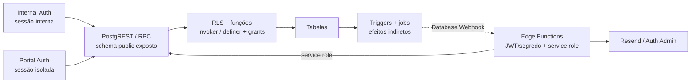

# Rastreabilidade Técnica

Verificado contra o repositório em 2026-07-02.

Este índice liga cada rota e ação relevante aos chamadores do frontend, aos
contratos executáveis do Supabase e ao documento do módulo proprietário. Ele é
um mapa de navegação; regras completas continuam nos módulos e ADRs. A definição
vigente é a última definição aplicável por assinatura e ordem de migration;
snapshots e planos datados servem apenas como histórico.
Nesta etapa foram inventariados 61 nomes literais de RPC, 41 tabelas acessadas
diretamente e os diretórios de `supabase/functions` (hoje 12 Edge Functions
além de `_shared`).

## Evidência

- **Código**: caminho confirmado por leitura do código executável.
- **Teste**: comportamento sustentado por uma asserção automatizada identificada.
- **Runtime**: comportamento observado em navegador/API/banco controlado.
- **Suspeita**: divergência plausível que ainda exige confirmação adicional.

Testes que apenas inspecionam texto ou regex de migrations são classificados
como **Teste de contrato SQL**. Eles detectam drift no SQL versionado, mas não
provam migration aplicada, grants remotos, RLS em execução ou atomicidade real.

## Índice por rota e ação

Este índice é o ponto de entrada curto. A explicação completa, as invariantes e
as divergências permanecem no documento vivo do módulo indicado.

| Rota / superfície | Ação | Origem | Hook / serviço | RPC / tabela / integração | Efeito e cache | Evidência | Módulo |
|---|---|---|---|---|---|---|---|
| `/login` | Autenticar usuário interno | `src/pages/Login.tsx` | `useAuth` / cliente `supabase` | Supabase Auth + `user_profiles` | Estabelece sessão interna e redireciona para `/painel` | **Código**; runtime bloqueado sem configuração | [Operação e suporte](modules/operacao-suporte.md#anatomia-das-telas) |
| `/portal/login` | Entrar por CNPJ e senha | `src/pages/PortalLogin.tsx` | `usePortalAuth` / Edge Function `portal-login` | `portal_resolve_login` no servidor + Supabase Auth isolado | Hidrata overview e libera `PortalProtectedRoute` | **Código**, **Teste**, **Teste de contrato SQL** | [Portal do Cliente](modules/portal-cliente.md#catálogo-de-ações) |
| `/portal/esqueci-senha` | Solicitar recuperação sem enumerar conta | `src/pages/PortalForgotPassword.tsx` | Edge Function `portal-password-recovery` | Convite de recuperação por token de uso único | Envia recuperação quando elegível; resposta permanece genérica | **Código**, **Teste** | [Portal do Cliente](modules/portal-cliente.md#catálogo-de-ações) |
| `/portal/recuperar-senha` | Consumir token e trocar senha | `src/pages/PortalResetPassword.tsx` | Edge Function `portal-password-reset` | Token de uso único validado no servidor; senha trocada via Auth Admin | Atualiza credencial e volta ao login sem sessão automática | **Código**, **Teste** | [Portal do Cliente](modules/portal-cliente.md#catálogo-de-ações) |
| `/portal/ativar` | Inspecionar e ativar convite | `src/pages/PortalAtivacao.tsx` | Edge Function `portal-invite-activate` | `portal_invites` por hash de token; Supabase Auth criado na ativação | Consome token atomicamente e retorna ao login sem sessão automática | **Código**; runtime não executado | [Portal do Cliente](modules/portal-cliente.md#catálogo-de-ações) |
| `/clientes/portal` | Fila e revisão individual do provisionamento | `src/pages/ClientesPortal.tsx`, `PortalReviewPanel` | `usePortalProvisioning`, `portalProvisioning.ts` | `customer_portal_accounts`, convites, contatos e alertas | Filtro inicial aguardando análise; ações individuais; deep-link por cliente | **Código**, **Teste** | [Portal do Cliente](modules/portal-cliente.md#catálogo-de-ações) |
| `/portal` | Carregar KPIs e programação de navios | `src/pages/PortalDashboard.tsx` | `usePortalAuth`, `usePortalScheduleVoyages` | `portal_get_session_overview_v2`, RPC `portal_ship_schedule` | Cache do Portal removido em logout/`SIGNED_OUT`; programação projetada de viagens visíveis | **Código**, **Teste**, **Teste de contrato SQL** | [Portal do Cliente](modules/portal-cliente.md#catálogo-de-ações) |
| `/portal/billing` | Listar e abrir cobranças locais e demurrage | `src/pages/PortalBilling.tsx` | `usePortalBilling` / `portalBilling.ts` | RPCs `portal_list_*`, `portal_get_*` | Dados são resolvidos pelo cliente autenticado | **Código**, **Teste**, **Teste de contrato SQL** | [Portal do Cliente](modules/portal-cliente.md#catálogo-de-ações) |
| `/portal/billing` | Criar ou tornar obsoleta consolidação | `src/components/portal/PortalConsolidatedModal.tsx` | `usePortalBilling` | `portal_create_consolidation`, `portal_obsolete_consolidation` | Invalida listas, overview e recebíveis consolidáveis | **Código**, **Teste de contrato SQL** | [Portal do Cliente](modules/portal-cliente.md#catálogo-de-ações) |
| `/portal/operacao` | Consultar B/Ls, containers e Informações de Transbordo | `src/pages/PortalOperacao.tsx` | `usePortalOperation` / `portalOperation.ts` | `portal_list_operation_bls`; projeção de `bl_transshipments` + `voyage_omissions` | Expansão do B/L mostra o card global vigente; complementações não criam notificação | **Código**, **Teste**, **Teste de contrato SQL** | [Portal do Cliente](modules/portal-cliente.md#catálogo-de-ações) |
| `/portal/perfil` | Atualizar perfil e contatos permitidos | `src/pages/PortalProfile.tsx` | `usePortalAuth` | `portal_update_profile` | Atualiza somente campos autorizados e recarrega overview | **Código**; runtime não executado | [Portal do Cliente](modules/portal-cliente.md#catálogo-de-ações) |
| `/line-up-tv/display` | Exibir e atualizar o Line-Up protegido | `src/pages/LineUpTVDisplay.tsx` | `fetchLineUpSnapshot`, `listVoyageEscalaSchedulesByVoyageIds`, `arrivalDisplay`, `deriveEscalaState` | projeção unificada de escalas + tabelas operacionais agregadas pelo serviço | Cache `['lineup-tv-display-v2']`; ATA precede ETA; escala atracada fica verde; viagens só de exportação entram pelo porto da escala unificada; borda do ciclo acompanha a primeira linha no desktop/mobile | **Código**, **Teste**; runtime visual não executado | [Operação e suporte](modules/operacao-suporte.md#catálogo-de-ações) |
| `/painel` | Carregar e filtrar snapshot do Line-Up | `src/pages/Painel.tsx` / `lineupFilters.ts` | queries da página / `filterLineUpRows` / `lineup.ts` / `listVoyageEscalaSchedulesByVoyageIds` / `arrivalDisplay` / `deriveEscalaState` | projeção unificada de escalas, `bls`, `containers`, `voyages`, `count_distinct_containers` | Inclui status retidos; ATA precede ETA; ATB sem ATD destaca a escala; importação e exportação do mesmo porto permanecem em uma escala; filtros locais e XLSX usam o snapshot limitado a 60 viagens | **Código**, **Teste** | [Operação e suporte](modules/operacao-suporte.md#catálogo-de-ações) |
| `/viagens` | Buscar, filtrar, ordenar, criar e selecionar viagem | `src/pages/Viagens.tsx` | `useVoyages`, `useViagemSchedulesAndStats`, `listVoyageEscalaSchedulesByVoyageIds`, `voyages.ts`, `voyageForm.ts`, `cacheEffects.ts` | `voyages`, audit logs de POL/POD e `voyage_export_schedules` | `useVoyages` traz status retidos; o rail expõe `Canceladas`; Próxima Escala e contagem de escalas usam a projeção unificada `(viagem, porto brasileiro)`; invalida via `cacheEffects` (`afterViagemAlterada`/`afterEscalaAlterada`/`afterRotaAlterada`); seleção sincroniza URL | **Código**, **Teste** | [Viagens](modules/viagens.md#catálogo-de-ações) |
| `/viagens/:voyageId` | Editar agendas, CE Master, listar rotas de B/L e abrir módulos vinculados | `src/pages/Viagens.tsx` | `voyageRouteSchedules.ts`, `voyageExportSchedules.ts`, serviços de schedule/timeline/reconciliation | audit logs de `voyage_pod_schedule`/`voyage_pol_schedule` + `voyage_export_schedules` por `(voyage_id, pol)` | Atualiza cards, timeline e reconciliação da viagem; planejamento exibe uma linha por escala brasileira, com marcadores de importação/exportação/granito; um único botão "Adicionar escala" e um único modal (`EscalaModal`) cobrem importação e exportação da mesma escala, incluindo os portos de descarga do embarque; o cabeçalho mostra uma linha de rota por perna (importação e exportação), com `Origem/Destino a definir` quando o lado é desconhecido | **Código**, **Teste** | [Viagens](modules/viagens.md#catálogo-de-ações) |
| `/viagens/:voyageId` | Omitir escala e complementar transbordo global; listar B/Ls afetados | `OmitEscalaModal`, `TransshipmentInfoCard`, `TransshipmentPanel`, `VoyageVisaoTab` | `useTransshipments`, `transshipments.ts`, `voyageRouteSchedules.ts`, `voyageTimeline.ts`, `voyageSummaries.ts` | RPCs `omit_voyage_escala`, `update_voyage_omission`; `voyage_omissions`, `bl_transshipments`; migrations `174`/`175`/`201`/`202` | Registro global é herdado pelos B/Ls; a disposição individual é somente leitura com link para a ficha do B/L | **Código**, **Teste**, **Teste de contrato SQL** | [Viagens](modules/viagens.md#catálogo-de-ações) |
| `/viagens/:voyageId?tab=adr&escala=:port` | Consultar o Agency Departure Report derivado (6 seções — Escala abre a aba fora das fases, depois Importação → Exportação; Embarque de vazios reúne as subseções Containers embarcados e Operação de pátio numa resolução só, ADR 0036), registrar terminal, Observação opcional por seção (edição livre, só pelo dono; exibida só quando há texto, senão o dono vê "Adicionar observação") e sign-off departamental (com confirmação/justificativa e histórico auditável); fechar (3/3 departamentos), imprimir ou reabrir sem resetar seções/assinaturas (ADR 0030). Cada escala brasileira da projeção unificada gera um ADR, com ou sem importação. Carga descarregada conta cheios pelos B/Ls (documental, ADR 0025) — incluindo carga em transbordo (`bl_transshipments`/`voyage_omissions`), contada no ADR do porto de descarga real, separada do destino final — e vazios pelo Baplie (natureza própria `vazio`), com avisos de divergência (`dischargeDivergence`, `vaziosDivergence`) e de dado órfão (granito/vazios embarcados fora das escalas da viagem, `orphanData`); escala omitida com ADR já fechado antes da omissão continua acessível/imprimível (chip "Omitida"); aba e impresso exibem Listagem do operado (sem matriz de zeros); impresso (`AgencyReportDocument`) traz resolução (estado + assinante + data) por seção e bloco final de Assinaturas departamentais (`departmentSignoffs`), com nomes resolvidos ao vivo mesmo fechado (ADR 0035) | `VoyageAgencyReportTab`, `SignoffControl`, `DepartmentSignoffControl`, `AgencyReportDocument` | `useAgencyReport` / `agencyDepartureReport.ts` | `agency_departure_reports`, sign-offs de seção (coluna `observation`, nullable; seções `ocorrencias` e `operacao_patio` removidas do CHECK — Operações com 1 seção, `datas`; Equipamentos com 3, `veiculos`, `carga_carregada` (Granito) e `vazios_embarcados`), sign-offs departamentais (`agency_departure_report_department_signoffs`); `agency_departure_report_occurrences`/`add_agency_report_occurrence` seguem existindo mas sem uso pela aba desde a ADR 0030 (dado histórico, fora da aba); histórico em `audit_logs` (`entity_type='agency_departure_report_signoff'` e `'agency_departure_report_department_signoff'`); RPCs `set_agency_report_signoff`, `set_agency_report_department_signoff`, `set_agency_report_section_observation`, `set_agency_report_terminal`, `close_agency_departure_report`, `reopen_agency_departure_report`, `get_agency_report_closer_name`, `get_agency_report_actor_names`; migrations `213`/`214`/`217`/`218`/`220`/`221`/`222`/`223`/`224`/`225`/`226`/`227`/`228`/`249`/`251`/`253`/`258` | Queries `['agency-report', voyageId, port]`, `['agency-report-own', voyageId, port]` e `['agency-report-signoff-events', voyageId, port]`; fechado lê `closed_snapshot`; sign-off invalida também `['agency-report-signoff-events']`; fechamento/reabertura invalidam `['agency-report']`, `['agency-report-signoff-events']`, `['alerts']`, `['op-count']`, `['header-alert']`, `['dashboard']` | **Código**, **Teste**, **Teste de contrato SQL:** `agencyReportMigration.test.ts`, `agencyReportPendingAlertsMigration.test.ts`, `agencyReportCloserNameMigration.test.ts`, `agencyReportReopenRbacMigration.test.ts`, `agencyReportSignoffHistoryMigration.test.ts`, `agencyReportOperacaoPatioSectionMigration.test.ts`, `agencyReportDepartmentSignoffMigration.test.ts`, `agencyReportCloseByDepartmentMigration.test.ts`, `agencyReportDepartmentAlertsMigration.test.ts`, `agencyReportOccurrenceAnyDepartmentMigration.test.ts`, `agencyReportReopenPreserveStateMigration.test.ts`, `agencyReportSectionObservationMigration.test.ts`, `agencyReportSnapshotValidationMigration.test.ts`, `agencyReportEmbarqueVaziosSecaoUnicaMigration.test.ts`, `agencyReportGraniteOwnershipMigration.test.ts`, `escalaUnificadaMigration.test.ts` | [Viagens](modules/viagens.md#catálogo-de-ações) |
| `/manifestos/:blId` | Operar disposição Transbordo/COD | `BlTransshipmentCard` | `useSetBlDisposition`, `transshipments.ts` | RPCs `set_bl_transshipment`, `set_bl_cod`; `bl_transshipments`, `bls`, `audit_logs` | Invalida cockpit, detalhe, B/Ls e viagens; ação única de escrita na ficha | **Código**, **Teste**, **Teste de contrato SQL** | [Manifestos e EDI](modules/manifesto-edi.md#catálogo-de-ações) |
| `/manifestos/:blId` | Consultar cockpit, Portal e divergências Baplie | `BlVisaoGeralTab`, `BlRailsPipeline`, `BlPortalCard` | `useBlCockpit`, `blRails.ts`, `blPortalStatus.ts`, `useVoyageReconciliation` | `get_bl_portal_status` (migration 206); `voyage_*_schedules`, `portal_notifications.bl_id`, `demurrage_invoices`, `baplie_containers` | Leitura escopada ao B/L; RPC do Portal valida usuário ativo e contorna o RLS com superfície mínima | **Código**, **Teste**, **Teste de contrato SQL** | [Manifestos e EDI](modules/manifesto-edi.md#catálogo-de-ações) |
| `/manifestos` | Listar/exportar B/Ls CNTR, importar CE Mercante e importar B/L | `src/pages/Manifestos.tsx`, `src/components/shared/CeMercanteImportModal.tsx`, `src/components/shared/BlImportModal.tsx` | `useBls`, `ceMercanteImport.ts`, `blParser.ts`, `blFreightImport.ts` | Leitura de B/Ls; `apply_ce_mercante_update`/`apply_ce_mercante_manifest`; `import_bl_freight_transactional` | O arquivo de B/L é a fonte documental vigente da carga de container; CE Master continua editável em Viagens e Manifesto BB mantém fluxo próprio | **Código**, **Teste:** `Manifestos.behavior.test.tsx`, `VoyageImportActions.behavior.test.tsx`, `voyageCardHelpers.test.tsx` | [Manifestos e EDI](modules/manifesto-edi.md#catálogo-de-ações) |
| `/manifestos` | Importar B/L | `src/pages/Manifestos.tsx`, `src/components/shared/BlImportModal.tsx` | `blParser.ts`, `blFreightImport.ts`, `ladenOnBoardAtd.ts` | `import_bl_freight_transactional`, `bl_freight_lines`; após confirmação chama `applyLadenOnBoardAtd`; `164` guarda container ISO | Exige viagem declarada pelo operador, bloqueia divergência navio/viagem no preview, normaliza POL/POD/destino para UN/LOCODE, aceita somente containers ISO `AAAA9999999`, preserva IMO/OOG existente ao reimportar o mesmo container, vincula o cliente pelo documento/nome do consignatário, grava reconciliação, aplica review gate/fila e, após confirmar, usa Laden on Board para aplicar o menor ATD por Viagem+POL e invalidar `voyage-pol-schedules` e `voyage-timeline`; não dispara faturamento automático, cujo gatilho é o cadastro do CE Mercante conforme `manifesto-edi.md` | **Código**, **Teste**, **Teste de contrato SQL** | [Manifestos e EDI](modules/manifesto-edi.md#catálogo-de-ações) |
| `/manifestos` | Importar B/L — campos documentais | `src/components/shared/BlImportModal.tsx` | `blFreightImport.ts` | Migration 205 + `import_bl_freight_transactional` | `place_of_receipt`, `movement_from`, `movement_to` e `issue_place` são persistidos apenas em novos imports/reimports | **Código**, **Teste de contrato SQL** | [Manifestos e EDI](modules/manifesto-edi.md#catálogo-de-ações) |
| `/manifestos` | Importar CE Mercante por linha ou manifesto | `src/components/shared/CeMercanteImportModal.tsx` | `ceMercanteEdiParser.ts`, `ceMercanteImport.ts` | `apply_ce_mercante_update`, `apply_ce_mercante_manifest` | Audita alterações e invalida B/Ls/detalhe | **Código**, **Teste** | [Manifestos e EDI](modules/manifesto-edi.md#catálogo-de-ações) |
| `/containers` | Filtrar containers e importar datas de descarga/devolução | `src/pages/Containers.tsx` | `containerDatesImport.ts` | `bl_containers` e efeitos de demurrage | Descarga é obrigatória, devolução opcional; datas afetam demurrage. IMO/OOG tem o Baplie EDI como fonte física única, mantendo a resolução de divergências | **Código**, **Teste** | [Manifestos e EDI](modules/manifesto-edi.md#catálogo-de-ações) |
| `/carga-solta` | Pré-visualizar e importar breakbulk | `src/pages/CargaSolta.tsx`, `FileImportModal` | `breakbulkImport.ts`, `importCore.ts`, `cacheEffects.ts` | RPC transacional de importação breakbulk | Escolhe a Viagem antes do arquivo; preview/confirmação são compartilhados; invalida o manifesto e filtros relacionados | **Código**, **Teste** | [Manifestos e EDI](modules/manifesto-edi.md#catálogo-de-ações) |
| `/veiculos` | Importar ou excluir veículos de forma controlada | `src/pages/Veiculos.tsx` | `vehicleImport.ts`, `vehicles.ts` | RPCs transacionais + `cancel_invoice` quando necessário | Recalcula cobranças e atualiza B/L/container/invoice | **Código**, **Teste** | [Manifestos e EDI](modules/manifesto-edi.md#catálogo-de-ações) |
| `/manifestos/:blId` | Editar detalhes e revisão do B/L | `src/pages/BlDetalhe.tsx`, `BlDetalhesTab.tsx` | `useBlEditForm` | `save_bl_review` | Lock otimista, auditoria, gate e invalidation do detalhe; inclui Place of Receipt, Movement From/To, Issue Place, Place of Delivery e emissão | **Código**, **Teste** | [Manifestos e EDI](modules/manifesto-edi.md#catálogo-de-ações) |
| `/manifestos/:blId` | Consultar Visão Geral e trilhos | `BlVisaoGeralTab`, `BlRailsPipeline` | `useBlCockpit`, `blRails.ts` | Leitura de schedules, B/L, containers, invoices e demurrage | Queries `bl-cockpit`, invoice-links e demurrage por B/L | Dados ainda não cadastrados aparecem como pendentes; próxima ação aponta para a ficha ou faturamento | **Código**, **Teste** | [Manifestos e EDI](modules/manifesto-edi.md#catálogo-de-ações) |
| `/manifestos/:blId` | Importar B/L na ficha | `src/pages/BlDetalhe.tsx`, `src/components/shared/BlImportModal.tsx` | `blParser.ts`, `blFreightImport.ts`, `ladenOnBoardAtd.ts` | `import_bl_freight_transactional`, `bl_freight_lines`; após confirmação chama `applyLadenOnBoardAtd` | Restringe ao B/L aberto, exige viagem declarada, aplica os mesmos bloqueios de divergência/faturamento, normaliza POL/POD/destino para UN/LOCODE, vincula o cliente pelo documento/nome do consignatário, aplica review gate/fila e, após confirmar, usa Laden on Board para aplicar o menor ATD por Viagem+POL e invalidar `voyage-pol-schedules` e `voyage-timeline`; não dispara faturamento automático, cujo gatilho é o cadastro do CE Mercante conforme `manifesto-edi.md` | **Código**, **Teste**, **Teste de contrato SQL** | [Manifestos e EDI](modules/manifesto-edi.md#catálogo-de-ações) |
| `/manifestos/:blId` | Gerir cliente, taxas, demurrage e fatura | `BlFaturamentoTab.tsx` | `useLocalCharges`, `BlDemurrageSection` | charges RPCs, `save_bl_review`, `bl_containers`, invoices | Consolida efeitos financeiros e atualiza timeline/cache | **Código**, **Teste** | [Manifestos e EDI](modules/manifesto-edi.md#catálogo-de-ações) |
| `/manifestos/:blId` | Paginar Histórico humanizado | `BlHistoricoTab.tsx` | `useBlTimeline` / `blTimeline.ts` | `bl_timeline` | Páginas de 50 eventos; Auditoria é o subconjunto justificado | **Código**, **Teste**, **Teste de contrato SQL** | [Manifestos e EDI](modules/manifesto-edi.md#catálogo-de-ações) |
| `/revisao` | Corrigir pendências e recomputar gate canônico | `src/pages/Revisao.tsx` | `useReview`, `review.ts` | `save_bl_review` (recomputa gate canônico internamente) | Atualiza fila, B/Ls, clientes e auditoria | **Código**, **Teste**, **Teste de contrato SQL** | [Operação e suporte](modules/operacao-suporte.md#catálogo-de-ações) |
| `/revisao` | Tentar cálculo e faturamento após zerar pendências | `reviewBillingAutomation.ts`, `operationalEvents.ts` | charge/billing services | `calculate_bl_local_charges`, `mark_bl_ready_and_create_invoice`, `audit_logs` | Só tenta emissão com lista canônica vazia; falha inesperada gera evento operacional `bl_auto_billing_failed`, e reimport de B/L já faturado gera `ce_reimport_already_invoiced` | **Código**, **Teste** | [Operação e suporte](modules/operacao-suporte.md#fluxos-e-invariantes) |
| `/clientes` | Filtrar, criar, importar, exportar e excluir clientes | `src/pages/Clientes.tsx`; `src/components/customers/CustomerTable.tsx`; `src/components/customers/CreateCustomerModal.tsx`; `src/components/customers/ImportBaseModal.tsx` | `useCustomers`, customer services | `customers`, contacts e RPCs de dependência/delete | Atualiza base, vínculos retroativos e caches de clientes | **Código**, **Teste** | [Clientes](modules/clientes.md#catálogo-de-ações) |
| `/clientes/:cnpj` | Consultar hub em abas, editar cadastro/contatos e gerir conta do Portal | `src/pages/ClienteFicha.tsx`; `src/components/clientes/FichaTabs.tsx`; `src/components/clientes/VisaoGeralTab.tsx`; `src/components/clientes/CadastroContatosTab.tsx`; `src/components/clientes/OperacionalTab.tsx`; `src/components/clientes/FinanceiroTab.tsx`; `src/components/clientes/HistoricoTab.tsx` | `useCustomers`, `useCustomerFicha`, `customerFicha.ts`, `customers.ts`, `usePortalProvisioning` | tabelas de cliente, invoices, demurrage, ledger, pagamentos, tarifas e Edge Functions `portal-invite-send`/`portal-account-suspend` | Saldo consolidado é leitura; ações financeiras e operacionais seguem nos módulos de origem via deep links | **Código**, **Teste** | [Clientes](modules/clientes.md#catálogo-de-ações) |
| `/taxas-locais` | Gerir tabelas, itens e overrides | `src/pages/TaxasLocais.tsx`; `src/components/taxasLocais/ChargeTablesTab.tsx`; `src/components/taxasLocais/ChargeTableFormCard.tsx`; `src/components/taxasLocais/ChargeTableItemFormCard.tsx`; `src/components/taxasLocais/ChargeTablesList.tsx` | charge table/rate services | tabelas de taxas e overrides | Invalida famílias `queryKeys.charges.*` | **Código**, **Teste** | [Taxas locais](modules/taxas-locais.md#catálogo-de-ações) |
| `/faturamento` | Validar B/Ls e emitir invoice individual/consolidada | `src/pages/Faturamento.tsx`; `src/components/billing/ValidacaoTab.tsx`, `src/components/billing/ValidacaoControls.tsx`, `src/components/billing/ValidacaoOperationsTable.tsx` | `useBilling`, `useBillingLedger` | invoice/ledger RPCs | Atualiza invoices, recebíveis, B/Ls, clientes e alertas | **Código**, **Teste**, **Teste de contrato SQL** | [Faturamento](modules/faturamento.md#catálogo-de-ações) |
| `/faturamento` | Registrar pagamento, cancelar, restituir e imprimir | `InvoiceDetailModal.tsx` | `billing.ts`, `billingLedger.ts` | payments, settlements, refunds e lifecycle RPCs | Mantém saldo e estados coerentes; invalida caches financeiros | **Código**, **Teste**, **Teste de contrato SQL** | [Faturamento](modules/faturamento.md#catálogo-de-ações) |
| `/alertas` | Detectar, filtrar, reconhecer e fechar alerta | `src/pages/Alertas.tsx` | `useOperationalAlerts` / `alerts.ts` | `detect_agency_report_pending`; `alerts`; `agency_report_pending_baselines` | Detecta departamentos ADR pendentes após ATD de POD ou POL brasileiro; mantém o baseline da 214 para POD e usa baseline capturado na 251 para a nova fonte POL; invalida alerts, op-count e dashboard | **Código**, **Teste de contrato SQL** | [Operação e suporte](modules/operacao-suporte.md#catálogo-de-ações) |
| `/relatorios` | Consultar e exportar relatórios XLSX | `src/pages/Relatorios.tsx` | `reports.ts`, `exports.ts` | leituras de B/Ls, invoices, clientes e demurrage | Caches por aba/filtro; export gera arquivo local | **Código**, **Teste** | [Operação e suporte](modules/operacao-suporte.md#catálogo-de-ações) |
| `/line-up-tv` | Redirecionar administração legada | `src/pages/LineUpTV.tsx` | `Navigate` | destino `/painel` | `replace` evita entrada extra no histórico | **Código** | [Operação e suporte](modules/operacao-suporte.md#anatomia-das-telas) |
| `/demurrage` | Acompanhar containers e gerir invoices | `src/pages/Demurrage.tsx` (composição/estado); `src/components/demurrage/DemurrageContainersTab.tsx`, `DemurrageInvoicesTab.tsx`, `DemurrageCustomersTab.tsx` e modais do módulo | demurrage services / `demurragePresentation.ts` / exchange rates | tabelas de demurrage, `demurrage_invoice_history` e RPCs `recalculate_demurrage_invoices(_manual)`/PIX/reversal | Cálculo por datas/tarifas; recálculo diário da PTAX (ADR 0014) com banner de staleness e botão Informar PTAX | **Código**, **Teste** | [Demurrage](modules/demurrage.md#catálogo-de-ações) |
| `/demurrage/invoices` | Redirecionar rota legada | `src/App.tsx` | `Navigate` | destino `/demurrage` | Navegação com `replace` | **Código** | [Demurrage](modules/demurrage.md#anatomia-das-telas) |
| `/demurrage/reconciliacao` | Redirecionar reconciliação legada | `src/App.tsx` | `Navigate` | destino `/reconciliacao` | Navegação com `replace` | **Código** | [Conciliação PIX](modules/reconciliacao-pix.md#anatomia-das-telas) |
| `/reconciliacao` | Importar extrato, classificar e confirmar PIX | `src/pages/Reconciliacao.tsx` | `reconciliacao.ts`, `pix.ts` | `confirm_unified_pix_matches` | Propaga pagamento e invalida domínios local/demurrage | **Código**, **Teste**, **Teste de contrato SQL** | [Conciliação PIX](modules/reconciliacao-pix.md#catálogo-de-ações) |
| `/reconciliacao` | Consultar histórico e reverter pagamento | `ReconciliationHistoryTable.tsx` | billing/demurrage services | RPCs de reversão com justificativa | Reconstitui estados e limpa efeitos PIX quando aplicável | **Código**, **Teste de contrato SQL** | [Conciliação PIX](modules/reconciliacao-pix.md#catálogo-de-ações) |
| `/granito` | Importar COSCO, calcular e faturar Granito | `src/pages/Granite.tsx` | `graniteImport.ts`, `graniteCharges.ts`, `billing.ts` | `granite_bls`, `granite_bl_charges`, `invoice_granite_bls` | Mantém persistência própria e integra invoice downstream | **Código**; testes específicos ausentes | [Granito](modules/granito.md#catálogo-de-ações) |
| `/granito/taxas` | Gerir tarifas de Granito | `src/pages/GraniteRates.tsx` | serviços de Granite | tabelas de rates do módulo | CRUD/ativação afeta cálculos futuros | **Código**; runtime não executado | [Granito](modules/granito.md#catálogo-de-ações) |
| `/demurrage/taxas` | Gerir tarifas de demurrage | `src/pages/DemurrageRates.tsx` | `demurrageRates.ts` | `demurrage_rates` | CRUD/ativação atualiza cálculo futuro | **Código** | [Demurrage](modules/demurrage.md#catálogo-de-ações) |
| `/embarquevazios` | Criar um Embarque por escala, substituir/incluir unidades e lançar linhas de serviço | `src/pages/EmbarqueVazios.tsx` | `vaziosImport.ts`, `vaziosExportOperations.ts`, `vaziosCusto.ts` | `vazios_export_operations`, `vazios_bookings`, `vazios_export_service_lines`; migrations `238`–`246` | Unidades são fato de sete colunas; duplicidade recusa o lote inteiro, inclusão/exclusão manual são atômicas e as regras de local/datas retornam validação exibível; "Porto de embarque" é uma seleção (não texto livre) entre as escalas brasileiras da viagem (`fetchVoyageEscalaPorts`, `ponytail:` até a escala unificada POL/POD), persistido via `normalizePortCode`; ADR deriva contagem, linhas (via `totalLinha`) e anexo de armazenagem | **Código**, **Teste**, **Teste de contrato SQL** | [Manifestos e EDI](modules/manifesto-edi.md#catálogo-de-ações) |
| `/embarquevazios/depots` | Cadastrar locais e catálogo sugerido por natureza/discriminantes | `src/pages/DepotCadastro.tsx` | `src/services/depots.ts`, `src/hooks/useDepots.ts` | `depots`, `depot_services`; migrations `239`–`240` | Depot possui dois free times; terminal portuário não gera armazenagem; `valorSugerido` escolhe a combinação mais específica e não altera a linha lançada | **Código**, **Teste**, **Teste de contrato SQL** | [Manifestos e EDI](modules/manifesto-edi.md#catálogo-de-ações) |
| `/vazios` | Redirecionar rota de compatibilidade | `src/App.tsx` | `Navigate` | destino `/embarquevazios` | Navegação com `replace` | **Código** | [Manifestos e EDI](modules/manifesto-edi.md#anatomia-das-telas) |
| `/vazios-importacao` | Importar planilha/Baplie e remover manifesto | `src/pages/VaziosImportacao.tsx`, `FileImportModal` | `vaziosImportacaoImport.ts`, `cacheEffects.ts` | RPCs/tabelas de vazios; delete por viagem | Escolhe a Viagem antes do arquivo; preview/confirmação são compartilhados; reimportação respeita manifesto e origem | **Código**, **Teste** | [Manifestos e EDI](modules/manifesto-edi.md#catálogo-de-ações) |
| `/baplie` | Importar staging e resolver divergências | `src/pages/Baplie.tsx` | Baplie parser/import/reconciliation | staging e RPCs de aplicação; `164` guarda container ISO | Substitui staging da viagem sem sobrescrever campos comerciais; parser e reconciliação deduplicam container por número ISO | **Código**, **Teste** | [Manifestos e EDI](modules/manifesto-edi.md#catálogo-de-ações) |
| `/chegadas-saidas` | Criar/anexar viagem, publicar no Portal e importar programação | `src/pages/ChegadasSaidas.tsx` | `voyageFromSchedule.ts`, `portalScheduleVoyages.ts`, `portalScheduleBulkImport.ts` | `voyages.show_on_portal`, `audit_logs` POL/POD, RPC `portal_ship_schedule` | Invalida `['portal-schedule-voyages']` e `['voyages']`; remoção desliga a flag sem excluir viagem | **Código**, **Teste**, **Teste de contrato SQL** | [Chegadas e saídas](modules/chegadas-saidas.md#catálogo-de-ações) |
| `/admin/usuarios` | Criar usuário, editar credenciais (e-mail/senha), alterar role/ativo desativando com encerramento de sessão, e consultar auditoria/métricas | `src/pages/AdminUsuarios.tsx` | `adminUsers.ts` + Edge Function `admin-users` + RPC `admin_list_users` | perfis, `auth.users` (via RPC/Edge Function) e audit logs, sob `ProtectedRoute adminOnly` | Invalida usuários, auditoria e métricas | **Código**; runtime não executado | [Operação e suporte](modules/operacao-suporte.md#catálogo-de-ações) |
| `*` | Redirecionar rota desconhecida | `src/App.tsx` | `Navigate` | destino `/painel` | Navegação com `replace`; depende do estado de configuração/auth | **Código**; runtime bloqueado | [Operação e suporte](modules/operacao-suporte.md#anatomia-das-telas) |

## Contratos Supabase

### Fronteira de execução

`SECURITY INVOKER` continua sujeito a grants e RLS do chamador.
`SECURITY DEFINER` atravessa RLS e, por isso, depende de `search_path`, checagem
interna de identidade/papel e ACL explícita. A ADR 0011 estabelece default-deny
para `anon`; a ADR 0013 permite como exceção pré-auth apenas
`portal_resolve_login(text)`.

Todos os `SECURITY DEFINER` chamados pelo cliente têm `search_path` controlado
como `public, pg_temp`, exceto `delete_baplie_manifest_for_voyage`, que usa
`search_path=''`; `detect_overdue_invoices` recebeu o mesmo
`public, pg_temp` por `ALTER FUNCTION` em `20260530102908`. Definições anteriores
a `20260609225321` herdam a revogação abrangente de `PUBLIC`/`anon`; definições
posteriores são avaliadas pela ACL no próprio arquivo e as reaberturas de
`anon` do Portal estão marcadas como **Suspeita**.

### RPCs e funções chamadas pelo cliente

| Contrato | Chamadores TypeScript | Definição vigente | Autorização | Escritas / efeitos | Módulo | Evidência |
|---|---|---|---|---|---|---|
| `add_manual_bl_charge` | `src/services/charges/chargeOperationsService.ts` | `108_guard_manual_charges_and_clear_pix_on_reversal.sql`: `(text,bigint,numeric,text,uuid) → jsonb`, `SECURITY DEFINER`, `search_path=public,pg_temp` | `auth.uid()` + `is_active_user()`; `PUBLIC` revogado; `authenticated` concedido | Insere `charge_calculations`, ajusta `bls`, audita; bloqueia B/L já faturado. Hooks invalidam linhas/detalhe/lista/pendências/viagens. | Taxas Locais | **Código:** service + migration; **Teste de contrato SQL:** `guardManualChargesMigration.test.ts` |
| `add_manual_invoice_charge` | `src/services/billing.ts` | `108_guard_manual_charges_and_clear_pix_on_reversal.sql`: `(bigint,text,numeric,numeric,text,uuid) → jsonb`, `SECURITY INVOKER` | `auth.uid()` + ativo + admin; `PUBLIC`/`anon` revogados, `authenticated` | Insere `invoice_items`, recalcula invoice, limpa/regera efeito PIX conforme estado e audita. | Faturamento | **Código:** service + migration; **Teste de contrato SQL:** `guardManualChargesMigration.test.ts` |
| `apply_bl_review_gate_after_import` | `src/services/breakbulkImport.ts` | `129_review_gate_hardening.sql`: `(text[],uuid) → integer`, `SECURITY DEFINER` | Ativo; `p_changed_by=auth.uid()`; `PUBLIC`/`anon` revogados; `authenticated` | Recalcula pendências somente dos B/Ls do lote, atualiza `bls`, `audit_logs` e fila de reconciliação; não reabre históricos faturados. | Revisão / Importação | **Código:** service + migration; **Teste de contrato SQL:** `reviewGateHardeningMigration.test.ts` |
| `apply_ce_mercante_manifest` | `src/services/ceMercanteImport.ts` | `087_apply_ce_mercante_manifest.sql`: `(jsonb,uuid) → jsonb`, `SECURITY INVOKER` | RLS do chamador; `PUBLIC` e `anon` revogados; `authenticated` | Atualização em lote de `bls.ce_mercante` com auditoria. Chamador invalida B/Ls/detalhe e agenda cálculo+emissão automática para B/L container reconciliado por documento (ADR 0020); `reviewBillingAutomation.ts` registra falhas inesperadas e reimports já faturados via `src/services/operationalEvents.ts`. | Manifestos / CE Mercante | **Código:** service + migrations `20260608191844`/`20260608192000`; `reviewBillingAutomation.test.ts`; `ceMercanteImport.test.ts` |
| `apply_ce_mercante_update` | `src/services/ceMercanteImport.ts` | `012_transactional_rpcs.sql`: `(text,text,uuid) → text`, `SECURITY INVOKER` | RLS de `bls`/`audit_logs`; `PUBLIC` revogado; `authenticated` | Atualiza CE de um B/L e audita; retorna `unchanged` quando não há mudança. Chamador agenda cálculo+emissão automática para B/L container reconciliado por documento (ADR 0020). | Manifestos / CE Mercante | **Código:** service + migration; **Teste:** `ceMercanteImport.test.ts`; **Integração não executada:** suite Supabase cobre `unchanged` |
| `approve_customer_reconciliation` | `src/services/charges/chargeReconciliationService.ts` | `025_billing_orchestration_portal.sql`: `(bigint,bigint,text,uuid) → jsonb`, `SECURITY DEFINER` | Ativo e autenticado; `PUBLIC` revogado; `authenticated` | Aprova fila, vincula/atualiza B/L e contato, audita; hooks invalidam fila, operações, billing runs e B/Ls. | Revisão / Clientes | **Código:** service + migration |
| `bl_timeline` | `src/services/blTimeline.ts` | Somente `130_bl_timeline_rpc.sql`: `(p_bl_id text,p_limit int=50,p_offset int=0) → table`, `STABLE SECURITY DEFINER`, `search_path=public,pg_temp` | `is_active_user()`; revoga `PUBLIC` e `anon`; concede somente `authenticated` | Somente leitura. Inclui `bl`, `bl_container`, `charge_calculation`, invoices via `invoice_bls` e `system_event` cujo `entity_id` é o B/L; exclui eventos globais e não relacionados. `Histórico` é o conjunto completo; linhas com justificativa formam o subconjunto `Auditoria`. | Manifestos / B/L | **Código:** migration, service, `CONTEXT.md`; PR `#258` alinhou versão local/remota, sem SQL novo |
| `calculate_bl_local_charges` | `src/services/charges/chargeOperationsService.ts` | `098_fix_recalc_clears_billing_hold_reason.sql`: `(text,uuid,boolean) → jsonb`, `SECURITY DEFINER` | Exige `auth.uid()`, mas não chama `is_active_user()`; `PUBLIC` revogado, `authenticated` | Recria linhas automáticas, aplica tabela/override, atualiza status e hold do B/L. **Suspeita:** usuário autenticado inativo pode alcançar o definer; confirmar ACL/execução remota. | Taxas Locais | **Código:** service + migration; **Suspeita:** guard menos estrito que ADR 0004 |
| `cancel_invoice` | `src/services/billing.ts`; `src/services/vehicleImport.ts` | `064_fix_granite_invoice_cancel_reissue.sql` + `142_secure_cancel_invoice_wrapper.sql`: `(bigint,text,uuid) → jsonb`, `SECURITY DEFINER`, `search_path=public,pg_temp` | Autenticado, ativo e admin | Cancela invoice sem pagamento, atualiza batch, estado financeiro de B/L/Granito e auditoria; o fluxo de veículos usa para liberar B/L isento. | Faturamento / Veículos | **Código:** callers + migrations; **Integração executada:** create/cancel/reissue/payment em PostgreSQL descartável |
| `confirm_unified_pix_matches` | `src/services/reconciliacao.ts` | `103_confirm_unified_pix_matches.sql`: `(jsonb) → jsonb`, `SECURITY INVOKER` | `authenticated`; delega local para RPC com guard admin e demurrage para função protegida | Concilia local por TXID/valor e demurrage em lote numa transação; erro aborta todo o lote. Chamador invalida invoices, demurrage, B/Ls, clientes e histórico. | Conciliação PIX | **Código:** service + migration |
| `count_distinct_containers` | `src/pages/Painel.tsx` | `045_count_distinct_containers_fn.sql`: `() → bigint`, `STABLE SECURITY INVOKER` | RLS do chamador; `PUBLIC` revogado; `authenticated` | Somente leitura agregada para dashboard. | Painel | **Código:** page + migration |
| `create_invoice_from_bls_with_ledger` | `src/services/billing.ts` | `100_create_invoice_from_bls_with_ledger.sql` + `141_secure_billing_core_wrappers.sql`: `(text[],bigint,date,text,boolean,uuid) → jsonb`, `SECURITY DEFINER` | Autenticado, ativo e admin | Valida o chamador, executa o core revogado e `link_invoice_to_ledger`; frontend persiste PIX como fallback. Hooks invalidam invoices, B/Ls e clientes. | Faturamento / Ledger | **Código:** service + migrations; **Integração:** create/cancel/reissue/payment em PostgreSQL descartável |
| `create_invoice_from_granite_bls` | `src/services/billing.ts` | `064_fix_granite_invoice_cancel_reissue.sql`: overload `(uuid[],bigint,date,text,uuid) → jsonb`, `SECURITY DEFINER` | Autenticado, ativo e admin; grants de overloads a `authenticated` | Cria invoice/itens/vínculos de Granito, atualiza `granite_bls` e audita; evita invoice ativa duplicada. | Granito / Faturamento | **Código:** service + migration |
| `create_local_consolidated_invoice` | `src/services/billingLedger.ts` | `083_portal_ledger_alignment.sql`: `(bigint,bigint[],date,text,uuid) → jsonb`, `SECURITY DEFINER` | Autenticado, ativo e admin; wrapper chama core privado | Cria consolidada, links e evento de lifecycle; hooks invalidam ledger, invoices, B/Ls, clientes, alertas. | Faturamento / Ledger | **Código:** service + migrations `20260529110000`/`20260603115147` |
| `delete_baplie_manifest_for_voyage` | `src/services/vaziosImportacaoImport.ts` | `097_vazios_importacao_delete_admin_only.sql`: `(bigint) → integer`, `SECURITY DEFINER`, `search_path=''` | `is_active_user()`; revoga `PUBLIC`/`anon`. **Suspeita:** migration não contém `GRANT ... TO authenticated`, dependendo do grant default/estado remoto. | Apaga somente manifesto `source='baplie'` da viagem; containers caem por cascade. | Baplie / Vazios de Importação | **Código:** service + migration; **Suspeita:** grant efetivo |
| `delete_manual_bl_charge` | `src/services/charges/chargeOperationsService.ts` | `108_guard_manual_charges_and_clear_pix_on_reversal.sql`: `(bigint,uuid) → jsonb`, `SECURITY DEFINER` | Autenticado e ativo; `authenticated` | Exclui somente linha manual elegível e audita; bloqueia B/L protegido por invoice. | Taxas Locais | **Código:** service + migration; **Teste de contrato SQL:** `guardManualChargesMigration.test.ts` |
| `delete_manual_invoice_charge` | `src/services/billing.ts` | `108_guard_manual_charges_and_clear_pix_on_reversal.sql`: `(bigint,uuid) → jsonb`, `SECURITY INVOKER` | Autenticado, ativo e admin | Exclui item manual de invoice aberta, recalcula total e audita. | Faturamento | **Código:** service + migration; **Teste de contrato SQL:** `guardManualChargesMigration.test.ts` |
| `detect_overdue_invoices` | `src/services/alerts.ts` | `168_overdue_invoice_alerts_ptbr_entity.sql`: `() → integer`, `SECURITY DEFINER`, `search_path=public,pg_temp` | `auth.uid()` e `is_active_user()` internos; `PUBLIC`/`anon` revogados; executável por `authenticated` | Marca invoices locais vencidas e cria alertas sem duplicar, em português, com valor `R$` no formato brasileiro e `alerts.entity_id` igual ao número da invoice quando disponível. | Alertas / Faturamento | **Código:** service + migrations; **Teste de contrato SQL:** `overdueInvoiceAlertsMigration.test.ts` |
| `get_consolidated_invoice_item_breakdown` | `src/services/billing.ts` | `090_restrict_consolidated_invoice_breakdown.sql`: `(bigint) → table`, `SECURITY DEFINER`, `search_path=public,pg_temp` | Autenticado, ativo e admin; `PUBLIC` revogado | Leitura de cálculos protegidos para uma invoice consolidada; fallback agregado se shape/soma não reconciliar. | Faturamento / Ledger | **Código:** service + migration; **Teste de contrato SQL:** `consolidatedInvoiceBreakdownMigration.test.ts` |
| `get_customer_portal_account` | `src/services/customers.ts` | `129_review_gate_hardening.sql`: `(bigint) → jsonb`, `STABLE SECURITY DEFINER` | Autenticado, ativo e admin; revoga `PUBLIC`/`anon` | Lê conta de Portal e estado Auth para administração/revisão. | Clientes / Portal | **Código:** service + migration |
| `import_baplie_staging_transactional` | `src/services/baplieImport.ts` | `109_fix_anon_executable_import_rpcs.sql`: `(bigint,jsonb) → integer`, `SECURITY DEFINER` | Autenticado, ativo e admin; `PUBLIC`/`anon` revogados | Substitui atomicamente staging Baplie da viagem. Chamadores invalidam staging, reconciliação, viagens e Line Up. | Baplie | **Código:** service + migration |
| `import_bl_freight_transactional` | `src/services/blFreightImport.ts` | `171_bl_import_edi_fields.sql`: `(jsonb,uuid) → jsonb`, `SECURITY DEFINER`, `search_path=public,pg_temp` | Autenticado e ativo; `p_changed_by=auth.uid()`; `PUBLIC`/`anon` revogados; `authenticated` | Upsert de campos comerciais do B/L, `bl_emission_date`, `cargo_description`, `total_packages`, `packages_unit`, `consignee_phone`, `bl_freight_lines` e reconciliação de cliente; preserva campos omitidos, adota cliente quando o B/L existente estava sem vínculo, aplica review gate/fila, audita, não escreve faturamento e bloqueia mudanças físicas quando há `charge_calculations` ou `invoice_bls`. | Manifestos | **Código:** service + migration; **Teste:** `blParser.test.ts`, `blFreightImport.test.ts`; **Teste de contrato SQL:** `blFreightLinesMigration.test.ts`, `blImportCustomerReviewGateMigration.test.ts` |
| `import_vehicle_rows_transactional` | `src/services/vehicleImport.ts` | `109_fix_anon_executable_import_rpcs.sql`: `(jsonb) → integer`, `SECURITY DEFINER` | Autenticado e ativo; `PUBLIC`/`anon` revogados | Insere veículos atomicamente; relacionamentos são validados por trigger. | Veículos | **Código:** service + migration |
| `list_bl_local_charge_lines` | `src/services/charges/chargeOperationsService.ts` | `016_local_charges_stage_a.sql`: `(text) → table`, `SECURITY DEFINER` | `PUBLIC` revogado; `authenticated`, sem checagem interna | Leitura das linhas e itens de taxa por B/L. **Suspeita:** definer permite leitura a usuário autenticado inativo. | Taxas Locais | **Código:** service + migration; **Suspeita:** guard interno ausente |
| `list_consolidatable_receivables` | `src/services/billingLedger.ts` | `066_local_billing_ledger_phase1.sql`: `(bigint,bigint,text) → table`, `SECURITY DEFINER` | Autenticado e ativo | Lê saldos/elegibilidade e vínculos abertos para consolidação. | Faturamento / Ledger | **Código:** service + migration; **Integração não executada:** backfill/listagem |
| `list_customer_reconciliation_queue` | `src/services/charges/chargeReconciliationService.ts` | `025_billing_orchestration_portal.sql`: `(text,int) → table`, `SECURITY DEFINER` | `PUBLIC` revogado; `authenticated`, sem checagem interna | Lê fila de reconciliação. **Suspeita:** sessão autenticada inativa pode contornar a policy de leitura via definer. | Revisão / Clientes | **Código:** service + migration; **Suspeita:** guard interno ausente |
| `list_invoice_details` | `src/services/billing.ts` | `020_billing_hybrid_workflow.sql`: `(bigint) → jsonb`, `SECURITY INVOKER` | Autenticado, ativo e admin | Lê invoice, B/Ls, itens e pagamentos; cliente complementa consolidada e faz backfill PIX best-effort. | Faturamento | **Código:** service + migration |
| `list_invoice_refunds` | `src/services/billingLedger.ts` | `112_settle_invoice_refunds.sql`: `(bigint) → table`, `STABLE SECURITY INVOKER` | RLS admin de `invoice_refunds`; `authenticated` | Somente leitura de restituições pendentes/baixadas. | Faturamento / Ledger | **Código:** service + migration; **Teste de contrato SQL:** `settleInvoiceRefundsMigration.test.ts` |
| `list_manual_charge_items_for_bl` | `src/services/charges/chargeOperationsService.ts` | `019_local_charges_manual_and_status_workflow.sql`: `(text) → table`, `SECURITY DEFINER` | `PUBLIC` revogado; `authenticated`, sem checagem interna | Lê itens manuais elegíveis e overrides. **Suspeita:** definer sem `is_active_user()`. | Taxas Locais | **Código:** service + migration; **Suspeita:** guard interno ausente |
| `mark_bl_charges_reviewed` | `src/services/charges/chargeOperationsService.ts` | `019_local_charges_manual_and_status_workflow.sql`: `(text,uuid) → jsonb`, `SECURITY DEFINER` | Autenticado e ativo | Muda cálculos/B/L para `reviewed` e audita; hooks invalidam linhas, B/Ls e pendências. | Taxas Locais | **Código:** service + migration |
| `mark_bl_ready_and_create_invoice` | `src/services/billing.ts` | `102_mark_ready_and_invoice_atomic.sql`: `(text,bigint,date,text,uuid) → jsonb`, `SECURITY INVOKER` | Autenticado, ativo e admin | Marca pronto e cria invoice+ledger atomicamente; qualquer falha reverte ambos. | Taxas Locais / Faturamento | **Código:** service + migration |
| `mark_bl_ready_for_billing` | `src/services/charges/chargeOperationsService.ts` | `129_review_gate_hardening.sql`: `(text,uuid) → jsonb`, `SECURITY DEFINER` | Autenticado e ativo; `PUBLIC`/`anon` revogados | Revalida gate canônico, cliente, linhas pendentes/USD, valor BRL e tabela vigente; atualiza cálculos/B/L, audita e pode disparar auto-emissão. | Taxas Locais / Faturamento | **Código:** service + migration; **Teste de contrato SQL:** `guardInvoiceableReadyStateMigration.test.ts`, `reviewGateHardeningMigration.test.ts` |
| `portal_create_consolidation` | `src/services/portalBilling.ts` | `123_portal_ce_mercante_gate.sql`: `(bigint[]) → jsonb`, `SECURITY DEFINER` | `current_portal_customer_id()`, posse, CE e rate limit 3/10 min; `PUBLIC`/`anon` revogados; `authenticated` | Cria consolidada pelo core, insere alerta e notificação; hooks invalidam recebíveis/invoices e atualizam overview. | Portal / Faturamento | **Código:** service + migration; **Teste de contrato SQL:** `portalCreateConsolidationJsonbMigration.test.ts`, `portalCeMercanteGateMigration.test.ts` |
| `portal_get_demurrage_invoice_detail` | `src/services/portalBilling.ts` | `123_portal_ce_mercante_gate.sql`: `(bigint) → jsonb`, `STABLE SECURITY DEFINER` | Escopo por `current_portal_customer_id()`, status e CE; migration concede `authenticated, anon` | Somente leitura de invoice/itens próprios. **Suspeita:** grant `anon` contradiz a allowlist da ADR 0013, embora o helper rejeite `auth.uid()` nulo. | Portal / Demurrage | **Código:** service + migration; **Suspeita:** ACL final |
| `portal_get_profile` | `src/services/portalBilling.ts` | `116_portal_fase2_notifications_disputes_profile.sql`: `() → jsonb`, `STABLE SECURITY DEFINER` | Escopo por `current_portal_customer_id()`; `PUBLIC`/`anon` revogados; `authenticated` | Lê conta, cadastro do cliente e contato de faturamento. | Portal / Perfil | **Código:** service + migration |
| `portal_get_session_overview_v2` | `src/hooks/usePortalAuth.tsx` | `115_portal_fase1_login_cnpj.sql`: `() → jsonb`, `SECURITY DEFINER` | Exige `auth.uid()` e conta ativa vinculada; `PUBLIC` revogado; `authenticated` | Lê overview e atualiza `last_login_at` da conta. | Portal / Auth | **Código:** hook + migration |
| `portal_invoice_details` | `src/services/portalBilling.ts` | `123_portal_ce_mercante_gate.sql`: `(bigint) → jsonb`, `STABLE SECURITY DEFINER` | Cliente resolvido, invoice própria e CE em todos os B/Ls; grant `authenticated, anon` | Lê invoice, links, breakdown, containers e pagamentos. **Suspeita:** `anon` reaberto após default-deny. | Portal / Faturamento | **Código:** service + migration; **Teste de contrato SQL:** `portalInvoiceConsolidatedBreakdownMigration.test.ts`, `portalCeMercanteGateMigration.test.ts`; **Suspeita:** ACL |
| `portal_list_consolidatable_receivables` | `src/services/portalBilling.ts` | `123_portal_ce_mercante_gate.sql`: `() → table`, `STABLE SECURITY DEFINER` | Cliente resolvido e CE por B/L; grant `authenticated, anon` | Somente leitura de recebíveis próprios elegíveis. **Suspeita:** grant `anon` diverge da ADR 0013. | Portal / Faturamento | **Código:** service + migration; **Teste de contrato SQL:** `portalCeMercanteGateMigration.test.ts`; **Suspeita:** ACL |
| `portal_list_demurrage_invoices` | `src/services/portalBilling.ts` | `123_portal_ce_mercante_gate.sql`: `() → jsonb`, `STABLE SECURITY DEFINER` | Cliente resolvido, status permitido e CE; grant `authenticated, anon` | Somente leitura das invoices próprias de demurrage. **Suspeita:** grant `anon`. | Portal / Demurrage | **Código:** service + migration; **Teste de contrato SQL:** `portalCeMercanteGateMigration.test.ts`; **Suspeita:** ACL |
| `portal_list_invoices` | `src/services/portalBilling.ts` | `123_portal_ce_mercante_gate.sql`: `() → table`, `STABLE SECURITY DEFINER` | Cliente resolvido, invoice própria e CE; grant `authenticated, anon` | Somente leitura de invoices e saldo ledger. **Suspeita:** grant `anon`. | Portal / Faturamento | **Código:** service + migration; **Teste de contrato SQL:** `portalInvoiceHistoryLinksMigration.test.ts`, `portalCeMercanteGateMigration.test.ts`; **Suspeita:** ACL |
| `portal_list_notifications` | `src/services/portalBilling.ts` | `119_portal_fixes_post_pr227.sql`: `(int=20) → jsonb`, `STABLE SECURITY DEFINER` | Cliente resolvido; `PUBLIC`/`anon` revogados; `authenticated` | Somente leitura; query é cacheada e atualizada por polling/refetch. | Portal / Notificações | **Código:** service + migration |
| `portal_list_operation_bls` | `src/services/portalOperation.ts` | `123_portal_ce_mercante_gate.sql`: `() → jsonb`, `STABLE SECURITY DEFINER` | Cliente resolvido e CE; grant `authenticated, anon` | Lê B/Ls/containers próprios e deriva free time/demurrage. **Suspeita:** grant `anon` contradiz ADR, apesar do guard interno. | Portal / Operação | **Código:** service + migration; **Teste:** `portalOperation.test.ts`; **Teste de contrato SQL:** `portalOperationMigration.test.ts`, `portalCeMercanteGateMigration.test.ts`; **Suspeita:** ACL |
| `portal_mark_all_notifications_read` | `src/services/portalBilling.ts` | `116_portal_fase2_notifications_disputes_profile.sql`: `() → void`, `SECURITY DEFINER` | Cliente resolvido; `PUBLIC`/`anon` revogados; `authenticated` | Atualiza `portal_notifications.read_at` do cliente; invalida lista e contador. | Portal / Notificações | **Código:** service + migration |
| `portal_mark_notification_read` | `src/services/portalBilling.ts` | `116_portal_fase2_notifications_disputes_profile.sql`: `(bigint) → void`, `SECURITY DEFINER` | Cliente resolvido e filtro pelo `customer_id`; `PUBLIC`/`anon` revogados | Marca uma notificação própria; invalida lista e contador. | Portal / Notificações | **Código:** service + migration |
| `portal_notification_unread_count` | `src/services/portalBilling.ts` | `116_portal_fase2_notifications_disputes_profile.sql`: `() → int`, `STABLE SECURITY DEFINER` | Cliente resolvido; `PUBLIC`/`anon` revogados | Somente contagem de não lidas; polling de 30 s no Portal. | Portal / Notificações | **Código:** service + migration |
| `portal_obsolete_consolidation` | `src/services/portalBilling.ts` | `119_portal_fixes_post_pr227.sql`: `(bigint) → jsonb`, `SECURITY DEFINER` | Cliente resolvido; posse/status/sem pagamentos; rate limit 3/15 min; `PUBLIC`/`anon` revogados | Torna consolidada obsoleta, obsoleta links, registra lifecycle, alerta e notificação. | Portal / Faturamento | **Código:** service + migration |
| `portal_open_demurrage_dispute` | `src/services/portalBilling.ts` | `117_portal_fase3_rate_limiting.sql`: `(bigint,text) → jsonb`, `SECURITY DEFINER` | Cliente resolvido; invoice própria; motivo; rate limit 3/30 min; `PUBLIC`/`anon` revogados | Atualiza disputa, insere notificação e alerta interno; invalida lista do Portal. | Portal / Demurrage | **Código:** service + migration |
| `portal_resolve_login` | `src/services/portalBilling.ts` | `122_harden_portal_resolve_login.sql`: `(text) → text`, `SECURITY DEFINER` | Exceção pré-auth da ADR 0013; `PUBLIC` revogado; `anon` e `authenticated`; hash, janela de tentativas e erro genérico | Registra tentativa por hash e resolve documento para email técnico; não cria sessão. | Portal / Auth | **Código:** service + migration + ADR 0013; **Teste de contrato SQL:** `portalResolveLoginHardeningMigration.test.ts` |
| `portal_update_profile` | `src/services/portalBilling.ts` | `119_portal_fixes_post_pr227.sql`: 6 textos opcionais `→ jsonb`, `SECURITY DEFINER` | Cliente resolvido; `PUBLIC`/`anon` revogados; `authenticated` | Atualiza email da conta, endereço do cliente e telefone de contato; overview é recarregado. | Portal / Perfil | **Código:** service + migration |
| `reconcile_invoice_payment_by_txid` | `src/services/billingLedger.ts` | `067_local_billing_ledger_phase2.sql`: `(text,numeric,timestamptz) → jsonb`, `SECURITY DEFINER` | Autenticado, ativo e admin | Faz match estrito por TXID, registra pagamento/liquidação e atualiza invoice/recebíveis. | Conciliação PIX / Ledger | **Código:** service + migration; **Integração não executada:** TXID ausente/vazio |
| `register_invoice_payment` | `src/services/billing.ts` | `020_billing_hybrid_workflow.sql`: `(bigint,numeric,text,timestamptz,text,uuid) → jsonb`, `SECURITY INVOKER` | Autenticado, ativo e admin | Insere pagamento, atualiza saldo/status de invoice e B/Ls, audita. | Faturamento | **Código:** service + migration; **Integração não executada:** parcial e total |
| `register_ledger_invoice_payment` | `src/services/billingLedger.ts` | `111_pix_exact_and_manual_overpayment_refunds.sql`: 8 argumentos `→ jsonb`, `SECURITY DEFINER` | Autenticado, ativo e admin | Aloca no ledger, atualiza recebíveis/links/invoice/B/Ls, cria lifecycle e restituição para excedente manual. | Faturamento / Ledger | **Código:** service + migration; **Teste de contrato SQL:** `ledgerPartialPaymentsMigration.test.ts`, `pixExactAndRefundsMigration.test.ts` |
| `reject_customer_reconciliation` | `src/services/charges/chargeReconciliationService.ts` | `025_billing_orchestration_portal.sql`: `(bigint,text,uuid) → jsonb`, `SECURITY DEFINER` | Autenticado e ativo | Rejeita fila, atualiza B/L e audita; mesmas invalidações da aprovação. | Revisão / Clientes | **Código:** service + migration |
| `reverse_demurrage_payment` | `src/services/reconciliacao.ts` | `113_require_justification_on_payment_reversal.sql`: `(bigint,text,uuid) → jsonb`, `SECURITY DEFINER` | Autenticado, ativo e admin; justificativa obrigatória; `PUBLIC`/`anon` revogados | Remove baixa de demurrage, volta status e audita justificativa. | Conciliação PIX / Demurrage | **Código:** service + migration; **Teste de contrato SQL:** `reversalJustificationMigration.test.ts` |
| `reverse_invoice_payment` | `src/services/reconciliacao.ts` | `118_fix_bls_financial_status_on_reversal.sql`: `(bigint,text,uuid) → jsonb`, `SECURITY DEFINER` | Autenticado, ativo e admin; justificativa obrigatória; `PUBLIC`/`anon` revogados | Reverte settlement/pagamento, reabre recebíveis/links, corrige invoice e `bls.financial_status`, audita. | Conciliação PIX / Ledger | **Código:** service + migrations; **Teste de contrato SQL:** `reversalJustificationMigration.test.ts`, `reversalBlsFinancialStatusMigration.test.ts` |
| `save_bl_review` | `src/components/bl/BlClienteSection.tsx`; `src/components/bl/BlDemurrageSection.tsx`; `src/hooks/useBlEditForm.ts`; `src/services/review.ts` | `129_review_gate_hardening.sql`: `(text,timestamptz,jsonb,jsonb,uuid) → jsonb`, `SECURITY DEFINER` | Autenticado e ativo; `p_changed_by=auth.uid()`; `PUBLIC`/`anon` revogados | Lock otimista `PT409`, atualiza campos, recomputa gate/notes, audita estado real e sincroniza fila. Invalida detalhe, histórico, B/Ls, viagens e revisão conforme caller. | B/L / Revisão / Demurrage | **Código:** todos os callers + migration; **Teste de contrato SQL:** `reviewGateCanonicalMigration.test.ts`, `reviewGateHardeningMigration.test.ts`; **Integração não executada:** stale timestamp |
| `set_customer_portal_account_active` | `src/services/customers.ts` | `129_review_gate_hardening.sql`: `(bigint,boolean,uuid) → jsonb`, `SECURITY DEFINER` | Autenticado, ativo e admin; não ativa sem `auth_user_id`/email | Alterna conta do Portal e bloqueia falso “ativo” sem usuário Auth. | Clientes / Portal | **Código:** service + migration |
| `settle_invoice_refund` | `src/services/billingLedger.ts` | `112_settle_invoice_refunds.sql`: `(bigint,uuid) → jsonb`, `SECURITY DEFINER` | Autenticado, ativo e admin | Muda restituição `pending → settled` e audita; hooks invalidam ledger/invoice/alertas. | Faturamento / Ledger | **Código:** service + migration; **Teste de contrato SQL:** `settleInvoiceRefundsMigration.test.ts` |
| `update_manual_bl_charge` | `src/services/charges/chargeOperationsService.ts` | `108_guard_manual_charges_and_clear_pix_on_reversal.sql`: `(bigint,numeric,text,uuid) → jsonb`, `SECURITY DEFINER` | Autenticado e ativo | Atualiza somente linha manual elegível, recalcula e audita; bloqueia B/L faturado. | Taxas Locais | **Código:** service + migration; **Teste de contrato SQL:** `guardManualChargesMigration.test.ts` |
| `upsert_customer_portal_account` | `src/services/customers.ts` | `129_review_gate_hardening.sql`: `(bigint,text,text,boolean,uuid,text) → jsonb`, `SECURITY DEFINER` | Autenticado, ativo e admin | Cria/atualiza conta inicialmente inativa; provisionamento continua na Edge Function e só depois ativa. | Clientes / Portal | **Código:** service + migration |

### Tabelas acessadas diretamente pelo cliente

As policies dinâmicas de `010_rls_by_role.sql` e
`042_rls_module_hardening.sql` foram resolvidas pelo conjunto de tabelas dos
loops, não apenas por regex de `CREATE POLICY`.

| Tabela | Operações do cliente | Chamadores | RLS / policy vigente | Efeitos relacionados | Módulo | Evidência |
|---|---|---|---|---|---|---|
| `alerts` | `SELECT`, `INSERT`, `UPDATE` | `src/hooks/useOperationalCounts.ts`; `src/pages/Painel.tsx`; `src/services/alerts.ts` | RLS de `010`: ativo lê/insere/atualiza; admin deleta | Recebe alertas de overdue, billing, disputa e seções ADR pendentes pós-ATD; invalida contagens/dashboard. | Alertas / Painel | **Código:** callers; **Código SQL:** `010_rls_by_role.sql`, `214_agency_report_pending_alerts.sql` |
| `audit_logs` | `SELECT`, `INSERT` | `src/components/bl/BlDemurrageSection.tsx`; `src/hooks/useBls.ts`; `src/pages/AdminUsuarios.tsx`; `src/services/baplieReconciliation.ts`; `src/services/charges/chargeOperationsService.ts`; `src/services/customers.ts`; `src/services/deleteAudit.ts`; `src/services/demurrage/demurrageContainers.ts`; `src/services/lineup.ts`; `src/services/operationalEvents.ts`; `src/services/review.ts`; `src/services/voyageRouteSchedules.ts`; `src/services/voyages.ts`; `src/services/voyageTimeline.ts`; `supabase/functions/admin-users/index.ts` | `014`: ativo lê; insert exige ativo e `changed_by=auth.uid()`; update/delete admin; `258`: trigger `trg_audit_user_profile_changes` registra troca de `role`/`active` em `user_profiles` | Alimenta timelines; insert de schedule dispara snapshot de viagem. | Auditoria transversal | **Código:** callers; **Código SQL:** `014_lock_down_financial_reads_and_audit_writes.sql`, `258_admin_usuarios_gestao.sql` |
| `baplie_containers` | `SELECT` | `src/pages/Baplie.tsx`; `src/services/baplieReconciliation.ts`; `src/services/vaziosImportacaoImport.ts`; `src/services/voyageTimeline.ts` | `20260609134000`: ativo lê/insere/atualiza; admin deleta; `164` adiciona constraint ISO `NOT VALID` para novas gravações | Staging é substituído pela RPC de importação; parser/reconciliação deduplicam por número ISO. | Baplie | **Código:** callers; **Teste de contrato SQL:** `rlsHardeningMigration.test.ts`, `containerNumberGuardMigration.test.ts` |
| `baplie_reconciliation_resolutions` | `SELECT`, `UPSERT` | `src/services/baplieReconciliation.ts`; `src/services/voyageTimeline.ts` | `20260609134000`: ativo lê/insere/atualiza; admin deleta | Resoluções entram na timeline da viagem. | Baplie / Reconciliação | **Código:** callers; **Teste de contrato SQL:** `rlsHardeningMigration.test.ts` |
| `billing_batches` | `SELECT` | `src/services/customers.ts` | `041`: ativo lê; admin insere/atualiza/deleta | Cancelamento de invoice pode atualizar lote. | Faturamento | **Código:** caller + `041_rls_missing_tables.sql` |
| `bl_breakbulk_items` | `DELETE`, `INSERT` | `src/services/breakbulkImport.ts` | Estado final de `010`: ativo lê/insere/atualiza; admin deleta | Trigger valida que o pai é B/L `carga_solta`. | Manifestos BB | **Código:** caller + migrations `006`/`010` |
| `bl_containers` | `SELECT`, `UPDATE`, `DELETE` | `src/hooks/useBls.ts`; `src/hooks/useOperationalAlerts.ts`; `src/services/baplieReconciliation.ts`; `src/services/containerDatesImport.ts`; `src/services/containers.ts`; `src/services/demurrage/demurrageContainers.ts`; `src/services/demurrage/demurrageInvoices.ts`; `src/services/demurrage/demurrageKpis.ts`; `src/services/lineup.ts`; `src/services/vehicleImport.ts` | Estado final de `010`: ativo lê/insere/atualiza; admin deleta; `164` normaliza/remove inválidos livres e adiciona constraint ISO `NOT VALID` | Trigger preenche descarga; mudanças podem ser auditadas; delete é bloqueado por dependências no serviço; `container_number` físico deve ser `AAAA9999999`. | Containers / Demurrage | **Código:** callers + migrations `010`/`028`/`164`; **Teste de contrato SQL:** `containerNumberGuardMigration.test.ts` |
| `bl_freight_lines` | `SELECT`, `INSERT`, `UPDATE`, `DELETE` | `src/hooks/useBls.ts`; `src/services/blFreightImport.ts` | `162`: ativo lê/insere/atualiza; admin deleta; importador escreve pela RPC transacional | Guarda Frete & Despesas documentais do B/L; não participa de Taxas Locais e cai por cascade com o B/L. | Manifestos | **Código:** callers + migration; **Teste:** `blFreightImport.test.ts`; **Teste de contrato SQL:** `blFreightLinesMigration.test.ts` |
| `bl_receivables` | `SELECT` | `src/services/bls.ts`; `src/services/customers.ts`; ficha do cliente lê via RPC `get_customer_receivables` (`src/services/customerFicha.ts`), não a tabela direto | `20260529100000`: todas as operações somente admin | Mantido por funções de ledger; vínculos/settlements definem saldo. RLS `SELECT` continua `is_admin()`-only; a RPC `216_customer_receivables_read_rpc.sql` é `SECURITY DEFINER` e libera leitura para qualquer usuário ativo, com `42501` explícito para inativo — RLS bem-sucedida não distinguia lista vazia de acesso restrito. | Ledger | **Código:** callers + migration `216`; **Teste de contrato SQL:** `customerReceivablesReadRpcMigration.test.ts` |
| `bls` | `SELECT`, `UPDATE`, `UPSERT`, `DELETE` | `src/components/bl/BlDemurrageSection.tsx`; `src/hooks/useBls.ts`; `src/hooks/useOperationalCounts.ts`; `src/hooks/useReview.ts`; `src/pages/Baplie.tsx`; `src/pages/Painel.tsx`; `src/services/baplieReconciliation.ts`; `src/services/billing.ts`; `src/services/blFreightImport.ts`; `src/services/bls.ts`; `src/services/breakbulkImport.ts`; `src/services/ceMercanteImport.ts`; `src/services/charges/chargeOperationsService.ts`; `src/services/containerDatesImport.ts`; `src/services/customerBase.ts`; `src/services/customers.ts`; `src/services/demurrage/demurrageInvoices.ts`; `src/services/lineup.ts`; `src/services/reports.ts`; `src/services/vehicleImport.ts`; `src/services/voyages.ts` | Estado final de `010`: ativo lê/insere/atualiza; admin deleta | `updated_at`, gate de revisão, promoção, auto-emissão e guards de faturamento e container. | B/L transversal | **Código:** callers + migrations `003`/`010`/`20260619130000`/`162` |
| `carriers` | `SELECT`, `INSERT` | `src/services/voyages.ts` | Estado final de `010`: ativo lê/insere/atualiza; admin deleta | Referência de viagens. | Viagens | **Código:** caller + `010_rls_by_role.sql` |
| `charge_calculations` | `SELECT` | `src/services/charges/chargeOperationsService.ts`; `src/services/containers.ts` | `014`: SELECT admin; INSERT/UPDATE ativo herdados de `010`; DELETE admin | Trigger preenche metadados; estados alimentam gate, ledger e timeline. | Taxas Locais | **Código:** callers + migrations `010`/`014`/`025` |
| `charge_table_items` | CRUD | `src/services/charges/chargeRateService.ts`; `src/services/charges/chargeTableService.ts` | `010` + `014`: todas as operações admin | Define linhas de cálculo/other charges; hooks invalidam tabelas, itens elegíveis e overrides. | Taxas Locais | **Código:** callers + migrations `010`/`014` |
| `charge_tables` | `SELECT`, `INSERT`, `UPDATE` | `src/pages/Painel.tsx`; `src/services/charges/chargeTableService.ts` | `010` + `014`: todas as operações admin | Vigência é gate para `ready_for_billing`. | Taxas Locais | **Código:** callers + migrations `010`/`014` |
| `customer_contacts` | CRUD | `src/services/customerBase.ts`; `src/services/customers.ts` | `010`: ativo lê; admin deleta. `215_rbac_voyages_customers_writes.sql`: insere/atualiza exige `can_edit_customers()` (administrativo/documentação), não qualquer usuário ativo | Email participa do gate; Edge de email lê contatos via service role. | Clientes | **Código:** callers + `010_rls_by_role.sql`, `215_rbac_voyages_customers_writes.sql` |
| `customer_rate_overrides` | CRUD | `src/services/charges/chargeRateService.ts`; `src/services/customers.ts` | `010` + `014`: todas as operações admin | Afeta cálculo e itens manuais; delete controlado no fluxo de cliente. | Taxas Locais / Clientes | **Código:** callers + migrations `010`/`014` |
| `customers` | CRUD/`UPSERT` | `src/components/bl/BlClienteSection.tsx`; `src/hooks/useCustomers.ts`; `src/pages/Clientes.tsx`; `src/pages/Revisao.tsx`; `src/services/billing.ts`; `src/services/charges/chargeRateService.ts`; `src/services/customerBase.ts`; `src/services/customerReconciliation.ts`; `src/services/customers.ts` | `010`: ativo lê; admin deleta. `215_rbac_voyages_customers_writes.sql`: insere/atualiza exige `can_edit_customers()`; `update_customer_with_audit` reforça a mesma checagem na RPC | `updated_at`; cascades/SET NULL; Portal profile escreve via RPC. | Clientes | **Código:** callers + migrations `003`/`010`/`215` |
| `demurrage_invoice_history` | `SELECT` | `src/services/reconciliacao.ts`; `src/services/demurrage/demurrageKpis.ts` | Estado final de `160`: ativo lê (`is_active_user()`); escrita só via RPCs SECURITY DEFINER (auditoria) | Foto diária do valor recalculado (ADR 0014/0015). **Correção:** `153` criara o SELECT permissivo (`USING (true)`) que expunha o histórico financeiro de todos os clientes a sessões do Portal (`authenticated`); `160` alinha à tabela-pai. | Demurrage | **Código:** callers; **Teste de contrato SQL:** `demurrageInvoiceHistoryRlsMigration.test.ts` |
| `demurrage_invoice_items` | `SELECT`, `INSERT` | `src/services/containers.ts`; `src/services/demurrage/demurrageInvoices.ts` | Estado final de `050`: ativo lê/insere/atualiza; admin deleta | Linhas congeladas da invoice; cascade ao apagar invoice. | Demurrage | **Código:** callers + migrations `042`/`050` |
| `demurrage_invoices` | `SELECT`, `INSERT`, `UPDATE` | `src/services/bls.ts`; `src/services/customers.ts`; `src/services/demurrage/demurrageInvoices.ts`; `src/services/demurrage/demurrageKpis.ts`; `src/services/reconciliacao.ts` | Estado final de `050`: ativo lê/insere/atualiza; admin deleta | `updated_at`, notificações, disputa e cron overdue. | Demurrage | **Código:** callers + migrations `028`/`042`/`050` |
| `demurrage_rates` | CRUD/`UPSERT` | `src/pages/DemurrageRates.tsx`; `src/services/demurrage/demurrageRates.ts` | SELECT ativo; INSERT/UPDATE/DELETE exigem ativo+admin | `updated_at`; RPC do Portal escolhe tarifa ativa/vigente. | Demurrage | **Código:** callers + migrations `048`/`20260610094629` |
| `ended_vessels` | `SELECT`, `INSERT` | `src/pages/ChegadasSaidas.tsx` | SELECT exige `is_active_read_user()`; INSERT ativo; DELETE admin; sem UPDATE policy | Recebe snapshot ao encerrar escala. Suspeita encerrada: a leitura era `USING (true)` e alcançava o cliente do Portal (mesmo role `authenticated`); fechada na migration `257`. | Chegadas/Saídas | **Código:** page + `124_vessel_schedules.sql`, `257_portal_authenticated_boundary_hardening.sql` |
| `granite_bl_charges` | `SELECT`, `INSERT`, `DELETE` | `src/services/charges/chargeOperationsService.ts`; `src/services/graniteCharges.ts` | Estado final de `042`: ativo lê/insere/atualiza; admin deleta | Soma alimenta invoice de Granito. | Granito | **Código:** callers + `042_rls_module_hardening.sql` |
| `granite_bls` | `SELECT`, `UPDATE`, `UPSERT` | `src/hooks/useOperationalAlerts.ts`; `src/hooks/useReview.ts`; `src/services/charges/chargeOperationsService.ts`; `src/services/graniteCharges.ts`; `src/services/graniteImport.ts`; `src/services/review.ts` | Estado final de `042`: ativo lê/insere/atualiza; admin deleta | Status participa de invoice/guard de vínculo ativo. | Granito | **Código:** callers + `042_rls_module_hardening.sql` |
| `granite_manifests` | `SELECT`, `INSERT` | `src/services/graniteCharges.ts`; `src/services/graniteImport.ts`; `src/services/voyages.ts` | Estado final de `042`: ativo lê/insere/atualiza; admin deleta | Dependência de viagem e import. | Granito | **Código:** callers + `042_rls_module_hardening.sql` |
| `granite_rates` | `SELECT`, `UPSERT`, `DELETE` | `src/services/graniteCharges.ts` | Estado final de `042`: ativo lê/insere/atualiza; admin deleta | Define cobrança de Granito. | Granito | **Código:** caller + `042_rls_module_hardening.sql` |
| `import_batches` | `SELECT`, `INSERT`, `UPDATE` | `src/services/breakbulkImport.ts`; `src/services/manifestImport.ts`; `src/services/voyages.ts` | Estado final de `010`: ativo lê/insere/atualiza; admin deleta | Vincula erros/B/Ls e billing run. | Importações | **Código:** callers + `010_rls_by_role.sql` |
| `import_errors` | `INSERT` | `src/services/breakbulkImport.ts` | Estado final de `010`: ativo lê/insere/atualiza; admin deleta | Registra erros do lote. | Importações | **Código:** caller + `010_rls_by_role.sql` |
| `invoice_bls` | `SELECT` | `src/services/billing.ts`; `src/services/bls.ts`; `src/services/vehicleImport.ts` | `020`: todas as operações admin | Trigger impede vínculo ativo duplicado; base da timeline e ledger legado. | Faturamento | **Código:** callers + migrations `020`/`20260528134131` |
| `invoice_receivable_links` | `SELECT` | `src/services/billing.ts`; `src/services/bls.ts`; `src/services/reports.ts` | `20260529100000`: todas as operações admin | Triggers obsoletam/reencadeiam consolidadas; fonte do saldo e histórico. | Ledger | **Código:** callers + migrations de ledger |
| `invoices` | `SELECT`, `UPDATE` | `src/hooks/useCustomers.ts`; `src/pages/AdminUsuarios.tsx`; `src/pages/Painel.tsx`; `src/services/billing.ts`; `src/services/bls.ts`; `src/services/customers.ts`; `src/services/reconciliacao.ts`; `src/services/reports.ts`; `src/services/vehicleImport.ts` | `010` + `014`: todas as operações admin | Número, `updated_at`, overdue guard, PIX, lifecycle, notificações e webhook de email. | Faturamento | **Código:** callers + migrations `003`/`014`/ledger/Portal |
| `payments` | `SELECT` | `src/services/billing.ts` | `010` + `014`: todas as operações admin | Baixas/reversões atualizam invoice, ledger e B/Ls. | Faturamento / Conciliação | **Código:** caller + migrations `010`/`014` |
| `user_profiles` | `SELECT`, `INSERT`, `UPDATE` | `src/hooks/useAuth.tsx`; `src/pages/AdminUsuarios.tsx`; `src/services/adminUsers.ts`; `src/services/voyageTimeline.ts`; `supabase/functions/admin-users/index.ts` | Self/admin SELECT; update próprio apenas se ativo, admin altera qualquer; INSERT/DELETE admin; trigger bloqueia autoelevação; `258`: RPC `admin_list_users` (`SECURITY DEFINER`) junta `auth.users` para a listagem administrativa, e trigger `trg_audit_user_profile_changes` audita `role`/`active` | Sustenta `is_active_user()`/`is_admin()` e nomes de atores. | Administração / Auth | **Código:** callers + migrations `010`/`20260530102906`/`20260610094629`/`258` |
| `agency_departure_reports`, `agency_departure_report_signoffs`, `agency_departure_report_department_signoffs`, `agency_departure_report_occurrences` | `SELECT`; escrita pelas RPCs do agregado | `src/services/agencyDepartureReport.ts` | `213`: leitura para usuário interno ativo; escrita controlada por RPC, ocorrências append-only; `217`: RPC `SECURITY DEFINER` `get_agency_report_closer_name` devolve somente o nome do `closed_by`, espelhando o mesmo gate de leitura do ADR, sem abrir consulta arbitrária de `user_profiles`; `218`: reabertura direta exige `is_admin()`, fechamento valida a forma do snapshot congelado; `220`: `get_agency_report_actor_names` generaliza a resolução de nomes; `221`: sign-off passa a exigir justificativa ao alterar uma decisão já registrada (não na primeira saída de `pending`) e grava a transição em `audit_logs` (`entity_type='agency_departure_report_signoff'`, sem tabela nova); `220` estendida para resolver também autores do histórico; `222` (ADR 0029): oitava seção `operacao_patio`, sob Equipamentos; `223`: nova tabela `agency_departure_report_department_signoffs` e RPC `set_agency_report_department_signoff` — assinar exige todas as seções do departamento resolvidas, reabrir exige justificativa auditada (`entity_type='agency_departure_report_department_signoff'`); `224`: fechamento passa a exigir 3/3 departamentos assinados (não 7/8 seções), reabertura do ADR limpa também os sign-offs departamentais; `225`: `detect_agency_report_pending` migra para alerta por departamento (`agency_report_department_pending`), fechado pelo sign-off departamental; `226`: coluna `section` (nullable) em ocorrências e `add_agency_report_occurrence` aberta aos 3 departamentos; `227` (ADR 0030): `reopen_agency_departure_report` para de resetar `agency_departure_report_signoffs`/`agency_departure_report_department_signoffs` — só destrava a edição (status/`closed_at`/`closed_by`/`closed_snapshot`); `228` (ADR 0030): remove linhas de resolução da seção `ocorrencias` (sem conteúdo para migrar) e estreita o CHECK de `section` para as 7 seções remanescentes; `agency_report_section_owner` deixa de mapear `ocorrencias`; nova RPC `set_agency_report_section_observation` (coluna `observation` em `agency_departure_report_signoffs`, escrita só pelo dono da seção, sem justificativa/`audit_logs`); `set_agency_report_department_signoff`/`detect_agency_report_pending` deixam de considerar `ocorrencias` (Operações com 1 seção); `251`: `detect_agency_report_pending` passa a considerar ATD vigente de `voyage_pod_schedule` e `voyage_pol_schedule` para portos `BR*`, preservando o corte de POD da 214 e capturando baseline novo para POL em `agency_report_pending_baselines`; `253` (ADR 0036): funde as resoluções de `operacao_patio` em `vazios_embarcados` (pendente vence; observações concatenadas) e estreita o CHECK para as 6 seções vivas — `agency_report_section_owner` deixa de mapear `operacao_patio`, fechando a RPC para cliente desatualizado; `agency_report_section_label` renomeia `datas` para "Escala" e `vazios_embarcados` para "Embarque de vazios", mantendo `operacao_patio`/`ocorrencias` resolvíveis para `audit_logs` e snapshots fechados; `set_agency_report_department_signoff`/`detect_agency_report_pending` passam a varrer 6 seções, e o alerta de departamento nomeia o dono em pt-BR via `agency_report_department_label` | Agregado por `(voyage_id, port)`; cada escala brasileira da projeção unificada pode gerar um ADR, com ou sem importação; sign-offs por seção e snapshot fechado preservam a leitura estável do ADR; histórico de sign-off vive em `audit_logs`, não numa tabela própria (ADR 0028); sign-off departamental (ADR 0029) é ato distinto da resolução de seção, habilitado só com todas as seções do departamento resolvidas; Observação por seção (ADR 0030) é edição livre, não um dado formal do ADR; Embarque de Vazios é um agregado só (ADR 0036) — unidades embarcadas e linhas de serviço compartilham uma resolução. | Viagens / ADR | **Código:** service + migrations `213`/`214`/`217`/`218`/`220`/`221`/`222`/`223`/`224`/`225`/`226`/`227`/`228`/`251`/`253`; **Teste de contrato SQL:** `agencyReportMigration.test.ts`, `agencyReportPendingAlertsMigration.test.ts`, `agencyReportCloserNameMigration.test.ts`, `agencyReportReopenRbacMigration.test.ts`, `agencyReportActorNamesMigration.test.ts`, `agencyReportSignoffHistoryMigration.test.ts`, `agencyReportOperacaoPatioSectionMigration.test.ts`, `agencyReportDepartmentSignoffMigration.test.ts`, `agencyReportCloseByDepartmentMigration.test.ts`, `agencyReportDepartmentAlertsMigration.test.ts`, `agencyReportOccurrenceAnyDepartmentMigration.test.ts`, `agencyReportReopenPreserveStateMigration.test.ts`, `agencyReportSectionObservationMigration.test.ts`, `agencyReportEmbarqueVaziosSecaoUnicaMigration.test.ts`, `escalaUnificadaMigration.test.ts`; **Teste local-pg:** `agencyReportCloserName.local-pg.test.ts` |
| `vazios_bookings` | `SELECT`, `INSERT`, `UPDATE` | `src/services/vaziosImport.ts`, `src/services/vaziosExportOperations.ts` | Migration `238` mantém RLS e troca o modelo por sete colunas operacionais; RPC substitui a lista inteira em transação | Lista de Unidades Embarcadas; local obrigatório e condição `vazio`/`material`. | Embarque de Vazios | **Código:** callers + migration `238`; **Teste de contrato SQL:** `embarqueVaziosSchemaMigration.test.ts` |
| `vazios_export_service_lines` | `SELECT`, `INSERT`, `UPDATE`, `DELETE` | `src/services/vaziosExportOperations.ts`, `src/services/vaziosCusto.ts` | RLS Equipamentos/Administrativo; FK para operação, serviço e locais; percentual 50/100 | Linha manual de serviço, com valor efetivo, sugestão opcional e quantidade calculada/manual para armazenagem. | Embarque de Vazios | **Código:** callers + migration `239`; **Teste de contrato SQL:** `embarqueVaziosSchemaMigration.test.ts` |
| `vazios_importacao_containers` | `SELECT`, `UPSERT` | `src/hooks/useVaziosImportacaoStats.ts`; `src/services/lineup.ts`; `src/services/vaziosImportacaoImport.ts` | Estado final de `042` + correção `20260610163251`: ativo lê/insere/atualiza; admin deleta | Cascade do manifesto; alimenta Line Up e estatísticas. | Vazios de Importação | **Código:** callers + migrations `042`/`20260610163251` |
| `vazios_importacao_manifests` | `SELECT`, `INSERT` | `src/hooks/useVaziosImportacaoStats.ts`; `src/services/lineup.ts`; `src/services/vaziosImportacaoImport.ts` | Estado final de `042` + remoção das policies permissivas antigas: ativo lê/insere/atualiza; admin deleta | Reimport Baplie de operador deleta por RPC escopada. | Vazios de Importação | **Código:** callers + migrations `042`/`20260610163251` |
| `vazios_manifests` | `SELECT`, `INSERT` | `src/services/vaziosImport.ts`; `src/services/voyages.ts` | Estado final de `042`: ativo lê/insere/atualiza; admin deleta | Dependência de viagem e bookings. | Embarque de Vazios | **Código:** callers + `042_rls_module_hardening.sql` |
| `vehicles` | `SELECT`, `DELETE` | `src/hooks/useVehicles.ts`; `src/services/bls.ts`; `src/services/containers.ts`; `src/services/lineup.ts`; `src/services/vehicleImport.ts`; `src/services/vehicles.ts` | Estado final de `010`: ativo lê/insere/atualiza; admin deleta | Trigger valida viagem/B/L/container; import principal usa RPC transacional. | Veículos | **Código:** callers + migrations `004`/`010` |
| `vessel_schedules` | Legado sem caller atual | — | SELECT exige `is_active_read_user()`; INSERT/UPDATE ativo; DELETE admin | Tabela histórica substituída pela projeção de `voyages.show_on_portal` via `portal_ship_schedule`. A leitura era `USING (true)` e contornava esse portão para o cliente do Portal; fechada na migration `257`, que também removeu o serviço/hook mortos que a liam pela sessão do Portal. | Chegadas/Saídas | **Código SQL:** `124_vessel_schedules.sql`, `257_portal_authenticated_boundary_hardening.sql` |
| `vessels` | `SELECT`, `INSERT` | `src/services/voyages.ts` | Estado final de `010`: ativo lê/insere/atualiza; admin deleta | Referência de viagens e relatórios. | Viagens | **Código:** caller + `010_rls_by_role.sql` |
| `voyage_export_schedules` | `SELECT`, `UPSERT`, `DELETE` | `src/services/voyageExportSchedules.ts` | `20260609134000`: ativo lê/insere/atualiza; admin deleta; `250`: backfill de `pol` e troca de unicidade para `(voyage_id, pol)`; `252`: `pol` vira `NOT NULL`, `eta`/`etb` saem (as datas são da escala) e entra `tem_exportacao`; `254`: entra `discharge_ports` (destino da carga embarcada, digitado no cadastro da escala) | Linha EXP por escala de exportação; alimenta a projeção unificada, programação e Line Up; mutations invalidam caches de viagem/TV. | Viagens / Line Up | **Código:** caller; **Teste de contrato SQL:** `rlsHardeningMigration.test.ts`, `escalaUnificadaMigration.test.ts` |
| `voyage_route_ce_master` | `SELECT` (via serviço); `UPSERT` via RPC `set_voyage_route_ce_master` | `src/services/voyageRouteSchedules.ts` | `167`: RLS `authenticated`; RPC `SECURITY DEFINER` exige usuário ativo e `changed_by=auth.uid()` | CE Master por rota (POL/POD) em viagem só-B/L, sem batch de manifesto (#322); grava evento em `audit_logs`; não entra no EDI. | Viagens | **Código:** caller; **Teste de contrato SQL:** `voyageRouteCeMasterMigration.test.ts` |
| `voyage_omissions` | `SELECT` via serviço; escrita via RPCs `omit_voyage_escala` e `update_voyage_omission` | `src/services/transshipments.ts` | `174`/`201`: RLS `is_active_user()` para leitura; RPCs `SECURITY DEFINER` exigem `auth.uid()`, usuário ativo e `changed_by=auth.uid()` | Registro global da omissão: porto, motivo, navio, armador, viagem, ETD e ETA; complementações auditam viagem e B/Ls sem notificação. | Viagens / Portal | **Código:** caller; **Teste de contrato SQL:** `voyageOmissionsMigration.test.ts`, `voyageOmissionGlobalMigration.test.ts` |
| `bl_transshipments` | `SELECT` via serviço, ordenado pela omissão mais recente; escrita via RPCs `set_bl_transshipment` e `set_bl_cod` | `src/services/transshipments.ts` | `174`/`201`: RLS `is_active_user()` para leitura; RPCs `SECURITY DEFINER` exigem `auth.uid()`, usuário ativo, `changed_by=auth.uid()` e `can_edit_voyages()` (`215_rbac_voyages_customers_writes.sql`) | Conserva a disposição individual por B/L (`transshipment` ou `cod`); campos globais vigentes vêm de `voyage_omissions`. Um B/L com mais de uma omissão no histórico usa `omitted_at DESC, id DESC` para escolher a vigente, igual ao Portal. | Viagens / Portal | **Código:** caller; **Teste de contrato SQL:** `voyageOmissionsMigration.test.ts`, `portalTransshipmentMigration.test.ts`, `rbacVoyagesCustomersWritesMigration.test.ts`; **Teste:** `transshipments.test.ts` |
| `voyages` | CRUD | `src/hooks/useBls.ts`; `src/hooks/useVehicles.ts`; `src/pages/AdminUsuarios.tsx`; `src/services/billing.ts`; `src/services/breakbulkImport.ts`; `src/services/graniteImport.ts`; `src/services/lineup.ts`; `src/services/vaziosImport.ts`; `src/services/vaziosImportacaoImport.ts`; `src/services/voyageRouteSchedules.ts`; `src/services/voyages.ts` | Estado final de `010`: ativo lê/insere/atualiza; admin deleta | Snapshots POD/POL são atualizados por trigger sobre `audit_logs`; delete tem guard de dependências. | Viagens | **Código:** callers + migrations `010`/`046`/`052` |

### Triggers e jobs com efeitos indiretos

| Trigger/job | Evento | Função | Efeito indireto | Definição vigente | Módulo | Evidência |
|---|---|---|---|---|---|---|
| `assign_invoice_number` | `BEFORE INSERT` em `invoices` | `assign_invoice_number()` | Incrementa contador anual e preenche número da invoice. | `003_functions.sql` | Faturamento | **Código SQL:** migration |
| `set_bls_updated_at`; `set_customers_updated_at`; `set_invoices_updated_at`; `set_customer_reconciliation_queue_updated_at`; `set_customer_portal_accounts_updated_at`; `set_billing_batches_updated_at`; `set_demurrage_rates_updated_at`; `trg_demurrage_invoice_updated_at`; `update_vessel_schedules_updated_at` | `BEFORE UPDATE` nas tabelas correspondentes | `set_updated_at()`, `touch_demurrage_invoice_updated_at()` ou `update_updated_at_column()` | Mantém timestamps de concorrência, cache e exibição. | `003`, `020`, `025`, `028`, `048`, `20260616000000` | Transversal | **Código SQL:** migrations citadas |
| `validate_vehicle_relationships` | `BEFORE INSERT OR UPDATE` em `vehicles` | `validate_vehicle_relationships()` | Normaliza campos e rejeita viagem/B/L/container incoerentes. | `004_vehicles.sql`; `search_path` fixado por `20260530102908` | Veículos | **Código SQL:** migrations |
| `validate_bl_breakbulk_item_parent` | `BEFORE INSERT OR UPDATE` em `bl_breakbulk_items` | `validate_bl_breakbulk_item_parent()` | Rejeita item cujo B/L não é `carga_solta`. | `006_breakbulk_module.sql`; `search_path` fixado por `20260530102908` | Manifestos BB | **Código SQL:** migrations |
| `populate_charge_calculation_billing_metadata` | `BEFORE INSERT OR UPDATE` em `charge_calculations` | `populate_charge_calculation_billing_metadata()` | Preenche manifest e versão de regra comercial. | `025_billing_orchestration_portal.sql` | Taxas / Billing | **Código SQL:** migration |
| `trg_container_discharge_date` | `BEFORE INSERT` em `bl_containers` sem descarga | `set_container_discharge_date()` | Copia `voyages.ata` para `discharge_date`. | `028_demurrage_module.sql`; `search_path` fixado em `20260530102908` | Demurrage | **Código SQL:** migrations |
| `mark-overdue-invoices` | `pg_cron`, diário `06:00 UTC` | `mark_overdue_invoices()` | Marca invoices locais e de demurrage vencidas como `overdue`. | `031_overdue_enforcement.sql` | Faturamento / Demurrage | **Código SQL:** migration; **Runtime:** não inspecionado |
| `trg_block_invoice_overdue_customer` | `BEFORE INSERT` em `invoices` | `fn_block_invoice_overdue_customer()` | Bloqueia nova invoice quando o cliente tem invoice local vencida. | `031_overdue_enforcement.sql` | Faturamento | **Código SQL:** migration |
| `cleanup-portal-sessions` | `pg_cron`, diário `03:00 UTC` | SQL direto | Remove sessões legadas expiradas há mais de um dia. | `041_rls_missing_tables.sql` | Portal legado | **Código SQL:** migration; **Runtime:** não inspecionado |
| `trg_voyage_schedule_snapshot` | `AFTER INSERT` em `audit_logs` para eventos POD/POL | `trg_voyage_schedule_snapshot()` | Atualiza JSONB snapshot em `voyages`, preservando `null` JSON sem violar `NOT NULL`. | Função vigente em `052_fix_voyage_snapshot_null_new_value.sql`; trigger criado em `046` | Viagens / Line Up | **Código SQL:** migrations `046`/`052` |
| `cleanup-provision-rate-limit` | `pg_cron`, diário `03:30 UTC` | SQL direto | Remove logs de rate limit da Edge Function com mais de 2 dias. | `053_security_hardening.sql` | Clientes / Portal | **Código SQL:** migration; **Runtime:** não inspecionado |
| `trg_prevent_duplicate_active_invoice_bl_link` | `BEFORE INSERT OR UPDATE` em `invoice_bls` | `prevent_duplicate_active_invoice_bl_link()` | Rejeita segundo vínculo ativo/pago do mesmo B/L (`23505`/PT409). | `064_fix_granite_invoice_cancel_reissue.sql` | Faturamento | **Código SQL:** migration |
| `trg_prevent_duplicate_active_invoice_granite_bl_link` | `BEFORE INSERT OR UPDATE` em `invoice_granite_bls` | `prevent_duplicate_active_invoice_granite_bl_link()` | Mesmo guard para B/L Granito. | `064_fix_granite_invoice_cancel_reissue.sql` | Granito / Faturamento | **Código SQL:** migration |
| `trg_guard_container_bl_without_containers` | `AFTER INSERT OR UPDATE` em `bls` | `guard_container_bl_without_containers()` | Cria pendência sintética e impede B/L container vazio de permanecer calculado/pronto. | `064_fix_granite_invoice_cancel_reissue.sql` | Taxas / Revisão | **Código SQL:** migration |
| `trg_ensure_container_bl_charge_status_default` | `BEFORE INSERT OR UPDATE` em `bls` | `ensure_container_bl_charge_status_default()` | Converte `charge_status NULL` de CNTR para `not_calculated`. | `065_fix_null_charge_status_cntr.sql` | Taxas | **Código SQL:** migration |
| `trg_emit_invoice_on_bl_ready` | `AFTER INSERT OR UPDATE OF charge_status` em `bls` | `emit_invoice_on_bl_ready()` | Sincroniza recebível e emite invoice individual; falha é best-effort e vira `audit_logs.auto_invoice_failed`, sem abortar transição. | Função/trigger vigentes em `070_ledger_individual_invoice_rpc.sql` | Ledger / Faturamento | **Código SQL:** migration; **Teste de contrato SQL:** `ledgerIndividualRpcMigration.test.ts` |
| `trg_mark_obsolete_consolidated_links` | `AFTER UPDATE OF status` em `invoices` | `mark_obsolete_consolidated_links()` | Marca todos os links ativos como obsoletos. | `073_ledger_obsolete_consolidated_links.sql` | Ledger | **Código SQL:** migration; **Teste de contrato SQL:** `ledgerObsoleteConsolidatedLinksMigration.test.ts` |
| `trg_populate_local_invoice_pix_payload` | `BEFORE INSERT OR UPDATE` em `invoices` | `populate_local_invoice_pix_payload()` | Gera payload PIX para invoice local individual/consolidada. | `074_ledger_invoice_pix_payload.sql` | Faturamento / PIX | **Código SQL:** migration; **Teste de contrato SQL:** `ledgerPixPayloadMigration.test.ts` |
| `trg_keep_single_pix_txid_settlement_row` | `BEFORE INSERT` em `ledger_settlements` | `keep_single_pix_txid_settlement_row()` | Guarda TXID somente na primeira linha do pagamento consolidado. | `075_ledger_pix_txid_single_settlement_row.sql` | Ledger / PIX | **Código SQL:** migration; **Teste de contrato SQL:** `ledgerPixSettlementTxidMigration.test.ts` |
| `trg_mark_replaced_obsolete_consolidated_invoice` | `AFTER INSERT` de link ativo | `mark_replaced_obsolete_consolidated_invoice()` | Encadeia invoice obsoleta à nova consolidada substituta. | `076_ledger_consolidated_reissue_links.sql` | Ledger | **Código SQL:** migration; **Teste de contrato SQL:** `ledgerConsolidatedReissueMigration.test.ts` |
| `trg_prevent_user_profile_privilege_escalation` | `BEFORE UPDATE` em `user_profiles` | `prevent_user_profile_privilege_escalation()` | Bloqueia autoalteração de `role`/`active`; service role continua permitida. | `077_fix_user_profile_privilege_escalation.sql` | Administração / Auth | **Código SQL:** migration |
| `trg_notify_invoice_issued` | `AFTER INSERT OR UPDATE OF status` em `invoices` | `notify_invoice_issued()` | Insere notificação in-app quando invoice entra em `issued`. | `116_portal_fase2_notifications_disputes_profile.sql` | Portal / Notificações | **Código SQL:** migration |
| `trg_notify_demurrage_issued` | Mesmo evento em `demurrage_invoices` | `notify_demurrage_issued()` | Insere notificação in-app de demurrage emitida. | `116_portal_fase2_notifications_disputes_profile.sql` | Portal / Notificações | **Código SQL:** migration |
| `trg_notify_dispute_responded` | `AFTER UPDATE OF dispute_status` | `notify_dispute_responded()` | Notifica cliente quando disputa vira `resolvido`. | `116_portal_fase2_notifications_disputes_profile.sql` | Portal / Notificações | **Código SQL:** migration |
| `trg_promote_calculated_bl_ready` | `BEFORE INSERT OR UPDATE` em `bls` | `promote_calculated_bl_ready_for_billing()` | Só promove calculado quando gate canônico, cliente, valor BRL e moedas permitem. | `129_review_gate_hardening.sql`; execute revogado de `PUBLIC`/`anon`/`authenticated` | Revisão / Billing gate | **Código SQL:** migration; **Teste de contrato SQL:** `reviewGateHardeningMigration.test.ts` |
| `prevent_pending_review_invoice` | `BEFORE INSERT OR UPDATE OF financial_status` em `bls` | `prevent_pending_review_invoice()` | Impede `invoiced` quando review ou pendências canônicas continuam abertas. | `129_review_gate_hardening.sql`; função de trigger não executável pelo cliente | Revisão / Billing gate | **Código SQL:** migration; **Teste de contrato SQL:** `reviewGateHardeningMigration.test.ts` |

### Edge Functions

| Função | Chamador | Autenticação própria | Recursos privilegiados | Efeitos externos | Evidência |
|---|---|---|---|---|---|
| `notify-invoice-issued` | Database Webhook esperado em transição `invoices.status → issued`; não há `functions.invoke` no frontend. **Inativo:** verificado em produção (2026-06-24) que não existe webhook configurado e `RESEND_API_KEY` não está provisionado; por decisão atual o projeto não envia email a clientes (notificação é in-app via `trg_notify_invoice_issued`). Reativação é trabalho futuro | Bearer deve ser exatamente `SUPABASE_SERVICE_ROLE_KEY` com comparação timing-safe; aceita `Origin` ausente ou igual a `SUPABASE_URL` | Cliente service role relê `invoices`, `customers`, `customer_contacts`; não escreve no banco | Quando ativada: envia email via Resend; sem destinatário/chave retorna `skipped`/`sent:false`; auth falha com `401`; Resend/parse falha com `500`. Não há rate limit próprio | **Código:** `supabase/functions/notify-invoice-issued/index.ts`; **Runtime:** produção sem webhook/chave (inativa) |
| Família `portal-*` e `recalc-demurrage-ptax` | `portal-login`, `portal-invite-activate`, `portal-invite-send`, `portal-password-recovery`, `portal-password-reset`, `portal-recovery-email-change`, `portal-account-suspend`, `portal-email-webhook`, `portal-daily-digest` e `recalc-demurrage-ptax`; chamadores em `src/hooks/usePortalAuth.tsx`, `src/hooks/usePortalProvisioning.ts` e páginas do Portal | `verify_jwt=false` com validação própria (token de convite, assinatura Svix, segredo interno) conforme `supabase/config.toml`; `recalc-demurrage-ptax` usa `verify_jwt=true` | Service role para Auth Admin, convites, emails e recálculo de PTAX | Login, convite/ativação, recuperação e troca de email, suspensão, entrega de email e digest diário; detalhamento por função em [Portal do Cliente](modules/portal-cliente.md) | **Código:** `supabase/functions/*`, `supabase/config.toml`; a Edge Function legada `provision-portal-user` foi aposentada pelo fluxo de convite |

### Histórico supersedido relevante

| Contrato | Definição antiga | Definição vigente | Mudança segurança/comportamento |
|---|---|---|---|
| RLS base | `002_rls.sql`: CRUD para qualquer `authenticated` por `auth.role()` | `010_rls_by_role.sql` + `014_lock_down_financial_reads_and_audit_writes.sql` | Introduz `is_active_user()`/`is_admin()`, restringe deletes/financeiro e torna auditoria append-oriented. |
| RLS Demurrage/Granito/Vazios | `028`, `034`–`036`: policies `true` ou apenas `auth.role()` | `042_rls_module_hardening.sql`, `050_alignment_granite_portal_demurrage.sql`, `20260610163251` | Alinha a ativo/admin e remove policies antigas de Vazios que sobreviveram por nome incorreto. |
| RLS Baplie/export | Policies permissivas ou ausentes | `091_harden_remaining_permissive_rls.sql` | Ativo para leitura/escrita operacional; delete admin. |
| RLS `demurrage_invoice_history` | `153_demurrage_invoice_history.sql`: SELECT `TO authenticated USING (true)` (mais permissivo que a tabela-pai) | `160_demurrage_invoice_history_rls_active.sql` | Restringe leitura a `is_active_user()`; fecha exposição do histórico financeiro a sessões do Portal (Broken Access Control, OWASP A01). |
| `anon` em definers | Grants históricos amplos, inclusive Portal e funções internas | `20260530102907` e `20260609225321` revogam `PUBLIC`/`anon` de todos os definers; migrations novas devem revogar no mesmo arquivo | Default-deny da ADR 0011; trigger functions também perdem execute de `authenticated`. |
| RPCs de dados do Portal | Fluxo legado por `p_session_token`, grants `anon` | Funções sem token usam `current_portal_customer_id()` desde `20260603130350` | Sessão passa a ser exclusivamente Supabase Auth. Migrations `20260615220000` voltam a conceder `anon` a seis leituras: **Suspeita** de drift documental/ACL, ainda que `auth.uid()` nulo seja rejeitado. |
| `portal_resolve_login` | `20260615000002`: resolver autenticado; `20260615145427`: grant `anon` sem hardening final | `122_harden_portal_resolve_login.sql` | Exceção ADR 0013 com hash, rate limit, erro genérico e tabela sem grants públicos. |
| Imports Baplie/veículos | `20260612153000`: novos `SECURITY DEFINER` sem guard interno e com grant default a `anon` | `109_fix_anon_executable_import_rpcs.sql` | Adiciona ativo/admin conforme operação e revoga `PUBLIC`/`anon`. |
| Reversões de pagamento | Definições iniciais sem revogação explícita de `anon`; motivo opcional | `20260614140808`, `20260614180000`, `20260615010000` | Revoga `anon`, exige admin/justificativa e corrige status financeiro do B/L. |
| Breakdown consolidado | `20260608174131`: ativo podia ler | `090_restrict_consolidated_invoice_breakdown.sql` | Restringe a admin ativo e controla `search_path`. |
| `save_bl_review` / gate | Retornava timestamp e aceitava `review_status` do payload | `20260619120000` + `20260619130000` | Retorna JSONB, recomputa pendências, preserva lock, audita estado real, sincroniza fila e endurece definer/ACL. |
| Promoção para billing | Regras distribuídas e trigger anterior sem gate canônico completo | `20260618163840` + `20260619130000` | Exige linha BRL positiva, cliente/portal/email/peso BB e bloqueia faturamento com pendências. |
| Manual charges e reversão PIX | Permitiram mutação de taxa após faturamento e PIX podia permanecer após reversão | `108_guard_manual_charges_and_clear_pix_on_reversal.sql` | Guards de invoice ativa e limpeza de estado PIX. |
| Ledger e lifecycle | Invoice/B/L e pagamentos sem fonte única de saldo | Migrations `20260529100000`–`20260614170000` | Introduz recebíveis, links, settlements, lifecycle, parciais, TXID único, reemissão e restituições. |
| Snapshot de schedule | `046`: `to_jsonb(NULL)` podia transformar snapshot em SQL `NULL` | `052_fix_voyage_snapshot_null_new_value.sql` | Persiste JSON `null` sem violar `NOT NULL`. |
| `bl_timeline` | O filename supersedido `20260619190023_bl_timeline_rpc.sql` não existe no checkout atual | Somente `130_bl_timeline_rpc.sql` | PR `#258` alinhou a versão da migration local à já aplicada remotamente; não alterou assinatura, SQL ou segurança do PR `#257`. |

### Evidência automatizada de banco

Os 27 arquivos `src/services/__tests__/*Migration.test.ts` foram classificados
como **Teste de contrato SQL** e não foram executados nesta frente. Eles cobrem:

- RLS remanescente, breakdown consolidado e gate de review/billing:
  `rlsHardeningMigration`, `consolidatedInvoiceBreakdownMigration`,
  `guardInvoiceableReadyStateMigration`, `reviewGateCanonicalMigration` e
  `reviewGateHardeningMigration`;
- guards de cobranças, reversões e restituições:
  `guardManualChargesMigration`, `reversalJustificationMigration`,
  `reversalBlsFinancialStatusMigration`, `pixExactAndRefundsMigration` e
  `settleInvoiceRefundsMigration`;
- ledger, lifecycle, parciais, PIX e reemissão:
  `ledgerBackfillExceptionReportMigration`,
  `ledgerConsolidatedReissueMigration`, `ledgerIndividualRpcMigration`,
  `ledgerObsoleteConsolidatedLinksMigration`,
  `ledgerPartialPaymentsMigration`, `ledgerPhase4dMigration`,
  `ledgerPixPayloadMigration`, `ledgerPixSettlementTxidMigration` e
  `ledgerSettlementGuardsMigration`;
- import/review e Portal:
  `blFreightLinesMigration`, `blImportCustomerReviewGateMigration`,
  `manifestImportBillingReasonMigration`, `portalCeMercanteGateMigration`,
  `portalCreateConsolidationJsonbMigration`,
  `portalInvoiceConsolidatedBreakdownMigration`,
  `portalInvoiceHistoryLinksMigration`, `portalOperationMigration`,
  `portalResolveLoginHardeningMigration`, `blDocumentFieldsMigration` e
  `portalNotificationsBlIdMigration`.

`src/integration/supabase.integration.test.ts` cobre, quando habilitada contra
ambiente controlado:

- `import_manifest_transactional`: hash duplicado `23505` e rate limit `P0429`;
- `save_bl_review`: lock otimista `PT409`;
- `apply_ce_mercante_update`: retorno `unchanged`;
- RLS de `invoices`: leitura negada a operador;
- fluxo de billing com writes de fixture em `bls`/`charge_calculations`,
  `create_invoice_from_bls`, `cancel_invoice`, `register_invoice_payment` parcial
  e total, e estados de invoice/B/L;
- `sync_local_charge_receivable`, `backfill_invoice_receivable_links`,
  `list_consolidatable_receivables`;
- `reconcile_invoice_payment_by_txid` sem match e com TXID vazio;
- `link_invoice_to_ledger` e leitura de `invoice_receivable_links`.

### Verificação local em runtime (2026-06-26)

Executada contra um Postgres descartável com todas as migrations aplicadas, via
um emulador parcial de PostgREST/GoTrue (`scripts/design-audit/sb-shim.cjs`) com
`SUPABASE_RUN_INTEGRATION=1`:

- **Runtime (local):** o *hardening gate* passou — `import_manifest_transactional`
  rejeita hash duplicado (`23505`) e aciona rate limit (`P0429`); `save_bl_review`
  retorna `PT409` em timestamp stale; `apply_ce_mercante_update` retorna
  `unchanged`; e o operador (não-admin) **lê** `invoices` mas é bloqueado
  (`42501`) ao chamar `cancel_invoice`. Os testes de fluxo de ledger/billing
  permaneceram *gated* (fixtures), mas esse fluxo tem evidência **Runtime (local)**
  pela UV de browser (emitir consolidada → pagar → reverter; emitir demurrage).
- **Suspeitas reavaliadas:** os `SECURITY DEFINER` marcados como "guard interno
  ausente" (`list_bl_local_charge_lines`, `list_customer_reconciliation_queue`,
  `calculate_bl_local_charges`, `detect_overdue_invoices`) **bloqueiam usuário
  autenticado inativo** com `42501`; as leituras do Portal com grant `anon` são
  inócuas porque rejeitam `auth.uid()` nulo (`28000`). No schema aplicado, essas
  Suspeitas **não se reproduzem**.

**Limite da evidência:** o emulador é parcial e o Postgres é local. Isto valida o
**contrato definido pelas migrations**, não o projeto **remoto**. Grants/RLS/jobs
de produção, webhook de email, deploy das Edge Functions e alinhamento remoto da
migration `20260619190144` permanecem para inspeção controlada (ADR 0011/0013).
# Provisionamento do Portal

O gate pré-piloto adiciona a entrada no cabeçalho de Clientes, a expansão inline e o deep link `?cliente={id}`. A fila usa `portal_list_provisioning_console` (migrations `196`, `197` e `198`); a `198` executa `portal_repair_missing_accounts()` antes da leitura. Eventos usam RPC dedicada e a planilha é produzida por `exportPortalProvisioningWorkbook`.

| Rota/ação | Serviço/hook | Contrato de dados | Teste/evidência |
|---|---|---|---|
| Fila de provisionamento | `listPortalProvisioningQueue`, `usePortalProvisioning` | `customer_portal_accounts`, `portal_invites` | `src/services/__tests__/portalProvisioning.test.ts` |
| Pendência geral/exceção crítica do Portal | triggers `portal_refresh_general_pendencies`, `portal_invoice_exception_on_issue/close` | `alerts`, `bls`, `invoices`, `customer_portal_accounts` | migrations 188–190; `reviewGatePortalDecouplingMigration.test.ts` |
| Exceção e retorno à análise | `useSetProvisioningException`, `useReturnToAnalysis` | `portal_set_exception`, `portal_return_to_analysis` | migrations `179`/`180` |
| Expiração | job SQL | `portal_mark_expired_invites`, `alerts` | migration `181` |

O recorte RBAC usa `roleHasPermission`/`can()` em `ClienteFicha`, `Clientes` e
`Revisao`, com `customers_edit` e `portal_provisioning`. Usos de `isAdmin` fora
dessas telas permanecem deliberadamente fora deste plano e devem ser tratados
na auditoria global.

A migration `215_rbac_voyages_customers_writes.sql` fechou a lacuna encontrada
na auditoria pós-merge dos PRs #405/#406: até então o guard de `voyages_edit`
(COD/transbordo em `BlDetalhe`) e de `customers_edit` (escrita de
clientes/contatos) só existia no frontend — as RPCs `set_bl_cod`/
`set_bl_transshipment`/`update_customer_with_audit` e as policies RLS de
`customers`/`customer_contacts` aceitavam qualquer usuário ativo. A migration
adiciona `public.can_edit_voyages()`/`public.can_edit_customers()` (espelhando
`roleHasPermission`, com o mapeamento legado `admin=administrativo`,
`operator=documentacao`) e reforça ambas as camadas. Outros usos de `isAdmin`
sem correspondente no banco continuam fora deste recorte.

Email transacional: `sendPortalEmail` é o dono de idempotência, retry e
supressão; `portal-email-webhook` atualiza entrega/deduplica eventos; e
`portal-daily-digest` consolida a atividade diária. Evidência versionada nas
Edge Functions e migrations `182`–`185`; runtime remoto ainda requer secrets e
domínio verificado.
