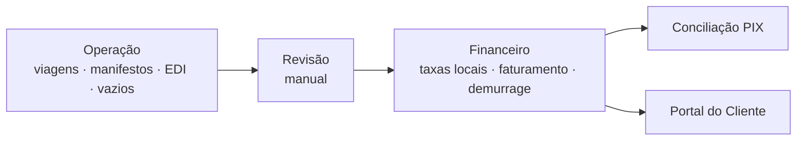

# Documentação do Transhipping Desk

Verificado contra o repositório em 2026-06-19.

## Por onde começar

| Você quer… | Vá para |
|---|---|
| Entender o sistema de cima | [ARCHITECTURE.md](ARCHITECTURE.md) + [GLOSSARIO.md](GLOSSARIO.md) |
| Mexer num módulo específico | [modules/](#módulos) abaixo |
| Rodar localmente | [setup/development.md](setup/development.md) |
| Fazer deploy | [setup/deploy.md](setup/deploy.md) |
| Rodar/entender os testes | [setup/testing.md](setup/testing.md) |
| Entender uma regra de negócio não óbvia | [operations/regras-de-negocio.md](operations/regras-de-negocio.md) |
| Entender segurança (RLS, auth, CSP) | [operations/seguranca.md](operations/seguranca.md) |
| Validar um fluxo manualmente | [operations/validacao.md](operations/validacao.md) |
| Saber por que algo foi decidido | [adr/](adr/) |

## Visão geral

Ciclo completo: **Operação** (viagens, manifestos CNTR/break-bulk/granito, containers, veículos, Baplie EDI, vazios) → **Revisão** (aprovação manual de B/Ls antes do faturamento) → **Comercial** (clientes, taxas locais, overrides) → **Financeiro** (faturamento, demurrage, conciliação PIX) → **Portal do Cliente** (consulta de faturas, pagamento, disputas).

O fluxo canônico detalhado está em [ARCHITECTURE.md](ARCHITECTURE.md#3-fluxo-operacional-canônico).

## Módulos

| Módulo | Doc | Rotas |
|---|---|---|
| Viagens | [modules/viagens.md](modules/viagens.md) | `/viagens`, `/viagens/:voyageId` |
| Manifestos & EDI (import) | [modules/manifesto-edi.md](modules/manifesto-edi.md) | `/manifestos`, `/carga-solta`, `/containers`, `/veiculos`, `/baplie`, `/vazios-importacao`, `/embarquevazios` |
| Granito | [modules/granito.md](modules/granito.md) | `/granito`, `/granito/taxas` |
| Chegadas/Saídas | [modules/chegadas-saidas.md](modules/chegadas-saidas.md) | `/chegadas-saidas` |
| Clientes | [modules/clientes.md](modules/clientes.md) | `/clientes`, `/clientes/:cnpj` |
| Taxas Locais | [modules/taxas-locais.md](modules/taxas-locais.md) | `/taxas-locais` |
| Faturamento | [modules/faturamento.md](modules/faturamento.md) | `/faturamento` |
| Demurrage | [modules/demurrage.md](modules/demurrage.md) | `/demurrage`, `/demurrage/taxas` |
| Conciliação PIX | [modules/reconciliacao-pix.md](modules/reconciliacao-pix.md) | `/reconciliacao` |
| Portal do Cliente | [modules/portal-cliente.md](modules/portal-cliente.md) | `/portal/*` |
| Operação & Suporte | [modules/operacao-suporte.md](modules/operacao-suporte.md) | `/painel`, `/revisao`, `/alertas`, `/relatorios`, `/line-up-tv`, `/admin/usuarios` |

## Referência transversal

- [ARCHITECTURE.md](ARCHITECTURE.md) — stack, camadas, modelo de dados, mapa de rotas.
- [GLOSSARIO.md](GLOSSARIO.md) — termos de domínio (B/L, Baplie, CE Mercante, demurrage…).
- [ROADMAP.md](ROADMAP.md) — estado atual, backlog e riscos.
- [CHANGELOG.md](CHANGELOG.md) — histórico de entregas relevantes.
- [adr/](adr/) — decisões arquiteturais numeradas.
- [operations/](operations/regras-de-negocio.md) — regras de negócio, segurança, validação, reset.
- [setup/](setup/development.md) — desenvolvimento, deploy, testes.
- [archive/](archive/README.md) — auditorias e planos históricos (não-vivos).

## Convenções da documentação

- Arquivos em `kebab-case.md`, prosa em **português técnico**, termos de domínio em inglês (BL, invoice, manifest, demurrage, ledger, PIX).
- Cada doc de módulo segue o mesmo esqueleto: **Propósito · Como funciona · Componentes e arquivos · Regras de negócio · Dependências · Notas e divergências**.
- Diagramas em **Mermaid**. Caminhos de código escritos como `src/services/billing.ts` (clicáveis).
- Links internos **relativos**. Datas só no nome de arquivos em `archive/` e nos ADRs.
