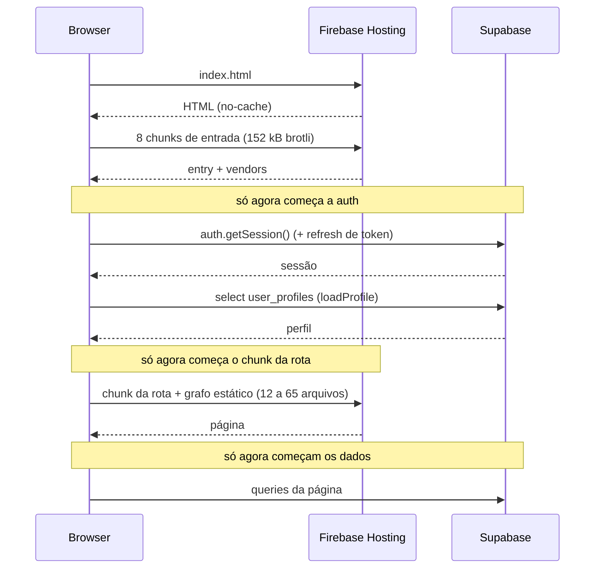

# Investigação — lentidão ao abrir páginas do sistema

**Data:** 2026-08-12
**Origem:** relato do responsável de que abrir páginas do sistema no navegador
está lento. Três commits recentes (`3721da4`, `cfb956c`, `424eb13`) tentaram
atacar o problema.
**Escopo:** diagnóstico. Nenhuma correção foi executada nesta mudança.

Este documento é um registro histórico do achado.

## Resumo

A causa dominante **não é volume de dados nem tamanho de bundle**. É consumo
de CPU do banco por um recurso de Realtime que **está quebrado e nunca entrega
evento nenhum**, somado a uma serialização no caminho crítico do carregamento
frio (autenticação bloqueia o download do chunk da rota).

| # | Achado | Impacto medido | Evidência |
|---|---|---|---|
| A | Realtime assina tabelas fora da publication — polling do WAL consome **45,3% do tempo de execução do banco** sem produzir nenhum evento | dominante | Runtime |
| B | `ProtectedRoute` bloqueia o `React.lazy` da rota até a sessão resolver — 4 fases de rede em série no load frio | alto | Código |
| C | `index.html` sem `preconnect` para o Supabase — handshake completo antes da primeira chamada de auth | médio | Código + Runtime |
| D | Waterfalls de duas/três etapas nas páginas mais usadas (Painel, Viagens, Demurrage) | médio | Código |
| E | Laço O(n²) na montagem das linhas do Line Up | baixo hoje | Código |
| F | Orçamento do `size-limit` aponta para chunk que não existe mais e ignora dois que são pré-carregados | hygiene | Código |

## O que foi descartado

**Volume de dados.** A maior tabela do projeto tem 1.378 linhas.

| Tabela | Linhas |
|---|---|
| `vehicles` | 1.378 |
| `bl_containers` | 1.112 |
| `baplie_containers` | 759 |
| `charge_calculations` | 638 |
| `bls` | 135 |
| `alerts` | 70 |
| `customers` | 40 |

Nenhuma consulta sobre esse volume pode custar tempo perceptível num banco
saudável. **Evidência: Runtime** (`pg_stat_user_tables`).

**Índices.** As colunas usadas pelas contagens do nav têm índice
(`idx_bls_review_status`, `idx_bls_charge_status`, `idx_bls_customer_id`,
`idx_bl_containers_demurrage_status`). O advisor reporta 74 foreign keys sem
índice de cobertura, mas todas em nível `INFO` e irrelevantes neste volume.

**RLS.** Todas as funções usadas nas policies (`is_active_read_user`,
`is_admin`, `is_active_non_equipamentos_user`, `can_edit_customers`,
`is_active_user`, `is_equipamentos_user`) são `STABLE SECURITY DEFINER` — o
planner as promove a InitPlan e avalia uma vez por query, não por linha. O
advisor só aponta `auth_rls_initplan` em cinco tabelas `portal_*`, fora do
caminho do sistema interno.

**Bundle e parse/compile.** `scripts/perf/measure-page-load.mjs` mede 15,6 a
28,3 ms de parse/compile por rota, todas dentro do orçamento de 50 ms. Payload
inicial de 152 kB brotli. Os assets são servidos com
`Cache-Control: public, max-age=31536000, immutable` (`firebase.json`), e as
fontes são self-hosted com `font-display: swap` e subsetting por
`unicode-range`. Nada disso explica a lentidão.

## A — Realtime queima 45% do CPU do banco sem entregar nada

**Evidência: Runtime.** As duas consultas mais caras do projeto inteiro, por
tempo total acumulado em `pg_stat_statements`:

| Consulta | Chamadas | Média | Tempo total | % do total |
|---|---|---|---|---|
| `realtime.apply_rls(...)` — poll do WAL | 535.377 | 4,94 ms | 2.644 s | **33,6%** |
| `realtime.apply_rls(...)` — poll do WAL | 214.834 | 4,30 ms | 923 s | **11,7%** |

Somadas: 750.211 chamadas, **3.568 segundos (≈ 59 minutos) de CPU de banco**.
Para comparação, a consulta de aplicação mais cara do sistema
(`bl_containers` do Line Up) acumula 133 s — 27 vezes menos.

O front abre exatamente dois canais `postgres_changes`:

- `src/hooks/useOperationalCounts.ts:31` — canal `op-counts-alerts-realtime`
  em `public.alerts`, montado dentro de `AppLayout`, ou seja **em toda página
  do sistema interno, para todo usuário logado**;
- `src/hooks/usePortalBilling.ts:63` — canal `portal_demurrage_invoices` em
  `public.demurrage_invoices`.

**Evidência: Runtime.** A publication `supabase_realtime` contém exatamente
uma tabela:

```
schemaname | tablename
-----------+------------------
public     | vessel_schedules
```

Nem `alerts` nem `demurrage_invoices` estão publicadas. **As duas assinaturas
nunca receberam e nunca receberão um evento.** O `invalidateQueries` do
`useOperationalCounts` é código morto em runtime.

E a recíproca também vale: `vessel_schedules` foi adicionada à publication pela
migration `supabase/migrations/124_vessel_schedules.sql:97`, mas nenhum arquivo
em `src/` assina essa tabela — a publication existe sem consumidor.

O custo, porém, é real: enquanto **qualquer** cliente mantém um canal aberto, o
servidor de Realtime varre o WAL em tick contínuo e roda `apply_rls` a cada
ciclo. Esse é o tributo que o banco paga o dia inteiro, e é o que faz uma
consulta trivial sobre 1.112 linhas custar 22–70 ms em vez de 1–2 ms. A
lentidão que o usuário sente em toda página é o efeito colateral dessa
competição por CPU no mesmo compute.

O ADR `docs/adr/0034-notificacao-interna-separada-do-alerta-sino-entrega-alertas-trata.md:151`
registra "`useOperationalCounts` já assina `postgres_changes` em `alerts`" como
fato consolidado — a divergência é que a assinatura existe no cliente, mas a
publication nunca foi criada do lado do banco.

**Caminhos de correção (não executados):**

1. Remover as duas assinaturas e viver de `staleTime` (as contagens já usam
   60 s) ou de polling explícito, como o Portal faz a 30 s. É a opção de menor
   risco: nada muda funcionalmente, porque hoje nada chega.
2. Se a atualização ao vivo dos indicadores for requisito de produto, publicar
   `alerts` e assumir o custo conscientemente — mas então o canal deve ser
   montado onde o dado importa, não em `AppLayout` para toda a navegação.
3. Remover `vessel_schedules` da publication enquanto não houver consumidor.

## B — Autenticação bloqueia o download do chunk da rota

**Evidência: Código.** `src/components/layout/ProtectedRoute.tsx:7` retorna
"Carregando sessão..." enquanto `loading` for verdadeiro, sem renderizar
`<Outlet />`. Como todas as páginas são `React.lazy` (`src/lib/lazyPage.ts`,
usado em `src/App.tsx`), e `lazy()` só dispara o `import()` quando o componente
é efetivamente renderizado, **o download do chunk da rota nem começa antes de a
sessão resolver.**

A sequência de um F5 numa página qualquer é, portanto, quatro fases de rede em
série:



O número de arquivos da terceira fase vem de
`scripts/perf/measure-page-load.mjs`: 29 chunks para o Painel, 65 para Viagens,
57 para BlDetalhe. Todos poderiam estar sendo baixados **em paralelo** com as
duas idas ao Supabase da fase de auth, e hoje não estão.

**Caminhos de correção (não executados):** disparar o `import()` do chunk da
rota em paralelo com a resolução da sessão (pré-carregar o componente lazy no
ramo de `loading`, ou migrar para o data router do react-router, cujo `lazy` de
rota resolve antes do render do elemento).

## C — Sem `preconnect` para o Supabase

**Evidência: Código.** `index.html` não declara `preconnect` nem
`dns-prefetch` para a origem do Supabase, que é o primeiro destino de rede do
app depois dos assets.

**Evidência: Runtime.** Medição do handshake contra
`https://fgmkhbzhaeebrsizwccx.supabase.co/rest/v1/` a partir do ambiente de
investigação: `time_appconnect` de 201 a 497 ms em três amostras, com o TTFB
imediatamente depois. O usuário final (Brasil → `sa-east-1`) paga menos que
isso, mas paga DNS + TCP + TLS integralmente antes do `getSession()` — e pela
sequência do achado B, esse custo está no caminho crítico do primeiro pixel de
conteúdo.

Vale também para `https://olinda.bcb.gov.br`, chamado pelo `HeaderInfoBar` via
`useRoeHeaderRate`.

## D — Waterfalls de dados nas páginas mais usadas

**Evidência: Código.**

`src/pages/Viagens.tsx` — `useViagemSchedulesAndStats`
(`src/hooks/useViagemSchedulesAndStats.ts:26-62`) dispara seis queries, todas
com `enabled: voyageIds.length > 0`. Os `voyageIds` vêm de `useVoyages()`.
Resultado: uma rodada completa de rede para carregar as viagens (com embeds
aninhados de `vessel`, `carrier`, `pol`, `pod`, `import_batches`), e só depois
as seis seguintes — mais `useVoyageVehicleStats` e `useVaziosImportacaoStats`.

`src/services/lineup.ts:89-102` — `fetchLineUpSnapshot` tem três fases em
série: `fetchVoyages()`, depois `Promise.all` de quatro coletas, depois
`fetchContainersByBlIds(blIds)` que depende dos B/Ls da fase anterior. Cada
coleta ainda pagina com `for (const chunk of ...) await`, serializando os
chunks entre si.

`src/services/demurrage/demurrageContainers.ts:28-64` — três fases em série:
`ensureDemurrageRatesLoaded()`, depois os itens de fatura ativos, depois os
containers.

Por densidade de `await` sequencial, os serviços mais expostos são
`src/services/charges/chargeOperationsService.ts` (23) e
`src/services/billing.ts` (20).

Num banco saudável cada salto custaria poucos milissegundos e nada disso seria
perceptível. Com o achado A ativo, cada salto custa 30–70 ms de banco mais o
RTT, e a soma aparece na tela.

## E — Laço O(n²) na montagem do Line Up

**Evidência: Código.** `src/services/lineup.ts:161-168` percorre, para cada
veículo da rota, todo o mapa `distinctContainers` procurando o container
correspondente por `id`. É quadrático no par (veículos × containers) de cada
rota.

Hoje é irrelevante (1.378 veículos e 1.112 containers no total, distribuídos
entre rotas), mas é exatamente o tipo de teto que a convenção do projeto manda
anotar: o arquivo já traz um `ponytail:` em `src/pages/Painel.tsx:37` para o
limite de 60 viagens, e este laço não tem anotação equivalente. Um índice
`Map<container_id, containerKey>` construído uma vez resolve em O(n).

## F — Orçamento de tamanho desalinhado com o build

**Evidência: Código.** O bloco `size-limit` de `package.json` lista
`dist/assets/supabase-*.js`, chunk que não existe mais — `manualChunks` em
`vite.config.ts` dobra `@supabase` e `@tanstack` dentro de `vendor-data`. Em
compensação, o orçamento **não** inclui dois chunks que o `index.html` gerado
pré-carrega com `modulepreload`:

- `exports-*.js` — 10,5 kB gz (é o chunk do Sentry, nome herdado do agrupador);
- `utils-*.js` — 9,6 kB gz.

O orçamento reporta 152,21 kB brotli contra o limite de 250 kB, mas subestima
o payload inicial real. O guard-rail passa sem cobrir o que deveria cobrir.

## O que os commits recentes resolveram (e o que não)

**`cfb956c` — "Avoid redundant profile hydration on auth updates".** Ganho
real e mensurável. **Evidência: Runtime** — o `select` em `user_profiles`
acumula 18.673 chamadas em `pg_stat_statements`, de longe a maior contagem
entre as consultas de aplicação. Vinha de `loadProfile` rodando a cada evento
de `onAuthStateChange` (INITIAL_SESSION, TOKEN_REFRESHED, e o `SIGNED_IN` que
o supabase-js emite ao reganhar foco da janela). O guard `shouldHydrateProfile`
corta isso para uma hidratação por `user id`. Não remove, porém, a hidratação
do caminho crítico do load frio — o achado B permanece intacto.

**`3721da4` — "Defer non-critical operational queries and ROE persistence".**
Dois efeitos distintos:

- `void persistExchangeRateReference(...)` em
  `src/services/demurrage/demurrageKpis.ts` é ganho real: tirou uma escrita RPC
  de dentro do `fetchROE`, que o header dispara em toda página autenticada.
- O `enabled` atrasado por `setTimeout(0)` em `useOperationalCounts` **não
  reduz round-trips** — reordena as cinco contagens para depois do primeiro
  paint, o que ajuda a percepção mas mantém a mesma carga de rede e de banco
  poucos milissegundos depois. E não toca no canal Realtime declarado logo
  acima, no mesmo hook, que é a fonte do custo dominante.

**`424eb13` — "Add payment dates and receipt printing".** Sem relação com
performance.

Ou seja: os commits recentes atacaram sintomas reais mas periféricos. O custo
dominante (A) e a serialização do caminho crítico (B) seguem intocados.

## Achados secundários

- **`AppLayout` declarado em duas posições de rota** (`src/App.tsx`, ramo normal
  e ramo `adminOnly`). Atravessar entre `/admin/usuarios` e o resto do sistema
  desmonta e remonta o layout, refazendo a assinatura de Realtime e as cinco
  contagens. **Evidência: Código.**
- **Dois clientes Supabase instanciados no load do módulo**
  (`src/services/supabase.ts`) — `supabase` e `supabasePortal`, cada um com seu
  GoTrue e `autoRefreshToken: true`, ambos criados mesmo no app interno, que só
  usa o primeiro. **Evidência: Código.**
- **74 foreign keys sem índice de cobertura** e **5 `auth_rls_initplan`** em
  tabelas `portal_*` (`portal_invites`, `portal_email_attempts`,
  `portal_email_events`, `portal_suppressed_emails`,
  `portal_provisioning_events`). Irrelevantes no volume atual; entram na conta
  quando as tabelas crescerem. **Evidência: Runtime** (advisor de performance).

## Ordem sugerida de ataque

1. **A** — remover as duas assinaturas de Realtime órfãs. É a maior redução de
   custo pelo menor risco, porque hoje elas não entregam funcionalidade
   nenhuma. Deve ser feita junto com a correção do ADR 0034 e uma decisão
   explícita sobre `vessel_schedules`.
2. **B + C** — paralelizar chunk da rota com a autenticação e adicionar
   `preconnect`. Ataca o load frio, que é onde a lentidão é mais visível.
3. **D** — colapsar os waterfalls de duas etapas em Viagens e Painel.
4. **E + F** — teto do laço quadrático e correção do orçamento de tamanho.
