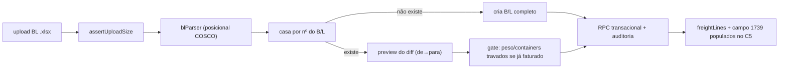

# BL Freight Import Design — frete e despesas do conhecimento para o EDI Mercante

**Approved:** 2026-07-01

> Spec/plano — snapshot de decisão, não verdade corrente. A autoridade
> executável é o código; enquanto esta feature não é implementada, o gerador de
> EDI continua zerando o frete (ver `docs/modules/manifesto-edi.md`). Decisão
> arquitetural em [ADR 0017](../../../adr/0017-bl-fonte-ingestao-correcao-autoridade-compartilhada.md).

## Problema

O manifesto do armador não carrega o **valor do frete** nem as **despesas**
(THD, BAF, …), que são obrigatórios para manifestar a carga no Mercante. Esses
valores só existem no **B/L (conhecimento de embarque)**. Hoje
`src/services/mercanteEdiGenerator.ts` já reserva a estrutura desses campos, mas
os preenche com zero:

- **Código:** `blToMercanteBlData` e `MercanteEdiModal` fixam `freightLines: []`.
- **Código:** o campo de frete marítimo do C5 (offset 1739) é escrito como
  zeros, com o comentário "valor computado de origem desconhecida".

Esta spec resolve **de onde** vem o frete (o arquivo Excel do B/L), **como** ele
é lido, casado, armazenado e integrado, e **onde** o operador faz o upload.

## Descoberta: o formato de frete do C5 (validado contra EDI real)

Cruzamento de um EDI Mercante real e aceito (`FWL_MERCANTE_561416`) com o Excel
do B/L `CSC45250E02Y00`, que consta nesse mesmo EDI. **Evidência: Runtime**
(decodificação byte a byte do arquivo aceito).

| Linha no B/L (seção 11) | Valor no B/L | Prepaid/Collect | Destino no C5 | Valor gravado |
|---|---|---|---|---|
| OCEAN FREIGHT | USD 2600 | Prepaid | **campo próprio, offset `[1739:1760)`**, 2 decimais | `2600,00` |
| THD | BRL 1717 | Collect | bloco de frete (offset 3796), código **`01779`**, tipo **`C`** | `1717,00` |
| BAF | USD 172 | Prepaid | bloco de frete (offset 3796), código **`00322`**, tipo **`P`** | `172,00` |

Fatos confirmados nos 10 conhecimentos do arquivo:

1. **Frete marítimo tem campo dedicado** no C5 em `[1739:1760)` (14+ dígitos, 2
   casas decimais), imediatamente antes da constante-âncora `220PHHI` (offset
   1760). Esse é exatamente o campo que o gerador zera hoje. Para os 10 B/Ls,
   decodifica em valores limpos (2600, 9600, 64800, 118800, …); no
   `CSC45250E02Y00` bate exatamente com o `OCEAN FREIGHT USD 2600` do Excel.
2. **Despesas vão no bloco 3796**, em fatias de 20 bytes
   `[código(5)][valor(14, 2dp)][tipo(1)]`. Os códigos observados:
   `01779 = THD`, `00322 = BAF`. Outros códigos de despesa existirão e serão
   adicionados ao mapa conforme aparecerem.
3. **O byte de tipo é Prepaid/Collect** — `P`/`C` — casando com as colunas
   Prepaid (`PDD`) / Collect (`COL`) do B/L.
4. **A moeda é ignorada na gravação.** O BAF em `USD 172` foi gravado como
   `172,00` sem conversão; o THD em `BRL 1717` como `1717,00`. O Mercante grava
   **o número impresso no B/L, sem PTAX/ROE**. A moeda original é preservada
   apenas para exibição e auditoria.

## Decisões (grilling 2026-07-01)

1. **Conceito separado.** *Frete & Despesas do BL* é um conceito novo que
   alimenta **apenas** o EDI Mercante; **não** toca as Taxas Locais (cobrança do
   desk ao cliente). Ver `CONTEXT.md`.
2. **Moeda original por linha.** Captura sem perda (USD/BRL + valor +
   prepaid/collect); nenhuma conversão. A gravação no EDI usa o número literal.
3. **Escopo do B/L: ingestão + correção.** O arquivo do B/L pode **criar** um
   B/L inexistente (completo, incluindo containers/veículos) e **corrigir** um
   B/L já existente. Ver [ADR 0017](../../../adr/0017-bl-fonte-ingestao-correcao-autoridade-compartilhada.md).
4. **Precedência: preview do diff + sobrescreve com auditoria.** Ao importar,
   o operador vê os campos que mudam (de→para), confirma, e o B/L sobrescreve
   com auditoria e justificativa automática. Nada muda em silêncio.
5. **Proteção de faturamento por campo.** Campos comerciais (consignatário,
   notify, descrição, datas, frete/despesas) são sempre corrigíveis. **Peso** e
   **conjunto de containers** só são corrigíveis se o B/L ainda **não** tiver
   cálculo de taxa nem invoice; havendo cobrança, a correção desses dois campos
   é bloqueada e o operador é avisado. Nenhuma correção via B/L altera variáveis
   de faturamento.
6. **Data de emissão por B/L.** *Date of Issue* / *Date Laden on Board* só
   existem no B/L e são a data de emissão usada no Mercante (campo de emissão do
   C5), hoje digitada à mão / derivada da viagem.
7. **Parser posicional, template único COSCO.** Layout de células fixas; um
   parser por posição, com `ponytail` marcando o teto (1 layout) e o caminho de
   upgrade para detecção multi-armador.
8. **Três entradas, um modal.** Lote em `/manifestos`, atalho na ficha
   `/manifestos/:blId`, e ação rápida em `/viagens/:voyageId` (junto das demais
   ações de import).

## Layout do arquivo de B/L (template COSCO)

Aba `Page 1`, células fixas (evidência: 4 amostras reais):

| Campo | Célula |
|---|---|
| Nº do B/L | `AC6` (e `U42` na página 2) |
| Shipper (bloco) | `A6` |
| Consignee (bloco + CNPJ) | `A10` |
| Notify (bloco) | `A14` · Also Notify: `T14` |
| Place of Receipt / POL / POD / Delivery | `G16` / `G18` / `A20` / `G20` |
| Navio + Viagem | `A18` (ex.: `GREEN SANTOS   14`) |
| Type of Movement | `T20` / `AC20` |
| Seção 11 "Freight & Charges" | linhas a partir de `A26`: descrição (col A), Rate (H), Per (L), Amount (P), Prepaid (W) / Collect (X) |
| Container (FCL) | `A47` (`nº / lacre / tara / COC / volumes / tipo / peso / cbm`) |
| Veículos (RoRo) | aba `VIN` (chassi, `CONTAINER NO`, `B/L NO.` por linha) |
| Date Laden on Board | `AB35` |
| Date of Issue / Place of Issue | `A38` / `E38` |

## Arquitetura

### Novo: `src/services/blParser.ts`
Parser posicional puro (sem I/O), espelhando o contrato de `manifestParser.ts`.
Lê o template COSCO e devolve um `ParsedBLDocument` com: partes, rota, datas,
itens físicos (container/veículos) e as linhas de Frete & Despesas
(`{ description, currencyCode, amount, payment: 'PREPAID'|'COLLECT' }`).
`ponytail:` acoplado a 1 layout; upgrade = detector multi-armador.

### Novo: `src/services/blFreightImport.ts`
Orquestra casamento (por nº de B/L, conferindo CNPJ do consignatário), diff,
create vs correct, e chama a RPC transacional. Espelha `manifestImport.ts`.

### Persistência
- **Nova tabela `bl_freight_lines`** (filha de `bls`): `bl_id`, `seq`,
  `description`, `category` (`OCEAN_FREIGHT`/`THD`/`BAF`/…), `mercante_code`,
  `currency`, `amount`, `payment` (`PREPAID`/`COLLECT`). Uma linha por item da
  seção 11. Migration seguindo `docs/adr/0016`.
- **Nova coluna `bls.bl_emission_date`** (Date of Issue) — data de emissão por
  B/L usada no C5.
- RPC transacional (create/correct) espelhando
  `import_manifest_with_postprocess_transactional`, com o gate de proteção de
  faturamento sobre peso/containers.

### Mapa de códigos Mercante
Semente `{ 'THD': { code: '01779', … }, 'BAF': { code: '00322', … } }`, no
estilo `ponytail` dos mapas `ISO_CONTAINER_TYPE` / `LOCODE_ALIASES` já em
`mercanteEdiGenerator.ts`. Tipo derivado de prepaid/collect. Cresce conforme
novos códigos forem confirmados contra EDIs reais.

### Gerador de EDI
- `blToMercanteBlData` passa a popular `freightLines` a partir de
  `bl_freight_lines` (linhas de despesa mapeadas a código+tipo), em vez de `[]`.
- `generateC5Record` passa a escrever o **frete marítimo** no campo `[1739:1760)`
  (linha `OCEAN_FREIGHT`), corrigindo o offset da constante `220PHHI` (1760).
- O C5 usa `bl_emission_date` por B/L quando disponível.

## Fluxo

## Invariantes

1. Frete & Despesas do BL nunca alimentam Taxas Locais nem qualquer variável de
   faturamento.
2. Correção via B/L é sempre auditada e precedida de preview do diff.
3. Peso e conjunto de containers são imutáveis via B/L quando existe cálculo de
   taxa ou invoice no B/L.
4. O valor gravado no EDI é o número literal do B/L; a moeda não é convertida.
5. O parser é posicional e válido apenas para o template COSCO (ponytail).

## Testes e validação (plano)

- Parser: fixtures reais dos B/Ls (container, RoRo/VIN, multi-container) →
  partes, rota, datas, itens e linhas de frete.
- Cross-check de frete: reproduzir o C5 de `CSC45250E02Y00` (frete 2600,00 em
  1739; `01779/1717,00/C` e `00322/172,00/P` em 3796) a partir do Excel.
- Diff/overwrite: correção de campo comercial gera auditoria; peso/containers
  bloqueados quando há cobrança.
- `npm run docs:check`, `npm run lint`, `npm test`, `npm run build`.

## Pendências

- Lista completa de códigos de despesa do Mercante além de `THD`/`BAF`.
- Confirmar se há indicador prepaid/collect para o frete marítimo (o campo 1739
  observado carrega só o valor).
