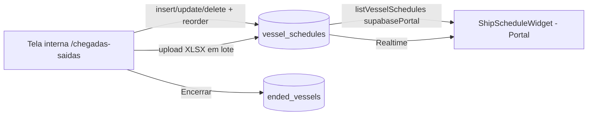

# Chegadas e Saídas

> **Status:** ativo · **Atualizado:** 2026-06-18 · **Rotas:** `/chegadas-saidas`

## Propósito

Board CRUD tipo planilha para administrar a **programação de navios** (ETD/ETA por porto) exibida no widget do Portal do Cliente (`ShipScheduleWidget`). É a tela interna que alimenta a tabela `vessel_schedules`: cada linha é um navio "vivo" no line-up, com data estimada de saída (ETD) nos portos de origem na Ásia e data estimada de chegada (ETA) nos portos de descarga no Brasil, mais o número IMO.

Não tem relação com importação de manifestos/EDI nem com [Viagens](viagens.md); é um cadastro manual independente, voltado a comunicação ao cliente. O número IMO, quando presente, vira link para o MarineTraffic.

## Como funciona

Tudo acontece no cliente, direto contra o Supabase via `supabase.from('vessel_schedules')` — não há service/RPC dedicado para a escrita; a tela interna usa o client interno e o Portal usa `supabasePortal` (somente leitura).

Operações da tela interna (`ChegadasSaidas.tsx`):

| Ação | Efeito |
| --- | --- |
| Adicionar / Editar navio | `insert` / `update` em `vessel_schedules` via modal (`VesselForm`) |
| Reordenar (subir/desce) | recalcula `display_order` de toda a lista com `update` em lote |
| Encerrar (arquivar) | copia a linha para `ended_vessels` e faz `delete` em `vessel_schedules` |
| Excluir | `delete` permanente em `vessel_schedules` |
| Upload em lote | lê XLSX, casa por `vessel_name` (case-insensitive) e atualiza datas |
| Exportar encerrados | gera XLSX a partir de `ended_vessels` |
| Baixar planilha modelo | gera XLSX template com os navios atuais |

O upload em lote (`SpreadsheetUpload`) só **atualiza** navios já cadastrados: para cada linha casa o nome (`vessel_name`) contra os existentes; nomes não encontrados vão para `notFound` (não cria novos). O parse é inline com `@e965/xlsx`, mapeando cabeçalhos fixos (`VESSEL NAME`, `VOY`, `QINGDAO ETD`, …, `PECÉM ETA`).

## Componentes e arquivos

| Camada | Arquivo | Responsabilidade |
| --- | --- | --- |
| Página (interna) | `src/pages/ChegadasSaidas.tsx` | Board CRUD: tabela, modal de form, reorder, encerrar/excluir, upload e export XLSX |
| Service (Portal) | `src/services/vesselSchedules.ts` | `listVesselSchedules()` — leitura via `supabasePortal`, normaliza linhas; ordena por `display_order` |
| Hook (Portal) | `src/hooks/useVesselSchedules.ts` | `useVesselSchedules()` — React Query, `queryKey: ['portal-vessel-schedules']`, habilitado só se autenticado |
| Widget (Portal) | `src/components/portal/ShipScheduleWidget.tsx` | Consome o hook e exibe a programação ao cliente |
| Tipos | `src/types/database.ts` | `VesselSchedule` |
| Migration | `supabase/migrations/20260616000000_vessel_schedules.sql` | Cria `vessel_schedules` + `ended_vessels`, RLS, trigger `updated_at`, realtime |
| Rota | `src/App.tsx` | `/chegadas-saidas` (lazy) |

## Regras de negócio

- **Portos fixos.** Colunas modeladas como `text`, não datas: 5 ETD de origem (`qingdao_etd`, `shanghai_etd`, `taicang_etd`, `ningbo_etd`, `nansha_etd`) e 3 ETA de destino (`salvador_eta`, `vitoria_eta`, `pecem_eta`). Default `'X'`.
- **`'X'` = não programado.** O valor `'X'` indica porto não escalado naquela viagem; a UI renderiza `'X'` esmaecido.
- **Datas como texto livre.** Formato esperado `DD/MM/AAAA` (ano opcional → ano corrente). O parse é só visual: `parseDate`/`isPast` pintam de azul/negrito datas já passadas. Não há validação de formato no banco.
- **Ordenação manual.** `display_order` controla a sequência exibida; reorder reescreve o índice de toda a lista.
- **Encerrar ≠ excluir.** "Encerrar" move para `ended_vessels` (histórico) e remove da tabela ativa; "Excluir" apaga sem arquivar.
- **IMO opcional.** Se preenchido, o nome do navio vira link para `marinetraffic.com/.../imo:<imo_number>`.
- **Upload só atualiza.** Casa por `vessel_name`; não cria navio novo. A linha-exemplo `EXEMPLO NAVIO` é ignorada.
- **RLS (ver migration):** `SELECT` para qualquer autenticado (inclui clientes do Portal); `INSERT`/`UPDATE` para usuário interno ativo (`is_active_user()`); `DELETE` só admin (`is_admin()`). Clientes do Portal não estão em `user_profiles`, logo nunca são admin.

## Dependências

**Tabelas Supabase**
- `vessel_schedules` — navios vivos no line-up. Realtime habilitado (`supabase_realtime`).
- `ended_vessels` — histórico de navios encerrados (`original_id`, `ended_at`).

**RPCs** — nenhuma. Toda escrita é CRUD direto pelo PostgREST.

**Integrações externas**
- MarineTraffic (link por IMO).
- `@e965/xlsx` (geração/leitura de planilhas no cliente).

**Outros módulos**
- Portal do Cliente — consome `vessel_schedules` no `ShipScheduleWidget` (leitura via `supabasePortal`).

## Notas e divergências

- **`taicang_etd` ausente na migration.** A página, o service, o tipo `VesselSchedule` e o template de upload usam a coluna `taicang_etd`, mas o `CREATE TABLE` em `20260616000000_vessel_schedules.sql` **não** a declara (lista apenas Qingdao, Shanghai, Ningbo, Nansha como ETD). A coluna provavelmente vem de uma migration Lovable anterior não consolidada aqui. Confirmar no banco antes de assumir o esquema.
- **Escrita sem camada de service.** Diferente do padrão [react-query-pattern](../ARCHITECTURE.md), a tela interna escreve direto em `supabase.from(...)` dentro do componente; só a leitura do Portal tem service (`vesselSchedules.ts`). Não há invalidação cruzada entre `['admin-vessel-schedules']` (interno) e `['portal-vessel-schedules']` (Portal) — o Portal depende do Realtime/refetch.
- **`pecem_eta` nullable** no banco; a UI normaliza `null → 'X'`.
- Não confundir com o indicador "ESCALA" do Painel/Line-Up nem com o **Número de Escala (Mercante)** — ver [GLOSSARIO](../GLOSSARIO.md). Este módulo é só programação comercial de ETD/ETA.
