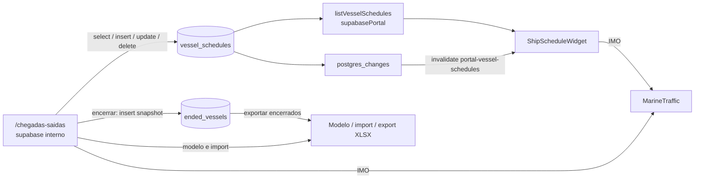

# Chegadas e Saídas

> **Status:** ativo · **Cartografia verificada:** 2026-06-20 · **Rota interna:** `/chegadas-saidas` · **Consumidor:** widget do Dashboard do Portal

## Propósito e escopo

Este módulo mantém a programação comercial de navios exibida no Portal do Cliente. A rota interna `/chegadas-saidas` administra linhas ativas em `vessel_schedules`, permite encerrar linhas em `ended_vessels`, importar/baixar planilhas e abrir o MarineTraffic por IMO. O widget `ShipScheduleWidget` lê a mesma programação com a sessão isolada do Portal e invalida sua query por Realtime.

O cadastro é independente das viagens operacionais, manifestos e EDI. Ele compartilha navio, viagem, ETD e ETA como linguagem de negócio, mas não referencia `voyages` nem participa do Line-Up operacional de `src/services/lineup.ts`.

Rótulos de evidência:

- **Código**: comportamento demonstrado pelos arquivos executáveis atuais;
- **Teste**: teste automatizado focado existente; nenhum foi localizado para este módulo;
- **Teste de contrato SQL**: teste que lê migration; nenhum foi localizado para estas tabelas;
- **Suspeita**: estado de schema/deploy que o repositório sozinho não confirma;
- **Runtime** não é usado, pois o fluxo não foi executado nesta passagem.

Fontes principais: `src/App.tsx`, `src/pages/ChegadasSaidas.tsx`, `src/services/vesselSchedules.ts`, `src/hooks/useVesselSchedules.ts`, `src/components/portal/ShipScheduleWidget.tsx`, `src/types/database.ts` e `supabase/migrations/20260616000000_vessel_schedules.sql`.

## Anatomia das telas

### Rota interna `/chegadas-saidas`

`src/App.tsx` coloca a página sob `ProtectedRoute` e `AppLayout`. A página `src/pages/ChegadasSaidas.tsx` concentra UI, parsing XLSX e CRUD direto no Supabase; não há service/RPC específico para as escritas internas.

A tela possui:

- cabeçalho com “Exportar Encerrados” e “Adicionar Navio”;
- modal `VesselForm` para nome, viagem, IMO, cinco ETDs e três ETAs;
- tabela de ativos ordenada por `display_order`;
- botões de subir/descer, editar, encerrar e excluir;
- painel `SpreadsheetUpload` para baixar modelo e importar `.xlsx`, `.xls` ou `.csv`.

Datas são strings livres. `parseDate` aceita `DD/MM` ou `DD/MM/AAAA` apenas para estilo visual; não valida calendário nem normaliza antes de persistir. `'X'` representa porto não programado.

### Widget do Portal

`src/hooks/useVesselSchedules.ts` habilita `['portal-vessel-schedules']` somente com sessão do Portal autenticada. `src/services/vesselSchedules.ts` consulta `vessel_schedules` por `supabasePortal`, ordena por `display_order` e normaliza valores ausentes.

`src/components/portal/ShipScheduleWidget.tsx`:

- renderiza a grade ECSA com os mesmos ETDs/ETAs;
- mostra Pecém somente quando alguma linha tem valor diferente de `'X'`;
- transforma o nome em link MarineTraffic quando há IMO;
- assina `postgres_changes` de `vessel_schedules`;
- invalida `['portal-vessel-schedules']` em qualquer insert/update/delete.

### Persistência e acesso

`supabase/migrations/20260616000000_vessel_schedules.sql` cria:

- `vessel_schedules`: ativos, `display_order`, timestamps e trigger de `updated_at`;
- `ended_vessels`: snapshot do encerramento com `original_id` e `ended_at`;
- publicação Realtime de `vessel_schedules`;
- RLS com leitura para `authenticated`, insert/update para `is_active_user()` e delete para `is_admin()`.

Assim, a UI pode mostrar botões destrutivos a qualquer usuário interno, mas o banco decide se o delete é permitido.

## Catálogo de ações

| Tela / ação | Pré-condições | Origem | Orquestração | Persistência | Efeitos e cache | Falhas | Evidência |
|---|---|---|---|---|---|---|---|
| Carregar ativos | Sessão interna e perfil ativo | Montagem de `/chegadas-saidas` | `useQuery(['admin-vessel-schedules'])` faz select ordenado | Leitura de `vessel_schedules` | Preenche tabela na ordem manual | Erro é lançado pela query, mas a página não renderiza estado de erro dedicado | **Código:** `src/pages/ChegadasSaidas.tsx` |
| Adicionar navio | Nome e viagem preenchidos; RLS `is_active_user()` | Modal “Adicionar Navio” | Calcula `max(display_order) + 1` no cliente e faz insert | Insere `vessel_schedules` | Invalida `['admin-vessel-schedules']` e fecha modal | Concorrência pode gerar ordens iguais; coluna inexistente/schema drift retorna erro PostgREST | **Código:** `src/pages/ChegadasSaidas.tsx`, `supabase/migrations/20260616000000_vessel_schedules.sql` |
| Editar navio | Linha existente; RLS `is_active_user()` | Botão Editar/modal | Update do objeto completo do formulário por `id` | Atualiza `vessel_schedules`; trigger muda `updated_at` | Invalida cache interno e fecha modal | Sem lock otimista; edição concorrente usa last write wins | **Código:** `src/pages/ChegadasSaidas.tsx` |
| Reordenar | Lista carregada; posição permite movimento; RLS de update | Botões Subir/Descer | Reordena array local e dispara um update por linha em `Promise.all` | Regrava `display_order` de todos os ativos | Invalida `['admin-vessel-schedules']`; Realtime atualiza Portal | Operação não é transacional; parte das linhas pode ser gravada antes de uma falha | **Código:** `src/pages/ChegadasSaidas.tsx`, `src/components/portal/ShipScheduleWidget.tsx` |
| Encerrar/arquivar | Confirmação; insert ativo e delete admin | Botão Encerrar | Insere snapshot em `ended_vessels`; depois deleta o ativo | `ended_vessels` + delete em `vessel_schedules` | Invalida cache interno; delete gera evento Realtime para o Portal | Duas chamadas não atômicas: delete negado/falho após insert deixa histórico e ativo simultaneamente | **Código:** `src/pages/ChegadasSaidas.tsx`, `supabase/migrations/20260616000000_vessel_schedules.sql` |
| Excluir permanentemente | Confirmação e `is_admin()` | Botão Excluir | Delete direto por `id` | Remove de `vessel_schedules`; não arquiva | Invalida cache interno; Realtime invalida Portal | Não admin recebe erro RLS; não há auditoria específica no fluxo | **Código:** `src/pages/ChegadasSaidas.tsx`, `supabase/migrations/20260616000000_vessel_schedules.sql` |
| Baixar planilha modelo | Sessão ativa; leitura permitida | “Baixar Planilha Modelo” | Lê ativos, prepende `EXEMPLO NAVIO`, gera workbook | Nenhuma escrita; arquivo `modelo_navios.xlsx` | Não altera cache | Erro da leitura não é verificado antes de gerar o arquivo | **Código:** `src/pages/ChegadasSaidas.tsx` |
| Importar planilha | Arquivo aceito pelo input; navios já cadastrados; update permitido | “Fazer Upload” | `@e965/xlsx` lê primeira aba; casa nome case-insensitive; mapeia cabeçalhos e atualiza linha a linha | Updates em `vessel_schedules`; nunca cria navio | Invalida cache se ao menos uma linha foi atualizada; Realtime propaga ao Portal | Sem limite de upload/preview; linhas desconhecidas vão para `notFound`; updates podem ser parciais; erros ficam no resumo | **Código:** `src/pages/ChegadasSaidas.tsx` |
| Carregar/exportar encerrados | Sessão autenticada com SELECT | “Exportar Encerrados” | Select de `ended_vessels` por `ended_at desc`; gera workbook | Somente leitura; arquivo `navios_encerrados.xlsx` | Não altera cache | Erro da consulta não é distinguido de lista vazia; não há tela de histórico | **Código:** `src/pages/ChegadasSaidas.tsx` |
| Abrir MarineTraffic | `imo_number` presente | Clique no nome do navio, interno ou Portal | Monta URL `https://www.marinetraffic.com/en/ais/details/ships/imo:<IMO>` | Nenhuma | Abre nova aba com `noopener noreferrer` | IMO inválido leva a URL externa sem validação local | **Código:** `src/pages/ChegadasSaidas.tsx`, `src/components/portal/ShipScheduleWidget.tsx` |
| Consultar programação no Portal | Sessão do Portal autenticada; policy SELECT para `authenticated` | Montagem do Dashboard/widget | `useVesselSchedules` → `listVesselSchedules` via `supabasePortal` | Leitura de `vessel_schedules` | Cache `['portal-vessel-schedules']` | Service registra erro no console e retorna `[]`, tornando falha indistinguível de vazio na UI | **Código:** `src/hooks/useVesselSchedules.ts`, `src/services/vesselSchedules.ts`, `src/components/portal/ShipScheduleWidget.tsx` |
| Atualizar Portal por Realtime | Widget montado; tabela na publicação; conexão ativa | Evento `postgres_changes` | Channel `vessel_schedules_widget` escuta `*` | Nenhuma escrita adicional | Invalida `['portal-vessel-schedules']` e refaz a leitura | Falha/subscription status não é exibido nem monitorado pelo componente | **Código:** `src/components/portal/ShipScheduleWidget.tsx`, `supabase/migrations/20260616000000_vessel_schedules.sql` |

## Estado e dados

### Modelo

Campos compartilhados por ativo e encerrado:

- identidade: `vessel_name`, `voyage`, `imo_number`;
- ETD: `qingdao_etd`, `shanghai_etd`, `taicang_etd`, `ningbo_etd`, `nansha_etd`;
- ETA: `salvador_eta`, `vitoria_eta`, `pecem_eta`;
- valores de programação: `text`, default `'X'` na migration;
- ativos: `display_order`, `created_at`, `updated_at`;
- encerrados: `original_id`, `ended_at`, `created_at`.

`src/types/database.ts` tipa `taicang_etd` como obrigatório e `pecem_eta` como nullable. `src/services/vesselSchedules.ts` normaliza campos ausentes para `'X'`, exceto `pecem_eta`, preservado como `null`.

### Caches

| Consumidor | Query key | Cliente Supabase | Invalidação |
|---|---|---|---|
| Rota interna | `['admin-vessel-schedules']` | `supabase` | explícita após mutations/import |
| Portal | `['portal-vessel-schedules']` | `supabasePortal` | Realtime no widget |

Não há invalidação cruzada direta entre as duas keys. A sincronização do Portal depende do evento Realtime ou de um refetch posterior.

### Matriz RLS declarada

| Tabela | SELECT | INSERT | UPDATE | DELETE |
|---|---|---|---|---|
| `vessel_schedules` | `authenticated` | `is_active_user()` | `is_active_user()` | `is_admin()` |
| `ended_vessels` | `authenticated` | `is_active_user()` | sem policy declarada | `is_admin()` |

O fluxo “Encerrar” exige simultaneamente permissão de insert no histórico e delete no ativo. Na prática, isso o torna administrativo mesmo que o botão apareça para outros perfis.

## Fluxos e invariantes



Invariantes observáveis:

- `'X'` significa porto não programado;
- a persistência aceita texto livre; formato de data é convenção de UI, não constraint SQL;
- `display_order` define a ordem interna e do Portal;
- encerrar copia e depois remove; excluir remove sem histórico;
- importação só atualiza navios existentes e ignora `EXEMPLO NAVIO`;
- matching da importação é por `vessel_name` case-insensitive e trim, embora a dica diga “exatamente igual”;
- Pecém só aparece no Portal quando ao menos uma linha possui ETA não vazia e diferente de `'X'`;
- datas coloridas são calculadas comparando texto parseável com o dia atual; não existe campo persistido de “evento confirmado”;
- Portal lê com a sessão isolada `supabasePortal`; clientes não ganham permissão de escrita por esse widget.

## Testes e validação

Não foi localizado teste focado para:

- `src/pages/ChegadasSaidas.tsx`;
- `src/services/vesselSchedules.ts`;
- `src/hooks/useVesselSchedules.ts`;
- `src/components/portal/ShipScheduleWidget.tsx`;
- contrato SQL de `vessel_schedules`/`ended_vessels`.

`src/pages/__tests__/PortalDashboard.test.tsx` apenas mocka `useVesselSchedules` com lista vazia; isso não valida query, renderização da grade, Realtime, RLS, importação ou CRUD.

Cenários runtime necessários em ambiente controlado:

1. usuário interno ativo lista, adiciona e edita; confirmar `updated_at` e ordem;
2. perfil não admin tenta hard delete e “Encerrar”; confirmar bloqueio RLS e verificar se o insert no histórico ocorreu antes do delete negado;
3. admin encerra com sucesso; confirmar uma linha em `ended_vessels`, ausência no ativo e atualização do Portal;
4. reordenar várias linhas; confirmar sequência consistente após reload e no Portal;
5. baixar modelo, alterar cada coluna, importar e confirmar round-trip, incluindo cabeçalhos acentuados/não acentuados;
6. importar nome inexistente, `EXEMPLO NAVIO`, arquivo grande e lote com erro parcial;
7. abrir Portal autenticado, alterar um ativo internamente e confirmar invalidação/refetch Realtime;
8. validar link MarineTraffic com IMO presente e ausência de link sem IMO;
9. confirmar RLS/grants diretamente para sessão interna, Portal autenticado e admin;
10. confirmar `taicang_etd` nas duas tabelas pelo schema controlado.

Consulta sugerida para a confirmação de schema:

```sql
select table_name, column_name, data_type, column_default
from information_schema.columns
where table_schema = 'public'
  and table_name in ('vessel_schedules', 'ended_vessels')
  and column_name = 'taicang_etd'
order by table_name;
```

Resultado esperado pelo código atual: duas linhas, ambas `text`, com default equivalente a `'X'`.

Por instrução de coordenação, nenhuma suíte Vitest foi executada nesta cartografia. Nenhum cenário acima recebe evidência Runtime.

## Notas e divergências

- **`taicang_etd` — Suspeita de alinhamento de ambiente, não defeito confirmado no repositório.** O código usa a coluna no formulário, tabela, template, importação, encerramento, exportação, service do Portal e tipos (`src/pages/ChegadasSaidas.tsx`, `src/services/vesselSchedules.ts`, `src/types/database.ts`). A migration atual também declara `taicang_etd` nas duas tabelas (`supabase/migrations/20260616000000_vessel_schedules.sql`). Entretanto, a própria migration afirma consolidar seis migrations Lovable anteriores; a inspeção do repositório não prova que o schema de cada ambiente controlado aplicou essa versão. Confirmar com `information_schema.columns` antes de encerrar a suspeita.
- **Impacto se `taicang_etd` estiver ausente — Suspeita.** Inserts/updates/import/encerramento podem falhar por coluna desconhecida; a leitura interna por `select('*')` pode produzir valor `undefined`; o service do Portal normaliza ausência para `'X'`, potencialmente mascarando drift; exportações podem emitir `'X'` sem revelar a coluna faltante.
- **Comentário da migration versus policies — Código.** O cabeçalho diz “escrita só admin”, mas as policies permitem INSERT/UPDATE a qualquer `is_active_user()` e reservam DELETE ao admin.
- **Encerramento não transacional — Código.** Insert no histórico e delete no ativo são chamadas separadas; uma falha intermediária deixa estado duplicado.
- **Reordenação não transacional — Código.** Um update é enviado por linha; erro parcial não faz rollback.
- **Erro do Portal mascarado como vazio — Código.** `listVesselSchedules` retorna `[]` quando a consulta falha.
- **Sem upload guard — Código.** O arquivo é convertido por `arrayBuffer()` e parseado sem `assertUploadSize`, preview ou validação de schema antes das mutations.
- **“Datas em azul = Evento confirmado” — Código/UI divergentes.** A cor indica apenas data parseável anterior a hoje; não há confirmação persistida.
- **“Atualização diária às 09:00” — Código/UI sem orquestração correspondente.** O widget exibe esse texto, mas o código observado atualiza por query e Realtime, sem scheduler de 09:00 neste módulo.
