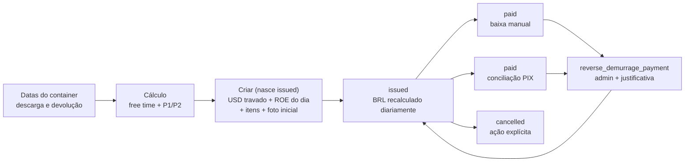

# Demurrage

> **Status:** ativo · **Atualizado:** 2026-06-24 · **Rotas:** `/demurrage`, `/demurrage/taxas`

## Propósito e escopo

Demurrage acompanha descarga e devolução de containers, resolve free time e
tarifas P1/P2, calcula a sobreestadia em USD e mantém invoices próprias cujo
total BRL é **recalculado diariamente pela PTAX até o pagamento** (USD travado na
emissão; ROE/BRL congelam só no pagamento — ver
[ADR 0014](../adr/0014-demurrage-recalculo-diario-substitui-roe-congelado.md) e
[ADR 0015](../adr/0015-demurrage-conciliacao-janela-duas-ptax-data-pagamento.md)).
As rotas internas ficam sob
`ProtectedRoute` em [`src/App.tsx`](../../src/App.tsx); a interface de tarifas
expõe mutações apenas para admin, enquanto as policies e RPCs continuam sendo a
fronteira efetiva de autorização.

O domínio não pertence ao ledger de taxas locais. Datas vivem em
`bl_containers`; configuração por B/L, em `bls`; tarifas, em
`demurrage_rates`; documentos e itens, em `demurrage_invoices` e
`demurrage_invoice_items`. A experiência é agregada em `/faturamento`,
`/reconciliacao` e `/portal/billing`, mas a persistência continua separada,
conforme a [ADR 0008](../adr/0008-demurrage-integrado-sem-unificar-persistencia.md).

Fontes executáveis principais:

- [`src/pages/Demurrage.tsx`](../../src/pages/Demurrage.tsx) e
  [`src/pages/DemurrageRates.tsx`](../../src/pages/DemurrageRates.tsx);
- [`src/components/bl/BlDemurrageSection.tsx`](../../src/components/bl/BlDemurrageSection.tsx)
  na aba `faturamento` do B/L;
- serviços em [`src/services/demurrage/`](../../src/services/demurrage/);
- importação de datas em
  [`src/services/containerDatesImport.ts`](../../src/services/containerDatesImport.ts);
- documento imprimível em
  [`src/components/demurrage/InvoiceDocument.tsx`](../../src/components/demurrage/InvoiceDocument.tsx).

## Anatomia das telas

### `/demurrage`

[`src/pages/Demurrage.tsx`](../../src/pages/Demurrage.tsx) mantém a aba
`Containers`, três abas de fatura (`Faturas` = `issued`, `Pagas`, `Canceladas`) e
a aba `Por Cliente`. Sob recálculo diário (ADR 0014) não há `draft` nem
`overdue`: a fatura nasce `issued`.

- A aba `Containers` carrega containers com descarga e ainda não marcados como
  `returned`, aceita `?busca=`, filtra por container/B/L/cliente, agrupa por B/L
  e deriva total USD e status com `calculateDemurrage`.
- A barra de KPIs é sempre visível e combina contagem de containers em atraso,
  total USD da lista filtrada, rascunhos em USD e emitidas em BRL.
- `Importar Datas` abre
  [`src/components/shared/ContainerDatesImportModal.tsx`](../../src/components/shared/ContainerDatesImportModal.tsx):
  parseia planilha, mostra preview e erros, atualiza datas e pode criar/emitir
  invoice quando todos os containers do B/L foram devolvidos.
- O modal `Editar datas do container` altera descarga e devolução, validando
  formato e ordem antes da escrita.
- As abas de invoice consultam um status exato por vez (`issued`, `paid` ou
  `cancelled`). Cada linha abre breakdown, desconto e disputa; em `issued` há
  `Registrar Pgto`, `Fatura` e `Cancelar` (ação explícita e auditada).
- O visualizador de fatura/recibo usa
  [`src/components/demurrage/InvoiceDocument.tsx`](../../src/components/demurrage/InvoiceDocument.tsx)
  e o kit compartilhado
  [`src/components/shared/InvoiceDocumentKit.tsx`](../../src/components/shared/InvoiceDocumentKit.tsx);
  `Imprimir` chama `window.print()`.

### `/manifestos/:blId` → aba `faturamento`

[`src/components/bl/BlFaturamentoTab.tsx`](../../src/components/bl/BlFaturamentoTab.tsx)
inclui [`BlDemurrageSection`](../../src/components/bl/BlDemurrageSection.tsx)
como segunda entrada operacional. A seção permite:

- editar `free_time_override` e overrides P1/P2 do B/L;
- definir ou limpar `return_date` por container;
- visualizar descarga e cálculo derivado antes de salvar;
- voltar à tarifa padrão deixando os campos de override vazios.

### `/demurrage/taxas`

[`src/pages/DemurrageRates.tsx`](../../src/pages/DemurrageRates.tsx) lista
`demurrage_rates` por tipo de equipamento, free days, faixas P1/P2, vigência e
estado ativo. Usuários ativos podem ler; a UI e a policy
`admin_gerencia_demurrage_rates` reservam criar, editar, ativar/desativar e
excluir para admin, conforme
[`supabase/migrations/048_demurrage_rates_table.sql`](../../supabase/migrations/048_demurrage_rates_table.sql).

## Catálogo de ações

| Tela / ação | Pré-condições | Origem | Orquestração | Persistência | Efeitos e cache | Falhas | Evidência |
|---|---|---|---|---|---|---|---|
| `/demurrage` · carregar, filtrar e agrupar tracking | Sessão interna; aba `Containers` | `Demurrage`; `groupByBl`; filtro local | `listDemurrageContainers`; `ensureDemurrageRatesLoaded`; `calculateDemurrage` | SELECT em `bl_containers`, `bls`, `customers`, `voyages`, `vessels`; SELECT em `demurrage_rates` | Query `['demurrage-containers']`, `staleTime=60s`; agrupamento e total USD derivados no cliente | Erro de query mostra `InlineError`; falha de tarifas usa grupos estáticos | **Código:** [`Demurrage.tsx`](../../src/pages/Demurrage.tsx), [`demurrageContainers.ts`](../../src/services/demurrage/demurrageContainers.ts), [`demurrageRates.ts`](../../src/services/demurrage/demurrageRates.ts) |
| `/demurrage` · carregar KPIs | Sessão interna | Query montada pela página | `fetchDemurrageKPIs` executa três consultas paralelas | `bl_containers` e `demurrage_invoices` | Query `['demurrage-kpis']`, `staleTime=60s` | Qualquer consulta com erro rejeita o conjunto; a página mantém placeholders | **Código:** [`Demurrage.tsx`](../../src/pages/Demurrage.tsx), [`demurrageKpis.ts`](../../src/services/demurrage/demurrageKpis.ts) |
| `/demurrage` · importar datas | Arquivo com B/L, container e descarga; devolução opcional | `ContainerDatesImportModal.handleFile/handleImport` | `parseContainerDatesFile` → `importContainerDates` → `resolveStatus`; quando todo o B/L retorna, `createInvoiceForReturnedBL` → `fetchROE` → `issueInvoice` | UPDATE em `bl_containers`; possível INSERT em `demurrage_invoices` e `demurrage_invoice_items` | Invalida `['demurrage-containers']`, `['demurrage-invoices']`, `['bl-detail']`; reporta atualizados, inalterados e ausentes | Colunas/datas inválidas ficam no preview; falha de qualquer escrita interrompe o import | **Código:** [`ContainerDatesImportModal.tsx`](../../src/components/shared/ContainerDatesImportModal.tsx), [`containerDatesImport.ts`](../../src/services/containerDatesImport.ts) |
| `/demurrage` · editar descarga e devolução | Descarga obrigatória; devolução vazia ou não anterior | `openEditContainer`; `containerDatesMutation` | `demurrageDatesSchema` → `updateContainerDates` → cálculo de status | UPDATE direto em `bl_containers` | Invalida `['demurrage-containers']`; fecha modal | Validação local bloqueia formato/ordem; constraint do banco rejeita ordem inválida | **Código/Teste:** [`Demurrage.tsx`](../../src/pages/Demurrage.tsx), [`demurrageContainers.ts`](../../src/services/demurrage/demurrageContainers.ts), [`financialValidation.test.ts`](../../src/services/__tests__/financialValidation.test.ts) |
| B/L · definir ou limpar devolução | Container do B/L; data opcional | `BlDemurrageSection.handleSaveReturnDate` | `updateContainerReturnDate` recalcula status e chama auditoria best-effort | UPDATE em `bl_containers`; INSERT best-effort em `audit_logs` com `new_value` data ou `null` | Invalida `bl-detail`, `bls` e `['demurrage-containers']` | Falha principal mostra toast; falha de auditoria vai para telemetria e não desfaz a data | **Código/Teste:** [`BlDemurrageSection.tsx`](../../src/components/bl/BlDemurrageSection.tsx), [`demurrageContainers.ts`](../../src/services/demurrage/demurrageContainers.ts), [`updateContainerReturnDate.audit.test.ts`](../../src/services/demurrage/__tests__/updateContainerReturnDate.audit.test.ts) |
| B/L · salvar free time | Usuário autenticado; B/L carregado com `updated_at` esperado | `BlDemurrageSection.handleSaveDemurrageConfig` | RPC auditada `save_bl_review` com payload e linha de auditoria | UPDATE de `bls.free_time_override` e INSERT de auditoria dentro da RPC | Invalida `queryKeys.bls.detail(bl.id)` | `PT409` ou `40001` recarrega detalhe e exige nova revisão; outros erros abortam antes dos overrides P1/P2 | **Código:** [`BlDemurrageSection.tsx`](../../src/components/bl/BlDemurrageSection.tsx), [`021_save_bl_review_stale_fast_fail.sql`](../../supabase/migrations/021_save_bl_review_stale_fast_fail.sql), [`022_save_bl_review_conflict_code_pt409.sql`](../../supabase/migrations/022_save_bl_review_conflict_code_pt409.sql) |
| B/L · salvar overrides P1/P2 | Free time salvo com sucesso; valores vazios ou numéricos | Mesmo handler, etapa posterior à RPC | UPDATE direto em `bls`; auditoria separada best-effort | `bls.demurrage_rate_override_p1_usd`, `bls.demurrage_rate_override_p2_usd`; `audit_logs` | Invalida detalhe do B/L ao concluir | Valor não numérico é bloqueado; falha do UPDATE aborta; falha da auditoria só gera telemetria | **Código:** [`BlDemurrageSection.tsx`](../../src/components/bl/BlDemurrageSection.tsx) |
| Derivar free time, P1/P2 e status | Tipo, descarga e devolução válidos; tarifas carregadas ou fallback | Tracking, aba do B/L, import e criação de invoice | `calculateDemurrage` resolve tarifa e calcula dias inclusivos de P1/P2 | Sem escrita; lê cache em memória de tarifas | Resultado `within_free_time` ou `overdue`; usado para UI e persistência subsequente | String vazia/data inválida ou devolução anterior lança erro | **Código/Teste:** [`demurrageRates.ts`](../../src/services/demurrage/demurrageRates.ts), [`calculateDemurrage.test.ts`](../../src/services/demurrage/__tests__/calculateDemurrage.test.ts) |
| `/demurrage` · criar invoice para B/L (nasce `issued`) | Cliente vinculado; container elegível; sem fatura ativa (`issued`/`paid`) no B/L | Botão `Gerar Fatura`; `generateMutation` | `createInvoiceForBL` resolve ROE (`resolveCurrentRoe`: override manual ou `fetchROE`), recalcula itens e chama a RPC atômica `create_demurrage_invoice_with_items` | RPC: INSERT em `demurrage_invoices` (`status='issued'`, `current_roe`/`current_total_brl`/`pix_payload`), itens e a foto inicial em `demurrage_invoice_history` | Invalida containers, invoices e KPIs | B/L já com fatura ativa lança erro (não duplica); PTAX indisponível sem cache rejeita | **Código:** [`Demurrage.tsx`](../../src/pages/Demurrage.tsx), [`demurrageInvoices.ts`](../../src/services/demurrage/demurrageInvoices.ts), [`20260624130000_demurrage_create_invoice_issued.sql`](../../supabase/migrations/20260624130000_demurrage_create_invoice_issued.sql) |
| `/demurrage` · listar invoices | Aba `Rascunhos`, `Emitidas` ou `Pagas` | Query da página | `listDemurrageInvoices({status})` | SELECT em `demurrage_invoices`, `customers`, `bls`, `voyages`, `vessels` | Query `['demurrage-invoices', status]`, `staleTime=30s` | Erro mostra `InlineError` | **Código:** [`Demurrage.tsx`](../../src/pages/Demurrage.tsx), [`demurrageInvoices.ts`](../../src/services/demurrage/demurrageInvoices.ts) |
| `/demurrage` · abrir detalhe/breakdown | Invoice selecionada | Botão `Detalhes` ou visualizador | `getInvoiceDetail` carrega cabeçalho e itens em paralelo | SELECT em `demurrage_invoices` e `demurrage_invoice_items` | Query `['demurrage-invoice-detail', id]` | Erro da invoice ou dos itens rejeita a leitura | **Código:** [`Demurrage.tsx`](../../src/pages/Demurrage.tsx), [`demurrageInvoices.ts`](../../src/services/demurrage/demurrageInvoices.ts) |
| `/demurrage` · marcar pago manualmente | UI exibe a ação para invoice `issued`; data informada | Modal `Registrar Pagamento`; `payMutation` | Reusa `current_roe` ou busca ROE; `markInvoicePaid` valida status | UPDATE direto em `demurrage_invoices` | Invalida invoices e KPIs | Status incompatível ou ROE indisponível rejeita | **Código:** [`Demurrage.tsx`](../../src/pages/Demurrage.tsx), [`demurrageInvoices.ts`](../../src/services/demurrage/demurrageInvoices.ts) |
| `/demurrage` · desmarcar pagamento | UI oferece para `paid`; confirmação aceita | `handleUnmarkInvoicePaid`; `unpayMutation` | `unmarkInvoicePaid` | UPDATE direto para `issued`, `paid_at=null` | Invalida invoices e KPIs | Erro mostra toast; não exige justificativa nem chama o RPC de reversão | **Código:** [`Demurrage.tsx`](../../src/pages/Demurrage.tsx), [`demurrageInvoices.ts`](../../src/services/demurrage/demurrageInvoices.ts) |
| `/demurrage` · cancelar invoice | UI oferece no rascunho; confirmação aceita | `handleCancelInvoice`; `cancelMutation` | `cancelDemurrageInvoice` | UPDATE direto de `status='cancelled'` | Invalida invoices e KPIs | Erro mostra toast; o serviço não valida pagamentos/status | **Código:** [`Demurrage.tsx`](../../src/pages/Demurrage.tsx), [`demurrageInvoices.ts`](../../src/services/demurrage/demurrageInvoices.ts) |
| `/demurrage` · aplicar ou remover desconto (USD) | Invoice visível; percentual entre 0 e 100 ou valor fixo em USD não negativo | Modal `Desconto`; `discountMutation` | `demurrageDiscountSchema` → `updateDemurrageInvoice` → `recomputeDiscountedBrl` | UPDATE dos campos de desconto e recálculo imediato de `current_total_brl`/`pix_payload` (desconto em USD antes da conversão) | Invalida invoices e KPIs | Validação rejeita modo/valor inválido; erro do banco mostra toast | **Código/Teste:** [`Demurrage.tsx`](../../src/pages/Demurrage.tsx), [`demurrageInvoices.ts`](../../src/services/demurrage/demurrageInvoices.ts), [`financialValidation.test.ts`](../../src/services/__tests__/financialValidation.test.ts) |
| `/demurrage` · abrir/atualizar disputa | Invoice visível | Modal `Disputa`; `disputeMutation` | `updateDemurrageInvoice` | UPDATE direto de `dispute_open`, assunto, motivo, status e notas | Invalida invoices e KPIs | Não há schema local específico; erro do banco mostra toast | **Código:** [`Demurrage.tsx`](../../src/pages/Demurrage.tsx), [`demurrageInvoices.ts`](../../src/services/demurrage/demurrageInvoices.ts) |
| `/demurrage` · imprimir fatura/recibo | Invoice detail carregado; `issued` ou `paid` na UI | Visualizador e botão `Imprimir` | Render React → `window.print()` | Sem escrita | Abre diálogo nativo; abaixo do título, "Valores calculados em DD/MM/AAAA com PTAX de R$ x,xxxx (fonte: BCB / BCB (cache) / Informada manualmente)"; fatura usa QR PIX e recibo usa carimbo `PAGO` | Popup/print dependem do navegador; não há geração de PDF no servidor | **Código:** [`Demurrage.tsx`](../../src/pages/Demurrage.tsx), [`InvoiceDocument.tsx`](../../src/components/demurrage/InvoiceDocument.tsx), [`InvoiceDocumentKit.tsx`](../../src/components/shared/InvoiceDocumentKit.tsx) |
| `/reconciliacao` · confirmar PIX | Match por TXID sem ambiguidade; data válida; valor exato | `Reconciliacao.confirmMutation` | `confirmUnifiedPixReconciliation` → RPC `confirm_unified_pix_matches` → lote `confirm_demurrage_pix_matches` | UPDATE em lote de `demurrage_invoices` para `paid`, com `paid_at`, `pix_txid`, `conciliated_by_extract` | Invalida invoices locais/demurrage, KPIs, B/Ls, clientes e histórico | Wrapper rejeita data, origem, valor divergente e contagem parcial | **Código/Teste:** [`reconciliacao.ts`](../../src/services/reconciliacao.ts), [`20260612161000_confirm_unified_pix_matches.sql`](../../supabase/migrations/20260612161000_confirm_unified_pix_matches.sql), [`reconciliacao.test.ts`](../../src/services/__tests__/reconciliacao.test.ts) |
| `/reconciliacao` · reverter baixa | Admin ativo; invoice `paid`; justificativa não vazia | `demurrageReversalMutation` | `reverseDemurragePayment` → RPC `reverse_demurrage_payment` | UPDATE para `issued`, limpa `paid_at`/`pix_txid`; INSERT em `audit_logs` | Invalida invoices de demurrage e histórico | `42501`, invoice ausente, status diferente de `paid` ou justificativa vazia | **Código/Teste:** [`Reconciliacao.tsx`](../../src/pages/Reconciliacao.tsx), [`reconciliacao.ts`](../../src/services/reconciliacao.ts), [`20260614180000_require_justification_on_payment_reversal.sql`](../../supabase/migrations/20260614180000_require_justification_on_payment_reversal.sql), [`reversalJustificationMigration.test.ts`](../../src/services/__tests__/reversalJustificationMigration.test.ts) |
| `/demurrage` · visão por consignatário | Aba `Por Cliente` | Acordeão + `fetchCustomerDemurrageSummary`/`fetchCustomerDemurrageDetail` | Agrega faturas `issued` não pagas por cliente (USD estável + BRL do último recálculo) | SELECT em `demurrage_invoices` + `customers` | Queries `['demurrage-customer-summary']` e `['demurrage-customer-detail', id]` | Erro rejeita a leitura; vazio mostra `EmptyState` | **Código:** [`Demurrage.tsx`](../../src/pages/Demurrage.tsx), [`demurrageKpis.ts`](../../src/services/demurrage/demurrageKpis.ts), [`CustomerSummaryReport.tsx`](../../src/components/demurrage/CustomerSummaryReport.tsx) |
| `/demurrage` · imprimir relatório por cliente | Aba `Por Cliente` com dados | Botão `Imprimir` → modal | Render React → `window.print()` | Sem escrita | Relatório imprimível com totais USD/BRL por consignatário | Popup/print dependem do navegador | **Código:** [`CustomerSummaryReport.tsx`](../../src/components/demurrage/CustomerSummaryReport.tsx) |
| `/demurrage/taxas` · listar | Usuário interno ativo | Query da página | `listDemurrageRates` | SELECT em `demurrage_rates` | Query `['demurrage-rates']` | Erro mostra `InlineError` | **Código:** [`DemurrageRates.tsx`](../../src/pages/DemurrageRates.tsx) |
| `/demurrage/taxas` · criar/editar | Admin; tipo de container preenchido | `handleSave` | `upsertDemurrageRate` | UPSERT em `demurrage_rates` | Limpa cache em memória e invalida `['demurrage-rates']` | Validação mínima na UI; policy bloqueia não-admin | **Código:** [`DemurrageRates.tsx`](../../src/pages/DemurrageRates.tsx), [`demurrageRates.ts`](../../src/services/demurrage/demurrageRates.ts) |
| `/demurrage/taxas` · ativar/desativar | Admin | `handleToggleActive` | `toggleDemurrageRateActive` | UPDATE de `active` | Limpa cache em memória e invalida `['demurrage-rates']` | Erro mostra toast | **Código:** [`DemurrageRates.tsx`](../../src/pages/DemurrageRates.tsx) |
| `/demurrage/taxas` · excluir | Admin | `handleDelete` | `deleteDemurrageRate` | DELETE em `demurrage_rates` | Limpa cache em memória e invalida `['demurrage-rates']` | Erro mostra toast; não há confirmação na página atual | **Código:** [`DemurrageRates.tsx`](../../src/pages/DemurrageRates.tsx) |

## Estado e dados

- **Queries principais:** `['demurrage-containers']`, `['demurrage-kpis']`,
  `['demurrage-invoices', status]`, `['demurrage-invoice-detail', id]` e
  `['demurrage-rates']`. A aba do B/L também invalida `['bl-detail', blId]` e
  `['bls']`.
- **Estado local da página:** aba, busca, B/L em geração, modais de data,
  detalhe, desconto, disputa, pagamento, documento e aviso de ROE offline.
- **Tarifa efetiva:** precedência
  `override do B/L > demurrage_rates vigente > STATIC_RATE_GROUPS`.
  `ensureDemurrageRatesLoaded` mantém cache em memória por cinco minutos; se a
  leitura falhar antes de existir cache dinâmico ou não houver linhas vigentes,
  usa os grupos estáticos.
- **Datas:** `bl_containers.discharge_date` e `return_date` são a fonte
  operacional. `demurrage_invoice_items` copia datas, dias, tarifas e subtotal
  no momento de criação da invoice.
- **ROE e recálculo diário:** `fetchROE` consulta a PTAX dos últimos dez dias,
  aplica o markup canônico `DEMURRAGE_ROE_MARKUP` (`1,065`, ADR 0014) e usa
  `localStorage['demurrage_roe_cache']` como fallback. Sob recálculo diário, o
  valor em BRL não é congelado na emissão: a RPC `recalculate_demurrage_invoices`
  (`service_role`) reprecifica toda fatura `issued` e não paga quando a PTAX muda,
  grava `current_roe`/`current_total_brl`/`roe_source`, regenera o `pix_payload` e
  insere a foto em `demurrage_invoice_history`. A Edge Function agendada
  [`recalc-demurrage-ptax`](../../supabase/functions/recalc-demurrage-ptax/index.ts)
  busca a PTAX (política do `demurrage-manager`: `CotacaoDolarPeriodo`, ~10 dias,
  `top 1` desc) e chama a RPC em dias úteis. Quando o BCB está fora, o operador usa
  o botão **Informar PTAX** em `/demurrage` →
  `recalculate_demurrage_invoices_manual` (autenticada). Um banner de staleness
  aparece quando há faturas aguardando pagamento e o último recálculo é anterior ao
  último dia útil.
- **Câmbio de display é outro contrato:** o header usa
  [`src/hooks/useExchangeRates.ts`](../../src/hooks/useExchangeRates.ts),
  cache `header_ptax_display`, PTAX sem markup e derivação CNY. Esse valor não é
  o ROE de emissão.
- **PIX:** o payload é montado por
  [`src/lib/pix.ts`](../../src/lib/pix.ts) com valor BRL e `doc_number` como
  TXID. A baixa de demurrage não cria `bl_receivables`,
  `invoice_receivable_links` nem `ledger_settlements`.
- **Portal:** [`src/services/portalBilling.ts`](../../src/services/portalBilling.ts)
  chama `portal_list_demurrage_invoices()` e
  `portal_get_demurrage_invoice_detail(bigint)`. A implementação atual em
  [`20260615220000_portal_ce_mercante_gate.sql`](../../supabase/migrations/20260615220000_portal_ce_mercante_gate.sql)
  resolve o cliente pela sessão, limita a invoices `issued|overdue|paid` e exige
  liberação do B/L para o Portal.

## Fluxos e invariantes

- `calculateDemurrage` rejeita devolução anterior à descarga; o modal repete a
  validação e
  [`20260609132000_demurrage_date_order_constraints.sql`](../../supabase/migrations/20260609132000_demurrage_date_order_constraints.sql)
  aplica constraints `NOT VALID` a novas escritas/updates. `total_days` não pode
  ser negativo nos itens.
- O free time override desloca as faixas P1/P2 pelo delta; overrides P1/P2
  substituem apenas o valor diário.
- A criação da invoice recalcula e persiste um snapshot. Alterações posteriores
  de datas ou tarifas não reescrevem os itens existentes.
- Sob recálculo diário, a emissão **não** congela o ROE/BRL: ela trava o USD e
  fixa o `current_total_brl` do dia. O congelamento real ocorre no pagamento
  (`source='payment'` no histórico), quando o recálculo daquela fatura cessa. O
  câmbio do header é apenas informativo.
- Descontos são sempre expressos e aplicados em **USD**, antes da conversão para
  BRL: percentual sobre o total USD; valor fixo em USD subtraído do total USD. A
  RPC de recálculo grava `discount_usd` no histórico; `recomputeDiscountedBrl`
  reflete o desconto no BRL/QR imediatamente após a edição.
- `localStorage` permite continuidade quando o BCB está indisponível, mas não
  impõe expiração máxima ao cache de ROE. A UI avisa a data do cache quando o
  caminho explícito de emissão recebe `offline=true`.
- `mark_overdue_invoices()` foi reduzida em
  [`20260624131000_demurrage_drop_overdue.sql`](../../supabase/migrations/20260624131000_demurrage_drop_overdue.sql)
  para tratar **apenas** faturas de taxas locais (`public.invoices`). Demurrage não
  tem vencimento sob recálculo diário (ADR 0014); faturas `overdue` legadas foram
  migradas de volta a `issued`.
- `set_container_discharge_date` em
  [`supabase/migrations/028_demurrage_module.sql`](../../supabase/migrations/028_demurrage_module.sql)
  é um trigger `BEFORE INSERT`: copia `voyages.ata` somente quando o container
  nasce sem descarga. Alterar a ATA depois não propaga a data.
- A maior parte do ciclo interno usa writes diretos em tabelas por
  [`demurrageInvoices.ts`](../../src/services/demurrage/demurrageInvoices.ts).
  Conciliação e reversão são as fronteiras RPC: lote base
  `confirm_demurrage_pix_matches`, wrapper transacional
  `confirm_unified_pix_matches` e reversão auditada
  `reverse_demurrage_payment`.
- O wrapper unificado valida data, fonte, valor contra `current_total_brl` com
  tolerância de `0,01` e quantidade atualizada antes de chamar o lote base.

## Testes e validação

- [`src/services/demurrage/__tests__/calculateDemurrage.test.ts`](../../src/services/demurrage/__tests__/calculateDemurrage.test.ts)
  cobre free time, P1/P2, grupos estáticos, fallback de tipo, overrides e ordem
  de datas.
- [`src/services/demurrage/__tests__/updateContainerReturnDate.audit.test.ts`](../../src/services/demurrage/__tests__/updateContainerReturnDate.audit.test.ts)
  cobre auditoria ao definir e limpar a devolução.
- [`src/services/__tests__/financialValidation.test.ts`](../../src/services/__tests__/financialValidation.test.ts)
  cobre validação de desconto e ordem descarga/devolução.
- [`src/services/__tests__/reconciliacao.test.ts`](../../src/services/__tests__/reconciliacao.test.ts)
  cobre chamada única ao wrapper, data ausente, erro de valor e divergência de
  contagem; testes de migration cobrem a exigência de admin e justificativa na
  reversão.
- [`src/services/__tests__/demurrageKpis.test.ts`](../../src/services/__tests__/demurrageKpis.test.ts)
  testa parsing de datas do extrato PIX, não `fetchDemurrageKPIs`; portanto os
  KPIs permanecem evidência de **Código**, não de teste específico.
- Por instrução desta execução, nenhum Vitest nem cenário de navegador foi
  rodado. Não há selo **Runtime** nesta cartografia.

## Notas e divergências

- **Suspeita — RPC base de PIX:** a função
  `confirm_demurrage_pix_matches(jsonb)` em
  [`20260610094207_confirm_demurrage_pix_matches_batch.sql`](../../supabase/migrations/20260610094207_confirm_demurrage_pix_matches_batch.sql)
  atualiza IDs recebidos sem validar valor, status ou TXID. O caminho suportado
  da UI usa `confirm_unified_pix_matches`, que faz a validação. O risco de
  chamada direta permanece **Suspeita** até teste autorizado contra o banco ou
  endurecimento explícito do contrato base.
- **Código — duas reversões diferentes:** `Desmarcar` em `/demurrage` chama
  `unmarkInvoicePaid` por UPDATE direto, sem justificativa/admin; a reversão em
  `/reconciliacao` chama `reverse_demurrage_payment`, exige admin, justificativa
  e auditoria.
- **Código — auditoria desigual de datas:** a devolução editada pela aba do B/L
  grava `audit_logs` best-effort; o modal geral `updateContainerDates` não grava
  auditoria equivalente para descarga/devolução.
- **Código — trigger de descarga limitado ao insert:** o trigger não reage a
  mudanças posteriores de `voyages.ata`; correções exigem import ou edição
  explícita das datas.
