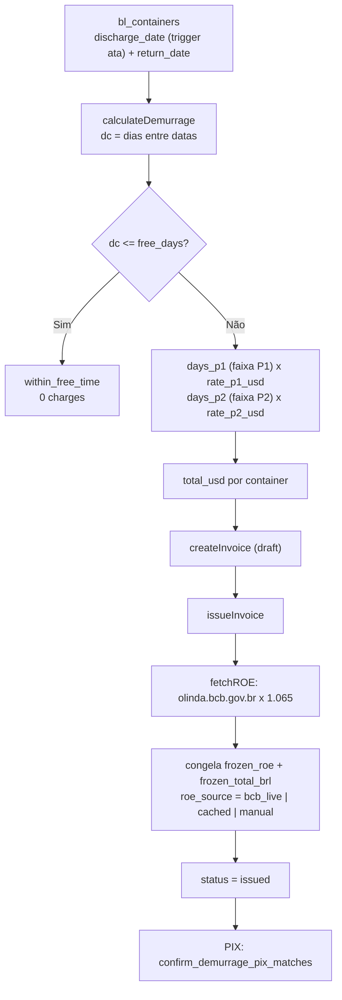

# Demurrage

> **Status:** ativo · **Atualizado:** 2026-06-18 · **Rotas:** `/demurrage`, `/demurrage/taxas`

## Propósito

Acompanha o tempo de permanência dos containers (free time vs. excedido), calcula o demurrage devido em USD por faixas de período e emite invoices de demurrage em BRL com ROE congelado na emissão. A página `/demurrage/taxas` gerencia a tabela de tarifas (`demurrage_rates`) por tipo de container.

## Como funciona

A `discharge_date` do container é preenchida por trigger a partir da `ata` da viagem; com a `return_date`, calcula-se a quantidade de dias e, descontado o free time, o valor por faixa (P1/P2) usando `demurrage_rates` (ou overrides do B/L). Ao emitir a invoice, o ROE (USD→BRL) é buscado no Banco Central, recebe markup e é **congelado** no documento junto com o total em BRL; descontos e disputas são aplicados sobre esse valor congelado.

## Componentes e arquivos

| Camada | Arquivo | Responsabilidade |
|--------|---------|------------------|
| Página | [`src/pages/Demurrage.tsx`](../../src/pages/Demurrage.tsx) | Tracking de containers, abas de invoices, modais (datas, desconto, disputa, pagamento) |
| Página | [`src/pages/DemurrageRates.tsx`](../../src/pages/DemurrageRates.tsx) | Admin de tarifas: CRUD de `demurrage_rates` |
| Service | [`src/services/demurrage/demurrageContainers.ts`](../../src/services/demurrage/demurrageContainers.ts) | Queries de containers, atualização de datas, cálculo de status |
| Service | [`src/services/demurrage/demurrageInvoices.ts`](../../src/services/demurrage/demurrageInvoices.ts) | Ciclo da invoice: criar, emitir (congela ROE/BRL), pagar, cancelar, desconto/disputa |
| Service | [`src/services/demurrage/demurrageRates.ts`](../../src/services/demurrage/demurrageRates.ts) | Resolução de tarifa, engine de cálculo (`calculateDemurrage`) e cache |
| Service | [`src/services/demurrage/demurrageKpis.ts`](../../src/services/demurrage/demurrageKpis.ts) | KPIs, `fetchROE` (BCB), parsing do extrato PIX |
| Componente | [`src/components/demurrage/InvoiceDocument.tsx`](../../src/components/demurrage/InvoiceDocument.tsx) | Documento imprimível: itens, badge ROE, desconto, QR PIX, carimbo PAGO |
| Hook | [`src/hooks/useExchangeRates.ts`](../../src/hooks/useExchangeRates.ts) | Cotações do header (display) — não usado no cálculo de demurrage |

## Regras de negócio

- **Free time:** `calculateDemurrage` calcula `dc = round((return - discharge)/dia)`. Se `dc <= free_days` (da `demurrage_rates`, ou `bls.free_time_override`), retorna `within_free_time` com zero charges.
- **Faixas de cobrança:** `days_p1 = max(0, min(dc, p1_day_to) - p1_day_from + 1) × rate_p1_usd`; `days_p2 = max(0, dc - p2_day_from + 1) × rate_p2_usd`. Total em USD = soma das faixas. Padrões (`STATIC_RATE_GROUPS`): containers 20 → free 21d, P1 22–30 @ $30, P2 31+ @ $50; containers 40 → P1 @ $60, P2 @ $80; reefer → free 10d.
- **Overrides por B/L:** `bls.free_time_override` desloca as faixas P1/P2 pelo delta; `demurrage_rate_override_p1_usd`/`_p2_usd` substituem as tarifas base. Precedência: override do B/L > `demurrage_rates` > `STATIC_RATE_GROUPS`.
- **ROE / PTAX:** `fetchROE` consulta `olinda.bcb.gov.br` (`CotacaoDolarPeriodo`, últimos dias, cotação mais recente) e aplica markup `× 1.065`. Fallback para cache em `localStorage` se o BCB estiver offline. Na emissão (`issueInvoice`), `frozen_roe` e `frozen_total_brl` são gravados e `roe_source` registra a origem (`bcb_live` | `cached` | `manual`). Valores em BRL ficam travados — não recalculam no pagamento.
- **Descontos:** aplicados em BRL pós-ROE sobre o total congelado (`discount_mode` percent/fixed; `discount_type` comercial/datas/cortesia/acordo/erro), com justificativa e aprovador.
- **Numeração:** `doc_number` no formato `DEM-<ano>-<timestamp+hash>`.
- **Status:** `draft` → `issued` → `paid` / `cancelled`; `overdue` é marcado por `mark_overdue_invoices()` (`pg_cron`) quando `issued` e `due_date < hoje`.
- **Constraints de data:** `return_date >= discharge_date`, `total_days >= 0` (migration `20260609132000`, `NOT VALID` para não varrer histórico).

## Dependências

- **Tabelas Supabase:** `demurrage_invoices`, `demurrage_invoice_items`, `demurrage_rates`, `bl_containers`, `bls` (colunas de override).
- **RPCs:** `confirm_demurrage_pix_matches` (baixa PIX em lote), `portal_list_demurrage_invoices`, `portal_get_demurrage_invoice_detail`, `mark_overdue_invoices`. Triggers: `set_container_discharge_date` (preenche `discharge_date` da `ata`), `touch_demurrage_invoice_updated_at`.
- **Integrações externas:** Banco Central / `olinda.bcb.gov.br` (ROE/PTAX), PIX (conciliação — ver [Reconciliação PIX](reconciliacao-pix.md)).
- **Outros módulos:** [Faturamento](faturamento.md) (aba e histórico compartilhados), [Reconciliação PIX](reconciliacao-pix.md), [Taxas Locais](taxas-locais.md), [Regras de negócio](../operations/regras-de-negocio.md), [Glossário](../GLOSSARIO.md), [Arquitetura](../ARCHITECTURE.md).

## Notas e divergências

- **`discharge_date` só preenche no INSERT.** O trigger lê a `voyages.ata` na inserção do container; alterações posteriores na `ata` não se propagam.
- **`overdue` é parcialmente inferido.** O enum permite `overdue`, marcado pelo job diário; fora dele o código trata como `issued`.
- **Tarifas em duas fontes.** Overrides em `bls` coexistem com `demurrage_rates`; não há link de UI entre eles na aba financeira do B/L.
- **PIX sem validação de valor na RPC base.** `confirm_demurrage_pix_matches` faz UPDATE em lote a partir de JSONB; a checagem de valor (`frozen_total_brl`, tolerância 0,01) é feita no orquestrador `confirm_unified_pix_matches`, não nesta RPC.
- **ROE com fallback em cache** pode usar cotação defasada em janelas longas de indisponibilidade do BCB sem trilha de auditoria explícita além de `roe_source`.
