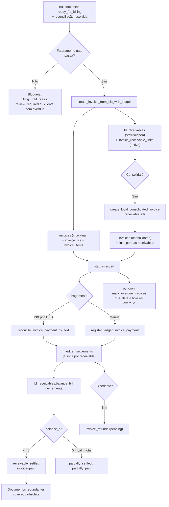

# Faturamento

> **Status:** ativo · **Atualizado:** 2026-06-18 · **Rotas:** `/faturamento`

## Propósito

Centraliza a emissão e a cobrança de invoices de taxas locais a partir de B/Ls já calculados e revisados. Suporta dois modelos de cobrança: invoice **individual** (1+ B/Ls de um cliente) e invoice **consolidada** (várias receivables abertas de um cliente em um único documento), com pagamento, baixa, refund de excedente e cancelamento controlados por um ledger de receivables como fonte da verdade do saldo em aberto.

## Como funciona

O fluxo parte de B/Ls com cálculo de taxas concluído (ver [Taxas Locais](taxas-locais.md)). A aba de validação aplica o **faturamento gate**, emite a invoice via RPC e cria as `bl_receivables`. O pagamento é alocado contra as receivables através de `ledger_settlements`; quando uma receivable já coberta por invoice individual é paga por uma consolidada (ou vice-versa), os documentos redundantes são marcados como `covered`/`obsolete`.

## Componentes e arquivos

| Camada | Arquivo | Responsabilidade |
|--------|---------|------------------|
| Página | [`src/pages/Faturamento.tsx`](../../src/pages/Faturamento.tsx) | Página principal: abas de invoices, validação, pendências e demurrage; dispara `mark_overdue` no mount |
| Página (helper) | [`src/pages/faturamentoInvoiceStatus.ts`](../../src/pages/faturamentoInvoiceStatus.ts) | Mapeia os 8 status reais nos 3 status de UI (`issued`/`paid`/`cancelled`) |
| Página (helper) | [`src/pages/faturamentoLedgerPayment.ts`](../../src/pages/faturamentoLedgerPayment.ts) | `isLedgerInvoicePayable()` — decide o caminho de pagamento (ledger vs legado) |
| Hook | [`src/hooks/useBilling.ts`](../../src/hooks/useBilling.ts) | `useInvoices`, `useInvoiceDetail`, pagamento, cancelamento, charges manuais |
| Hook | [`src/hooks/useBillingLedger.ts`](../../src/hooks/useBillingLedger.ts) | Receivables consolidáveis, criação de consolidada, pagamento ledger, settle de refund |
| Service | [`src/services/billing.ts`](../../src/services/billing.ts) | CRUD de invoice, listagem, detalhe, charges manuais; reconstrói itens de consolidada |
| Service | [`src/services/billingLedger.ts`](../../src/services/billingLedger.ts) | RPCs do ledger: consolidação, pagamento por TXID, refunds |
| Service | [`src/services/charges/chargeReconciliationService.ts`](../../src/services/charges/chargeReconciliationService.ts) | Fila de reconciliação de cliente (gate do faturamento) |
| Componente | [`src/components/billing/InvoicesTable.tsx`](../../src/components/billing/InvoicesTable.tsx) | Lista de invoices com filtros |
| Componente | [`src/components/billing/InvoiceDetailModal.tsx`](../../src/components/billing/InvoiceDetailModal.tsx) | Detalhe, pagamento, refund, cancelamento; escolhe caminho ledger vs legado |
| Componente | [`src/components/billing/ConsolidatedInvoiceModal.tsx`](../../src/components/billing/ConsolidatedInvoiceModal.tsx) | Wizard de consolidação por receivables |
| Componente | [`src/components/billing/ValidacaoTab.tsx`](../../src/components/billing/ValidacaoTab.tsx) | Orquestra recalcular → revisar → ready → emitir; integra fila de reconciliação |
| Componente | [`src/components/billing/PendenciasFaturamentoTab.tsx`](../../src/components/billing/PendenciasFaturamentoTab.tsx) | B/Ls pendentes de cálculo |
| Componente | [`src/components/billing/ReconciliationHistoryTable.tsx`](../../src/components/billing/ReconciliationHistoryTable.tsx) | Histórico de pagamentos (local + demurrage) |

## Regras de negócio

- **Numeração de invoice:** o trigger `assign_invoice_number` (BEFORE INSERT em `invoices`) gera o número via `invoice_counters` (sequência por ano), no formato `INV-<ano>-<NNNN>`. Não é informado pela aplicação; só preenche se `invoice_number` vier vazio.
- **Faturamento gate (invoice individual via ledger):** o B/L precisa de `charge_status = ready_for_billing`, reconciliação de cliente **resolvida** (`reconciled`/`matched_document`/`matched_name`), sem `billing_hold_reason`, `financial_status != invoiced`, todos os B/Ls da seleção com o **mesmo** `customer_id` (não nulo) e sem vínculo a invoice ativa. Aplicado em `ValidacaoTab` e validado dentro de `create_invoice_from_bls_with_ledger`.
- **Enforcement de inadimplência:** o trigger `fn_block_invoice_overdue_customer` (BEFORE INSERT em `invoices`) bloqueia a emissão de nova invoice de taxas locais para cliente que possua qualquer invoice `overdue` em aberto (ERRCODE `P0003`). `mark_overdue_invoices()` roda via `pg_cron` diariamente (06:00 UTC) marcando `issued` com `due_date < hoje` como `overdue` em `invoices` e `demurrage_invoices`.
- **Status reais:** `draft`, `issued`, `partially_paid`, `overdue`, `paid`, `covered`, `obsolete`, `cancelled`. `covered` = invoice individual quitada por consolidada das mesmas receivables; `obsolete` = consolidada superada por pagamento individual.
- **Consolidação:** `list_consolidatable_receivables` lista receivables abertas/parciais do cliente; `create_local_consolidated_invoice` gera invoice `consolidated` e cria `invoice_receivable_links` (status `active`) para cada receivable. A consolidada **não** persiste itens em `invoice_items` — o breakdown é reconstruído na leitura via `get_consolidated_invoice_item_breakdown` a partir de `charge_calculations`.
- **Settlement (ledger):** `bl_receivables` é a fonte da verdade do saldo (`original_amount_brl`, `settled_amount_brl`, `balance_brl`, `status`). O pagamento (`register_ledger_invoice_payment` / `reconcile_invoice_payment_by_txid`) aloca o valor pelas receivables vinculadas, gravando uma linha em `ledger_settlements` por receivable e decrementando `balance_brl`. Excedente gera `invoice_refunds` (pending → settled via `settle_invoice_refund`).
- **Caminho de pagamento dual:** invoices individuais/consolidadas (ledger) usam `register_ledger_invoice_payment`; o caminho legado `register_invoice_payment` permanece para invoices não-ledger. `isLedgerInvoicePayable()` decide com base em `invoice_type` e saldo.
- **Charges manuais:** `add_manual_invoice_charge` / `delete_manual_invoice_charge` só operam em invoices `draft`/`issued` sem pagamento registrado.
- **TXID único:** `reconcile_invoice_payment_by_txid` normaliza o TXID e rejeita duplicidade (`already_reconciled`) checando `ledger_settlements.pix_txid`, evitando dupla baixa.

## Dependências

- **Tabelas Supabase:** `invoices`, `invoice_items`, `invoice_bls`, `invoice_receivable_links`, `invoice_granite_bls`, `invoice_counters`, `invoice_lifecycle_events`, `invoice_refunds`, `bl_receivables`, `ledger_settlements`, `payments`, `bls`, `charge_calculations`, `customers`.
- **RPCs:** `create_invoice_from_bls`, `create_invoice_from_bls_with_ledger`, `create_invoice_from_granite_bls`, `create_local_consolidated_invoice`, `list_consolidatable_receivables`, `register_invoice_payment`, `register_ledger_invoice_payment`, `reconcile_invoice_payment_by_txid`, `cancel_invoice`, `add_manual_invoice_charge`, `delete_manual_invoice_charge`, `list_invoice_details`, `get_consolidated_invoice_item_breakdown`, `list_invoice_refunds`, `settle_invoice_refund`, `mark_overdue_invoices`. Triggers: `assign_invoice_number`, `fn_block_invoice_overdue_customer`.
- **Integrações externas:** PIX (conciliação por TXID — ver [Reconciliação PIX](reconciliacao-pix.md)). Job agendado via `pg_cron`.
- **Outros módulos:** [Taxas Locais](taxas-locais.md) (origem dos charges e do gate), [Demurrage](demurrage.md) (aba e histórico compartilhados), [Reconciliação PIX](reconciliacao-pix.md), [Regras de negócio](../operations/regras-de-negocio.md), [Glossário](../GLOSSARIO.md), [Arquitetura](../ARCHITECTURE.md).

## Notas e divergências

- **Itens da consolidada são derivados em leitura.** `get_consolidated_invoice_item_breakdown` reconstrói o detalhamento a partir de `charge_calculations` + `bl_receivables` a cada render, com fallback agregado por B/L se a reconciliação falhar — operação custosa e sensível a drift de dados.
- **Dois modelos de invoice convivem.** Individual liga direto a `invoice_bls`; consolidada liga a `invoice_receivable_links`. A coluna legada `invoices.bl_id` (FK única) permanece por compatibilidade e não é usada no caminho ledger.
- **`bls.financial_status` não é mais a fonte da verdade** do saldo; é mantida em sincronia com o ledger por triggers, mas o saldo real vive em `bl_receivables.balance_brl`.
- **`detect_overdue_invoices()` (migration 024) foi superada** por `mark_overdue_invoices()` + `pg_cron` (migration 031). O dispatch de overdue no mount da página é fire-and-forget (erros silenciados).
- **`pricing_rule_versions`** existe mas não é consultada por este módulo (auditoria via `audit_logs`).
