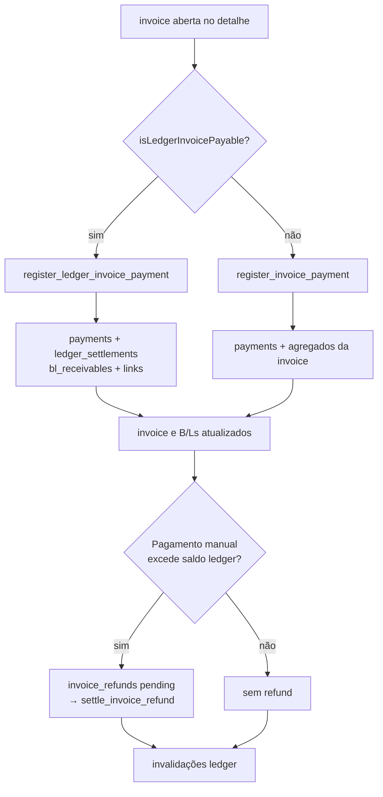

# Faturamento

> **Status:** ativo · **Atualizado:** 2026-07-08 · **Rotas:** `/faturamento`; detalhe e estorno de pagamentos também são abertos por `/reconciliacao`

## Propósito e escopo

Faturamento transforma B/Ls elegíveis em documentos financeiros, mantém a
lista e o detalhe de invoices, cria consolidadas, registra pagamentos,
cancelamentos e restituições e apresenta Demurrage como visão financeira
agregada. Para taxas locais, o saldo canônico é o ledger por recebível; a tabela
`invoices` continua sendo o documento emitido.

- `/faturamento` é uma rota interna definida em `src/App.tsx` e composta por
  `src/pages/Faturamento.tsx`.
- Alterações financeiras exigem usuário ativo/admin nas RPCs. A capacidade
  `faturamento_edit` existe em `src/hooks/useAuth.tsx`, mas
  `src/pages/Faturamento.tsx` não a usa como gate da rota ou das abas.
- [Taxas Locais](taxas-locais.md) é dona do cálculo e do estado
  `ready_for_billing`.
- Para B/Ls de container, emissão automática de taxas locais só nasce após o
  cadastro do CE Mercante (ADR 0020) e continua respeitando reconciliação de
  cliente, revisão e holds. Carga solta/Granito seguem fora desse gatilho.
- [Reconciliação PIX](reconciliacao-pix.md) é dona do upload, matching,
  confirmação por TXID e estorno a partir do histórico.
- Demurrage aparece na mesma experiência, mas permanece em
  `demurrage_invoices`, sem entrar no ledger local.

## Anatomia das telas

### Lista de invoices

`src/pages/Faturamento.tsx` abre por padrão a aba **Faturas**. A lista usa:

- `src/components/billing/InvoiceFiltersBar.tsx` para B/L, invoice, cliente,
  navio/viagem, POD, tipo, status, emissão, pagamento e tamanho de página;
- `src/components/billing/InvoicesTable.tsx` para paginação, totais, B/Ls
  diretos ou de receivables e abertura do detalhe;
- métricas da página atual e exportação completa dos filtros;
- query string `invoice`, `customer`, `customerName`, `bl` e `tab`;
- loading, erro e vazio derivados de `useInvoices`.

Ao montar, a página chama `detect_overdue_invoices` em fire-and-forget e
invalida invoices, alertas financeiros e contagem operacional em caso de
sucesso.

### Validação e pendências

- `src/components/billing/ValidacaoTab.tsx` orquestra consultas, mutações,
  invalidações e estado da fila operacional de taxas locais e Granito.
  `src/components/billing/ValidacaoControls.tsx` contém filtros, pipeline e
  ações em lote; `src/components/billing/ValidacaoOperationsTable.tsx` renderiza
  seleção, detalhes, conciliação e emissão individual.
- `src/components/billing/PendenciasFaturamentoTab.tsx` mostra B/Ls
  `review_required` e recalcula toda a lista carregada.
- `src/components/billing/PendenciasTable.tsx` renderiza inicialmente 100 linhas
  e revela novos lotes de 100.

### Modal de invoice consolidada

`src/components/billing/ConsolidatedInvoiceModal.tsx` seleciona cliente,
viagem e B/L, consulta receivables, desabilita linhas não elegíveis e resume
quantidade/valor. A seleção só aceita `eligibility_status = eligible`, regra
isolada em `src/components/billing/consolidatedInvoiceSelection.ts`.

### Detalhe, pagamento, restituição e cancelamento

`src/components/billing/InvoiceDetailModal.tsx` apresenta:

- métricas, cliente, B/Ls, itens e pagamentos;
- breakdown reconstruído de consolidadas;
- formulário de pagamento com decisão ledger versus legado;
- inclusão/exclusão de other charges em invoice individual elegível;
- lista de `invoice_refunds` e ação “Marcar estornado”;
- cancelamento de invoice sem pagamentos;
- cancelamento de baixa quando aberto pelo histórico de `/reconciliacao`;
- abertura do documento imprimível.

### Demurrage

`src/components/billing/DemurrageInvoicesSection.tsx` carrega a lista e o
detalhe de `demurrage_invoices`, exibe métricas e imprime o documento de
Demurrage. A criação e gestão continuam em `/demurrage`.

### Histórico de reconciliação

`src/components/billing/ReconciliationHistoryTable.tsx` pertence à pasta de
billing, mas não é montado em `Faturamento.tsx`; a superfície executável está em
`src/pages/Reconciliacao.tsx`. Ela combina pagamentos locais e Demurrage,
filtra, ordena, pagina, exporta e abre o detalhe para estorno.

### Documento imprimível

`src/components/billing/InvoiceDocumentLocal.tsx` usa
`src/components/shared/InvoiceDocumentKit.tsx` e
`src/components/shared/invoiceFormat.ts`. `InvoiceDetailModal` abre uma área de
impressão e chama `window.print()`; o nome sugerido é calculado por
`buildInvoiceFileBaseName`. Não existe geração de PDF por biblioteca.

## Catálogo de ações

| Tela / ação | Pré-condições | Origem | Orquestração | Persistência | Efeitos e cache | Falhas | Evidência |
|---|---|---|---|---|---|---|---|
| `/faturamento` · filtrar/listar invoices | Sessão interna; filtros opcionais | `Faturamento` → `InvoiceFiltersBar` / `InvoicesTable` | `useInvoices` → `listInvoices` | `SELECT invoices`, `invoice_bls`, `invoice_receivable_links`, `payments`; filtros auxiliares consultam B/Ls/viagens | Query `queryKeys.invoices.list(filters)`; paginação remota da lista principal | Erro principal vira `InlineError`; filtros sem IDs retornam vazio sem consultar invoices | **Código:** `src/pages/Faturamento.tsx`, `src/services/billing.ts` · **Teste:** `src/services/__tests__/billing.test.ts` |
| `/faturamento` · exportar lista | Mesmos filtros; ao menos uma invoice | `Faturamento.handleExport` | `listInvoicesForExport` → `exportInvoicesWorkbook` | Leituras paginadas de 1000; arquivo XLSX local | Não altera cache | Sem linhas gera aviso; leitura/geração propaga erro | **Código:** `src/pages/Faturamento.tsx`, `src/services/billing.ts`, `src/services/exports.ts` · **Teste:** `src/services/__tests__/billingHelpers.test.ts` |
| `/faturamento` · abrir invoice | ID selecionado pela tabela ou query string | `InvoicesTable.onSelectInvoice` | `useInvoiceDetail` → `listInvoiceDetails` | RPC `list_invoice_details` lê documento, links diretos, itens e pagamentos | Query `queryKeys.invoices.detail(id)` | ID ausente desabilita query; erro mostra falha no modal | **Código:** `src/components/billing/InvoicesTable.tsx`, `src/components/billing/InvoiceDetailModal.tsx`, `src/services/billing.ts` · **Teste:** `src/pages/__tests__/Faturamento.behavior.test.tsx` |
| Detalhe · carregar breakdown consolidado | Invoice sem itens diretos e com `invoice_receivable_links` | `listInvoiceDetails` após RPC base | Lê links/snapshots; RPC `get_consolidated_invoice_item_breakdown`; valida com Zod | `invoice_receivable_links`, `voyages`, leitura protegida de `charge_calculations` | Reusa `invoice-detail`; usa linha agregada por B/L se breakdown não reconciliar com subtotal | Erro/shape inválido do breakdown é best-effort e cai no agregado | **Código:** `src/services/billing.ts`, `supabase/migrations/086_consolidated_invoice_item_breakdown.sql`, `supabase/migrations/090_restrict_consolidated_invoice_breakdown.sql` |
| `/faturamento` · marcar vencidas ao abrir | Montagem da página | `Faturamento.useEffect` | `detectOverdueInvoices` | RPC `detect_overdue_invoices` altera invoices e cria alertas em português, com `entity_id` igual ao número da invoice quando disponível | Invalida `['financial-alerts']`, `['invoices']`, `['op-count']` | Erro é enviado à telemetria best-effort sem rejeição não tratada | **Código:** `src/pages/Faturamento.tsx`, `src/services/alerts.ts`, `supabase/migrations/168_overdue_invoice_alerts_ptbr_entity.sql` · **Teste:** `src/pages/__tests__/Faturamento.behavior.test.tsx`; **Teste de contrato SQL:** `src/services/__tests__/overdueInvoiceAlertsMigration.test.ts` |
| Validação · recalcular selecionados | Seleção não vazia | `ValidacaoTab.runBatchOperation('recalculate')` | Hooks de Taxas Locais; Granito usa `runGraniteBatch` canônico | Uma operação por B/L | Invalida operações, invoices, B/Ls e resumo após o lote | Resultado parcial agrega erros sem interromper os demais B/Ls | **Código:** `src/components/billing/ValidacaoTab.tsx`, `src/hooks/useLocalCharges.ts`, `src/services/graniteBillingWorkflow.ts` · **Teste:** `src/services/__tests__/localCharges.test.ts`, `src/services/__tests__/graniteBillingWorkflow.test.ts` |
| Validação · aprovar revisão selecionada | Seleção não vazia | `runBatchOperation('review')` | `useBatchMarkLocalChargesReviewed`; `runGraniteBatch` rejeita revisão Granito como não suportada | RPC `mark_bl_charges_reviewed` por B/L local | Invalida operações, pendências, B/Ls e detalhe-prefixo vazio | Falhas são isoladas por B/L; Granito não reporta sucesso sem escrita | **Código:** `src/components/billing/ValidacaoTab.tsx`, `src/services/charges/chargeOperationsService.ts`, `src/services/graniteBillingWorkflow.ts` · **Teste:** `src/services/__tests__/localCharges.test.ts`, `src/services/__tests__/validacaoGraniteWorkflowContract.test.ts` |
| Validação · marcar pronto selecionados | Seleção; gates de cliente/taxas | `runBatchOperation('ready')` | Agrupa locais por cliente e usa `markBlsReadyAndCreateInvoice` | RPC `mark_bls_ready_and_create_invoice` promove e emite atomicamente por grupo | Invalida operações, invoices, B/Ls e resumo | Qualquer falha reverte promoção e emissão do grupo | **Código:** `src/components/billing/ValidacaoTab.tsx`, `src/services/localBatchBillingWorkflow.ts`, `src/services/billing.ts`, `supabase/migrations/133_mark_bls_ready_and_create_invoice_atomic.sql` |
| Validação · emitir invoice individual | B/L `ready_for_billing`, não faturado e com cliente | `handleIssueSingleInvoice` | `createInvoiceFromBls` | RPC protegida `create_invoice_from_bls_with_ledger` (`SECURITY DEFINER` após validar usuário ativo/admin) → core revogado + `link_invoice_to_ledger` | Invalida operações, invoices, B/Ls e resumo | RPC revalida estado, cliente, vínculos e permissões; core não é chamável diretamente por authenticated | **Código:** `src/components/billing/ValidacaoTab.tsx`, `src/services/billing.ts`, `supabase/migrations/100_create_invoice_from_bls_with_ledger.sql`, `supabase/migrations/141_secure_billing_core_wrappers.sql` · **Teste:** `src/services/__tests__/billing.test.ts`, `src/services/__tests__/billingCoreWrapperPrivilegesMigration.test.ts` |
| B/L/revisão · marcar pronto e emitir atomicamente | Um B/L com cliente e gates satisfeitos | `BlCobrancasTab`, `reviewBillingAutomation` | `markBlReadyAndCreateInvoice` | RPC `mark_bl_ready_and_create_invoice` chama promoção + criação ledger na mesma transação | Chamadores invalidam seus domínios após sucesso | Qualquer falha aborta promoção e emissão juntas | **Código:** `src/components/bl/BlCobrancasTab.tsx`, `src/services/reviewBillingAutomation.ts`, `supabase/migrations/102_mark_ready_and_invoice_atomic.sql` |
| Modal consolidada · listar elegíveis | Cliente selecionado; filtros opcionais | `ConsolidatedInvoiceModal` | `useConsolidatableReceivables` → `listConsolidatableReceivables` | RPC `list_consolidatable_receivables` lê ledger e links | Query `queryKeys.billingLedger.consolidatableReceivables(filters)` | Sem cliente não consulta; rows pagas/sem saldo/em consolidada aberta ficam desabilitadas | **Código:** `src/components/billing/ConsolidatedInvoiceModal.tsx`, `src/services/billingLedger.ts` · **Teste:** `src/components/billing/__tests__/ConsolidatedInvoiceSelection.test.ts` |
| Modal consolidada · emitir | Cliente e ao menos um receivable elegível selecionado | `ConsolidatedInvoiceModal.submit` | `useCreateConsolidatedInvoice` → `createConsolidatedInvoice` | RPC `create_local_consolidated_invoice` cria invoice, links, evento e auditoria | Invalidação ledger comum: ledger, invoices, B/Ls, clientes, detalhes, refunds, alertas e contagem | RPC trava receivables e rejeita cliente divergente, saldo inválido ou consolidada aberta | **Código:** `src/services/billingLedger.ts`, `supabase/migrations/067_local_billing_ledger_phase2.sql` · **Teste:** `src/services/__tests__/billingLedger.test.ts` |
| Detalhe · registrar pagamento ledger | `isLedgerInvoicePayable`: tipo individual/consolidated, status `issued`/`partially_paid`/`overdue`, saldo positivo | `InvoiceDetailModal.handleRegisterPayment` | `useRegisterLedgerInvoicePayment` → `registerLedgerInvoicePayment` | RPC `register_ledger_invoice_payment` → `payments`, `ledger_settlements`, receivables, invoice, B/Ls, eventos e possível refund | Invalidação ledger comum | Valor/data validados; RPC rejeita estado, ausência de links, TXID duplicado e regras de valor | **Código:** `src/pages/faturamentoLedgerPayment.ts`, `src/components/billing/InvoiceDetailModal.tsx`, `src/services/billingLedger.ts` · **Teste:** `src/services/__tests__/billingLedger.test.ts` |
| Detalhe · registrar pagamento legado | Invoice não classificada como ledger payable | Mesmo handler, ramo `else` | `useRegisterInvoicePayment` → `registerInvoicePayment` | RPC `register_invoice_payment` → `payments`, agregados de `invoices`, `bls.financial_status`, auditoria | Invalida invoices, detalhe, B/Ls e clientes | Bloqueia valor não positivo, acima do saldo, invoice paga/cancelada | **Código:** `src/hooks/useBilling.ts`, `supabase/migrations/020_billing_hybrid_workflow.sql` · **Teste:** `src/services/__tests__/billing.test.ts` |
| Detalhe · adicionar other charge | Invoice não consolidada, status `draft`/`issued`/`overdue`, sem pagamentos | `handleAddCharge` | Zod `manualInvoiceChargeSchema` → `useAddManualInvoiceCharge` | RPC `add_manual_invoice_charge` → `invoice_items` e totais | Invalida invoices e detalhe | Validação de descrição/quantidade/valor; RPC guarda estado e pagamentos | **Código:** `src/components/billing/InvoiceDetailModal.tsx`, `src/services/financialValidation.ts`, `supabase/migrations/108_guard_manual_charges_and_clear_pix_on_reversal.sql` |
| Detalhe · excluir other charge | Mesmas condições; item `source = manual` | `handleDeleteCharge` | `useDeleteManualInvoiceCharge` | RPC `delete_manual_invoice_charge` | Invalida invoices e detalhe | RPC rejeita item automático ou invoice protegida | **Código:** `src/services/billing.ts`, `src/hooks/useBilling.ts` · **Teste de contrato SQL:** `src/services/__tests__/guardManualChargesMigration.test.ts` |
| Detalhe · cancelar invoice | Admin; invoice sem pagamentos | `handleCancelInvoice` | `useCancelInvoice` → `cancelInvoice` | RPC protegida `cancel_invoice` (executa como `SECURITY DEFINER` após validar sessão ativa e papel admin) → invoice, batch, B/Ls e auditoria; implementação mais recente também preserva regras de Granito | Invalida invoices, detalhe, billing-ready, B/Ls e clientes | Pagamentos bloqueiam cancelamento; tabelas internas não são expostas diretamente; falha cria alerta/evento best-effort | **Código:** `src/components/billing/InvoiceDetailModal.tsx`, `src/services/billing.ts`, `supabase/migrations/064_fix_granite_invoice_cancel_reissue.sql`, `supabase/migrations/142_secure_cancel_invoice_wrapper.sql` |
| Detalhe · liquidar restituição | `invoice_refunds.status = pending`; admin | `handleSettleRefund` | `useSettleInvoiceRefund` → `settleInvoiceRefund` | RPC `settle_invoice_refund` atualiza refund e auditoria | Invalidação ledger comum | Refund ausente ou não pendente é rejeitado | **Código:** `src/services/billingLedger.ts`, `supabase/migrations/112_settle_invoice_refunds.sql` · **Teste de contrato SQL:** `src/services/__tests__/settleInvoiceRefundsMigration.test.ts` |
| Detalhe · imprimir invoice | Detalhe carregado | `handlePrintInvoice` | Abre `InvoiceDocumentLocal`; `window.print()` | Sem persistência; documento usa snapshot/detalhe e `pix_payload` | Sem invalidação | Sem detalhe, ação não abre; falha de impressão é do navegador | **Código:** `src/components/billing/InvoiceDetailModal.tsx`, `src/components/billing/InvoiceDocumentLocal.tsx`, `src/index.css` · **Teste:** `src/components/billing/__tests__/InvoiceDetailPrint.test.tsx` |
| Histórico de reconciliação · filtrar/exportar/abrir detalhe | Superfície `/reconciliacao` | `ReconciliationHistoryTable` | `listReconciliationHistory`, `exportReconciliationHistoryExcel` | Leituras de invoices/payments/links e Demurrage; export XLSX local | Query `['reconciliation-history', filters]` | Erros de leitura aparecem na tabela; export reaplica filtros | **Código:** `src/components/billing/ReconciliationHistoryTable.tsx`, `src/services/reconciliacao.ts` · **Teste:** `src/components/billing/__tests__/ReconciliationHistoryTable.behavior.test.tsx` |

## Estado e dados

### Queries e invalidações

| Estado remoto | Query key | Dono |
|---|---|---|
| Lista de invoices | `queryKeys.invoices.list(filters)` | `useInvoices` |
| Detalhe | `queryKeys.invoices.detail(id)` | `useInvoiceDetail` |
| Links por B/L | `queryKeys.invoices.links(blIds)` | `useInvoiceLinks` |
| Clientes do seletor | `queryKeys.billingReady.customers(search)` | `useBillingCustomers` |
| Receivables consolidáveis | `queryKeys.billingLedger.consolidatableReceivables(filters)` | `useConsolidatableReceivables` |
| Refunds | `['invoice-refunds', invoiceId]` | `useInvoiceRefunds` |
| Alertas | `['financial-alerts']` | `Faturamento` |
| Demurrage agregado | `['demurrage-invoices', 'faturamento']` | `DemurrageInvoicesSection` |
| Histórico | `['reconciliation-history', filters]` | `ReconciliationHistoryTable` |

`useLedgerInvalidation` invalida `billingLedger.all()`, `invoices.all()`,
`bls.all()`, clientes, `['invoice-detail']`, `['invoice-refunds']`,
`['financial-alerts']` e `['op-count']`. O caminho legado usa invalidações
menores e específicas descritas no catálogo.

### Ownership financeiro

| Relação | O que possui | O que não possui |
|---|---|---|
| `invoices` | Documento, número, cliente, tipo, datas, total, agregados pagos/saldo, status, PIX e relações `covered`/`obsolete` | Não é a fonte final do saldo por B/L no caminho ledger |
| `invoice_bls` | Vínculo direto e snapshot financeiro de B/Ls para invoices individuais/Granito | Não representa a alocação contábil de consolidadas |
| `invoice_receivable_links` | Vínculo invoice ↔ receivable, subtotal/snapshot e estado `active`/`settled_by_this_invoice`/`settled_elsewhere`/`obsolete` | Não possui o saldo atual; aponta para `bl_receivables` |
| `bl_receivables` | `original_amount_brl`, `settled_amount_brl`, `balance_brl` e estado por B/L de taxas locais | Não é o documento apresentado ao cliente |
| `ledger_settlements` | Alocação de um pagamento a um receivable, método, origem e TXID | Não substitui o evento de pagamento em `payments` |
| `payments` | Evento de pagamento por invoice, valor, método, data, ator e observação | No ledger, não informa sozinho como o valor foi distribuído entre B/Ls |
| `invoice_refunds` | Excedente manual a devolver e estado `pending`/`settled`/`cancelled` | Não reabre saldo nem substitui o estorno do pagamento |
| `invoice_lifecycle_events` | Eventos `issued`, `paid`, `partially_paid`, `covered`, `obsolete`, `cancelled`, `reconciled_by_txid` e `backfilled` | Não é a fonte de saldo nem o log genérico de todas as alterações |

### Fronteiras atômicas

| RPC | Transição atômica | Chamador atual |
|---|---|---|
| `create_invoice_from_bls_with_ledger` | `create_invoice_from_bls_core` + `link_invoice_to_ledger` | `createInvoiceFromBls` em `src/services/billing.ts` |
| `mark_bl_ready_and_create_invoice` | trava B/L, promove para pronto e cria invoice ledger | `BlCobrancasTab` e `reviewBillingAutomation` |
| `create_local_consolidated_invoice` | trava receivables, cria invoice, links, evento e auditoria | `createConsolidatedInvoice` |
| `register_ledger_invoice_payment` | cria payment, distribui settlements, atualiza receivables/invoice/B/Ls, estados cruzados, eventos e refund | `registerLedgerInvoicePayment`; também chamado por reconciliação TXID |
| `reconcile_invoice_payment_by_txid` | resolve uma invoice local e delega a baixa ao ledger | `confirm_unified_pix_matches` em `/reconciliacao` |
| `register_invoice_payment` | pagamento e agregados do modelo legado | `registerInvoicePayment` |
| `cancel_invoice` | cancelamento, estado de B/Ls e auditoria | `cancelInvoice` |
| `add_manual_invoice_charge` / `delete_manual_invoice_charge` | item manual e totais protegidos por estado | `addManualInvoiceCharge` / `deleteManualInvoiceCharge` |
| `settle_invoice_refund` | `pending → settled` com auditoria | `settleInvoiceRefund` |

## Fluxos e invariantes

- `isLedgerInvoicePayable` exige tipo `individual` ou `consolidated`, estado
  pagável e `balance_brl > 0`; qualquer outro documento cai no RPC legado.
- No ledger, `bl_receivables.balance_brl` é a fonte da verdade. Totais e status
  em `invoices` e `bls.financial_status` são projeções atualizadas na mesma RPC.
- Pagamento ledger parcial produz `bl_receivables.status =
  partially_settled` e `invoices.status = partially_paid`. O valor é alocado em
  ordem de `receivable_id`.
- PIX exige quitação do saldo local, com margem técnica de `0,01`. Pagamento
  manual pode ser parcial; se exceder o saldo, aloca somente o aberto e cria
  `invoice_refunds`.
- `covered` significa que uma invoice individual foi quitada por uma
  consolidada ligada aos mesmos receivables. `covered_by_invoice_id` aponta para
  o documento que liquidou.
- `obsolete` significa que uma consolidada aberta perdeu validade porque uma
  invoice individual liquidou receivables que ela cobria. Seus links passam a
  `obsolete`.
- O estorno do pagamento local, documentado em
  [Reconciliação PIX](reconciliacao-pix.md), restaura receivables, links e
  estados `covered`/`obsolete` quando aplicável.
- O breakdown de consolidada é derivado em leitura. O subtotal de
  `invoice_receivable_links` prevalece: se a soma atual de
  `charge_calculations` não reconciliar em `0,01`, a UI mostra uma linha
  agregada.
- A UI agrupa oito status reais em três rótulos:
  `issued|partially_paid|overdue|draft → Emitida`,
  `paid|covered → Paga`, `cancelled|obsolete → Cancelada`.

## Testes e validação

Os testes não foram executados nesta cartografia, por instrução do coordenador.

### Testes de serviço, página e componente

- `src/pages/__tests__/Faturamento.test.ts`
- `src/pages/__tests__/faturamentoInvoiceStatus.test.ts`
- `src/services/__tests__/billing.test.ts`
- `src/services/__tests__/billingHelpers.test.ts`
- `src/services/__tests__/billingLedger.test.ts`
- `src/components/billing/__tests__/ConsolidatedInvoiceModal.test.tsx`
- `src/components/billing/__tests__/ConsolidatedInvoiceSelection.test.ts`
- `src/components/billing/__tests__/ManualChargeFormFields.test.tsx`
- `src/components/billing/__tests__/PendenciasTable.test.tsx`
- `src/components/billing/__tests__/ValidacaoOperationsTable.test.tsx`

Esses arquivos sustentam filtros, emissão, RPCs de pagamento/cancelamento,
seleção de consolidadas, helpers de status, paginação de exportação e estados
dos formulários.

### Teste de contrato SQL

Os testes abaixo leem texto de migrations; não provam o comportamento de um
banco aplicado:

- `src/services/__tests__/ledgerIndividualRpcMigration.test.ts`
- `src/services/__tests__/ledgerPartialPaymentsMigration.test.ts`
- `src/services/__tests__/ledgerSettlementGuardsMigration.test.ts`
- `src/services/__tests__/pixExactAndRefundsMigration.test.ts`
- `src/services/__tests__/settleInvoiceRefundsMigration.test.ts`
- `src/services/__tests__/guardInvoiceableReadyStateMigration.test.ts`
- `src/services/__tests__/guardManualChargesMigration.test.ts`

Não há evidência de Runtime registrada neste documento.

## Notas e divergências

- **Histórico fora de `/faturamento`.** Apesar do nome e diretório do componente,
  `ReconciliationHistoryTable` é montado somente em `/reconciliacao`.
- **Dois detectores de vencimento coexistem.** A página ainda chama
  `detect_overdue_invoices`, com definição vigente em
  `supabase/migrations/168_overdue_invoice_alerts_ptbr_entity.sql`;
  o job canônico diário usa `mark_overdue_invoices` em
  `supabase/migrations/031_overdue_enforcement.sql`. A chamada da página ignora
  erros.
- **Emissão em lote não usa a fronteira pronta+invoice.** `ValidacaoTab` promove
  B/Ls e depois chama `create_invoice_from_bls_with_ledger` por cliente. Entre
  as duas etapas pode haver sucesso parcial; a RPC
  `mark_bl_ready_and_create_invoice` é usada no detalhe/revisão de um B/L.
- **Breakdown congelado na consolidação (migration `261`).** Desde a etapa 1 do
  plano de faturamento (ADR 0038, achado 3), `create_local_consolidated_invoice_core`
  grava o snapshot em `invoice_items` no momento da consolidação — linha por
  item quando a soma reconcilia com o saldo do B/L, senão uma linha agregada
  (mesma regra que antes só existia ao vivo). Consolidadas emitidas antes da
  migration foram backfilled (`snapshot_payload.backfilled=true`); a
  reconstrução ao vivo em `get_consolidated_invoice_item_breakdown` e no CTE de
  `portal_invoice_details` continua existindo só como rede de segurança.
- **Taxa local em USD converte na emissão (migration `268`).** Etapa 11 do
  plano de faturamento (ADR 0038, decisão 6, achado 7): linha em USD deixou
  de bloquear o faturamento. `create_invoice_from_bls_core` e
  `create_local_consolidated_invoice_core` convertem para BRL pelo ROE
  vigente em `exchange_rate_reference` no momento da emissão/consolidação,
  congelado no `snapshot_payload` do item (`roe`, `roe_effective_date`) e
  exibido como nota no documento impresso e no modal de detalhe. Sem ROE
  configurado, a emissão falha com mensagem explícita em vez de congelar
  valor zerado. A mesma migration removeu o trigger
  `trg_emit_invoice_on_bl_ready` (bug pré-existente: emitia fatura
  automaticamente em qualquer transição para `ready_for_billing`, inclusive
  pelo botão manual, sem checar CE Mercante) — `mark_bl_ready_for_billing`
  passou a chamar `sync_local_charge_receivable` diretamente para manter o
  ledger atualizado sem esse efeito colateral.
- **PIX tem dois autores.** A migration
  `074_ledger_invoice_pix_payload.sql` mantém payload por trigger para
  invoices locais. `createInvoiceFromBls` ainda executa `persistPixPayload`
  depois da RPC e trata falha de update como best-effort.
- **Suspeita — caminho legado amplo.** A decisão de pagamento é feita somente
  por tipo, status e saldo da invoice. Documento local com vínculos ledger
  incompletos pode cair no RPC legado; não houve validação em Runtime desse
  cenário.
