# Granito

> **Status:** ativo · **Atualizado:** 2026-06-20 · **Rotas:** `/granito`, `/granito/taxas`

## Propósito e escopo

Granito é o pipeline especializado para planilhas COSCO de blocos: seleciona
uma viagem, parseia o relatório de cargas/booking, reconcilia o shipper com
clientes, persiste manifesto e B/Ls próprios, calcula taxas por peso/B/L e liga
os B/Ls elegíveis a invoices compartilhadas.

As rotas são internas e ficam sob `ProtectedRoute` em
[`src/App.tsx`](../../src/App.tsx). A UI de tarifas reserva mutações para admin;
as tabelas operacionais aceitam leitura/inserção/update de usuário ativo e
DELETE de admin após
[`supabase/migrations/042_rls_module_hardening.sql`](../../supabase/migrations/042_rls_module_hardening.sql).
A emissão usa RPC administrativa.

O ownership é separado:

- `granite_bls` não é uma extensão de `bls`;
- `granite_bl_charges` é o snapshot das taxas calculadas;
- `invoice_granite_bls` é o vínculo financeiro entre a invoice compartilhada e
  o B/L de granito;
- `charge_tables.cargo_mode='granito'` amplia a visão de Taxas Locais, mas não
  move nem duplica a persistência `granite_*`.

Fontes executáveis principais:

- [`src/pages/Granite.tsx`](../../src/pages/Granite.tsx) e
  [`src/pages/GraniteRates.tsx`](../../src/pages/GraniteRates.tsx);
- [`src/services/graniteImport.ts`](../../src/services/graniteImport.ts) e
  [`src/services/graniteCharges.ts`](../../src/services/graniteCharges.ts);
- entrada por viagem em
  [`src/components/shared/VoyageImportActions.tsx`](../../src/components/shared/VoyageImportActions.tsx);
- integração financeira em
  [`src/components/billing/ValidacaoTab.tsx`](../../src/components/billing/ValidacaoTab.tsx),
  [`src/services/charges/chargeOperationsService.ts`](../../src/services/charges/chargeOperationsService.ts)
  e [`src/services/billing.ts`](../../src/services/billing.ts).

## Anatomia das telas

### `/granito`

[`src/pages/Granite.tsx`](../../src/pages/Granite.tsx) combina importação e
operação:

- lê `?voyage=` como viagem inicial;
- filtra por texto, viagem, porto de descarga e tamanho da página;
- lista `granite_bls` com booking, shipper/CNPJ, navio/viagem, peso real, CBM,
  fase, `charge_status` e ação `Calcular taxas`;
- o modal COSCO exige viagem e arquivo `.xls/.xlsx`, mostra B/Ls válidos, peso
  total, erros de parser e reconciliação `matched|missing_cnpj|not_found`;
- CNPJ ausente pode ser preenchido inline e reconciliado novamente;
- confirmar com pendências importa B/Ls sem `client_id`, que ficam bloqueados
  para faturamento até a revisão;
- quando não há cliente, o cálculo abre um modal com as linhas snapshot; quando
  há cliente, a página tenta calcular e emitir automaticamente.

### `/granito/taxas`

[`src/pages/GraniteRates.tsx`](../../src/pages/GraniteRates.tsx) lista descrição,
tipo (`per_kg`, `per_ton`, `per_bl`, `fixed`), valor unitário, moeda, vigência e
estado ativo de `granite_rates`. Admin pode criar, editar, ativar/desativar e
excluir.

### Entrada por `/viagens/:voyageId`

[`VoyageImportActions`](../../src/components/shared/VoyageImportActions.tsx)
abre um [`FileImportModal`](../../src/components/shared/FileImportModal.tsx)
genérico já associado à viagem. Para Granito, ele usa o mesmo parser e
importador, mostra somente totais de B/Ls/erros e confirma a importação com
`allowPending=true` implícito.

### Superfícies downstream

- `/revisao` agrega `granite_bls.client_id IS NULL`; vincular cliente chama
  `saveGraniteBlReview`, audita e orienta refazer o cálculo em `/granito`.
- `/faturamento` → `Validação` agrega B/Ls de granito à visão operacional,
  calcula em lote e exige CE Mercante antes da emissão. O cadastro do CE
  recalcula, promove internamente para `ready_for_billing` e emite a invoice;
  a exceção manual é o botão individual “Emitir”, com os mesmos gates.
- `/faturamento` → `Faturas` abre o detalhe genérico da invoice por
  `InvoiceDetailModal`.

## Catálogo de ações

| Tela / ação | Pré-condições | Origem | Orquestração | Persistência | Efeitos e cache | Falhas | Evidência |
|---|---|---|---|---|---|---|---|
| `/granito` · abrir import e selecionar viagem | Sessão interna exceto papel Equipamentos; viagem existente para confirmar | `Granite`; estado `uploadOpen`, `voyageId`; `VoyageCombobox` | A seleção só prepara os argumentos do parser/importador | Leitura de viagens pelo hook compartilhado | Estado local; após sucesso invalida `['granite-bls']` e `['voyages']` | Sem viagem, arquivo ou usuário o botão permanece desabilitado | **Código:** [`Granite.tsx`](../../src/pages/Granite.tsx), [`VoyageCombobox.tsx`](../../src/components/shared/VoyageCombobox.tsx) |
| `/viagens/:voyageId` · importar Granito | Viagem e usuário já definidos; papel diferente de Equipamentos; arquivo com B/Ls válidos | `VoyageImportActions`; `FileImportModal` | `parseGraniteManifestFile` → `importGraniteManifest` | `granite_manifests`, `granite_bls` | Invalida `['voyages']` e `['granite-manifests']` | Erro de parse por arquivo; falha de persistência interrompe o lote | **Código:** [`VoyageImportActions.tsx`](../../src/components/shared/VoyageImportActions.tsx), [`FileImportModal.tsx`](../../src/components/shared/FileImportModal.tsx) |
| Parsear planilha COSCO | Arquivo dentro do limite; primeira aba não vazia | `handleFile` ou parser do modal genérico | `assertUploadSize` → `readFirstSheetRows` → `createHeaderMapper`; exige B/L único e `real_weight_kg > 0` | Carrega clientes para reconciliação, sem escrita | Retorna `ParsedGraniteManifest` com `bls` e `rowErrors` | B/L ausente/duplicado e peso ausente/zero viram erro de linha; planilha vazia lança erro | **Código:** [`graniteImport.ts`](../../src/services/graniteImport.ts), [`importCore.ts`](../../src/services/importCore.ts) |
| Preview · reconciliar cliente/CNPJ | Manifesto parseado; CNPJ do shipper opcional | `handleCnpjOverride`; tabela de preview | `loadCustomerMaps` + `findMatchedCustomer`; normaliza documento com `onlyDigits` | SELECT na base de clientes | Atualiza apenas o manifesto em memória para `matched` | Input inline aparece apenas para `missing_cnpj`; CNPJ curto não dispara busca; `not_found` permanece pendente | **Código:** [`Granite.tsx`](../../src/pages/Granite.tsx), [`customerReconciliation.ts`](../../src/services/customerReconciliation.ts) |
| Preview · aceitar ou rejeitar pendentes | B/L sem cliente resolvido | Confirmação dos modais; argumento `allowPending` do service | `importGraniteManifest` filtra `allowPending || clientId !== null` | INSERT/UPSERT em `granite_bls` | Com `true`, mantém B/L sem `client_id`; com `false`, exclui a linha da persistência | As UIs atuais não expõem seletor: ambas omitem o argumento e aceitam pendentes por default | **Código:** [`graniteImport.ts`](../../src/services/graniteImport.ts), [`Granite.tsx`](../../src/pages/Granite.tsx), [`VoyageImportActions.tsx`](../../src/components/shared/VoyageImportActions.tsx) |
| Confirmar importação | Viagem existente; usuário; ao menos um B/L válido | `Granite.handleImport` ou importer de `VoyageImportActions` | `importGraniteManifest` valida a viagem, soma peso e monta linhas | INSERT em `granite_manifests`; UPSERT em `granite_bls` por `(manifest_id, bl_number)` com `charge_status='not_calculated'` | Fecha/reset modal; invalida listas relacionadas; informa `pendingCount` | Viagem ausente ou erro em qualquer write lança; cabeçalho e B/Ls não estão numa RPC atômica | **Código:** [`graniteImport.ts`](../../src/services/graniteImport.ts), [`034_granite_module.sql`](../../supabase/migrations/034_granite_module.sql) |
| `/granito` · filtrar/listar/paginar | Sessão interna | Query `['granite-bls', filters]` | `listGraniteBls` monta filtros e, para viagem, resolve manifest IDs antes | SELECT em `granite_bls`, `granite_manifests`, `voyages`, `vessels`, `customers` | Paginação local por `range`; troca de filtro volta à página 1 | Erro mostra `InlineError`; viagem sem manifest retorna lista vazia | **Código:** [`Granite.tsx`](../../src/pages/Granite.tsx), [`graniteCharges.ts`](../../src/services/graniteCharges.ts) |
| `/granito` · importar CE Mercante | Usuário interno; planilha/EDI com BL e CE válidos | `CeMercanteImportModal` com `target='granite'` | `parseCeMercanteFile` → resolução `bl_number → granite_bls.id` na viagem → `apply_granite_ce_mercante_update` → `maybeAutoBillAfterCeMercante` | RPC audita e atualiza `granite_bls.ce_mercante`; invoice após cálculo e cliente vinculado | Invalida B/Ls, invoices e charges inclusive em resultado parcial; CE preenchido é único por B/L | B/L inexistente ou ambíguo aparece por linha; falha de invoice vira alerta/evento | **Código:** [`CeMercanteImportModal.tsx`](../../src/components/shared/CeMercanteImportModal.tsx), [`ceMercanteImport.ts`](../../src/services/ceMercanteImport.ts) · **Teste:** `ceMercanteImport.test.ts`, `reviewBillingAutomation.test.ts` |
| `/granito` · calcular taxas | Papel diferente de Equipamentos; B/L existente; rates ativas/vigentes; peso real disponível | `handleCalculateCharges` | `calculateGraniteBlCharges` apaga snapshot anterior, filtra vigência e calcula quantidade/subtotal | DELETE/INSERT em `granite_bl_charges`; UPDATE de `granite_bls.charge_status` | Invalida `['granite-bls']` e `['voyages']`; sem cliente abre modal de linhas | Sem rates grava `calculated` e retorna vazio; falha após DELETE pode deixar snapshot vazio | **Código:** [`Granite.tsx`](../../src/pages/Granite.tsx), [`graniteCharges.ts`](../../src/services/graniteCharges.ts) |
| `/granito` · autoemitir invoice | B/L com CE, `client_id`; snapshot positivo e elegível | `handleCalculateCharges` ou cadastro do CE | `calculateAndIssueGraniteInvoice` guarda invoice → `calculateGraniteBlCharges` → marca pronto → `createInvoiceFromGraniteBls` | RPC `create_invoice_from_granite_bls`; `invoices`, `invoice_items`, `invoice_granite_bls`, `audit_logs`; UPDATE `granite_bls` | Invalida `['invoices']`; falha restaura o `charge_status` anterior | B/L faturado é no-op auditado; falha após marcação restaura estado; RPC exige admin, cliente, total positivo e ausência de invoice ativa | **Código:** [`Granite.tsx`](../../src/pages/Granite.tsx), [`graniteBillingWorkflow.ts`](../../src/services/graniteBillingWorkflow.ts) · **Teste:** `graniteBillingWorkflow.test.ts` |
| `/faturamento` · emitir manualmente | Linha `ready_for_billing`, sem `financial_status='invoiced'`, com cliente | `ValidacaoTab.handleIssueSingleInvoice` | Handler atual chama `createInvoiceFromBls`, não `createInvoiceFromGraniteBls` | Tenta RPC local `create_invoice_from_bls_with_ledger` | Invalida operações, invoices e B/Ls em caso de sucesso | Para UUID de `granite_bls`, o roteamento para a RPC de `bls` é incompatível; comportamento final não foi executado | **Suspeita:** [`ValidacaoTab.tsx`](../../src/components/billing/ValidacaoTab.tsx), [`billing.ts`](../../src/services/billing.ts) |
| `/taxas-locais` · abrir invoice ligada | Invoice retornada pela lista genérica | `InvoicesTable` → `InvoiceDetailModal` | `useInvoiceDetail` → `listInvoiceDetails`/RPC `list_invoice_details` | SELECT em `invoices`, `invoice_items`, `payments`; vínculo Granite permanece em `invoice_granite_bls` | Query `['invoice-detail', id]`; impressão e pagamento usam a superfície comum | Não existe link direto em `/granito`; lista/detalhe genéricos não consultam `invoice_granite_bls` para metadados do B/L | **Código:** [`TaxasLocais.tsx`](../../src/pages/TaxasLocais.tsx), [`InvoicesTable.tsx`](../../src/components/billing/InvoicesTable.tsx), [`billing.ts`](../../src/services/billing.ts), [`020_billing_hybrid_workflow.sql`](../../supabase/migrations/020_billing_hybrid_workflow.sql) |
| `/revisao` · vincular cliente pendente | `granite_bls.client_id IS NULL`; cliente selecionado | `Revisao`; `saveGraniteBlReview` | UPDATE direto seguido de tentativa de auditoria | `granite_bls.client_id`; INSERT em `audit_logs` | Invalida revisão, Granite, clientes, operação de taxas e invoices; solicita recálculo | Falha do UPDATE lança; o retorno da auditoria não é inspecionado e pode falhar silenciosamente | **Código:** [`useReview.ts`](../../src/hooks/useReview.ts), [`review.ts`](../../src/services/review.ts), [`Revisao.tsx`](../../src/pages/Revisao.tsx) |
| `/granito/taxas` · listar | Usuário interno ativo | Query da página | `listGraniteRates` | SELECT em `granite_rates` | Query `['granite-rates']` | Erro mostra `InlineError` | **Código:** [`GraniteRates.tsx`](../../src/pages/GraniteRates.tsx), [`graniteCharges.ts`](../../src/services/graniteCharges.ts) |
| `/granito/taxas` · criar/editar | A UI exige admin; descrição e tipo; valor presente | `handleSave` | `upsertGraniteRate` | UPSERT em `granite_rates` | Invalida `['granite-rates']` | Erro do banco mostra toast; UI não valida vigência cruzada; a policy atual permite INSERT/UPDATE a qualquer usuário ativo | **Código:** [`GraniteRates.tsx`](../../src/pages/GraniteRates.tsx), [`graniteCharges.ts`](../../src/services/graniteCharges.ts), [`042_rls_module_hardening.sql`](../../supabase/migrations/042_rls_module_hardening.sql) |
| `/granito/taxas` · ativar/desativar | A UI exige admin | `handleToggleActive` | `upsertGraniteRate` com `active` invertido | UPSERT em `granite_rates` | Invalida `['granite-rates']` | Erro mostra toast; a policy de UPDATE aceita usuário ativo | **Código:** [`GraniteRates.tsx`](../../src/pages/GraniteRates.tsx), [`042_rls_module_hardening.sql`](../../supabase/migrations/042_rls_module_hardening.sql) |
| `/granito/taxas` · excluir | Admin; confirmação aceita | `handleDelete` | `deleteGraniteRate` | DELETE em `granite_rates`; snapshots mantêm `rate_id` nulo por `ON DELETE SET NULL` | Invalida `['granite-rates']` | Policy bloqueia não-admin; erro mostra toast | **Código:** [`GraniteRates.tsx`](../../src/pages/GraniteRates.tsx), [`034_granite_module.sql`](../../supabase/migrations/034_granite_module.sql) |
| `/faturamento` · cancelar/reemitir | Admin; invoice sem pagamentos | `InvoiceDetailModal` → `cancelInvoice` | RPC `cancel_invoice` trava invoice e verifica pagamentos | UPDATE `invoices`; para vínculos em `invoice_granite_bls`, restaura `granite_bls` para `ready_for_billing` se não houver outra invoice ativa | Hooks invalidam invoices, detalhe, billing-ready, B/Ls e clientes; nova emissão volta a ser elegível | Invoice paga não pode ser cancelada; duplicidade ativa é bloqueada por trigger | **Código:** [`InvoiceDetailModal.tsx`](../../src/components/billing/InvoiceDetailModal.tsx), [`billing.ts`](../../src/services/billing.ts), [`064_fix_granite_invoice_cancel_reissue.sql`](../../supabase/migrations/064_fix_granite_invoice_cancel_reissue.sql) |

## Estado e dados

- **`granite_manifests`:** cabeçalho por importação, associado à viagem, com
  portos, quantidade de B/Ls, peso total e autor.
- **`granite_bls`:** entidade própria com UUID, dados COSCO, `client_id`,
  `ce_mercante` único quando preenchido, `real_weight_kg`, `final_m3` e
  `charge_status=not_calculated|calculated|ready_for_billing|invoiced`.
  Não possui FK ou identidade compartilhada com `bls`.
- **`granite_rates`:** regras ativas por tipo de cobrança, moeda e vigência.
- **`granite_bl_charges`:** snapshot recalculável. Copia descrição,
  `charge_type`, `unit_value`, quantidade, subtotal e moeda; alterar/excluir a
  rate não reprecifica automaticamente snapshots existentes.
- **`invoice_granite_bls`:** vínculo invoice ↔ `granite_bls`, com subtotal por
  B/L. O trigger
  `prevent_duplicate_active_invoice_granite_bl_link` impede duas invoices
  ativas para o mesmo B/L.
- **Estado de cálculo:** `calculateGraniteBlCharges` grava `calculated`;
  `calculateAndIssueGraniteInvoice`, disparado pelo CE, promove internamente a
  `ready_for_billing`; a RPC de emissão exige esse estado e termina em `invoiced`.
- **Quantidade:** `per_kg` usa `real_weight_kg`; `per_ton`, peso/1000;
  `per_bl` e `fixed`, quantidade 1. A RPC atual exige total BRL positivo.
- **Queries/cache:** `/granito` usa `['granite-bls', filters]`;
  `/granito/taxas`, `['granite-rates']`; a visão unificada usa
  `queryKeys.charges.operations(filters)`; invoices usam a família
  `queryKeys.invoices`.
- **Revisão:** B/Ls sem `client_id` aparecem na fila `['review-queue']`.
  Vincular cliente não recalcula snapshots; a UI exige voltar a `/granito`.
- **Taxas Locais:** a migration
  [`062_taxas_locais_granito.sql`](../../supabase/migrations/062_taxas_locais_granito.sql)
  permite `charge_tables.cargo_mode='granito'` para filtros/tabelas da visão
  operacional. O cálculo especializado continua em `granite_rates` e
  `granite_bl_charges`.

## Fluxos e invariantes

```mermaid
flowchart LR
    Voyage["Viagem selecionada"] --> Cosco["Planilha COSCO"]
    Cosco --> Parse["Parse + erros por linha"]
    Parse --> Reconcile{"Cliente resolvido?"}
    Reconcile -->|Não, aceitar pendente| Pending["granite_bls<br/>client_id=null"]
    Pending --> Review["Revisão vincula cliente"]
    Reconcile -->|Sim| Persist["granite_manifests<br/>+ granite_bls"]
    Review --> Persist
    Persist --> Calc["calculateGraniteBlCharges<br/>snapshot de granite_rates"]
    Calc --> Calculated["calculated"]
    Calculated --> Ready["ready_for_billing"]
    Ready --> Invoice["create_invoice_from_granite_bls"]
    Invoice --> Shared["invoices + invoice_items<br/>+ invoice_granite_bls"]
    Shared --> Invoiced["granite_bls=invoiced"]
    Invoiced --> Cancel["cancel_invoice"]
    Cancel --> Ready
```

- O parser considera a primeira aba e exige B/L e peso real positivo. B/L
  duplicado na mesma planilha é rejeitado; o banco reforça unicidade por
  `(manifest_id, bl_number)`.
- Pendência de cliente pode ser persistida, mas emissão exige todos os B/Ls com
  cliente e pertencentes a um único cliente.
- O cálculo substitui o snapshot anterior: DELETE ocorre antes do INSERT das
  novas linhas. Mudança de tarifa só afeta o próximo recálculo.
- `ready_for_billing` é a fronteira obrigatória da RPC; `calculated` isolado não
  é invoiceável.
- A RPC mais recente em
  [`064_fix_granite_invoice_cancel_reissue.sql`](../../supabase/migrations/064_fix_granite_invoice_cancel_reissue.sql)
  exige admin ativo, trava B/Ls, rejeita seleção vazia/ausente, cliente
  divergente, invoice ativa e total BRL não positivo, cria invoice/itens/vínculo
  e audita.
- Cancelar uma invoice sem pagamentos restaura a elegibilidade:
  `ready_for_billing` quando não existe outra invoice ativa, ou mantém
  `invoiced` quando existe.
- `cargo_mode='granito'` unifica filtros e operação visual, não ownership:
  `granite_bls`, `granite_bl_charges` e `invoice_granite_bls` continuam sendo
  as fontes do domínio.

## Testes e validação

- Não existe arquivo dedicado de teste para
  `src/services/graniteImport.ts` nem para
  `src/services/graniteCharges.ts`.
- [`src/services/__tests__/importCore.test.ts`](../../src/services/__tests__/importCore.test.ts)
  cobre helpers genéricos de cabeçalho, primeira aba e coleta de erros; não
  comprova o `HEADER_MAP`, as regras COSCO, reconciliação ou persistência de
  Granito.
- [`src/services/__tests__/uploadLimits.test.ts`](../../src/services/__tests__/uploadLimits.test.ts)
  cobre limite de upload para base de clientes e extrato PIX, não chama
  `parseGraniteManifestFile`.
- [`src/services/__tests__/billing.test.ts`](../../src/services/__tests__/billing.test.ts)
  cobre o payload de `createInvoiceFromGraniteBls`, propagação de erro e
  persistência best-effort do PIX; não executa as validações SQL nem
  cancelamento/reemissão de Granito em banco real.
- Existem testes de helpers de Viagens com estatísticas de Granito, mas eles não
  cobrem importação ou cálculo.
- Por instrução desta execução, nenhum Vitest nem cenário de navegador foi
  rodado. Não há selo **Runtime** nesta cartografia.

## Notas e divergências

- **Suspeita — autoemissão em `/granito`:**
  `calculateGraniteBlCharges` termina gravando `charge_status='calculated'` e,
  na mesma ação, a página chama `create_invoice_from_granite_bls`, cuja guarda
  exige `ready_for_billing`. Não há trigger de promoção em `granite_bls` nas
  migrations atuais. O provável erro precisa ser confirmado em ambiente
  controlado; a promoção explícita disponível é `markGraniteBlReady` na aba
  `Validação`.
- **Suspeita — emissão manual em `Validação`:** o botão `Emitir` também aparece
  para linha `cargo_mode='granito'`, mas `handleIssueSingleInvoice` chama
  `createInvoiceFromBls`/`create_invoice_from_bls_with_ledger`, que opera
  `bls`, não `granite_bls`.
- **Código — não há link direto da linha de Granito para a invoice:** `/granito`
  não consulta `invoice_granite_bls` nem navega para
  `/faturamento?invoice=<id>` após emitir; comunica apenas por toast.
- **Código — detalhe genérico perde metadados do B/L Granito:** a lista de
  invoices consulta `invoice_bls` e `invoice_receivable_links`; a RPC
  `list_invoice_details` também monta `bls` apenas por `invoice_bls`.
  `invoice_items` ainda permite abrir o documento, mas a lista pode exibir
  `Sem B/L` e o detalhe não recebe porto/viagem do vínculo Granite.
- **Código — `invoice_type` não é informado pela RPC Granite:** a função atual
  insere em `invoices` sem `invoice_type`; após
  [`066_local_billing_ledger_phase1.sql`](../../supabase/migrations/066_local_billing_ledger_phase1.sql)
  o default é `individual`, embora o enum aceite `granite`.
- **Código — rejeição de pendentes não é exposta:** `allowPending=false`
  existe no serviço, mas as duas UIs atuais usam o default `true`. O operador
  pode corrigir CNPJ ausente ou confirmar com pendências, não excluir
  seletivamente uma linha pendente pelo preview.
- **Código — importação não atômica:** o cabeçalho `granite_manifests` é criado
  antes do UPSERT de `granite_bls`; falha posterior pode deixar manifesto sem
  todos os B/Ls esperados.
