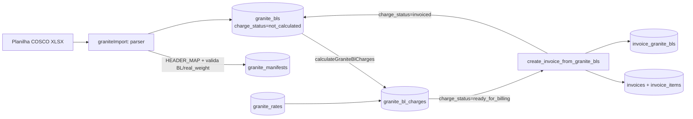

# Granito

> **Status:** ativo · **Atualizado:** 2026-06-18 · **Rotas:** `/granito`, `/granito/taxas`

## Propósito

Módulo dedicado à carga de **granito** (blocos), operada via planilhas da COSCO. É um pipeline de importação e faturamento **paralelo** ao de containers/breakbulk: os B/Ls de granito vivem em tabelas próprias (`granite_*`), separadas de `bls`, porque o modelo de dados (peso real, m³, blocos, prontidão) e as taxas são específicos do granito.

Fluxo de ponta a ponta: importar planilha COSCO → conciliar shipper (CNPJ) com customer → calcular taxas (`granite_rates`) → emitir fatura (`create_invoice_from_granite_bls`). Conecta-se ao [Faturamento](faturamento.md) pela tabela-junção `invoice_granite_bls`.

## Como funciona

O parser COSCO (`graniteImport.ts`) lê a primeira aba do XLSX, mapeia cabeçalhos COSCO (case-insensitive) para colunas canônicas e valida cada linha (B/L e `real_weight_kg` obrigatórios). Reconcilia o CNPJ do shipper contra a base de customers; linhas sem match podem ser importadas como pendentes (`allowPending`), mas ficam bloqueadas para faturamento até ter `client_id`.

Estados de `granite_bls.charge_status`: `not_calculated` → `calculated` → `ready_for_billing` → `invoiced`.

## Componentes e arquivos

| Camada | Arquivo | Responsabilidade |
| --- | --- | --- |
| Parser/Import | `src/services/graniteImport.ts` | Parse de planilha COSCO; HEADER_MAP, validação (B/L + `real_weight_kg`), reconciliação de CNPJ, persistência em `granite_manifests` + `granite_bls` |
| Service | `src/services/graniteCharges.ts` | CRUD de `granite_rates`; `calculateGraniteBlCharges` (filtra rates ativas por vigência, aplica `charge_type`, grava `granite_bl_charges`); `listGraniteBls` paginado |
| Página | `src/pages/Granite.tsx` (`/granito`) | Import COSCO, preview/reconciliação, lista de B/Ls, ação "Calcular taxas" + auto-fatura se cliente vinculado |
| Página | `src/pages/GraniteRates.tsx` (`/granito/taxas`) | Admin de `granite_rates` (descrição, `charge_type`, `unit_value`, moeda, vigência, ativo) |
| Migration | `supabase/migrations/034_granite_module.sql` | Cria `granite_manifests`, `granite_bls`, `granite_rates`, `granite_bl_charges` + RLS |
| Migration | `supabase/migrations/039_granite_invoiceable_view.sql` | `invoice_granite_bls` + RPC `create_invoice_from_granite_bls` |
| Migration | `supabase/migrations/051_granite_empty_array_guard.sql` | Guarda de array vazio + validação multi-B/L na RPC |
| Migration | `supabase/migrations/20260528134131_fix_granite_invoice_cancel_reissue.sql` | `cancel_invoice` reverte `charge_status` para `ready_for_billing` |
| Migration | `supabase/migrations/20260523120000_taxas_locais_granito.sql` | Habilita `charge_tables.cargo_mode='granito'` em Taxas Locais |

## Regras de negócio

- **Parser COSCO.** Primeira aba do XLSX. Colunas obrigatórias: `bl` (→ `bl_number`) e `real weight` (→ `real_weight_kg`, deve ser > 0). Demais colunas COSCO mapeadas: booking, shipper/CNPJ, consignee, `shipper's m3`, `blocks qtty`, `shipper's final m3`, stockyard, `restrição parcial` (→ boolean), `prontidão de carga` (→ `cargo_readiness_date` DD/MM/AAAA), fase, etc.
- **Unicidade.** B/L único por manifesto: constraint `(manifest_id, bl_number)`. Duplicatas na planilha viram erro de linha.
- **Reconciliação de cliente.** CNPJ do shipper (só dígitos) casado contra a base de customers: `matched`, `missing_cnpj` (vazio) ou `not_found`. Por padrão `allowPending=true` importa o B/L sem `client_id`; este fica bloqueado para faturamento até ser vinculado.
- **Cálculo de taxas.** `calculateGraniteBlCharges` apaga charges antigas do B/L, filtra `granite_rates` ativas dentro de `valid_from`/`valid_to` e calcula por `charge_type`: `per_kg` (qty = `real_weight_kg`), `per_ton` (= `real_weight_kg`/1000), `per_bl` e `fixed` (= 1). `subtotal = quantity × unit_value`. Depois marca `charge_status='ready_for_billing'`.
- **Snapshot de rate.** `granite_bl_charges` copia `description`, `charge_type`, `unit_value`, `currency` no momento do cálculo — mudar a rate depois não altera charges já calculadas.
- **Faturamento.** `create_invoice_from_granite_bls` exige: array não-vazio, todos os B/Ls existentes, `charge_status='ready_for_billing'`, sem fatura ativa, mesmo cliente, `client_id` setado, total > 0, caller admin ativo. Soma `granite_bl_charges.subtotal`, cria `invoices` + `invoice_items`, registra em `invoice_granite_bls` e marca os B/Ls `invoiced`.
- **Cancelamento/reemissão.** `cancel_invoice` exige admin, trava `FOR UPDATE`, valida ausência de pagamentos e reverte `charge_status` de `invoiced` para `ready_for_billing` se não houver outra fatura ativa para o B/L.
- **Proteção contra duplo-vínculo.** Trigger `prevent_duplicate_active_invoice_granite_bl_link` bloqueia ligar o mesmo B/L a duas faturas ativas, mesmo fora da RPC.
- **Taxas Locais.** A partir da migration `20260523120000`, `charge_tables.cargo_mode` aceita `'granito'`, permitindo que o motor de Taxas Locais defina regras para granito.

## Dependências

**Tabelas Supabase**
- `granite_manifests` — cabeçalho do manifesto (voyage, vessel/voyage, portos, totais, auditoria de import)
- `granite_bls` — B/Ls de granito (≈ colunas COSCO, `client_id`, `real_weight_kg`, `final_m3`, `charge_status`)
- `granite_rates` — tabela de taxas (`description`, `charge_type` `per_kg|per_ton|per_bl|fixed`, `unit_value` `NUMERIC(12,4)`, `currency`, `valid_from/to`, `active`)
- `granite_bl_charges` — charges calculadas por B/L (snapshot da rate + `quantity`, `subtotal`)
- `invoice_granite_bls` — junção fatura ↔ B/L de granito (`subtotal_brl`, único `(invoice_id, granite_bl_id)`)

**RPCs**
- `create_invoice_from_granite_bls(p_granite_bl_ids, p_customer_id, p_due_date, p_notes, [p_issue_now], p_actor)` → JSONB `{invoice_id, invoice_number, total_brl, bl_count}`
- `cancel_invoice` (compartilhada; reverte `charge_status` do granito)

**Integrações externas**
- Planilhas COSCO (Relatório de Cargas/Booking) · `@e965/xlsx`

**Outros módulos**
- [Faturamento](faturamento.md) — emissão/cancelamento de faturas, PIX
- [Manifesto & EDI](manifesto-edi.md) — pipeline de import "irmão" (containers/breakbulk)
- Taxas Locais — `cargo_mode='granito']`

## Notas e divergências

- B/Ls de granito **não** estão em `bls`; são entidade separada (`granite_bls`). Relatórios/financeiro que cruzem com B/Ls de container precisam tratar as duas origens.
- A RPC `create_invoice_from_granite_bls` tem sobrecargas (com e sem `p_issue_now`). A migration `051` exige emissão imediata (`p_issue_now=true`); emissão diferida não é suportada.
- O estado `calculated` existe no CHECK mas o fluxo prático salta direto para `ready_for_billing` após o cálculo.
- Termos do domínio (CE Mercante, manifesto) em [GLOSSARIO](../GLOSSARIO.md); arquitetura geral em [ARCHITECTURE](../ARCHITECTURE.md).
