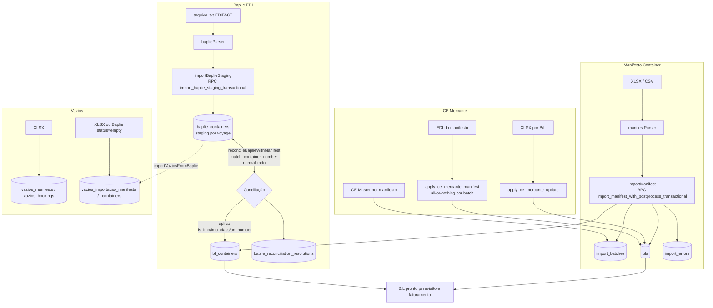

# Manifesto & EDI (Pipeline de Importação)

> **Status:** ativo · **Atualizado:** 2026-06-19 · **Rotas:** `/manifestos`, `/manifestos/:blId`, `/carga-solta`, `/containers`, `/veiculos`, `/baplie`, `/vazios-importacao`, `/embarquevazios`

## Propósito

Pipeline de ingestão de dados operacionais do Transhipping Desk. Recebe arquivos de carriers (planilhas XLSX/CSV e arquivos EDI/EDIFACT `.txt`), faz o **parse** (funções puras em `*Parser.ts`), valida, concilia com customers/voyages e persiste em tabelas de domínio (`bls`, `bl_containers`, `baplie_containers`, etc.). É a fonte de quase todo o dado que alimenta [Viagens](viagens.md), [Faturamento](faturamento.md) e o Portal.

Cobre seis grandes fluxos: **Manifesto Container**, **Carga Solta (breakbulk)**, **Baplie EDI** (staging + conciliação), **CE Mercante** (por B/L e por manifesto), **Containers** (datas e flags), **Veículos** e **Vazios** (exportação e importação). Todo parser segue o playbook do skill [import-parser](../../.claude/skills/import-parser.skill): parser puro → preview → import.

## Como funciona

O padrão é: `*Parser.ts` (pura, sem Supabase) produz um objeto tipado → o componente (`FileImportModal` ou modal dedicado) mostra preview → `*Import.ts` persiste, em geral via RPC transacional. Todo parser chama `assertUploadSize(file)` (`src/lib/fileGuard.ts`, limite 10 MB) antes de ler.

## Componentes e arquivos

### Parsers (puros) e Importers

| Camada | Arquivo | Responsabilidade |
| --- | --- | --- |
| Núcleo | `src/services/importCore.ts` | Helpers comuns: `createRowErrorCollector`, `createHeaderMapper`, `readFirstSheetRows` (extraídos de granite/vazios) |
| Guard | `src/lib/fileGuard.ts` | `assertUploadSize(file)` — limite 10 MB, anti-DoS no parser XLSX |
| Parser | `src/services/manifestParser.ts` | Parse de manifesto container (XLSX/CSV); detecta layout (header genérico vs template carrier), tara, CNPJ, POL/POD, IMO/UN, agrupa containers por B/L |
| Import | `src/services/manifestImport.ts` | Persiste manifesto via RPC `import_manifest_with_postprocess_transactional`; match de customer, billing hold, `setImportBatchCeMaster` |
| Parser/Import | `src/services/breakbulkImport.ts` | Carga solta: parse + persistência em `bls` + `bl_breakbulk_items`, `cargo_mode='carga_solta'` |
| Parser | `src/services/baplieParser.ts` | Parse EDIFACT (segmentos `TDT+20`, `EQD+CN`, `MEA+WT`, `LOC+`, `RFF+BM`, `DGS+`) → `ParsedBaplie` |
| Import | `src/services/baplieImport.ts` | Staging via RPC `import_baplie_staging_transactional` (substitui staging do voyage) |
| Conciliação | `src/services/baplieReconciliation.ts` | Compara `baplie_containers` (status `full`) vs `bl_containers`; `applyBaplieAttribute` / `keepManifestAttribute` |
| Parser | `src/services/ceMercanteEdiParser.ts` | Parse EDI Mercante posicional (M=cabeçalho, C=B/L, I=item); valida 15 dígitos e unicidade |
| Import | `src/services/ceMercanteImport.ts` | Modo por-B/L (`apply_ce_mercante_update`) e por-manifesto (`apply_ce_mercante_manifest`) |
| Parser/Import | `src/services/containerDatesImport.ts` | Datas de descarga/devolução em `bl_containers`; calcula `demurrage_status`, auto-fatura demurrage |
| Parser/Import | `src/services/containerFlagsImport.ts` | Flags `is_imo`/`imo_class`/`un_number`/`is_oog` em `bl_containers`, com auditoria |
| Parser/Import | `src/services/vehicleImport.ts` | Veículos via RPC `import_vehicle_rows_transactional`; cancela/recalcula charges do B/L |
| Parser/Import | `src/services/vaziosImport.ts` | Vazios de exportação → `vazios_manifests` + `vazios_bookings` |
| Parser/Import | `src/services/vaziosImportacaoImport.ts` | Vazios de importação (planilha ou Baplie `status=empty`); RPC `delete_baplie_manifest_for_voyage` |

### Páginas e modais

| Camada | Arquivo | Responsabilidade |
| --- | --- | --- |
| Página | `src/pages/Manifestos.tsx` (`/manifestos`) | Lista de B/Ls; import de manifesto; edição inline de CE Mercante / CE Master |
| Página | `src/pages/BlDetalhe.tsx` (`/manifestos/:blId`) | Detalhe de um B/L, formulário de revisão |
| Página | `src/pages/CargaSolta.tsx` (`/carga-solta`) | Lista breakbulk; import de carga solta |
| Página | `src/pages/Containers.tsx` (`/containers`) | Lista de containers; import de datas e de flags |
| Página | `src/pages/Veiculos.tsx` (`/veiculos`) | Lista de veículos; import de planilha de veículos |
| Página | `src/pages/Baplie.tsx` (`/baplie`) | Staging do Baplie EDI + tela de conciliação |
| Página | `src/pages/VaziosImportacao.tsx` (`/vazios-importacao`) | Vazios de importação (devolvidos); import planilha ou Baplie |
| Página | `src/pages/EmbarqueVazios.tsx` (`/embarquevazios`) | Bookings de vazios de exportação |
| Componente | `src/components/shared/FileImportModal.tsx` | Modal genérico: select → parse → preview → import |
| Componente | `src/components/shared/CeMercanteImportModal.tsx` | Upload CE Mercante por B/L (`importCeMercanteRows`) |
| Componente | `src/components/shared/ContainerDatesImportModal.tsx` | Upload de datas de descarga/devolução (`importContainerDates`) |

## Regras de negócio

### Baplie: staging e conciliação

- **Staging em `baplie_containers`.** O parse do `.txt` não toca o B/L; grava linhas em `baplie_containers`, escopadas por `voyage_id` (migration `20260520132021_create_baplie_containers_staging.sql`). A importação é **transacional e idempotente por voyage**: a RPC `import_baplie_staging_transactional` apaga o staging anterior do voyage e insere o novo.
- **Chave de match:** `container_number` normalizado (trim + uppercase) dentro do mesmo `voyage_id`. Só containers `status='full'` entram na conciliação (os `empty` vão para Vazios de Importação).
- **Divergência de Existência** (`missing_in_manifest`): o Baplie traz um container que não existe em nenhum B/L do manifesto daquela voyage.
- **Divergência de Atributo**: container existe nos dois lados mas diverge em `is_imo`, `imo_class` ou `un_number`.
- **Campos que o Baplie PODE sobrescrever:** apenas atributos físicos/de segurança — `is_imo`, `imo_class`, `un_number` (via `applyBaplieAttribute`). O operador escolhe aplicar o valor do Baplie ou manter o do manifesto.
- **Campos financeiros PROTEGIDOS:** consignatário, peso, customer/pricing vêm **somente do manifesto**. Não há caminho para o Baplie sobrescrevê-los. A conciliação só mexe nos três atributos acima.
- **Resoluções persistidas:** cada decisão (aplicar/manter) é gravada em `baplie_reconciliation_resolutions` (migration `055_baplie_reconciliation_resolutions.sql`) para auditoria e para suprimir divergências já resolvidas em reimportações.

### Atomicidade e batches

- **Import atômico.** Manifesto container usa `import_manifest_with_postprocess_transactional` (envolve o `import_manifest_transactional` original, migration `012_transactional_rpcs.sql`): grava batch + B/Ls + containers + erros + pós-processamento (audit, billing hold, contatos) em uma transação. Depois dos contatos e antes do billing, aplica `apply_bl_review_gate_after_import` apenas aos B/Ls do lote. Baplie e veículos têm RPCs transacionais próprias (migration `20260612153000`).
- **`import_batches`** (migration `007_import_batches_cargo_mode.sql`): metadados do lote — `filename`, `voyage_id`, `cargo_mode` (`container` | `carga_solta`), `status`, contadores, `file_hash`, `ce_master`. Constraint única `(voyage_id, cargo_mode, file_hash)` → reupload idêntico levanta `23505`, capturado como `DuplicateManifestImportError`. Rate limit (migration `015`) levanta `P0429` → `RateLimitImportError`.
- **`import_errors`**: erros de linha do parse (`row_number`, `error_type`, `error_message`, `raw_data`), exibidos no preview.
- **File size guard.** `assertUploadSize(file)` no início de cada parser; acima de 10 MB lança erro antes de ler o XLSX.

### CE Mercante: por B/L vs por manifesto

- **CE Mercante por B/L** (planilha 2 colunas): `importCeMercanteRows` chama `apply_ce_mercante_update` por linha; pode cruzar manifestos. Retorna contagem inserido/sobrescrito/inalterado/erro.
- **CE por manifesto** (EDI extraído do manifesto): `importCeMercanteEdi` chama `apply_ce_mercante_manifest` (migrations `20260608191844` + `20260608192000` que revoga anon). É **all-or-nothing por batch**: valida ausência de B/L/CE duplicados, formato 15 dígitos, existência de todos os B/Ls e cobertura do batch (todos os B/Ls do batch presentes, nenhum fora).
- **CE Master por manifesto** (≠ CE por B/L): um único CE agrupador por manifesto, em `import_batches.ce_master`, definido inline em Viagens/Manifestos via `setImportBatchCeMaster`. Ver [Viagens](viagens.md) e [GLOSSARIO](../GLOSSARIO.md).

### Outros fluxos

- **Carga solta**: rejeita B/L que já exista como container; após o upsert de `bls`, chama `apply_bl_review_gate_after_import` e só então grava itens/dispara cálculo de taxas locais. O gate usa os IDs da importação corrente e não executa backfill de históricos.
- **Container Dates**: valida devolução ≥ descarga; deriva `demurrage_status` (`returned` | `overdue` | `within_free_time`); quando todos os containers do B/L são `returned`, emite fatura de demurrage se houver valor devido.
- **Veículos**: match B/L→voyage e container→B/L (tipo+lacre); após inserir, cancela faturas ativas e recalcula charges (veículo isento). Suporta layout COSCO Daily Report.
- **Vazios Importação**: além da planilha, pode auto-importar do Baplie filtrando `status='empty']` e ligando POD (`importVaziosFromBaplie`); reimport via `delete_baplie_manifest_for_voyage` (delete admin-only, RPC liberada a operador).

## Dependências

**Tabelas Supabase**
- `import_batches`, `import_errors` — lote e erros de importação
- `bls`, `bl_containers`, `bl_breakbulk_items` — domínio do B/L
- `baplie_containers` — staging Baplie por voyage
- `baplie_reconciliation_resolutions` — decisões de conciliação
- `vehicles` — veículos
- `vazios_manifests`, `vazios_bookings` — vazios de exportação
- `vazios_importacao_manifests`, `vazios_importacao_containers` — vazios de importação
- `customer_contacts`, `audit_logs`, `charge_calculations`, `invoices`, `invoice_items` — efeitos colaterais

**RPCs**
- `import_manifest_with_postprocess_transactional` (envolve `import_manifest_transactional`)
- `apply_bl_review_gate_after_import` (gate pós-importação, sem backfill)
- `import_baplie_staging_transactional`
- `import_vehicle_rows_transactional`
- `apply_ce_mercante_update` (por B/L) · `apply_ce_mercante_manifest` (por manifesto)
- `delete_baplie_manifest_for_voyage`
- `cancel_invoice` (recálculo após import de veículo)

**Integrações externas**
- `@e965/xlsx` (parse de planilhas no cliente)
- Arquivos EDI/EDIFACT de carriers (Baplie, CE Mercante)

**Outros módulos**
- [Viagens](viagens.md) — consome batches, schedules e estado de conciliação
- [Faturamento](faturamento.md) — billing hold, demurrage, recálculo de charges
- [Granito](granito.md) — pipeline de import paralelo (COSCO), tabelas próprias

## Notas e divergências

- O nome canônico da RPC de manifesto é `import_manifest_with_postprocess_transactional`; ela **encapsula** o `import_manifest_transactional` original da migration `012`. Citar a wrapper ao falar do caminho real de produção.
- Schedules de voyage (POL/POD) são reconstruídos de `audit_logs`, não de tabela dedicada — relevante porque o import de manifesto sincroniza ETD/POD via esse mecanismo. Ver [Viagens](viagens.md).
- Regras de negócio transversais (free time, demurrage, billing hold) em [regras-de-negocio](../operations/regras-de-negocio.md).
- Para adicionar um novo parser, seguir o skill [import-parser](../../.claude/skills/import-parser.skill): parser puro primeiro, depois importer e modal.
