# Manifestos & EDI

> **Status:** ativo · **Atualizado:** 2026-06-23 · **Rotas:** `/manifestos`, `/manifestos/:blId`, `/carga-solta`, `/containers`, `/veiculos`, `/baplie`, `/vazios-importacao`, `/embarquevazios`

## Propósito e escopo

Pipeline de ingestão e revisão operacional do Transhipping Desk. O módulo recebe planilhas e EDI/EDIFACT, limita o arquivo, faz parse e preview no cliente, persiste em tabelas de domínio e expõe as superfícies de B/L, containers, veículos, Baplie e vazios. A viagem é o eixo operacional; o manifesto é a autoridade de dados comerciais, enquanto o Baplie é uma fonte física de staging e conciliação.

As rotas são registradas em `src/App.tsx`. Os donos executáveis são as páginas em `src/pages/`, os parsers/importadores em `src/services/`, as RPCs e policies em `supabase/migrations/` e as chaves em `src/services/queryKeys.ts`. `docs/adr/0005-pipeline-importacao-viagem-staging-reconciliacao.md` define a separação entre fontes; `docs/adr/0009-hard-delete-controlado-bloqueios-fiscais-auditoria.md` define exclusões controladas.

Para o detalhe de B/L, o código dos PRs `#255`–`#258` é a fonte atual. A spec e os três planos de `docs/superpowers/` preservam intenção e sequência histórica, mas não prevalecem sobre `src/pages/BlDetalhe.tsx`, `src/components/bl/` e `supabase/migrations/130_bl_timeline_rpc.sql`.

## Anatomia das telas

### `/manifestos`

- `src/pages/Manifestos.tsx` lista B/Ls de container com paginação, seleção em massa, resumo e filtros por texto, viagem, POL, POD, revisão, financeiro, taxas locais e perfil de carga.
- Cada linha mostra CE Mercante, navio/viagem, consignatário/cliente, rota, containers distintos, perfil IMO/OOG, status de taxas, invoice e link para `/manifestos/:blId`.
- O modal CNTR aceita múltiplos arquivos, seleciona/cria uma viagem, calcula SHA-256, exibe preview por arquivo e resumo consolidado e importa sequencialmente.
- Duplicidade de arquivo é definida pela constraint de `(voyage_id, cargo_mode, file_hash)` e traduzida para `DuplicateManifestImportError`; rate limit `P0429` é tentado novamente uma vez após espera.
- O modal de CE Mercante aceita planilha por B/L ou EDI de um único manifesto.
- Admin pode excluir B/Ls elegíveis, individualmente ou em lote, após pré-checagem fiscal.
- CE Master pertence ao manifesto (`import_batches.ce_master`), mas a edição atual está na ficha `/viagens/:voyageId`, não nesta lista.

### `/manifestos/:blId`

- `src/pages/BlDetalhe.tsx` resolve o modo container/BB e monta exatamente três abas: `detalhes`, `faturamento`, `historico`.
- A aba padrão `detalhes` remove `tab` da query; as demais sincronizam `?tab=faturamento` ou `?tab=historico`. Chaves antigas, como `operacional`, não são aceitas.
- **Detalhes do B/L:** `BlDetalhesTab` compõe `BlOperacionalTab` e `BlCargaTab`.
  - Formulário auditado: POL, POD, CE Mercante, shipper, consignee, `notify_party`, descrição, pesos/CBM, campos BB, pagamento, notas e justificativa.
  - NCM é somente leitura, derivado de `cargo_description` por `listBlNcms`/`extractNcmCodes` em `src/lib/ncm.ts`, deduplicado e sem ocorrências `UN NCM`.
  - `notify_party` de novos manifestos CNTR usa a primeira parte posterior ao consignatário ou preserva o literal `SAME AS CONSIGNEE`; continua editável.
  - Composição física: containers/veículos ou resumo e itens legados de carga solta.
- **Faturamento:** `BlFaturamentoTab` compõe `BlClienteSection`, `BlCobrancasSection`, `BlDemurrageSection` e o status/link da invoice ativa.
  - Cliente existente é vinculado/desvinculado por `save_bl_review`; cliente vindo do manifesto pode ser criado por `createCustomer` e então vinculado.
  - Taxas locais podem ser calculadas, receber linhas manuais, ser revisadas e avançar para faturamento.
  - Demurrage reúne free time, P1/P2, descarga/devolução e cálculo por container; as regras canônicas continuam em [Demurrage](demurrage.md).
- **Histórico:** `BlHistoricoTab` usa paginação incremental de `bl_timeline`, badges por família e marca “Auditoria” somente quando há justificativa.

### `/carga-solta`

- `src/pages/CargaSolta.tsx` lista B/Ls BB, indicadores, filtros, exportação e acesso ao mesmo detalhe `/manifestos/:blId`.
- O importador aceita layout resumido, legado e formatos de carrier; faz preview, rejeita sobrescrita de B/L que já exista como container e registra erros no batch.
- A tela também abre o modal compartilhado de CE Mercante.

### `/containers`

- `src/pages/Containers.tsx` lista containers consolidados com filtros, resumo distinto por tipo/IMO/OOG, exportação e navegação ao B/L.
- “Importar Datas Demurrage” atualiza descarga/devolução e pode emitir invoice de demurrage quando todos os containers do B/L retornaram.
- “Importar IMO/OOG” atualiza flags físicas e audita `bl_container`.
- Admin pode excluir containers sem cálculos de taxa nem itens de demurrage vinculados; veículos dependentes são removidos primeiro.

### `/veiculos`

- `src/pages/Veiculos.tsx` exige navio/viagem para visualizar lista, estatísticas e filtros; o modal de importação possui seletor próprio de viagem.
- O parser suporta modelo do sistema, COSCO Daily Report e cabeçalhos chineses.
- O import valida chassi, B/L da viagem e match não ambíguo de container por número, tipo e lacre.
- Após inserir veículos, cancela invoices ativas dos B/Ls afetados e recalcula taxas para aplicar isenção; esse pós-processamento ocorre fora da RPC de insert.
- Admin pode excluir veículos individualmente ou em lote.

### `/baplie`

- `src/pages/Baplie.tsx` sincroniza a viagem em `?voyage=<id>` e trabalha em três estados: sem staging; staging sem manifesto; staging com manifesto.
- Importação/reimportação substitui o staging completo da viagem por `import_baplie_staging_transactional`.
- A conciliação considera containers `full`, divergência de existência e diferenças de `is_imo`, `imo_class` e `un_number`.
- O operador pode aplicar o valor físico do Baplie ou manter o manifesto, inclusive em lote.
- Containers `empty` podem gerar um manifesto de Vazios de Importação; se já existir um manifesto Baplie, o operador escolhe substituir ou manter.

### `/vazios-importacao`

- `src/pages/VaziosImportacao.tsx` lista e exporta containers vazios por texto, viagem e manifesto.
- O modal importa planilha com container, tipo e tara para uma viagem.
- O fluxo alternativo vindo de Baplie é iniciado em `/baplie`, não por botão desta página.

### `/embarquevazios`

- `src/pages/EmbarqueVazios.tsx` lista bookings de vazios de exportação por texto e viagem.
- O modal faz parse/preview de booking, container, tipo, data, terminal, destino e observações e cria um manifesto associado à viagem.
- `/vazios` é apenas redirect de compatibilidade para esta rota.

## Catálogo de ações

| Tela / ação | Pré-condições | Origem | Orquestração | Persistência | Efeitos e cache | Falhas | Evidência |
|---|---|---|---|---|---|---|---|
| `/manifestos` — filtrar, paginar, selecionar e abrir B/L | Sessão interna; dados legíveis por RLS | `Manifestos` | `useBls`, `useBlSummary`, `useInvoiceLinks`; seleção local por `useRowSelection` | Leitura de `bls`, relações e invoices | Queries `['bls', filters]`, `['bl-summary', filters]`, `['invoice-links', ...]`; navega para `/manifestos/:blId` | Filtros de `chargeStatus`/perfil podem carregar tudo e filtrar no cliente; erro de query mostra `InlineError` | `src/pages/Manifestos.tsx`; `src/hooks/useBls.ts`; `src/hooks/useBilling.ts` |
| `/manifestos` — parse e preview CNTR | Arquivo `.xlsx/.xls/.csv`, até 10 MB | `UploadManifestModal.handleFile` | `parseManifestFile` detecta layout, agrupa B/Ls/containers, partes, rota, ETA e erros | Nenhuma | Estado local por arquivo; preview de até 25 B/Ls e resumo consolidado | Formato ilegível, aba ausente, arquivo grande ou parser sem preview | `src/pages/Manifestos.tsx`; `src/services/manifestParser.ts`; `src/lib/fileGuard.ts` |
| `/manifestos` — importar manifesto CNTR | Viagem e usuário; preview; SHA-256 disponível | `UploadManifestModal.handleImport` | `importManifestWithRetry` chama `importManifest`; a wrapper SQL executa lote, B/Ls, containers, erros, schedules, contatos, review gate e billing | `import_batches`, `bls`, `bl_containers`, `import_errors`, `audit_logs`, contatos e efeitos de billing | Invalida `['bls']`, `['bl-summary']`, `['invoice-links']`, `['voyages']` | `23505` vira duplicidade; `P0429` espera 60 s e tenta uma vez; arquivos múltiplos podem terminar parcialmente | `src/pages/Manifestos.tsx`; `src/services/manifestImport.ts`; `supabase/migrations/129_review_gate_hardening.sql` |
| `/manifestos` — detectar arquivo/batch duplicado | Mesmo hash, viagem e `cargo_mode` | `computeFileHash` / RPC | Constraint `uq_import_batches_voyage_hash`; service mapeia erro | Nenhuma escrita confirmada para a tentativa rejeitada | Evento best-effort `manifest_import_duplicate_hash`; caches só são invalidados ao final do lote da UI | Hash indisponível bloqueia; arquivo alterado produz hash diferente | `src/services/manifestImport.ts`; `supabase/migrations/011_schema_hardening.sql`; `src/pages/Manifestos.tsx` |
| Manifesto — editar CE Master | Batch/manifesto existente; usuário ativo | `PolScheduleModal` em `/viagens/:voyageId` | `setImportBatchCeMaster` chama RPC com lock, update e auditoria na mesma transação | `import_batches.ce_master` + `audit_logs` | Invalida `['voyages']` e timeline/schedules pela página Viagens | Não existe ação inline atual em `/manifestos`; batches agrupados ainda são enviados em chamadas independentes | `src/pages/Viagens.tsx`; `src/services/manifestImport.ts`; `supabase/migrations/145_set_import_batch_ce_master_atomic.sql` |
| CE Mercante por linha | Planilha válida; B/L existente | `CeMercanteImportModal.handleSheetImport` | Parser valida cabeçalhos, BL único e CE de 15 dígitos; `importCeMercanteRows` chama `apply_ce_mercante_update` por linha | `bls.ce_mercante` e auditoria pela RPC | Invalida `['bls']`, `['bl-detail']` | Pode cruzar batches; erros são por linha e não revertem updates anteriores | `src/components/shared/CeMercanteImportModal.tsx`; `src/services/ceMercanteImport.ts` |
| CE Mercante por manifesto EDI | Registros C válidos e cobertura total de um único batch | `CeMercanteImportModal.handleEdiImport` | `parseCeMercanteEdiFile` + RPC `apply_ce_mercante_manifest` all-or-nothing | `bls.ce_mercante`, `audit_logs` | Invalida `['bls']`, `['bl-detail']` | BL/CE duplicado, CE fora de 15 dígitos, B/L inexistente, batches mistos ou cobertura incompleta retornam `ok=false`; nada é gravado | `src/services/ceMercanteEdiParser.ts`; `src/services/ceMercanteImport.ts`; `supabase/migrations/087_apply_ce_mercante_manifest.sql` |
| Excluir B/L elegível | Admin; sem invoice, invoice consolidada, recebível, vínculo de recebível ou demurrage invoice | `runBlDelete` | `checkBlDependencies`; confirmação; `deleteBls` remove veículos e B/L | Hard delete de `vehicles` e `bls`; cascatas operacionais; auditoria de exclusão | Invalida `['bls']`, `['bl-summary']`, `['containers']`, `['vehicles']`, `['invoice-links']`, `['voyages']` | Bloqueadores fiscais geram exclusão parcial ou nenhuma; operação irreversível | `src/pages/Manifestos.tsx`; `src/services/bls.ts`; `docs/adr/0009-hard-delete-controlado-bloqueios-fiscais-auditoria.md` |
| B/L — sincronizar aba com URL | B/L válido | `BL_TABS` / `setSearchParams` | `detalhes` remove `tab`; demais definem query | Nenhuma | Preserva componentes montados por prop `active` | Query desconhecida cai em `detalhes` | `src/pages/BlDetalhe.tsx`; `src/pages/__tests__/blTabs.test.tsx` |
| B/L — editar revisão operacional e carga | Mudança detectada; justificativa; usuário; `updated_at` esperado | `BlOperacionalTab` / `useBlEditForm` | Normaliza campos, cria auditoria por campo e chama `save_bl_review`; BB sincroniza toneladas para kg | `bls`, `audit_logs`, fila de reconciliação; status recalculado pelo gate | Invalida `['bl-detail', blId]`, `['audit-logs','bl',blId]`, `['bls']`, `['voyages']` | Sem mudança/justificativa; número inválido; `PT409`/`40001` recarrega após conflito | `src/hooks/useBlEditForm.ts`; `supabase/migrations/129_review_gate_hardening.sql` |
| B/L — exibir NCM e Notify Party | Descrição/notify importados ou editados | `BlOperacionalTab` | `listBlNcms` deriva chips; parser CNTR preserva primeira notify ou `SAME AS CONSIGNEE` | NCM não persiste em coluna própria; `notify_party` persiste em `bls` | Sem query própria | NCM ausente mostra vazio; notify de imports anteriores não recebe backfill | `src/lib/ncm.ts`; `src/services/manifestParser.ts`; `src/services/manifestImport.ts` |
| B/L — vincular, criar ou desvincular cliente | Usuário; B/L carregado; dados de manifesto para criação | `BlClienteSection` | `save_bl_review` para vínculo; `createCustomer` e depois vínculo; fallback procura CNPJ já existente | `customers`, contatos e `bls.customer_id`/reconciliação | Invalida `queryKeys.bls.detail(bl.id)` | Conflitos/duplicidade de cliente; falha genérica na UI; vínculo exige estado atual do B/L | `src/components/bl/BlClienteSection.tsx`; `src/services/customers.ts` |
| B/L — calcular/revisar taxas e faturar | Usuário; linhas/tabela elegíveis; gate e cliente coerentes | `BlCobrancasSection` | Hooks de taxas; linhas manuais; `markBlReadyAndCreateInvoice` quando há cliente | `charge_calculations`, `bls`, recebíveis/invoices conforme serviços/RPCs | Invalida famílias de linhas, B/Ls, pendências, voyages e invoices; caminho de emissão também usa arrays literais | Pendência de revisão, ausência de cliente, USD ou tabela ausente bloqueiam; B/L faturado trava edição | `src/components/bl/BlCobrancasTab.tsx`; `src/hooks/useLocalCharges.ts`; `src/services/billing.ts` |
| B/L — configurar demurrage e datas de retorno | Usuário ativo; container/B/L carregado | `BlDemurrageSection` | `save_bl_demurrage_config` grava free time, P1/P2 e auditoria com optimistic lock; retorno usa `updateContainerReturnDate` | `bls`, `bl_containers`, `audit_logs` | Invalida `queryKeys.bls.detail(bl.id)`, `queryKeys.bls.all()`, `['demurrage-containers']` | Conflito concorrente recarrega o B/L; regras pertencem a Demurrage | `src/components/bl/BlDemurrageSection.tsx`; `src/services/blDemurrageConfig.ts`; `supabase/migrations/147_save_bl_demurrage_config_atomic.sql` |
| B/L — abrir invoice ativa e carregar Histórico | B/L válido | `BlFaturamentoTab` / `BlHistoricoTab` | Link para `/faturamento?invoice=<id>`; `useInfiniteQuery` chama `bl_timeline` em páginas de 50 | Leitura de invoices e `audit_logs` resolvidos pela RPC | `queryKeys.invoices.links([blId])`; `queryKeys.bls.timeline(blId)` | Histórico sem evento mostra vazio; falha da RPC não tem estado de erro dedicado na aba | `src/components/bl/BlFaturamentoTab.tsx`; `src/hooks/useBlTimeline.ts`; `src/services/blTimeline.ts`; `supabase/migrations/130_bl_timeline_rpc.sql` |
| `/carga-solta` — parse/preview/import BB | Viagem, usuário e arquivo válido | Modal em `CargaSolta` ou `VoyageImportActions` | Parser suporta três layouts; service filtra B/Ls incompatíveis e envia lote, B/Ls, itens e erros para `import_breakbulk_manifest_transactional`; taxas são disparadas depois do commit | RPC compõe `import_manifest_transactional`, campos BB, `bl_breakbulk_items` e review gate em uma transação | Página invalida `['bls']`, `['voyages']`, `['port-options']`; ação rápida invalida também Line-Up | B/L existente como container é rejeitado; qualquer falha central reverte batch, B/Ls, itens e erros | `src/services/breakbulkImport.ts`; `supabase/migrations/144_import_breakbulk_manifest_transactional.sql` |
| `/containers` — importar datas | Linhas com B/L, container e descarga; devolução ≥ descarga | `ContainerDatesImportModal` | Deduplica por B/L+container, atualiza datas/status e verifica todos retornados | `bl_containers`; possível `demurrage_invoices` e emissão | Invalida `['demurrage-containers']`, `['demurrage-invoices']`, `['bl-detail']` | Container ausente conta `missing`; falha de update/emissão interrompe; import em lote não grava auditoria própria | `src/components/shared/ContainerDatesImportModal.tsx`; `src/services/containerDatesImport.ts` |
| `/containers` — importar IMO/OOG | Planilha válida; match B/L+container | Modal em `Containers` | Deduplica, atualiza todos os matches e grava uma auditoria por container alterado | `bl_containers`, `audit_logs` | Invalida `['containers']`, `['bls']`, `['bl-summary']`, `['dashboard']`, `['voyages']` | Valor IMO/OOG inválido; sem match conta `missing`; auditoria falha junto do fluxo | `src/pages/Containers.tsx`; `src/services/containerFlagsImport.ts` |
| `/containers` — excluir | Admin; sem taxa local nem item de demurrage | `runContainerDelete` | Pré-checagem; remove veículos antes de containers | `vehicles`, `bl_containers`; cascatas; auditoria de delete | Invalida `['containers']`, `['bls']`, `['vehicles']`, `['bl-detail']` | Bloqueadores fiscais; hard delete irreversível | `src/pages/Containers.tsx`; `src/services/containers.ts` |
| `/veiculos` — parse/preview/import | Viagem; linhas válidas e match não ambíguo | Modal em `Veiculos` ou `VoyageImportActions` | Valida chassi/B/L/container; RPC insere lote; depois cancela invoices ativas e recalcula taxas por B/L | Insert em `vehicles`; pós-processamento em invoices e `charge_calculations` | Página invalida `['vehicles']`, `['vehicle-stats']`, `['voyage-vehicle-stats']`, `['bl-detail']`; ação rápida também `['voyages']` e Line-Up | Duplicidade, B/L fora da viagem, container/tipo/lacre divergente; insert pode ter sucesso e pós-processamento financeiro falhar, retornando erro por B/L | `src/services/vehicleImport.ts`; `supabase/migrations/109_fix_anon_executable_import_rpcs.sql` |
| `/veiculos` — excluir | Admin; confirmação | `runDelete` | `deleteVehicles` por IDs | `vehicles` + auditoria de exclusão | Mesmas quatro invalidações da página de veículos | RLS/DB; hard delete irreversível | `src/pages/Veiculos.tsx`; `src/services/vehicles.ts` |
| `/baplie` — importar ou substituir staging | Viagem, usuário; RPC atual exige admin | `BaplieUploadModal` / ação rápida | Parser EDIFACT; filtro opcional de POD; RPC apaga staging da viagem e insere o novo lote na mesma transação | `baplie_containers` | Invalida `['baplie-staging', voyageId]`, `['baplie-reconciliation', voyageId]` | Sem containers selecionados; parse inválido; `42501` para não-admin | `src/pages/Baplie.tsx`; `src/services/baplieParser.ts`; `src/services/baplieImport.ts`; `supabase/migrations/109_fix_anon_executable_import_rpcs.sql` |
| `/baplie` — aplicar atributo físico | Divergência em `is_imo`, `imo_class` ou `un_number` | `ReconciliacaoSection` | `applyBaplieAttribute` atualiza um campo e grava auditoria | `bl_containers`, `audit_logs` | Página invalida apenas `['baplie-reconciliation', voyageId]` | Update ou auditoria pode falhar; ações em lote são sequenciais, não atômicas | `src/pages/Baplie.tsx`; `src/services/baplieReconciliation.ts` |
| `/baplie` — manter valor do manifesto | Divergência aberta | `ReconciliacaoSection` | Upsert de resolução pela combinação de viagem, container, campo e valores; audita decisão | `baplie_reconciliation_resolutions`, `audit_logs` | Invalida apenas `['baplie-reconciliation', voyageId]` | Mudança posterior de qualquer valor cria nova combinação e pode reabrir divergência | `src/services/baplieReconciliation.ts`; `src/services/__tests__/baplieReconciliation.test.ts` |
| `/baplie` — importar/substituir/manter vazios | Staging com `status='empty'`; usuário ativo | `VaziosSection` | RPC lê staging, substitui opcionalmente e cria manifesto/containers na mesma transação; manter não escreve | `vazios_importacao_manifests`, `vazios_importacao_containers` | Invalida `['baplie-vazios-manifest', voyageId]`, staging, reconciliação, `['vazios-importacao']`, `['vazios-importacao-stats']` | Nenhum vazio ou manifesto duplicado sem confirmação de substituição | `src/pages/Baplie.tsx`; `src/services/vaziosImportacaoImport.ts`; `supabase/migrations/146_import_vazios_transactional.sql` |
| `/vazios-importacao` — importar planilha | Viagem, usuário e preview | Modal da página ou ação rápida | RPC cria manifesto e containers na mesma transação | `vazios_importacao_manifests`, `vazios_importacao_containers` | Página invalida containers/manifests, `['voyages']` e Line-Up; ação rápida invalida só voyages/Line-Up | Reimport comum cria novo manifesto | `src/pages/VaziosImportacao.tsx`; `src/services/vaziosImportacaoImport.ts`; `supabase/migrations/146_import_vazios_transactional.sql` |
| `/embarquevazios` — parse/preview/import booking | Viagem, usuário e booking válido | Modal da página ou ação rápida | RPC cria manifesto e bookings na mesma transação | `vazios_manifests`, `vazios_bookings` | Invalida `['vazios-bookings']`, `['voyages']` | Idempotência permanece interna ao novo manifesto | `src/pages/EmbarqueVazios.tsx`; `src/services/vaziosImport.ts`; `supabase/migrations/146_import_vazios_transactional.sql` |

## Estado e dados

Principais famílias de cache:

| Superfície | Chaves atuais |
|---|---|
| Manifestos/B/Ls | `['bls', filters]`, `['bl-summary', filters]`, `queryKeys.bls.detail(blId)`, `queryKeys.bls.localChargeLines(blId)`, `queryKeys.bls.manualChargeItems(blId)`, `queryKeys.bls.timeline(blId)` |
| Invoices do B/L | `queryKeys.invoices.links(blIds)` e famílias `queryKeys.invoices.*` |
| Containers | `['containers', filters]`, `['bl-detail', blId]`, `['demurrage-containers']`, `['demurrage-invoices']` |
| Veículos | `['vehicles', voyageId, filters]`, `['vehicle-stats', voyageId]`, `['voyage-vehicle-stats', voyageIds]` |
| Baplie | `['baplie-staging', voyageId]`, `['baplie-bls-exist', voyageId]`, `['baplie-vazios-manifest', voyageId]`, `['baplie-reconciliation', voyageId]` |
| Vazios de importação | `['vazios-importacao-containers', filters]`, `['vazios-importacao-manifests']`, `['vazios-importacao-stats', voyageIds]` |
| Vazios de exportação | `['vazios-bookings', filters]` |

As páginas e modais ainda usam várias arrays literais. A cartografia preserva essas formas: não as normaliza para `queryKeys` quando o código não o faz.

Dados e fronteiras:

- **Lote:** `import_batches` e `import_errors`.
- **B/L:** `bls`, `bl_containers`, `bl_breakbulk_items`, `vehicles`.
- **Staging físico:** `baplie_containers`.
- **Decisões:** `baplie_reconciliation_resolutions`.
- **Vazios:** `vazios_importacao_manifests`/`vazios_importacao_containers` e `vazios_manifests`/`vazios_bookings`.
- **Financeiro derivado:** `charge_calculations`, `invoices`, `invoice_bls`, recebíveis e tabelas próprias de demurrage.
- **Histórico:** `audit_logs`, consultado por `bl_timeline`.

Campos físicos que a conciliação Baplie pode alterar: `bl_containers.is_imo`, `imo_class` e `un_number`. O parser também lê peso, OOG, slot, status e portos para staging, mas `applyBaplieAttribute` não oferece caminho para sobrescrever peso, consignatário, cliente, pricing, rota comercial ou cobrança. Esses dados permanecem sob autoridade do manifesto e dos fluxos financeiros.

## Fluxos e invariantes

```mermaid
flowchart LR
    Guard["file guard<br/>assertUploadSize"] --> Parser["parser puro<br/>manifestParser"]
    Parser --> Preview["preview e erros<br/>UploadManifestModal"]
    Preview --> RPC["RPC transacional<br/>import_manifest_with_postprocess_transactional"]
    RPC --> Core["batch + B/Ls + containers + errors"]
    Core --> Gate["review gate<br/>IDs importados"]
    Gate --> Billing["charges / billing<br/>pós-processamento SQL"]
    Billing --> Audit["audit_logs + invalidação de cache no cliente"]
```

1. **Manifesto CNTR é transacional no banco.** `import_manifest_with_postprocess_transactional` chama o import core, sincroniza agendas, cria contatos, aplica `apply_bl_review_gate_after_import` aos IDs do lote e executa billing dentro da mesma chamada SQL.
2. **Teste de parser não prova transação.** Vitest valida parsing, payload e chamadas mockadas. Atomicidade depende da implementação SQL e só é provada integralmente por aplicação da migration e teste contra banco real/controlado.
3. **Código pós-PR prevalece.** PR `#254` e seus planos descrevem a sequência; os merges `#255`–`#258` definem a tela atual.
4. **Três abas exatas.** `detalhes`, `faturamento`, `historico`. `BlFinanceiroTab` foi removido; cliente e demurrage foram consolidados em `BlFaturamentoTab`.
5. **Colunas preservadas, UI removida.** `place_of_delivery` e `incoterm` permanecem em `bls`/tipos e ainda são aceitas pela RPC histórica, mas não integram `editableFields` nem a UI atual.
6. **NCM derivado.** Não é salvo pelo formulário; `extractNcmCodes` é compartilhado com `breakbulkImport.ts`, elimina `UN NCM`, deduplica e formata apenas para exibição.
7. **Notify forward-only.** Novos imports CNTR carregam `notify_party`; não há backfill dos B/Ls existentes. A heurística guarda somente a primeira notify e preserva o literal `SAME AS CONSIGNEE`.
8. **Histórico e Auditoria não são sinônimos.** Histórico é o ciclo completo. Auditoria é o subconjunto com justificativa deliberada; eventos sistêmicos podem pertencer ao Histórico sem serem Auditoria.
9. **Escopo da timeline.** `bl_timeline` inclui famílias `bl`, `bl_container`, `charge_calculation`, `invoice` e `system_event` cujo `entity_id` é o B/L. Eventos globais, como `entity_id='billing'`, ficam fora. Mudanças de `charge_status`/`financial_status` registradas como `entity_type='bl'` são classificadas pela RPC.
10. **Demurrage pertence ao módulo próprio.** Esta documentação cobre a entrada no B/L e efeitos de datas; cálculo, tarifas, invoice, disputa e ciclo de vida pertencem a [Demurrage](demurrage.md).
11. **Carga solta possui fronteira transacional.** Batch, B/Ls, campos BB,
    itens, erros e review gate são confirmados ou revertidos por
    `import_breakbulk_manifest_transactional`. O cálculo de taxas permanece
    pós-commit e best-effort. O upsert é permitido somente quando o B/L não
    existe como container.
12. **Baplie substitui por viagem.** A RPC apaga e reinsere o staging em uma transação. Containers `empty` não entram na conciliação de B/L; alimentam Vazios de Importação.
13. **Resolução “manter” é dependente dos valores.** O upsert inclui valores Baplie/manifesto; se a combinação mudar em reimport, a divergência pode reaparecer.
14. **Veículos têm fronteira dividida.** A inserção do lote é transacional; cancelamento de invoices e recálculo de taxas ocorrem depois, por B/L. Falha nessa fase não desfaz veículos já inseridos.
15. **Datas de container afetam demurrage.** Devolução anterior à descarga é rejeitada; todos retornados podem criar e emitir invoice de demurrage.
16. **Vazios são atômicos por manifesto.** Planilhas criam cabeçalho e itens na mesma RPC. Vazios vindos do Baplie substituem por viagem dentro da mesma transação; a opção “manter” não escreve.

## Testes e validação

O lote de 2026-06-23 executou a suíte completa: 148 arquivos passaram, 1 foi
ignorado, com 634 testes aprovados e 9 ignorados.

- Parsers CNTR/notify/fixtures: `src/services/__tests__/manifestParser.test.ts`, `manifestParser.notify.test.ts`, `manifestFixtures.real.test.ts`.
- Payload/import CNTR: `src/services/__tests__/manifestImport.test.ts` confirma nome da wrapper e mapeamento de `23505`/`P0429`, usando mocks; não prova rollback do PostgreSQL.
- CE Mercante: `src/services/__tests__/ceMercanteEdiParser.test.ts` e `ceMercanteImport.test.ts`.
- B/L pós-PRs: `src/lib/__tests__/ncm.test.ts`, `src/pages/__tests__/blTabs.test.tsx`, `src/components/bl/__tests__/blTimelinePresentation.test.ts`.
- Carga solta: `src/services/__tests__/breakbulkImport.test.ts` e `breakbulkFixtures.real.test.ts`.
- Atomicidade BB: `src/services/__tests__/breakbulkImportAtomicMigration.test.ts`;
  replay limpo de 144 migrations e cenário transacional com rollback em
  PostgreSQL 17 (`breakbulk-import-atomic`).
- Containers/veículos/Baplie/vazios: `containerDatesImport.test.ts`, `vehicleImport.test.ts`, `baplieReconciliation.test.ts`, `vaziosImportacaoImport.test.ts`, `vaziosImportsAtomic.test.ts`.
- `src/components/shared/__tests__/VoyageImportActions.test.ts` testa apenas `buildCntrManifestImportSummary`, não os modais, importadores ou caches.
- `src/services/__tests__/uploadLimits.test.ts` comprova o guard antes da leitura para base de clientes e PIX; para os parsers deste módulo, a cobertura do guard foi confirmada estaticamente pelas chamadas a `assertUploadSize`.

O Supabase compartilhado permaneceu somente leitura. As escritas foram
executadas apenas no PostgreSQL descartável e revertidas ao final.

## Notas e divergências

- CE Master é uma ação relacionada a manifestos, porém a UI executável atual está em `/viagens/:voyageId`; `/manifestos` não possui editor inline.
- O plano histórico de consolidação dizia que free time e P1/P2 passariam todos por `save_bl_review`. O código atual usa a RPC apenas para `free_time_override`; P1/P2 usam update direto em `bls` e auditoria best-effort em `BlDemurrageSection`.
- `useBlEditForm` ainda inclui `free_time_override`, embora o campo tenha sido removido de `BlOperacionalTab` e movido para `BlDemurrageSection`. O formulário principal não oferece controle para alterá-lo.
- A importação de datas em `src/services/containerDatesImport.ts` atualiza `bl_containers` sem inserir eventos `bl_container`; a edição individual em `updateContainerReturnDate` registra auditoria best-effort. Portanto, nem toda mudança de data em lote aparece garantidamente no Histórico do B/L.
- Ao aplicar/manter atributos no Baplie, a página invalida somente `['baplie-reconciliation', voyageId]`; não invalida explicitamente `['containers']`, `['bl-detail']`, `['voyages']` ou `queryKeys.bls.timeline(blId)`.
- A UI de Baplie exibe import/reimport para usuário autenticado, mas a RPC `import_baplie_staging_transactional` exige admin no banco; não-admin recebe `42501`.
- A navegação contextual de Viagens para `/carga-solta?voyage=<id>` não é consumida por `CargaSolta.tsx`. Já `/manifestos`, `/baplie` e `/embarquevazios` leem o contexto de viagem.
- O redirect `/vazios → /embarquevazios` usa destino fixo em `src/App.tsx`; não há código explícito preservando `?voyage=`.
- O pós-processamento financeiro que ocorre depois de alguns imports permanece fora da transação central e deve ser validado separadamente.
  financeiro de veículos. Para carga solta, a garantia cobre a persistência
  central; o cálculo posterior de taxas continua fora da transação.
