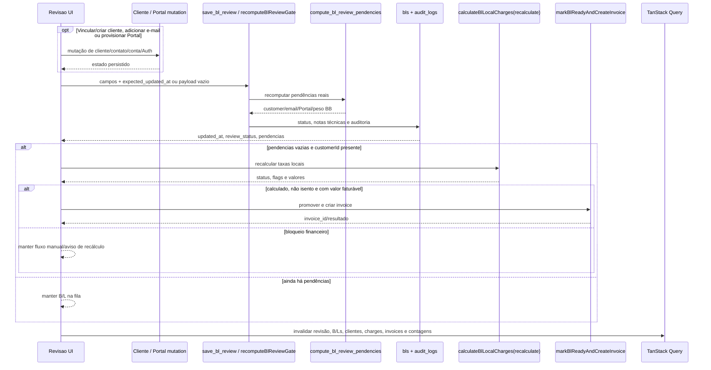

# Operação e Suporte

> **Status:** ativo · **Cartografia verificada:** 2026-06-20 · **Rotas:** `/painel`, `/revisao`, `/alertas`, `/relatorios`, `/line-up-tv`, `/line-up-tv/display`, `/admin/usuarios`

## Propósito e escopo

Este documento cartografa as superfícies operacionais e de suporte que consolidam indicadores, revisão, alertas, relatórios, exibição do Line-Up e administração de usuários. O mapa parte do código executável atual: `src/App.tsx` é a fonte das rotas; páginas compõem a UI; hooks e services concentram queries e mutations; migrations, RLS e RPCs são a fronteira efetiva de autorização e consistência.

Escopo por rota:

- `/painel`: KPIs operacionais, snapshot do Line-Up, exportação e atalhos;
- `/revisao`: fila agrupada, correção individual ou por cliente, gate canônico e tentativa de faturamento automático;
- `/alertas`: filtro, reconhecimento e fechamento de alertas internos;
- `/relatorios`: abas operacional, financeira, por cliente e demurrage, com exportação XLSX onde implementada;
- `/line-up-tv`: compatibilidade por redirecionamento para `/painel`;
- `/line-up-tv/display`: quadro protegido, sem o shell do `AppLayout`, para monitor/TV;
- `/admin/usuarios`: perfis, papel, ativação, log de ações e métricas;
- guards e shell compartilhados: `ProtectedRoute`, `AppLayout`, `HeaderInfoBar` e navegação.

Rótulos usados na coluna **Evidência**:

- **Código**: comportamento demonstrado por TypeScript/TSX/SQL executável inspecionado;
- **Teste**: teste automatizado existente; não executado nesta cartografia;
- **Teste de contrato SQL**: teste que inspeciona o texto de uma migration, sem provar aplicação em ambiente;
- **Suspeita**: divergência ou risco que exige confirmação em schema/ambiente controlado;
- **Runtime** não é atribuído neste documento, pois nenhum fluxo foi executado contra ambiente nesta passagem.

Fontes de linguagem e arquitetura: `CONTEXT.md`, `docs/ARCHITECTURE.md`, `docs/adr/0006-revisao-operacional-reconciliacao-cliente-gate-faturamento.md`, `docs/operations/seguranca.md` e `WORKFLOW.md`.

## Anatomia das telas

### Guards, shell e navegação

`src/App.tsx` coloca todas as rotas deste módulo sob `ProtectedRoute`. `/admin/usuarios` usa uma segunda árvore com `ProtectedRoute adminOnly`. `/line-up-tv/display` permanece protegido, mas fica deliberadamente fora de `AppLayout`; as demais rotas internas usam o shell com cabeçalho, barra de mercado, navegação, badges, logout e `ErrorBoundary`.

`src/components/layout/ProtectedRoute.tsx` trata loading, ausência de sessão, falta de perfil ativo e redirecionamento de não admin. `src/components/layout/AppLayout.tsx` monta badges com `useOperationalCounts`, mostra o menu Admin somente quando `isAdmin`, executa logout e navega para `/login`. `src/components/layout/HeaderInfoBar.tsx` repete o logout no menu do usuário, exibe role, câmbio e alertas resumidos de demurrage/Granite.

Esses filtros de UI são ergonomia e navegação. A autoridade continua em policies, triggers, grants, Edge Functions e RPCs; chamadas diretas à API não podem depender de menu oculto ou redirect. Evidências: `supabase/migrations/040_portal_login_rate_limit.sql`, `supabase/migrations/077_fix_user_profile_privilege_escalation.sql`, `supabase/migrations/014_lock_down_financial_reads_and_audit_writes.sql` e as migrations específicas do gate.

### `/painel`

`src/pages/Painel.tsx` tem três áreas:

1. cabeçalho com última alteração do Line-Up, indicação stale após 10 minutos, refresh, atalho para `/chegadas-saidas` e abertura de `/line-up-tv/display`;
2. snapshot do Line-Up com `LineUpFilters`, `LineUpTable` e exportação XLSX;
3. grade de KPIs com links para os módulos responsáveis.

Os KPIs vêm de leituras diretas a `bls`, `invoices`, `alerts` e `charge_tables`, mais a RPC `count_distinct_containers`. A query `['dashboard']` não possui refetch periódico próprio. O snapshot usa `['lineup-tv-v3']`, `staleTime` de 60 segundos e `refetchInterval` de 90 segundos.

`src/services/lineup.ts` lê viagens ativas/concluídas/canceladas, B/Ls, containers, veículos, agendas por POD, agenda de exportação, vazios de importação e `audit_logs`. Containers são deduplicados por número, MTY é creditado apenas à primeira linha ordenada de cada viagem, CE é derivado como `approved | partial | missing` quando não há override da agenda, e a última alteração é o timestamp mais recente entre as fontes consultadas. `src/lib/lineupFilters.ts` aplica localmente navios, viagens, status, período, veículos, BB, CEs, Linked, MTY e RTW; exportações permanecem visíveis. O recorte permanece limitado às 60 viagens mais recentes, devendo ser paginado ou ampliado se o Painel precisar de histórico maior.

### `/revisao`

`src/pages/Revisao.tsx` combina:

- busca por B/L, cliente, consignatário ou shipper;
- chips de motivo;
- grupos por CNPJ e, na ausência dele, por nome normalizado;
- ações de grupo para vincular cliente, adicionar e-mail e provisionar Portal;
- correções inline de CE Mercante legado e peso BB;
- drawer por item, com navegação por `id`, edição operacional, busca/criação/vínculo de cliente e justificativa opcional;
- avisos de recálculo para taxas locais e Granite.

`src/hooks/useReview.ts` carrega até 500 `bls` em `pending_review` e até 500 `granite_bls` sem `client_id`. O join de Granite tem fallback sem metadados de viagem; falha também no fallback torna a indisponibilidade visível. A UI não faz join direto com `customer_portal_accounts`: extrai apenas a linha técnica `Pendencias de importacao:` de `bls.notes`.

`src/pages/revisaoHelpers.ts` trata cliente e consignatário como a mesma entidade de agrupamento, prioriza CNPJ/razão social já cadastrados e expõe predicados para cliente, e-mail, Portal, CE e peso BB.

O drawer salva B/L comum por `saveBlReview`, enviando `expected_updated_at`. A RPC `save_bl_review` aplica o lock otimista, atualiza os campos permitidos, recomputa o gate, decide `review_status`, preserva notas humanas, audita mudanças e retorna `{ updated_at, review_status, pendencias }`. Conflito concorrente usa SQLSTATE `PT409`, convertido em `ConcurrentEditError`; `40001` permanece aceito pelo cliente por retrocompatibilidade.

Ações de nível-cliente alteram primeiro `customers`/`customer_contacts`/conta do Portal e depois chamam `recomputeBlReviewGate` para cada B/L vinculado do grupo. Provisionamento do Portal gera senha, cria/atualiza conta inativa, invoca `supabase/functions/provision-portal-user/index.ts`, exige `auth_user_id`, ativa a conta e exibe a senha uma única vez. A Edge Function permite apenas papel `administrativo` ou legado `admin`.

Granite é uma ramificação mais simples: `saveGraniteBlReview` atualiza `granite_bls.client_id` e tenta inserir auditoria. Não usa `save_bl_review`; se `charge_status` continuar fora de `ready_for_billing | invoiced`, a UI orienta recálculo no módulo Granite.

### `/alertas`

`src/pages/Alertas.tsx` mostra abas `all | open | acknowledged`, tabela, deep-links por entidade e ações de reconhecer/fechar. `src/services/alerts.ts` limita a lista a 200 registros não fechados, ordenados por criação.

Reconhecer só atualiza linhas ainda `open`; fechar aceita qualquer estado diferente de `closed` e grava `closed_at`. Ambas as mutations invalidam `['alerts']`, `['op-count']` e `['dashboard']`. O realtime de `alerts` usado por `useOperationalCounts` invalida especificamente `['op-count', 'open-alerts']`.

### `/relatorios`

`src/pages/Relatorios.tsx` possui quatro abas:

- **Operacional**: período, POD e modalidade; KPIs de B/Ls, containers, viagens, peso e CBM;
- **Financeiro**: período e status; invoices, emitido, pago, saldo e canceladas;
- **Por Cliente**: período; B/Ls, peso, CBM, invoices, emitido e saldo por cliente;
- **Demurrage**: período e status; `doc_number`, B/L, cliente, USD, BRL e status.

As queries são `['report-operational', filters]`, `['report-financial', filters]`, `['report-customers', filters]` e `['demurrage-report', dateFrom, dateTo, statusFilter]`.

`src/services/reports.ts` define `REPORT_ROW_LIMIT = 2000` para as listas operacional e financeira em tela. As variantes de exportação operacional/financeira removem o limite e carregam o XLSX sob demanda. O relatório por cliente consulta até 4.000 B/Ls e 4.000 invoices (`REPORT_ROW_LIMIT * 2`) antes do agrupamento; portanto, a mensagem geral de “2.000 linhas por consulta” não descreve uniformemente todas as abas. Demurrage usa `listDemurrageInvoices` sem limite explícito no service.

Há exportação XLSX para operacional, financeiro e clientes. A aba demurrage atual não expõe botão de exportação.

### `/line-up-tv` e `/line-up-tv/display`

`src/pages/LineUpTV.tsx` apenas retorna `<Navigate to="/painel" replace />`.

`src/pages/LineUpTVDisplay.tsx` usa `['lineup-tv-display-v2']`, `staleTime` e auto-refresh de 30 segundos. Remove linhas com `atd`, tenta fullscreen na carga, mostra flash verde quando recebe novo snapshot e:

- em desktop, dimensiona oito linhas visíveis e anima um carrossel quando há mais de nove linhas;
- em touch/mobile, renderiza cards estáticos;
- mantém placeholders quando há menos de oito linhas.

O display compartilha `fetchLineUpSnapshot` com o Painel, mas não compartilha a mesma cache key.

### `/admin/usuarios`

`src/pages/AdminUsuarios.tsx` contém abas:

- **Usuários**: nome, papel, ativo/inativo, criação e ações;
- **Log de Ações**: filtros por módulo (`entity_type`), autor (`changedBy`, disponível no estado/query), período e paginação de 50;
- **Métricas**: última viagem, última conciliação PIX e último faturamento.

As chaves são `['admin-users']`, `['admin-audit-logs', logFilters]` e `['admin-metrics']`. `src/services/adminUsers.ts` lista `user_profiles` e atualiza `role`/`active` diretamente. A tela gerencia `administrativo`, `financeiro`, `operacoes` e `documentacao`, normalizando papéis legados `admin` e `operator` apenas para exibição/seleção.

Não há lock otimista nessa atualização. A proteção efetiva para `role` e `active` é administrativa no banco, incluindo o trigger de `supabase/migrations/077_fix_user_profile_privilege_escalation.sql`.

## Catálogo de ações

### `/painel`

| Tela / ação | Pré-condições | Origem | Orquestração | Persistência | Efeitos e cache | Falhas | Evidência |
|---|---|---|---|---|---|---|---|
| Carregar KPIs | Sessão interna e perfil ativo | Montagem de `Painel` | `useQuery(['dashboard'])` chama `fetchDashboard` e `fetchDistinctContainerCount` | Leitura de `bls`, `invoices`, `alerts`, `charge_tables`; RPC `count_distinct_containers` | Preenche cards e links; invoice negada vira “Restrito” | Primeiro erro não financeiro interrompe a query; `42501` de invoices é tratado como restrição | **Código:** `src/pages/Painel.tsx` |
| Carregar snapshot Line-Up | Sessão interna ativa | Montagem/intervalo/refresh manual | `useQuery(['lineup-tv-v3'])` → `fetchLineUpSnapshot` | Leituras de `voyages`, `bls`, `bl_containers`, `vehicles`, `vazios_importacao_*`, `audit_logs` e agendas | Cache stale 60 s, refetch 90 s; atualiza tabela, MTY e timestamp | Qualquer leitura obrigatória lança erro e exibe falha do Line-Up | **Código:** `src/pages/Painel.tsx`, `src/services/lineup.ts` |
| Filtrar/exportar Line-Up | Snapshot carregado; export exige linhas | `LineUpFilters` e botão Exportar | `filterLineUpRows` combina filtros locais; import dinâmico de `@e965/xlsx` | Nenhuma escrita no banco; arquivo `painel-lineup-AAAA-MM-DD.xlsx` | Exporta somente linhas filtradas; não altera cache | Falha de download mostra toast | **Código:** `src/pages/Painel.tsx`, `src/lib/lineupFilters.ts`; **Teste:** `src/lib/__tests__/lineupFilters.test.ts`, `src/pages/__tests__/Painel.behavior.test.tsx` |
| Abrir atalhos | Sessão interna ativa | Links no cabeçalho/KPIs | React Router ou nova aba | Nenhuma | Navega para `/chegadas-saidas`, `/line-up-tv/display` ou módulo do KPI | Guard pode redirecionar se a sessão deixar de ser válida | **Código:** `src/pages/Painel.tsx`, `src/App.tsx` |

### `/revisao`

| Tela / ação | Pré-condições | Origem | Orquestração | Persistência | Efeitos e cache | Falhas | Evidência |
|---|---|---|---|---|---|---|---|
| Carregar, filtrar e agrupar fila | Sessão/perfil ativo | Montagem, busca e chips | `useReviewQueue` carrega B/Ls/Granite; `groupReviewItems` agrupa por CNPJ/nome | Leitura de `bls`, `customers`, `customer_contacts`, `voyages`, `bl_containers`, `granite_bls` e `granite_manifests` | Cache `['review-queue']`; filtros e collapse são locais | B/L falha: query inteira falha; Granite usa fallback e sinaliza fila incompleta | **Código:** `src/hooks/useReview.ts`, `src/pages/Revisao.tsx`, `src/pages/revisaoHelpers.ts`; **Teste:** `src/pages/__tests__/revisaoHelpers.test.ts`, `src/pages/__tests__/Revisao.test.tsx` |
| Abrir/navegar drawer | Item presente no resultado filtrado | Botão “Corrigir”, anterior/próximo | Seleção por `id`; formulário é rebaseado quando o item muda | Nenhuma até salvar | Mantém posição usando `siblingIds`; item resolvido avança pelo próximo `id` calculado antes do refetch | Alteração do filtro pode remover o item selecionado | **Código:** `src/pages/Revisao.tsx`; **Teste:** `src/pages/__tests__/Revisao.test.tsx` |
| Criar e selecionar cliente no drawer | Nome e CNPJ/CPF válido; permissão de escrita | Formulário “Ou cadastre” | `createCustomer`; em duplicidade busca cadastro existente e o seleciona | `customers`, opcionalmente `customer_contacts` | Invalida `['customers']`; seleção só é vinculada ao salvar revisão | Documento inválido, duplicidade não resolvida ou `42501` geram feedback | **Código:** `src/pages/Revisao.tsx`, `src/services/customers.ts` |
| Salvar revisão individual | Usuário ativo; item B/L; `expected_updated_at` corrente | “Marcar como revisado” | `saveBlReview` → RPC `save_bl_review` → `compute_bl_review_pendencies` → status; se resolvido, `tryAutoIssueInvoice` | Atualiza `bls`; insere `audit_logs`; sincroniza fila de reconciliação; pode gerar cobranças/invoice | Invalida `review-queue`, `bls`, `granite-bls`, detalhe, audit, customers e `op-count`; faturamento também altera caches por fluxos subsequentes | `PT409`/`40001` vira conflito concorrente; números inválidos falham antes da RPC; pendências mantêm item na fila | **Código:** `src/pages/Revisao.tsx`, `src/services/review.ts`; **Teste:** `src/services/__tests__/review.test.ts`, `src/pages/__tests__/Revisao.test.tsx`; **Teste de contrato SQL:** `src/services/__tests__/reviewGateCanonicalMigration.test.ts` |
| Vincular cliente ao grupo | Cliente escolhido; itens sem cliente; usuário ativo | Picker no cabeçalho do grupo | Para B/L: `applyInlineBlReviewFix(customer_id)`; para Granite: `saveGraniteBlReview`; B/L resolvido tenta faturar | B/L via `save_bl_review`; Granite via `granite_bls` + tentativa de `audit_logs` | Invalida `review-queue`, `bls`, `granite-bls`, customers, charges, invoices e `op-count` | Execução é item a item; grupo pode terminar parcialmente vinculado | **Código:** `src/pages/Revisao.tsx`, `src/services/review.ts`; **Teste:** `src/pages/__tests__/Revisao.test.tsx` |
| Adicionar e-mail ao grupo | Grupo com cliente vinculado e pendência canônica de e-mail | Campo “E-mail de faturamento” | `addCustomerEmail` → `refreshGroupGate` → `recomputeBlReviewGate` por B/L → tentativa de invoice | Insere `customer_contacts`; RPC regrava status/notas do B/L | Invalida customers, revisão, B/Ls, charges, invoices e `op-count` | Validação da UI exige apenas conteúdo com `@`; falha em qualquer etapa gera toast | **Código:** `src/pages/Revisao.tsx`, `src/services/customers.ts`, `src/services/review.ts`; **Teste:** `src/pages/__tests__/Revisao.test.tsx` |
| Provisionar e ativar Portal | Admin; cliente vinculado; e-mail existente; CNPJ opcional | Botão “Provisionar portal” | Gera senha → `upsert_customer_portal_account(active=false)` → Edge Function → exige `auth_user_id` → `set_customer_portal_account_active(true)` → recomputa grupo | `customer_portal_accounts`, Supabase Auth e auditoria das RPCs | Invalida `['customer-portal-account', customerId]`, depois caches de revisão/charges/invoices; mostra credencial uma vez | Origem, auth, papel, rate limit, e-mail duplicado, Auth não confirmado ou RPC ausente bloqueiam | **Código:** `src/pages/Revisao.tsx`, `src/services/customers.ts`, `supabase/functions/provision-portal-user/index.ts`, `supabase/migrations/129_review_gate_hardening.sql`; **Teste:** `src/pages/__tests__/Revisao.test.tsx` |
| Corrigir peso BB ou CE inline | Item B/L; valor válido; motivo aplicável | Editor inline | `applyInlineBlReviewFix` → `save_bl_review`; só tenta faturar se resultado estiver resolvido | `bls`, `audit_logs` e status canônico | Invalida revisão, B/Ls, detalhe, customers e `op-count` | Peso vazio/não positivo e CE vazio são rejeitados; conflito recarrega fila | **Código:** `src/pages/Revisao.tsx`, `src/services/review.ts`; **Teste:** `src/services/__tests__/review.test.ts`, `src/pages/__tests__/revisaoHelpers.test.ts` |
| Recomputar gate após mutação de cliente/Portal | B/L já vinculado; `updated_at` ainda corrente | Ação de e-mail ou Portal | `recomputeBlReviewGate` chama `save_bl_review` com payload/audit vazios; RPC chama helper canônico | Atualiza `review_status` e linha técnica de `notes` quando necessário | B/L resolvido sai da fila e pode entrar na automação financeira | Falha pontual é absorvida no loop do grupo e o refetch recupera o estado real | **Código:** `src/pages/Revisao.tsx`, `src/services/review.ts`; **Teste de contrato SQL:** `src/services/__tests__/reviewGateCanonicalMigration.test.ts` |
| Calcular charges e tentar faturamento | Gate resolvido e `customerId` presente | Pós-save/pós-recompute | `calculateBlLocalCharges(recalculate=true)`; se não `review_required`, não isento e com valor, `markBlReadyAndCreateInvoice` | RPCs `calculate_bl_local_charges` e `mark_bl_ready_and_create_invoice`; ledger/invoice conforme contrato financeiro | Pode levar B/L a `invoiced`; falha/bloqueio cria aviso de recálculo e preserva fluxo manual | Revisão de taxa, isenção, valor zero, USD/bloqueios do banco ou erro de invoice impedem emissão | **Código:** `src/services/reviewBillingAutomation.ts`, `src/services/charges/chargeOperationsService.ts`, `src/services/billing.ts`; **Teste:** `src/services/__tests__/reviewBillingAutomation.test.ts`; **Teste de contrato SQL:** `src/services/__tests__/reviewGateHardeningMigration.test.ts` |
| Vincular cliente Granite | Cliente selecionado; item Granite sem `client_id` | Grupo ou drawer | `saveGraniteBlReview` atualiza cliente e tenta auditoria separada | `granite_bls.client_id`; `audit_logs` best effort sem tratamento do erro retornado | Invalida revisão/Granite; pode exibir aviso para abrir `/granito` | Update falha interrompe; falha de audit não é propagada; não há transação entre ambos | **Código:** `src/services/review.ts`, `src/pages/Revisao.tsx` |

### `/alertas`

| Tela / ação | Pré-condições | Origem | Orquestração | Persistência | Efeitos e cache | Falhas | Evidência |
|---|---|---|---|---|---|---|---|
| Filtrar/listar | Sessão interna ativa | Abas Todos/Novos/Reconhecidos | `useQuery(['alerts', statusFilter])` → `listAlerts` | Leitura de até 200 `alerts` não fechados | Troca de filtro usa cache por status | Erro exibe `InlineError` | **Código:** `src/pages/Alertas.tsx`, `src/services/alerts.ts` |
| Reconhecer | Alerta ainda `open` | Botão “Reconhecer” | `acknowledgeAlert(id)` aplica `eq(status, open)` | `alerts.status = acknowledged` | Invalida `['alerts']`, `['op-count']`, `['dashboard']` | Update concorrente que já mudou status pode afetar zero linhas sem erro explícito | **Código:** `src/pages/Alertas.tsx`, `src/services/alerts.ts` |
| Fechar | Alerta ainda não fechado | Botão “Fechar” | `closeAlert(id)` aplica `neq(status, closed)` | `alerts.status = closed`, `closed_at = now` | Invalida alerts/op-count/dashboard | Linha já fechada pode afetar zero linhas sem erro explícito | **Código:** `src/pages/Alertas.tsx`, `src/services/alerts.ts` |
| Abrir entidade | `entity_type`/`entity_id` suportados | Link na linha | Mapeia invoice, container ou B/L para rota interna | Nenhuma | Navega para faturamento, demurrage ou manifesto | Tipos sem mapeamento não exibem link | **Código:** `src/pages/Alertas.tsx` |

### `/relatorios`

| Tela / ação | Pré-condições | Origem | Orquestração | Persistência | Efeitos e cache | Falhas | Evidência |
|---|---|---|---|---|---|---|---|
| Consultar operacional | Sessão ativa | Aba/filtros | `fetchOperationalReport`, limite 2.000 | Leitura de `bls` com customers, voyages/vessels/carriers e containers | Cache `['report-operational', filters]`; calcula KPIs no cliente | Erro da query interrompe; limite atingido gera aviso | **Código:** `src/pages/Relatorios.tsx`, `src/services/reports.ts` |
| Consultar financeiro | Permissão de leitura financeira | Aba/filtros | `fetchFinancialReport`; reconstrói saldo local com receivables | `invoices`, `invoice_receivable_links`, `bl_receivables` | Cache `['report-financial', filters]`; limite 2.000 | `42501`/`PGRST301` retorna estado `accessDenied`, demais erros propagam | **Código:** `src/services/reports.ts`; **Teste:** `src/services/__tests__/reports.test.ts` |
| Consultar por cliente | Sessão ativa; financeiro pode ser restrito | Aba/período | Carrega B/Ls e invoices, agrega por `customer_id`, deduplica recebíveis | `bls`, `invoices`, `invoice_receivable_links`, `bl_receivables` | Cache `['report-customers', filters]`; até 4.000 linhas por fonte | Sem acesso a invoices, mantém métricas operacionais e zera componente financeiro | **Código:** `src/pages/Relatorios.tsx`, `src/services/reports.ts`; **Teste:** `src/services/__tests__/reports.test.ts` |
| Consultar demurrage | Sessão ativa | Aba/período/status | `listDemurrageInvoices` | `demurrage_invoices` com customers e B/L/viagem/navio | Cache `['demurrage-report', dateFrom, dateTo, statusFilter]` | Erro exibe `InlineError`; service não define limite explícito | **Código:** `src/pages/Relatorios.tsx`, `src/services/demurrage/demurrageInvoices.ts` |
| Exportar XLSX | Aba operacional/financeira/clientes com dados | Botão “Exportar xlsx” | Fetch de exportação e import dinâmico de `src/services/exports.ts` | Sem escrita; gera arquivo local | Não invalida cache | Operacional/financeiro podem buscar volume sem limite; falha gera toast | **Código:** `src/pages/Relatorios.tsx`, `src/services/reports.ts`, `src/services/exports.ts` |

### `/line-up-tv` e `/line-up-tv/display`

| Tela / ação | Pré-condições | Origem | Orquestração | Persistência | Efeitos e cache | Falhas | Evidência |
|---|---|---|---|---|---|---|---|
| Abrir `/line-up-tv` | Sessão interna ativa | Navegação/URL | `Navigate` com replace | Nenhuma | Redireciona para `/painel` | Guard pode redirecionar antes para login | **Código:** `src/pages/LineUpTV.tsx`, `src/App.tsx` |
| Exibir quadro TV | Sessão interna ativa; rota fora do `AppLayout` | URL/atalho do Painel | `useQuery(['lineup-tv-display-v2'])` → snapshot compartilhado | Mesmas leituras do Line-Up | Auto-refresh 30 s; filtra `atd`; carrossel desktop/cards mobile; tenta fullscreen | Fullscreen pode ser negado sem bloquear; erro de dados mostra mensagem | **Código:** `src/pages/LineUpTVDisplay.tsx`, `src/services/lineup.ts`, `src/App.tsx` |

### `/admin/usuarios` e shell

| Tela / ação | Pré-condições | Origem | Orquestração | Persistência | Efeitos e cache | Falhas | Evidência |
|---|---|---|---|---|---|---|---|
| Listar usuários | `ProtectedRoute adminOnly` e RLS admin | Aba Usuários | `listAllUserProfiles` | Leitura de `user_profiles` | Cache `['admin-users']` | Erro exibe `InlineError` | **Código:** `src/pages/AdminUsuarios.tsx`, `src/services/adminUsers.ts`, `src/components/layout/ProtectedRoute.tsx` |
| Alterar role/ativo | Admin; perfil alvo | Select ou Ativar/Desativar | `updateUserProfile(id, updates)` | Update direto em `user_profiles`; trigger impede alteração sensível por não admin | Invalida `['admin-users']` | Não há optimistic lock; concorrência usa last write wins; `42501` bloqueia autor indevido | **Código:** `src/services/adminUsers.ts`, `supabase/migrations/077_fix_user_profile_privilege_escalation.sql` |
| Filtrar/paginar audit log | Admin na rota; aba Logs | Filtros de módulo, autor/período e paginação | Query direta com count e lookup dos autores | Leitura de `audit_logs` e `user_profiles` | Cache `['admin-audit-logs', logFilters]`; páginas de 50 | Falha da query lança; UI não renderiza `InlineError` específico para logs | **Código:** `src/pages/AdminUsuarios.tsx`, `supabase/migrations/014_lock_down_financial_reads_and_audit_writes.sql` |
| Carregar métricas | Aba Métricas | Troca de aba | Três leituras paralelas | `voyages`, `audit_logs` de `pix_reconciliation`, `invoices` | Cache `['admin-metrics']`, stale 60 s | Função não verifica erros individuais; ausência/falha pode aparecer como `-` | **Código:** `src/pages/AdminUsuarios.tsx` |
| Navegar e sair | Sessão interna ativa | Menus, marca, Header e botão Sair | `AppLayout`/`HeaderInfoBar`; `signOut` → `/login` | Supabase Auth/storage de sessão | Limpa sessão conforme `useAuth`; badges vêm de `['op-count', ...]` | Falha de autorização real deve ser resolvida por RLS/RPC, não pelo menu | **Código:** `src/components/layout/AppLayout.tsx`, `src/components/layout/HeaderInfoBar.tsx`, `src/components/layout/appLayoutNav.ts`, `src/hooks/useOperationalCounts.ts`; **Teste:** `src/components/layout/__tests__/AppLayout.test.ts` |

## Estado e dados

### Mapa de caches

| Superfície | Query keys principais | Dono | Política observável |
|---|---|---|---|
| Painel | `['dashboard']`, `['lineup-tv-v3']` | `src/pages/Painel.tsx` | Dashboard sob demanda; Line-Up stale 60 s/refetch 90 s |
| Badges do shell | `['op-count', 'pending-review' | 'charge-review-required' | 'ready-for-billing' | 'open-alerts' | 'bls-without-customer']` | `src/hooks/useOperationalCounts.ts` | stale 60 s; realtime apenas para alertas abertos |
| Header | `['header-alert', 'demurrage-overdue' | 'granite-pending']` | `src/hooks/useOperationalAlerts.ts` | stale 5 min |
| Revisão | `['review-queue']`, além de `['bls']`, `['granite-bls']`, `['bl-detail', id]`, `['customers']`, `['op-count']` | `src/hooks/useReview.ts`, `src/pages/Revisao.tsx` | Invalidação explícita após mutations |
| Alertas | `['alerts', statusFilter]` | `src/pages/Alertas.tsx` | Lista por filtro; mutations invalidam prefixo |
| Relatórios | famílias `report-*` e `demurrage-report` | `src/pages/Relatorios.tsx` | stale 30 s operacional/financeiro/clientes; 60 s demurrage |
| Display TV | `['lineup-tv-display-v2']` | `src/pages/LineUpTVDisplay.tsx` | stale/refetch 30 s |
| Admin | `['admin-users']`, `['admin-audit-logs', logFilters]`, `['admin-metrics']` | `src/pages/AdminUsuarios.tsx` | logs 30 s; métricas 60 s |

### Gate canônico de revisão

`supabase/migrations/129_review_gate_hardening.sql` é a definição posterior do contrato:

1. `customer_id` precisa existir;
2. qualquer contato do cliente precisa ter e-mail não vazio;
3. precisa existir conta de Portal `active = true` com `auth_user_id IS NOT NULL`;
4. B/L de `cargo_mode = 'carga_solta'` precisa de `bb_weight_ton > 0`.

CE Mercante não integra esse conjunto. Pode continuar editável e relevante para outras superfícies, mas não decide `review_status` nem autoriza faturamento.

O helper `compute_bl_review_pendencies` é `SECURITY DEFINER` e teve execução revogada de `PUBLIC`, `anon` e `authenticated`; ele é consumido dentro das funções controladas. `save_bl_review` permanece executável por `authenticated`, mas valida `is_active_user()` e exige que `p_changed_by = auth.uid()`.

### Persistência relevante

- operação/Line-Up: `voyages`, `bls`, `bl_containers`, `vehicles`, `vazios_importacao_manifests`, `vazios_importacao_containers`, agendas de importação/exportação e `audit_logs`;
- revisão: `bls`, `customer_contacts`, `customer_portal_accounts`, `granite_bls`, `audit_logs`, `charge_calculations`, invoices e ledger;
- alertas: `alerts`;
- relatórios: `bls`, `customers`, `invoices`, `invoice_receivable_links`, `bl_receivables`, `demurrage_invoices`;
- administração: `user_profiles`, `audit_logs`, `voyages`, `invoices`.

## Fluxos e invariantes

### Revisão até faturamento

Invariantes:

- `save_bl_review` é o autor de `review_status` para o save manual: o status não é aceito do payload;
- `expected_updated_at` protege contra sobrescrita concorrente; conflito é `PT409`;
- faturamento automático só é tentado quando `pendencias` está vazio;
- CE Mercante não é condição do gate canônico;
- Portal só satisfaz o gate com conta ativa e usuário Auth vinculado;
- nenhuma migration atual faz backfill top-level dos B/Ls históricos já faturados;
- importação aplica o gate antes de `run_billing_for_import_batch`;
- Granite compartilha a superfície de revisão, mas não a mesma RPC/status canônico de B/L comum.

### Alertas e shell

- reconhecer é `open → acknowledged`;
- fechar é `open|acknowledged → closed`;
- listas sempre excluem `closed`;
- contagens do menu são auxiliares e retornam zero em erro para não quebrar o shell;
- menu/role/redirect são UX; RLS, triggers, RPCs e Edge Functions mandam;
- `/line-up-tv/display` não herda cabeçalho/nav, porém continua atrás de `ProtectedRoute`.

### Line-Up

- viagens consideradas: `active`, `completed` e `cancelled`, até 60;
- containers são deduplicados por `container_number`, com fallback por id;
- MTY vem somente de Vazios de Importação e é creditado uma vez por viagem;
- display exclui linhas com `atd`;
- Painel e display compartilham o service, mas têm caches e intervalos distintos.

## Testes e validação

Testes existentes relevantes, não executados nesta cartografia por restrição de recursos compartilhados:

| Área | Cobertura existente | Calibração |
|---|---|---|
| Revisão UI | agrupamento, vínculo em lote, drawer, justificativa default, e-mail e provisionamento | **Teste:** `src/pages/__tests__/Revisao.test.tsx` |
| Helpers de revisão | grupos, e-mail, Portal, CE legado e peso BB | **Teste:** `src/pages/__tests__/revisaoHelpers.test.ts` |
| Service de revisão | parsing de retorno, `PT409`, payload e correção inline | **Teste:** `src/services/__tests__/review.test.ts` |
| Gate SQL | quatro travas, ausência de CE, status e lock | **Teste de contrato SQL:** `src/services/__tests__/reviewGateCanonicalMigration.test.ts`, `src/services/__tests__/reviewGateHardeningMigration.test.ts` |
| Auto-faturamento | recálculo, invoice, review_required, valor zero e erro | **Teste:** `src/services/__tests__/reviewBillingAutomation.test.ts` |
| Relatórios | saldos por receivables e deduplicação por cliente | **Teste:** `src/services/__tests__/reports.test.ts` |
| Navegação financeira | badge/alerta no menu | **Teste:** `src/components/layout/__tests__/AppLayout.test.ts` |

Lacunas observadas:

- não há teste focado de `Painel`, `fetchLineUpSnapshot`, `Alertas`, `LineUpTVDisplay` ou `AdminUsuarios`;
- os testes de contrato SQL provam texto esperado na migration, não schema aplicado, grants efetivos nem execução transacional;
- faltam cenários de integração para conflito real `PT409`, provisionamento Auth, RLS por papel, emissão completa de invoice e invalidation/realtime.

Validação runtime futura deve usar ambiente controlado e registrar: papel, B/L/cliente, estado inicial, mutation, retorno RPC, status final, invoice/cache e evidência. Nenhum desses cenários recebe rótulo Runtime nesta cartografia.

## Notas e divergências

- **Admin sem lock otimista — Código.** A documentação anterior atribuía lock por `updated_at` à edição de usuários, mas `src/services/adminUsers.ts` faz update por `id` sem versão. Segurança de papel/ativo existe no banco; concorrência continua last-write-wins.
- **Display não é público — Código.** `/line-up-tv/display` está fora do `AppLayout`, porém dentro de `ProtectedRoute` em `src/App.tsx`.
- **Relatórios e limite — Código.** A UI anuncia limite geral de 2.000; operacional/financeiro em tela usam 2.000, clientes usa até 4.000 por fonte, exportações operacional/financeira não aplicam limite e demurrage não define limite explícito.
- **Demurrage sem export na aba — Código.** A rota tem quatro abas, mas somente operacional, financeiro e clientes expõem exportação XLSX.
- **Filtro `changedBy` de auditoria — Código.** O estado e a query suportam autor, mas a UI atual não renderiza um controle para preenchê-lo; módulo e período estão visíveis.
- **CE Mercante — Código + Teste de contrato SQL.** `needsCeMercante` preserva compatibilidade com razões legadas e edição inline, mas a migration canônica não inclui CE no gate.
- **Auditoria Granite não atômica — Código.** O update de `granite_bls` e o insert em `audit_logs` são chamadas separadas; o erro do insert não é verificado.
- **Sem evidência Runtime.** Esta cartografia não executou suíte, browser, Supabase, Edge Function, email, fullscreen ou faturamento real.
