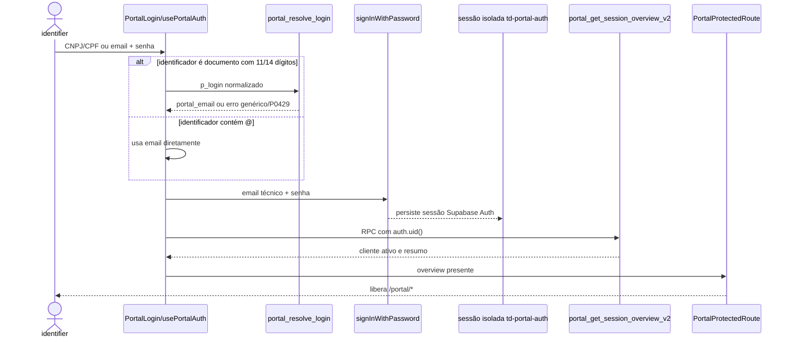

# Portal do Cliente

> **Status:** ativo · **Atualizado:** 2026-06-20 · **Rotas:** `/portal/login`, `/portal/esqueci-senha`, `/portal/recuperar-senha`, `/portal`, `/portal/billing`, `/portal/operacao`, `/portal/perfil`

## Propósito e escopo

O Portal é a superfície externa para autenticação, consulta financeira e operacional, consolidação de recebíveis, disputas de demurrage, notificações e atualização limitada de perfil. Não existe cadastro público nem sessão alternativa por token próprio: CNPJ, CPF e email são **identificadores de entrada**; Supabase Auth com email técnico e senha é o único **mecanismo de autenticação e sessão**.

As três rotas de autenticação são públicas. `/portal`, `/portal/billing`, `/portal/operacao` e `/portal/perfil` ficam sob `PortalProtectedRoute` e `PortalLayout` em `src/App.tsx`. O navegador usa `supabasePortal`, com `storageKey: 'td-portal-auth'` e `detectSessionInUrl:false`, separado da sessão interna (`src/services/supabase.ts`).

A interface e seus filtros não autorizam dados. RPCs de Portal resolvem o cliente pela identidade autenticada; RLS, grants e validações server-side continuam sendo a fronteira real, conforme [ADR 0004](../adr/0004-supabase-rls-rpc-fronteira-seguranca.md) e [ADR 0013](../adr/0013-portal-auth-identificador-resolvido-e-excecao-anon.md).

## Anatomia das telas

### `/portal/login`

`src/pages/PortalLogin.tsx` aceita CNPJ, CPF ou email e senha. Se a sessão já foi hidratada, redireciona para `/portal`; durante submit chama `usePortalAuth.signIn`, preserva mensagem específica apenas para `P0429` e converte as demais falhas em erro genérico de credenciais.

### `/portal/esqueci-senha`

`src/pages/PortalForgotPassword.tsx` resolve documento por `portal_resolve_login`, usa email diretamente quando contém `@` e chama `supabasePortal.auth.resetPasswordForEmail`. Sucesso e falha não limitada usam texto não enumerável; a tela de sucesso não confirma que a conta existe.

### `/portal/recuperar-senha`

`src/pages/PortalResetPassword.tsx` lê `access_token`, `refresh_token` e `type=recovery` do hash, estabelece manualmente a sessão com `setSession`, remove os tokens da URL e permite `updateUser({ password })` após validar mínimo de oito caracteres e confirmação.

### `/portal`

`src/pages/PortalDashboard.tsx` deriva quatro KPIs das listas de invoices locais, invoices de demurrage e B/Ls operacionais. Cada card navega para billing/operação com aba e filtro na query string. `ShipScheduleWidget` lê `vessel_schedules` e assina Realtime para invalidar o cache do cronograma.

### `/portal/billing`

`src/pages/PortalBilling.tsx` tem abas Taxas Locais e Demurrage, filtros client-side por status, navio/viagem, B/L, POD e intervalo de emissão, exportação XLSX do resultado filtrado e modais de detalhe. A aba local mostra breakdown, containers, PIX e impressão pelo navegador; também abre criação ou desfazimento de consolidada. A aba demurrage mostra detalhe, PIX e abertura de disputa.

### `/portal/operacao`

`src/pages/PortalOperacao.tsx` alterna B/Ls e Containers, com filtros, paginação local, expansão dos containers do B/L e exportação XLSX. A aba Containers é derivada por `flattenContainers`; `tab` e o filtro inicial `devolucao` podem vir da URL.

### `/portal/perfil`

`src/pages/PortalProfile.tsx` carrega email de contato, telefone e endereço via RPC, mantém os campos em estado local e salva somente o conjunto permitido. `NotificationBell`, em `PortalLayout`, fica disponível em todas as rotas protegidas.

## Catálogo de ações

### Autenticação e sessão

| Tela / ação | Pré-condições | Origem | Orquestração | Persistência | Efeitos e cache | Falhas | Evidência |
|---|---|---|---|---|---|---|---|
| `/portal/login` — resolver CNPJ/CPF | Valor sem `@`, com 11 ou 14 dígitos | `PortalLogin` → `usePortalAuth.signIn` | `portalResolveLogin(login)` antes do Auth | RPC `portal_resolve_login`; lê conta ativa por `login_cnpj`; registra hash em `portal_login_resolution_attempts` | Substitui o identificador pelo `portal_email`; nenhuma query React Query | 8 tentativas/10 min geram `P0429`; vazio/desconhecido gera `28000` genérico | **Teste:** `src/hooks/__tests__/usePortalAuth.test.tsx`; **Teste de contrato SQL:** `src/services/__tests__/portalResolveLoginHardeningMigration.test.ts` |
| `/portal/login` — usar email e autenticar senha | Identificador com `@` ou valor que não foi reconhecido como documento | `usePortalAuth.signIn` | Chama diretamente `supabasePortal.auth.signInWithPassword({ email, password })` | Supabase Auth; sessão persistida pelo cliente `supabasePortal` | Sessão em storage isolado `td-portal-auth`; depois carrega overview | Erro de Auth é convertido pela página em credencial genérica | **Código:** `src/hooks/usePortalAuth.tsx`, `src/services/supabase.ts`; **Runtime não executado** |
| Inicialização — hidratar sessão e overview | Aplicação montada; sessão Portal persistida opcional | `PortalAuthProvider` | `getSession()` → `fetchOverview()` | Supabase Auth; RPC `portal_get_session_overview_v2`; UPDATE de `last_login_at` | Define `overview` e `isAuthenticated=Boolean(overview)` | Sessão sem Conta de Portal ativa gera `28000` e limpa overview; outras falhas não são exibidas | **Código:** `src/hooks/usePortalAuth.tsx`; **Runtime não executado** |
| Layout — sair | Sessão/overview presente | Botão “Sair” em `PortalLayout` | Limpa overview antes de `signOutSupabaseClient`; chamadas concorrentes compartilham uma Promise | Supabase Auth `signOut` | Guard passa a considerar a sessão não autenticada | Ignora apenas erro conhecido de lock roubado; demais erros propagam | **Teste:** `src/services/__tests__/supabaseAuth.test.ts`; **Código:** `src/components/layout/PortalLayout.tsx` |
| `/portal/esqueci-senha` — solicitar recuperação | CNPJ/CPF ou email preenchido | `PortalForgotPassword.handleSubmit` | Documento → resolver; email → direto; `resetPasswordForEmail` com redirect | RPC resolver quando necessário; Supabase Auth recovery | Troca para tela de resposta genérica | `P0429` explícito; demais falhas preservam mensagem não enumerável | **Código:** `src/pages/PortalForgotPassword.tsx`; **Runtime não executado** |
| `/portal/recuperar-senha` — estabelecer sessão de recovery | Hash com `type=recovery`, access e refresh tokens | `parseRecoveryTokens`/`useEffect` | `supabasePortal.auth.setSession`; remove hash com `history.replaceState` | Supabase Auth; storage isolado | Habilita formulário somente após sessão válida | Link ausente, expirado ou `setSession` falho mostra mensagem única | **Código:** `src/pages/PortalResetPassword.tsx`; **Runtime não executado** |
| `/portal/recuperar-senha` — atualizar senha | Sessão recovery pronta; senha 8+; confirmação igual | `handleSubmit` | `supabasePortal.auth.updateUser({ password })` | Supabase Auth | Navega para `/portal/login` | Validação local ou mensagem retornada pelo Auth | **Código:** `src/pages/PortalResetPassword.tsx`; **Runtime não executado** |
| Rotas protegidas — redirecionar | `PortalAuthProvider` terminou loading | `PortalProtectedRoute` | Loading ocupa shell; ausência de overview retorna `<Navigate replace>` | Nenhuma chamada própria | Redireciona para `/portal/login` | O guard é UX, não autorização de dados | **Código:** `src/components/layout/PortalProtectedRoute.tsx` |

### Dashboard

| Tela / ação | Pré-condições | Origem | Orquestração | Persistência | Efeitos e cache | Falhas | Evidência |
|---|---|---|---|---|---|---|---|
| `/portal` — carregar KPIs e abrir destinos | Sessão autenticada | `PortalDashboard` | `usePortalInvoices`, `usePortalDemurrageInvoices`, `usePortalOperationBls`; cálculos em `useMemo` | RPCs `portal_list_invoices`, `portal_list_demurrage_invoices`, `portal_list_operation_bls` | Usa caches `portal-invoices`, `portal-demurrage-invoices`, `portal-operation-bls`; cards navegam com filtros | Tela só agrega loadings; falhas individuais dependem dos hooks e não têm erro dedicado no dashboard | **Teste:** `src/pages/__tests__/PortalDashboard.test.tsx` |
| `/portal` — cronograma e Realtime | Sessão autenticada; SELECT permitido em `vessel_schedules` | `ShipScheduleWidget` | `useVesselSchedules` → `listVesselSchedules`; canal `vessel_schedules_widget` | SELECT direto em `vessel_schedules`; publicação `supabase_realtime` | Query `['portal-vessel-schedules']`; qualquer evento invalida o cache; link externo para MarineTraffic quando há IMO | Service converte erro de leitura em lista vazia; falha pode parecer “nenhum navio” | **Código:** `src/components/portal/ShipScheduleWidget.tsx`, `src/services/vesselSchedules.ts`, `supabase/migrations/20260616000000_vessel_schedules.sql` |

### Billing, consolidação e disputa

| Tela / ação | Pré-condições | Origem | Orquestração | Persistência | Efeitos e cache | Falhas | Evidência |
|---|---|---|---|---|---|---|---|
| `/portal/billing` — listar/filtrar invoices locais | Sessão autenticada | `PortalBilling`/`LocalFeesTab` | `usePortalInvoices`; filtros client-side por status agrupado, navio/viagem, B/L, POD e data | RPC `portal_list_invoices`; invoices/links/recebíveis/B/Ls do cliente resolvido por `auth.uid()` | Query `['portal-invoices']`; filtros são estado local; `tab` fica na URL | Erro da query mostra “Falha ao consultar faturas” | **Teste:** filtros/export em `src/pages/__tests__/PortalBilling.test.tsx`; **Teste de contrato SQL:** `src/services/__tests__/portalCeMercanteGateMigration.test.ts` |
| `/portal/billing` — abrir detalhe local/imprimir | Invoice da lista selecionada | Botão “Detalhes”; modal e botão “Imprimir PDF” | `usePortalInvoiceDetail` → `portalInvoiceDetails`; `InvoiceDocumentLocal`; `window.print()` | RPC `portal_invoice_details`; lê invoice, B/Ls, itens, containers e pagamentos | Query `['portal-invoice-detail', id]`; impressão altera temporariamente `document.title` | Invoice fora do cliente/gate gera `P0002`; UI mostra falha genérica | **Teste de contrato SQL:** `src/services/__tests__/portalInvoiceConsolidatedBreakdownMigration.test.ts`, `src/services/__tests__/portalCeMercanteGateMigration.test.ts`; **Runtime não executado** |
| `/portal/billing` — listar/filtrar/detalhar demurrage | Sessão autenticada | `DemurrageTab` e modal de detalhe | `usePortalDemurrageInvoices`/`usePortalDemurrageInvoiceDetail` | RPCs `portal_list_demurrage_invoices` e `portal_get_demurrage_invoice_detail`; lê `demurrage_invoices/items` e B/L | Queries `portal-demurrage-invoices` e `portal-demurrage-invoice-detail` | A lista final aceita somente `issued`, `overdue`, `paid`; detalhe negado gera `P0002` | **Teste:** aba/export em `src/pages/__tests__/PortalBilling.test.tsx`; **Teste de contrato SQL:** `src/services/__tests__/portalCeMercanteGateMigration.test.ts` |
| `/portal/billing` — exportar resultado | Aba ativa; resultado filtrado | `handleExport` | `exportPortalLocalInvoicesWorkbook` ou `exportPortalDemurrageWorkbook` | Download XLSX local com `@e965/xlsx` | Exporta somente linhas após filtros da aba; sem mutação/cache | A página não aguarda nem apresenta toast de falha do export | **Teste:** `src/pages/__tests__/PortalBilling.test.tsx`; **Código:** `src/services/exports.ts` |
| `/portal/billing` — carregar recebíveis consolidáveis | Sessão autenticada | Métrica e `PortalConsolidatedModal` | `usePortalConsolidatableReceivables`; `isReceivableSelectable` | RPC `portal_list_consolidatable_receivables`; `bl_receivables`, links e invoices | Query `['portal-consolidatable-receivables']`; status `eligible`, `paid`, `no_balance`, `open_consolidated` | Itens inelegíveis ficam desabilitados; falha de query não tem erro dedicado no modal | **Teste de contrato SQL:** `src/services/__tests__/portalCeMercanteGateMigration.test.ts`; **Código:** `src/components/portal/PortalConsolidatedModal.tsx` |
| `/portal/billing` — criar consolidada | Ao menos um recebível selecionado e elegível; posse do cliente; CE em todos os B/Ls; rate limit | `PortalConsolidatedModal.submit` | `usePortalCreateConsolidation` → `portalCreateConsolidation` → core transacional | RPC `portal_create_consolidation`; core `create_local_consolidated_invoice_core`; INSERT `alerts` e `portal_notifications` | Invalida recebíveis e invoices; `refreshOverview`; abre detalhe retornado | 3 tentativas/10 min, outro cliente, sem CE, inelegibilidade/core ou transporte | **Teste de contrato SQL:** `src/services/__tests__/portalCreateConsolidationJsonbMigration.test.ts`, `src/services/__tests__/portalCeMercanteGateMigration.test.ts`; **Código:** componente/hook |
| `/portal/billing` — desfazer consolidada | Invoice `consolidated`, status `issued/partially_paid/overdue`, sem pagamentos; confirmação; rate limit | Detalhe local, `handleObsolete` | `usePortalObsoleteConsolidation` → `portalObsoleteConsolidation` | RPC `portal_obsolete_consolidation`; UPDATE invoice e links; INSERT lifecycle, alerta e notificação | Invalida recebíveis/invoices; `refreshOverview`; fecha detalhe | 3 tentativas/15 min, invoice alheia/não consolidada/paga/cancelada/obsoleta ou com pagamento | **Código:** `src/pages/PortalBilling.tsx`, `supabase/migrations/20260615145427_portal_fixes_post_pr227.sql`; **Runtime não executado** |
| `/portal/billing` — abrir disputa de demurrage | Invoice não paga/cancelada e sem disputa na UI; motivo não vazio; rate limit | `DisputeModal` → `usePortalOpenDispute` | `portalOpenDemurrageDispute` | RPC `portal_open_demurrage_dispute`; UPDATE `demurrage_invoices`; INSERT `portal_notifications` e `alerts` | Invalida `['portal-demurrage-invoices']`; notificação aparece no polling/refetch próprio | 3 tentativas/30 min, motivo vazio, invoice alheia/inexistente ou disputa já aberta | **Código:** `src/components/portal/DisputeModal.tsx`, `src/hooks/usePortalDisputes.ts`; **Runtime não executado** |

### Operação

| Tela / ação | Pré-condições | Origem | Orquestração | Persistência | Efeitos e cache | Falhas | Evidência |
|---|---|---|---|---|---|---|---|
| `/portal/operacao` — carregar B/Ls e containers | Sessão autenticada | `usePortalOperationBls` | `portalListOperationBls` → `normalizePortalOperationRows` | RPC `portal_list_operation_bls`; B/Ls, viagens, navios, containers e tarifas de demurrage | Query `['portal-operation-bls']` | Erro propaga ao hook e vira `InlineError` | **Teste:** `src/services/__tests__/portalOperation.test.ts`; **Teste de contrato SQL:** `src/services/__tests__/portalCeMercanteGateMigration.test.ts` |
| `/portal/operacao` — alternar, buscar, filtrar e paginar | Dados carregados | `PortalOperacao`, `BlsTab`, `ContainersTab` | Filtros locais; `flattenContainers`; páginas 10/25/50/100 | Nenhuma nova leitura | `tab` na URL; `devolucao` só inicializa filtro de Containers; filtros resetam página | Sem resultado mostra vazio; filtros não autorizam nem ampliam o escopo RPC | **Teste:** `src/pages/__tests__/PortalOperacao.test.tsx`, `src/lib/__tests__/portalOperationViews.test.ts` |
| `/portal/operacao` — derivar devolução/demurrage | Descarga, devolução, free time e tarifa disponíveis | SQL do RPC; helpers de view para filtros/KPIs | SQL calcula `usage_days`, `free_time_days`, `demurrage_days` e status; cliente deriva contagens/filtros | Somente leitura | Estados: `sem_descarga`, `dentro_free_time`, `em_demurrage`, `devolvido` | Ausência de descarga/free time produz nulos/status conservador; status desconhecido normaliza para `sem_descarga` | **Teste:** `src/services/__tests__/portalOperation.test.ts`, `src/lib/__tests__/portalOperationViews.test.ts` |
| `/portal/operacao` — exportar B/Ls/containers | Resultado filtrado não vazio | Botões “Exportar Excel” | `exportPortalBlsWorkbook`/`exportPortalContainersWorkbook` | Download XLSX local | Exporta todas as linhas filtradas, não só a página | Sem feedback dedicado de falha | **Código:** `src/pages/PortalOperacao.tsx`, `src/services/exports.ts` |

### Notificações e perfil

| Tela / ação | Pré-condições | Origem | Orquestração | Persistência | Efeitos e cache | Falhas | Evidência |
|---|---|---|---|---|---|---|---|
| Layout — contar/listar notificações | Overview autenticado; lista habilitada ao abrir sino | `NotificationBell` | `usePortalUnreadCount` e `usePortalNotifications(open)` | RPCs `portal_notification_unread_count`, `portal_list_notifications(20)`; tabela `portal_notifications` | Queries `portal-unread-count` e `portal-notifications`; polling de 30 s | Loading/vazio no popover; erros não têm UI dedicada | **Código:** `src/components/portal/NotificationBell.tsx`, `src/hooks/usePortalNotifications.ts` |
| Layout — marcar uma/todas como lidas | Notificação do cliente ou contagem > 0 | Clique na linha ou ação “Marcar todas” | `usePortalMarkRead`/`usePortalMarkAllRead` | RPCs atualizam `portal_notifications.read_at` escopado ao cliente | Invalida lista e contador | Mutation sem feedback de erro; clique não navega para `notification.link` | **Código:** hooks e `supabase/migrations/20260615000003_portal_fase2_notifications_disputes_profile.sql` |
| `/portal/perfil` — carregar perfil | Sessão autenticada | `PortalProfile.useEffect` | `portalGetProfile` | RPC `portal_get_profile`; lê conta, cliente e primeiro contato `faturamento` | Preenche estado local; fallback do email vem do overview | Erro é silenciosamente ignorado e pode deixar formulário vazio | **Código:** `src/pages/PortalProfile.tsx`, `src/services/portalBilling.ts` |
| `/portal/perfil` — atualizar contato/endereço | Sessão autenticada; formulário submetido | `PortalProfile.handleSubmit` | `portalUpdateProfile` → `refreshOverview` | RPC `portal_update_profile`; UPDATE `customer_portal_accounts.contact_email`, campos de endereço em `customers` e telefone do contato `faturamento` (cria se ausente) | Atualiza overview; não há query de perfil em cache | Erro do RPC aparece inline; campos vazios de endereço não apagam valor existente | **Código:** `src/pages/PortalProfile.tsx`, `supabase/migrations/20260615145427_portal_fixes_post_pr227.sql` |

## Estado e dados

| Query/estado | Fonte | Invalidação ou atualização |
|---|---|---|
| `overview` no `PortalAuthProvider` | `portal_get_session_overview_v2` | Login, hidratação, `refreshOverview`; limpo antes do logout ou por erro de sessão. |
| `['portal-invoices']` | `portal_list_invoices` | Criação/desfazimento de consolidada. |
| `['portal-invoice-detail', id]` | `portal_invoice_details` | Não é invalidada explicitamente; o modal fecha após desfazer. |
| `['portal-consolidatable-receivables']` | `portal_list_consolidatable_receivables` | Criação/desfazimento de consolidada. |
| `['portal-demurrage-invoices']` | `portal_list_demurrage_invoices` | Abertura de disputa. |
| `['portal-demurrage-invoice-detail', id]` | `portal_get_demurrage_invoice_detail` | Sem invalidação explícita. |
| `['portal-operation-bls']` | `portal_list_operation_bls` | Sem Realtime/refetch específico. |
| `['portal-vessel-schedules']` | SELECT `vessel_schedules` | Invalidação por subscription Realtime. |
| `['portal-notifications']`, `['portal-unread-count']` | RPCs de notificação | Polling 30 s e invalidação após marcar lida. |
| Filtros, seleção e modais | Estado local de cada página | Não persistem, salvo `tab` e parte do filtro de operação na query string. |

Persistência principal: `customer_portal_accounts`, `portal_login_resolution_attempts`, `portal_rate_limits`, `portal_notifications`, `customers`, `customer_contacts`, `invoices`, `invoice_bls`, `invoice_receivable_links`, `bl_receivables`, `payments`, `demurrage_invoices`, `demurrage_invoice_items`, `bls`, `bl_containers`, `vessel_schedules`, `alerts` e `invoice_lifecycle_events`.

## Fluxos e invariantes

- **Identificador ≠ mecanismo:** o resolver só traduz documento para email técnico. A senha e a sessão são sempre verificadas pelo Supabase Auth.
- **Erros genéricos:** resolver desconhecido/vazio usa `28000` sem revelar existência; a UI de login esconde todos os erros exceto `P0429`. Recuperação também responde de forma não enumerável.
- **Escopo por identidade:** `current_portal_customer_id()` exige `auth.uid()`, localiza `customer_portal_accounts.auth_user_id` e exige `active=true`. Cada RPC de dados usa esse customer ID; filtros React nunca autorizam.
- **Sessões isoladas:** `supabase` e `supabasePortal` têm storages distintos. Logout do Portal não deve derrubar o usuário interno.
- **CE Mercante:** `bl_has_portal_release` exige `trim(coalesce(ce_mercante,'')) <> ''`. O gate vale para visibilidade e ações self-service no Portal; não define elegibilidade de cálculo/emissão no sistema interno.
- **Consolidação:** somente recebíveis do cliente e liberados por CE entram; o core decide elegibilidade financeira. Criação tem limite 3/10 min; desfazimento 3/15 min e exige consolidada aberta sem pagamento.
- **Disputa:** limite 3/30 min; atualiza a invoice de demurrage com prefixo `[Portal]`, cria confirmação em `portal_notifications` e alerta interno. O trigger `notify_dispute_responded` notifica quando o status muda para `resolvido`.
- **Notificações:** triggers criam `invoice_issued`, `demurrage_issued` e `dispute_responded`; ações do Portal também criam `dispute_opened` e `system`.
- **Perfil:** os únicos campos graváveis pelo RPC são email de contato, telefone, endereço, cidade, UF e CEP. Não altera email técnico de Auth, CNPJ/CPF, razão social, status da conta ou permissões.

## Testes e validação

Os testes foram lidos, mas não executados nesta frente. “Teste de contrato SQL” abaixo significa inspeção textual de migration, não execução contra PostgreSQL.

| Evidência | Tipo | O que sustenta | Limite |
|---|---|---|---|
| `src/hooks/__tests__/usePortalAuth.test.tsx` | **Teste** de hook | Normalização do erro do resolver e preservação de `P0429` | Não cobre login bem-sucedido, hidratação, overview ou recovery. |
| `src/services/__tests__/supabaseAuth.test.ts` | **Teste** unitário | Deduplicação de logout e tratamento do lock | Não usa Auth real. |
| `src/components/layout/__tests__/PortalLayout.test.tsx` | **Teste** de componente | Links de navegação do layout | Notificações são mockadas; não cobre guard/logout. |
| `src/pages/__tests__/PortalDashboard.test.tsx` | **Teste** de componente | Quatro KPIs derivados e links com filtros | Cronograma/Realtime são mockados. |
| `src/pages/__tests__/PortalBilling.test.tsx` | **Teste** de componente | Abas e exportação do conjunto filtrado | Modais de consolidação/disputa e detalhes são mockados. |
| `src/pages/__tests__/PortalOperacao.test.tsx` | **Teste** de componente | Abas, filtros, flatten e query param de demurrage | RPC/export são mockados. |
| `src/services/__tests__/portalOperation.test.ts` | **Teste** unitário | Normalização, chamada ao cliente Portal e propagação de erro | Não executa SQL. |
| `src/lib/__tests__/portalOperationViews.test.ts` | **Teste** unitário | Contagens e filtros de devolução/demurrage | Usa fixtures estáticas. |
| `src/services/__tests__/portalResolveLoginHardeningMigration.test.ts` | **Teste de contrato SQL** | Hash, rate limit, erro genérico e grant pré-auth do resolver | Não confirma migration aplicada nem resistência real a abuso. |
| `src/services/__tests__/portalCeMercanteGateMigration.test.ts` | **Teste de contrato SQL** | Helper de CE e presença do gate em operação, billing, consolidação e demurrage | Não prova dados, grants efetivos ou execução remota. |
| `src/services/__tests__/portalCreateConsolidationJsonbMigration.test.ts` | **Teste de contrato SQL** | Uso correto do retorno JSONB do core e rate limit | Não cria invoice real. |
| `src/services/__tests__/portalInvoiceConsolidatedBreakdownMigration.test.ts` | **Teste de contrato SQL** | Breakdown por B/L e fallback reconciliado | É contrato de uma migration redefinida depois pelo gate de CE. |
| `src/services/__tests__/portalInvoiceHistoryLinksMigration.test.ts` | **Teste de contrato SQL** histórico | Uso de links de histórico na migration de 2026-06-12 | A migration de CE posterior volta a filtrar links ativos em partes do contrato final. |

Não há teste focado para `PortalLogin`, `PortalForgotPassword`, `PortalResetPassword`, `PortalProtectedRoute`, `PortalConsolidatedModal`, `DisputeModal`, `NotificationBell` ou `PortalProfile`; nessas ações a evidência atual é **Código**.

**Runtime não executado.** Cenários necessários: login real por CPF, CNPJ e email; desconhecido com erro genérico e rate limit; coexistência/logout das sessões interna e Portal; reload protegido; recovery completo e tokens expirados; KPIs e Realtime do cronograma; listas/detalhes/export/print local e demurrage; invisibilidade por CE ausente sem afetar o interno; consolidação e desfazimento com/sem pagamento, alertas e lifecycle; estados operacionais em datas controladas; abertura/resolução de disputa; triggers de invoice/demurrage; leitura individual/todas das notificações; perfil com atualização/criação única do contato `faturamento` e tentativa de alterar campos não permitidos.

## Notas e divergências

- **Suspeita — grants `anon` precisam de auditoria pelo estado final.** Migrations antigas concederam `anon`; `20260615000001_portal_fase1_indexes_and_cleanup.sql` revogou parte delas, mas `supabase/migrations/20260615220000_portal_ce_mercante_gate.sql` redefiniu e voltou a conceder `authenticated, anon` a RPCs de leitura. Essas funções ainda chamam `current_portal_customer_id()`, que rejeita `auth.uid()` nulo, portanto o grant isolado não autoriza dados. Mesmo assim, o resultado aplicado deve ser verificado pelo Plano 07 contra a política default-deny da ADR 0013.
- **Código — links de notificação não navegam.** `portal_list_notifications` retorna `link`, mas `NotificationBell` apenas marca a linha como lida.
- **Código — falha de perfil é silenciosa na carga.** `PortalProfile` ignora erro de `portal_get_profile`, podendo exibir campos vazios como se fossem dados reais.
- **Código — falha do cronograma vira vazio.** `listVesselSchedules` registra no console e retorna `[]`, sem distinguir indisponibilidade de ausência de navios.
- `portal_list_disputes()` existe em `supabase/migrations/20260615000003_portal_fase2_notifications_disputes_profile.sql`, mas não tem consumidor no frontend atual.
- [ADR 0001](../adr/0001-portal-login-supabase-auth.md) continua válida para Supabase Auth e fim do token legado, mas foi parcialmente superada pela [ADR 0013](../adr/0013-portal-auth-identificador-resolvido-e-excecao-anon.md) quanto aos identificadores aceitos.
