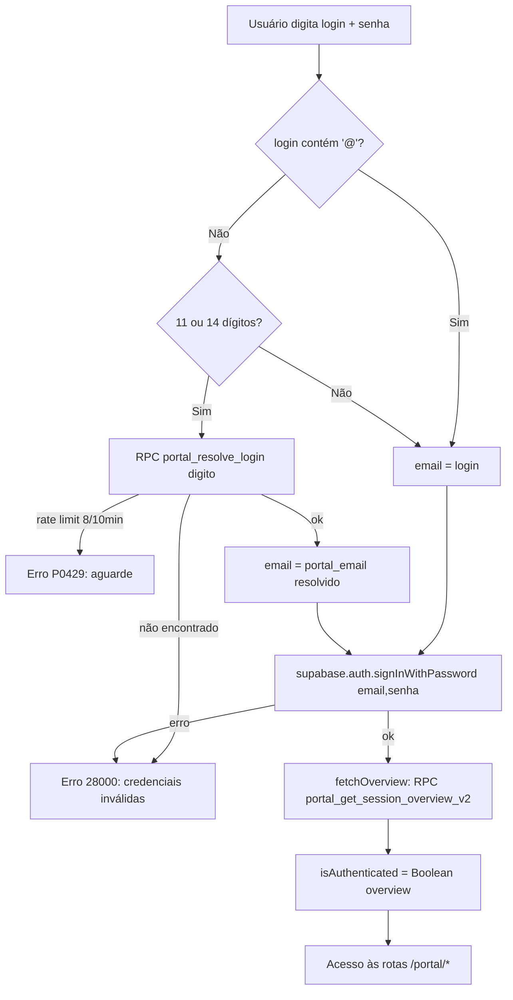

# Portal do Cliente
> **Status:** ativo · **Atualizado:** 2026-06-19 · **Rotas:** `/portal/login`, `/portal/esqueci-senha`, `/portal/recuperar-senha`, `/portal`, `/portal/billing`, `/portal/operacao`, `/portal/perfil`

## Propósito
Área externa de autoatendimento para o cliente final: consultar faturas de taxas locais e demurrage, ver saldo em aberto, **consolidar B/Ls e refazer a própria consolidada** ([ADR 0002](../adr/0002-portal-self-service-reconsolidation.md)), acompanhar a operação (B/Ls e containers, free time, demurrage), **abrir disputas de demurrage**, receber **notificações in-app** e editar dados de contato. O portal roda em client Supabase isolado (`supabasePortal`, `storageKey: 'td-portal-auth'`) para não colidir com a sessão do app interno.

## Como funciona
O login aceita **CNPJ/CPF (11 ou 14 dígitos) OU email**. O frontend detecta o formato: se não contém `@` e tem 11/14 dígitos, resolve o documento para o `portal_email` via RPC `portal_resolve_login`; depois autentica sempre em `supabase.auth.signInWithPassword`. A sessão é 100% Supabase Auth — **não há mais token legado em sessionStorage**.

Na montagem, `usePortalAuth` hidrata via `supabasePortal.auth.getSession()`; se há sessão, busca o overview por `auth.uid()` (`portal_get_session_overview_v2`). `PortalProtectedRoute` apenas checa `isAuthenticated` do contexto — sem qualquer fallback de storage.

## Componentes e arquivos
| Camada | Arquivo | Responsabilidade |
|---|---|---|
| Layout | `src/components/layout/PortalLayout.tsx` | Casca do portal (nav, `NotificationBell`) |
| Guard | `src/components/layout/PortalProtectedRoute.tsx` | Bloqueia rotas sem sessão Supabase Auth |
| Auth hook | `src/hooks/usePortalAuth.tsx` | `signIn`/`signOut`/overview via Supabase Auth |
| Page | `src/pages/PortalLogin.tsx` | Login CNPJ-ou-email |
| Page | `src/pages/PortalForgotPassword.tsx` | `resetPasswordForEmail` após resolver login |
| Page | `src/pages/PortalResetPassword.tsx` | `setSession` por tokens do hash + `updateUser({password})` |
| Page | `src/pages/PortalDashboard.tsx` | KPIs (saldo local, demurrage, containers) + `ShipScheduleWidget` |
| Page | `src/pages/PortalBilling.tsx` | Faturas locais e demurrage, consolidação, disputas |
| Page | `src/pages/PortalOperacao.tsx` | Abas B/Ls e Containers operacionais |
| Page | `src/pages/PortalProfile.tsx` | Edição de contato/endereço |
| Component | `src/components/portal/PortalConsolidatedModal.tsx` | Seleção de B/Ls e criação de consolidada |
| Component | `src/components/portal/DisputeModal.tsx` | Abertura de disputa de demurrage |
| Component | `src/components/portal/NotificationBell.tsx` | Sino de notificações in-app |
| Component | `src/components/portal/ShipScheduleWidget.tsx` | Cronograma de navios (CSSC), realtime |
| Hook | `src/hooks/usePortalBilling.ts` | Faturas, consolidação, obsoletar |
| Hook | `src/hooks/usePortalOperation.ts` | B/Ls/containers operacionais |
| Hook | `src/hooks/usePortalDisputes.ts` | Abrir disputa |
| Hook | `src/hooks/usePortalNotifications.ts` | Notificações + unread count |
| Service | `src/services/portalBilling.ts` | RPCs de billing/notificações/perfil |
| Service | `src/services/portalOperation.ts` | RPC `portal_list_operation_bls` |
| Edge | `supabase/functions/provision-portal-user/index.ts` | Cria/atualiza usuário Supabase Auth da conta |

## Regras de negócio
- **Login CNPJ + email:** `isDocument` reconhece 11/14 dígitos; `portal_resolve_login` normaliza (email → `portal_email`; dígitos → `login_cnpj`, ambos com `active = true`) e aplica rate limit de **8 tentativas / 10 min** por hash (SHA-256) em `portal_login_resolution_attempts`, lançando `P0429`; falha de credencial lança `28000`. O mesmo fluxo de resolução é usado em "esqueci a senha".
- **Conta provisionada:** `active = true` só é válido com `auth_user_id` preenchido. Ficha do cliente e fila de revisão criam/atualizam a conta inativa, aguardam a Edge Function confirmar o vínculo Auth e só então ativam; o RPC de ativação reforça a mesma invariável no banco.
- **Reset de senha:** "esqueci-senha" resolve o login e chama `resetPasswordForEmail` com `redirectTo` para `/portal/recuperar-senha`. Como `supabasePortal` usa `detectSessionInUrl: false`, a página de recuperação lê `access_token`/`refresh_token` do hash (`type=recovery`), estabelece manualmente via `setSession`, limpa o hash e chama `updateUser({ password })` (mín. 8 caracteres).
- **CE Mercante gate:** o portal só mostra dados de B/Ls com **CE Mercante preenchida**. A migration `20260615220000_portal_ce_mercante_gate.sql` define `bl_has_portal_release(p_bl_id)` (`trim(coalesce(ce_mercante,'')) <> ''`) e a aplica em `portal_list_operation_bls`, `portal_list_consolidatable_receivables`, `portal_create_consolidation`, `portal_list_invoices`, `portal_invoice_details`, `portal_list_demurrage_invoices` e `portal_get_demurrage_invoice_detail`. O sistema interno continua calculando/emitindo antes da CE.
- **Billing e consolidação:** `portal_list_invoices` lista faturas locais (status `issued|partially_paid|overdue|draft|paid|covered|cancelled|obsolete`); `portal_invoice_details` traz o breakdown por B/L (habilitado pela migration `20260615190000`). Em `PortalConsolidatedModal`, `portal_list_consolidatable_receivables` retorna receivables com `eligibility_status` ∈ `eligible|paid|no_balance|open_consolidated`; `portal_create_consolidation({ receivableIds })` valida posse e CE Mercante, reusa o core de emissão e gera alerta + notificação. **Autoatendimento de reconsolidação** ([ADR 0002](../adr/0002-portal-self-service-reconsolidation.md)): `portal_obsolete_consolidation(invoiceId)` desfaz uma consolidada `consolidated` ainda aberta e **sem pagamentos**, liberando os B/Ls para reemissão.
- **Operação:** `portal_list_operation_bls` retorna B/Ls com containers, contagens (`containers_in_demurrage`, `containers_returned`) e, por container, `discharge_date`/`return_date`/`free_time_days`/`demurrage_days` e `status` ∈ `sem_descarga|dentro_free_time|em_demurrage|devolvido`. `ShipScheduleWidget` mostra o cronograma CSSC a partir de `vessel_schedules` com subscription realtime.
- **Disputas (demurrage):** `DisputeModal` → `portal_open_demurrage_dispute(demurrageInvoiceId, reason)` seta `dispute_open=true`, `dispute_status='aberto'`, grava o motivo com prefixo `[Portal]` e cria notificação (`dispute_opened`) + alerta interno. Resolução interna (`dispute_status='resolvido'`) dispara notificação `dispute_responded`.
- **Notificações in-app:** `NotificationBell` usa `portal_notification_unread_count` (refetch 30s) e `portal_list_notifications(p_limit)`; marcar lida via `portal_mark_notification_read` / `portal_mark_all_notifications_read`. Tipos: `invoice_issued`, `demurrage_issued`, `dispute_opened`, `dispute_responded`, `system`, criados por triggers da migration `20260615000003`.
- **Perfil:** `portal_get_profile` / `portal_update_profile(contactEmail, phone, address, city, state, zip)` atualizam `customer_portal_accounts.contact_email`, endereço em `customers` e telefone em `customer_contacts (purpose='faturamento')`.

## Dependências
- **Tabelas:** `customer_portal_accounts`, `customer_portal_sessions` (legado, não usado pelo fluxo atual), `portal_notifications`, `portal_login_attempts`, `portal_login_resolution_attempts`, `portal_rate_limits`; leitura de `invoices`, `demurrage_invoices`, `bl_receivables`, `invoice_receivable_links`, `bls` (`ce_mercante`), `bl_containers`, `vessel_schedules`, `customers`, `customer_contacts`.
- **RPCs:** `portal_resolve_login`, `portal_get_session_overview_v2`, `portal_list_invoices`, `portal_invoice_details`, `portal_list_consolidatable_receivables`, `portal_create_consolidation`, `portal_obsolete_consolidation`, `portal_list_demurrage_invoices`, `portal_get_demurrage_invoice_detail`, `portal_open_demurrage_dispute`, `portal_list_operation_bls`, `portal_list_notifications`, `portal_notification_unread_count`, `portal_mark_notification_read`, `portal_mark_all_notifications_read`, `portal_get_profile`, `portal_update_profile`, `bl_has_portal_release`.
- **Integrações externas:** Supabase Auth (`signInWithPassword`, `resetPasswordForEmail`, `setSession`, `updateUser`, `getSession`); Edge Function `provision-portal-user` (criação/atualização do usuário Auth, com rate limit `check_provision_rate_limit` e CORS restrito).
- **Outros módulos:** provisionamento em [Clientes](clientes.md); faturas e consolidação derivadas de [Faturamento](faturamento.md); disputas/valores de [Demurrage](demurrage.md). RLS/RPC como fronteira em [segurança](../operations/seguranca.md) e [ARCHITECTURE](../ARCHITECTURE.md). Termos em [Glossário](../GLOSSARIO.md); regras em [regras-de-negócio](../operations/regras-de-negocio.md).

## Notas e divergências
- **Login CNPJ + email supera a [ADR 0001](../adr/0001-portal-login-supabase-auth.md).** A ADR 0001 (aceita em 2026-06-03) definiu **email-only** via Supabase Auth e removeu o caminho legado por CNPJ. As migrations `20260615000002_portal_fase1_login_cnpj.sql` e `20260615210000_harden_portal_resolve_login.sql` reintroduziram o CNPJ como **identificador de login** (não como mecanismo de auth): o CNPJ/CPF é apenas resolvido para o `portal_email` (`login_cnpj` em `customer_portal_accounts`), e a autenticação continua sendo Supabase Auth. Portanto a verdade atual é **login por CNPJ/CPF OU email**, e a ADR 0001 deve ser lida como superada nesse ponto.
- **Sem token legado.** O fallback de sessão por `sessionStorage`/`localStorage` foi removido; `usePortalAuth` e `PortalProtectedRoute` dependem só de `supabasePortal.auth`. A tabela `customer_portal_sessions` permanece no schema mas não participa do fluxo atual.
- `portal_list_disputes` existe mas não é consumido pelo frontend atual.
- O rate limit legado de login (`portal_login_attempts`, migration `040`) coexiste com o novo de resolução (`portal_login_resolution_attempts`); o fluxo atual usa o segundo.
