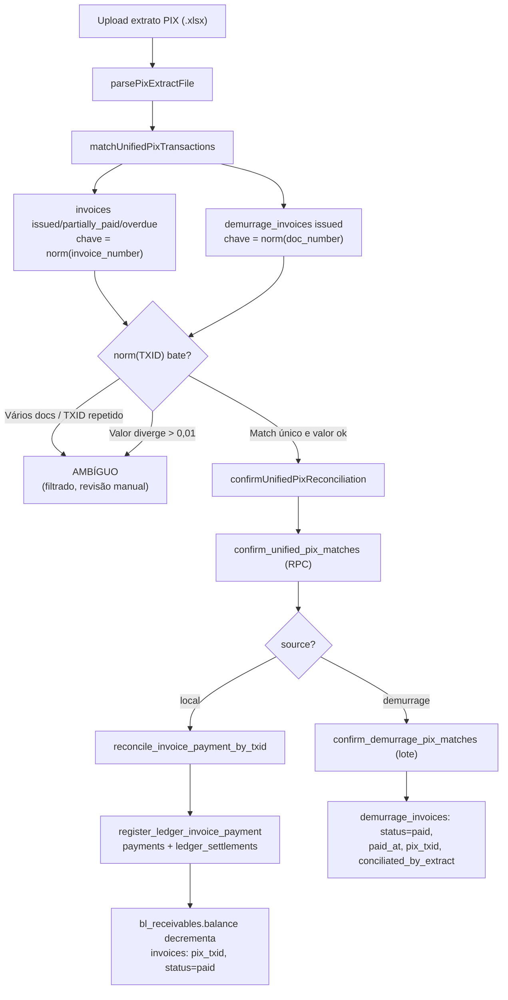

# Reconciliação PIX

> **Status:** ativo · **Atualizado:** 2026-06-18 · **Rotas:** `/reconciliacao`

## Propósito

Concilia pagamentos recebidos via PIX com as invoices em aberto, fazendo o casamento pelo TXID do extrato bancário (.xlsx). Atende dois domínios distintos — invoices de taxas locais (com baixa via ledger) e invoices de demurrage (baixa direta) — através de um único ponto de entrada unificado, filtrando casamentos ambíguos antes de confirmar.

## Como funciona

O operador sobe o extrato PIX; cada transação tem TXID e valor. O matcher carrega invoices locais (`issued`/`partially_paid`/`overdue`) e de demurrage (`issued`), normaliza o TXID e procura pelo `invoice_number` (local) ou `doc_number` (demurrage). Apenas casamentos inequívocos e com valor compatível são enviados a `confirm_unified_pix_matches`, que despacha cada item para o RPC correto conforme a origem.

## Componentes e arquivos

| Camada | Arquivo | Responsabilidade |
|--------|---------|------------------|
| Página | [`src/pages/Reconciliacao.tsx`](../../src/pages/Reconciliacao.tsx) | Upload, parsing, exibição de matches, confirmação, histórico, estorno |
| Service | [`src/services/reconciliacao.ts`](../../src/services/reconciliacao.ts) | `matchUnifiedPixTransactions`, `confirmUnifiedPixReconciliation`, `listReconciliationHistory`, estornos |
| Lib | [`src/lib/pix.ts`](../../src/lib/pix.ts) | Geração do payload PIX (BRCode): `buildTransshippingPixPayload`, CRC-16, TLV |
| Service (parser) | [`src/services/demurrage/demurrageKpis.ts`](../../src/services/demurrage/demurrageKpis.ts) | `parsePixExtractFile` — leitura do extrato .xlsx |
| Componente | [`src/components/billing/ReconciliationHistoryTable.tsx`](../../src/components/billing/ReconciliationHistoryTable.tsx) | Histórico (local + demurrage), filtros e export Excel |

## Regras de negócio

- **TXID:** o TXID embutido no QR PIX é o número do documento — `invoice_number` (local) ou `doc_number` (demurrage). É inserido no payload nos campos TLV `26/05` e `62/05` ([`src/lib/pix.ts`](../../src/lib/pix.ts)), com no máximo 35 caracteres alfanuméricos. O matching normaliza para alfanumérico maiúsculo (`UPPER(REGEXP_REPLACE(txid, '[^A-Za-z0-9]', '', 'g'))`).
- **Dois caminhos de casamento:**
  - **Local (ledger):** `reconcile_invoice_payment_by_txid(txid, amount, paid_at)` casa o TXID com o `invoice_number`, exige valor igual ao saldo aberto, e via `register_ledger_invoice_payment` grava `payments` + `ledger_settlements` (uma linha por receivable), decrementa `bl_receivables.balance_brl` e marca a invoice (`pix_txid`, `conciliated_by_extract`, `status`).
  - **Demurrage (direto):** `confirm_demurrage_pix_matches(jsonb)` faz UPDATE em lote — `status = paid`, `paid_at`, `pix_txid`, `conciliated_by_extract = true`. Não há `ledger_settlements` nem decremento de saldo.
- **Orquestrador:** `confirm_unified_pix_matches(p_matches)` itera o lote, exige `paid_at` presente, valida (demurrage) `abs(amount - frozen_total_brl) <= 0.01`, despacha para o RPC certo por `source` e agrega o resultado (`{local, demurrage, items}`).
- **Ambiguidade:** o matcher marca `ambiguous` quando vários documentos compartilham o mesmo TXID, quando o TXID se repete no extrato, ou quando o valor diverge (> 0,01). Casamentos ambíguos são exibidos mas **filtrados** antes do envio; a RPC local também retorna `already_reconciled` se o TXID já tem settlement. Transações sem match são ignoradas.
- **Estorno:** `reverse_invoice_payment` (local) e `reverse_demurrage_payment` (demurrage) exigem role admin e justificativa não-vazia; revertem status, limpam `pix_txid`/`conciliated_by_extract` e, no caso local, removem `ledger_settlements` e restauram o saldo da receivable.

## Dependências

- **Tabelas Supabase:** `invoices` (`pix_txid`, `pix_payload`, `conciliated_by_extract`, `balance_brl`, `status`), `demurrage_invoices` (`pix_txid`, `frozen_total_brl`, `paid_at`, `status`), `ledger_settlements`, `bl_receivables`, `payments`.
- **RPCs:** `confirm_unified_pix_matches`, `reconcile_invoice_payment_by_txid`, `confirm_demurrage_pix_matches`, `register_ledger_invoice_payment`, `reverse_invoice_payment`, `reverse_demurrage_payment`. Função SQL de payload: `build_transshipping_pix_payload` (trigger `populate_local_invoice_pix_payload`).
- **Integrações externas:** PIX (extrato bancário .xlsx "QR Codes recebidos"); geração de BRCode própria.
- **Outros módulos:** [Faturamento](faturamento.md) (invoices locais e ledger), [Demurrage](demurrage.md) (invoices de demurrage), [Regras de negócio](../operations/regras-de-negocio.md), [Glossário](../GLOSSARIO.md), [Arquitetura](../ARCHITECTURE.md).

## Notas e divergências

- **Semânticas assimétricas.** Local usa ledger transacional completo (settlements + saldo); demurrage faz UPDATE simples sem trilha de saldo — diverge a lógica de estorno e auditoria.
- **Filtragem de ambiguidade é client-side.** A RPC unificada não rejeita ambíguos por si; o frontend filtra antes de chamar. Chamada direta à API poderia conciliar casamentos ambíguos.
- **Tolerância de valor inconsistente.** Local exige valor exato vs. saldo; demurrage tolera 0,01 no orquestrador.
- **TXID duplicado entre domínios não é barrado.** Nada impede o mesmo TXID existir em invoice local e de demurrage simultaneamente; o `txidMap` é construído para ambos sem guarda de uso duplo.
- **TXID denormalizado.** Persistido em `invoices.pix_txid` e em `ledger_settlements.pix_txid` (só na primeira linha do settlement consolidado, via trigger) — risco de drift.
