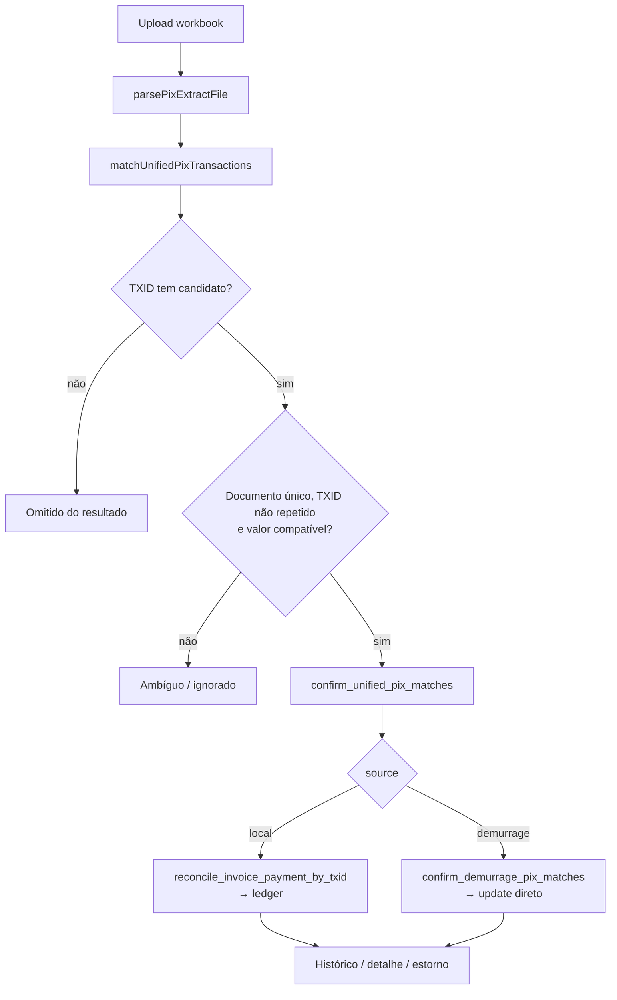

# Reconciliação PIX

> **Status:** ativo · **Atualizado:** 2026-06-20 · **Rotas:** `/reconciliacao`; `/demurrage/reconciliacao` redireciona para esta rota

## Propósito e escopo

Reconciliação PIX recebe a planilha bancária, extrai transações, casa TXIDs com
documentos locais ou de Demurrage, separa resultados seguros de ambiguidades,
confirma o lote, apresenta histórico/exportação e permite cancelar baixas.

- A rota interna está em `src/App.tsx` e a composição em
  `src/pages/Reconciliacao.tsx`.
- `src/services/demurrage/demurrageKpis.ts` é o dono do parser da planilha.
- `src/services/reconciliacao.ts` é o dono do matching, confirmação, histórico,
  exportação e chamadas de estorno.
- Taxas locais são liquidadas pelo ledger descrito em
  [Faturamento](faturamento.md); Demurrage é atualizado em persistência própria.
- A capacidade visual `reconciliacao_edit` existe em `src/hooks/useAuth.tsx`;
  as RPCs críticas também exigem sessão ativa/admin.

## Anatomia das telas

### Upload e matching

`src/pages/Reconciliacao.tsx` começa com uma dropzone acessível por clique,
teclado ou drag-and-drop. Aceita `.xlsx`/`.xls`, mostra estado “Processando
extrato...” e limpa o resultado anterior antes de processar outro arquivo.

`parsePixExtractFile` valida tamanho antes de `arrayBuffer()`. O parser procura
a linha que contém a coluna `identificador`, exige `valor pago`, tenta localizar
CPF/CNPJ e `pago em`, ignora TXID vazio e valor não positivo e normaliza a data
para `YYYY-MM-DD`.

### Revisão do resultado

Após o matching, a página apresenta:

- resumo de correspondências seguras, ambíguas e total de matches retornados;
- tabela de matches não ambíguos com origem, documento, cliente, valor do PIX,
  valor esperado e TXID;
- painel separado de ambiguidades, com candidato, contagem e motivo;
- estado vazio quando nenhuma correspondência foi retornada;
- botão de confirmação habilitado somente quando existe match não ambíguo.

Transações sem documento candidato não geram um objeto `UnifiedPixMatch` e,
portanto, não aparecem nem são contadas separadamente.

### Confirmação e resultado por item

Depois da RPC, a página substitui os matches por um cartão de resultado com:

- contagem `local` e `demurrage`;
- uma linha por item retornado, contendo `source`, `invoice_id`, `doc_number` e
  `status`.

### Histórico, filtros e exportação

`src/components/billing/ReconciliationHistoryTable.tsx` combina:

- invoices locais `paid`, `covered` e `partially_paid` com data em `payments`;
- `demurrage_invoices.status = paid`;
- filtros de período, origem, tipo documental, cliente, B/L, navio, viagem e
  POD;
- ordenação, paginação e exportação XLSX;
- abertura do detalhe local ou de Demurrage.

### Detalhe e cancelamento de baixa

- Invoice local abre `src/components/billing/InvoiceDetailModal.tsx` com
  `enablePaymentReversal` e o `paymentId` escolhido no histórico.
- Demurrage abre modal próprio com documento tipo recibo.
- Somente admin vê a ação de cancelamento; justificativa é obrigatória na UI e
  nas RPCs.

## Catálogo de ações

| Tela / ação | Pré-condições | Origem | Orquestração | Persistência | Efeitos e cache | Falhas | Evidência |
|---|---|---|---|---|---|---|---|
| `/reconciliacao` · selecionar/upload de planilha | Arquivo `.xlsx`/`.xls` dentro do limite | Dropzone/input → `processFile` | `matchMutation` chama `parsePixExtractFile` | Leitura local do arquivo; sem escrita remota | Limpa `matches` e `confirmationResult`; inicia estado de processamento | Arquivo grande, formato inválido ou nenhuma transação gera toast de erro | **Código:** `src/pages/Reconciliacao.tsx`, `src/services/demurrage/demurrageKpis.ts` |
| Parser · extrair linhas bancárias | Cabeçalho `identificador` e coluna `valor pago` | `parsePixExtractFile` | `assertUploadSize` → `parsePixExtract` → import dinâmico de `@e965/xlsx` | Nenhuma persistência | Retorna `{txid, cnpj, date, amount}`; ignora TXID vazio/valor não positivo | Cabeçalho/valor ausente lança erro; data inválida vira string vazia e falhará na confirmação | **Código:** `src/services/demurrage/demurrageKpis.ts` |
| Matching · carregar documentos locais e Demurrage | Transações parseadas | `matchUnifiedPixTransactions` | Duas queries paralelas; normalização alfanumérica maiúscula | `SELECT invoices` locais pagáveis e `SELECT demurrage_invoices` emitidas | Sem cache React Query; monta mapa único de TXID para os dois domínios | Erro de qualquer query aborta o matching | **Código:** `src/services/reconciliacao.ts` · **Teste:** `src/services/__tests__/reconciliacao.test.ts` |
| Matching · classificar sem match | TXID sem candidato aberto | Loop de `matchUnifiedPixTransactions` | `txidMap.get(key)` retorna vazio | Sem persistência | A linha é omitida do array, não recebe objeto/status “unmatched” | Operador vê apenas o estado geral “nenhuma correspondência” quando todo o arquivo é omitido | **Código:** `src/services/reconciliacao.ts` · **Teste:** caso sem TXID em `src/services/__tests__/reconciliacao.test.ts` |
| Matching · classificar ambiguidade de documento/TXID | Mais de um documento com TXID normalizado ou TXID repetido no extrato | Mesmo loop | `entries.length > 1` ou `seenTxids` | Sem persistência | `ambiguous = true`, motivo e `candidateCount`; UI move para painel ignorado | Não há seleção manual de candidato nesta tela | **Código:** `src/services/reconciliacao.ts`, `src/pages/Reconciliacao.tsx` · **Teste:** `src/services/__tests__/reconciliacao.test.ts` |
| Matching · classificar divergência de valor | Diferença absoluta maior que `0,01` ou valor esperado não numérico | Mesmo loop | Compara transação com saldo local ou `frozen_total_brl` | Sem persistência | Marca como ambíguo; local e Demurrage recebem motivos distintos | Não existe pagamento parcial por PIX neste fluxo | **Código:** `src/services/reconciliacao.ts` · **Teste:** `src/services/__tests__/reconciliacao.test.ts` |
| `/reconciliacao` · confirmar somente não ambíguos | Ao menos um match seguro; data parseada | `confirmMutation` | Filtra `!ambiguous`; `confirmUnifiedPixReconciliation` refiltra e monta JSON | RPC `confirm_unified_pix_matches` | Em sucesso invalida Demurrage, invoices, KPIs, B/Ls, detalhe de B/L, cliente e histórico | Data vazia falha antes da RPC; qualquer erro do lote é propagado | **Código:** `src/pages/Reconciliacao.tsx`, `src/services/reconciliacao.ts` · **Teste:** `src/services/__tests__/reconciliacao.test.ts` |
| RPC unificada · conciliar item local | `source = local`, data presente, TXID casa uma invoice pagável e valor quita saldo | `confirm_unified_pix_matches` | `reconcile_invoice_payment_by_txid` → `register_ledger_invoice_payment` | `payments`, `ledger_settlements`, `bl_receivables`, links, invoice, B/Ls e eventos | Item `{source: local, status: ok}`; transação inteira aborta se um item falhar | Sem match, ambíguo no domínio local, já conciliado ou valor inexato gera falha do lote | **Código:** `supabase/migrations/20260612161000_confirm_unified_pix_matches.sql`, `supabase/migrations/20260614160000_pix_exact_and_manual_overpayment_refunds.sql` |
| RPC unificada · conciliar item Demurrage | `source = demurrage`, invoice existente e diferença até `0,01` | Mesma RPC | Trava e valida cada documento; acumula lote para `confirm_demurrage_pix_matches` | `UPDATE demurrage_invoices`: `paid`, `paid_at`, `pix_txid`, `conciliated_by_extract` | Item `{source: demurrage, status: ok}` | Documento ausente, valor divergente ou contagem atualizada diferente aborta o lote | **Código:** `supabase/migrations/20260612161000_confirm_unified_pix_matches.sql`, `supabase/migrations/20260610094207_confirm_demurrage_pix_matches_batch.sql` |
| Resultado · exibir retorno por fonte/item | Confirmação concluída | `confirmMutation.onSuccess` | Normalização de `UnifiedPixConfirmationResult` | Sem nova persistência | Mostra contagens e itens; limpa matches | Shape sem itens vira array vazio | **Código:** `src/pages/Reconciliacao.tsx`, `src/services/reconciliacao.ts` |
| Histórico · listar/filtrar/ordenar/paginar | Sessão interna | `ReconciliationHistoryTable` | `useQuery` → `listReconciliationHistory` | Leituras limitadas a 2000 de cada domínio; filtros/ordenação/paginação no cliente | Query `['reconciliation-history', filters]`, `staleTime` 15 s | Erro de qualquer domínio falha a tabela inteira | **Código:** `src/components/billing/ReconciliationHistoryTable.tsx`, `src/services/reconciliacao.ts` |
| Histórico · exportar | Filtros atuais | Botão “Exportar Excel” | `exportReconciliationHistoryExcel` consulta com página única ampla e carrega `@e965/xlsx` | Arquivo local `conciliacao-<timestamp>.xlsx` | Sem invalidação; neutraliza prefixos de fórmula em strings | Erro de leitura/geração é propagado pela promise do clique | **Código:** `src/services/reconciliacao.ts` |
| Histórico · abrir detalhe local | Linha local; invoice/payment IDs disponíveis | `onSelectLocalInvoice` | `InvoiceDetailModal` → `useInvoiceDetail`/`useInvoiceRefunds` | Leituras do faturamento | Queries de detalhe/refund | `paymentId = null` permite detalhe, mas não cancelamento da baixa | **Código:** `src/pages/Reconciliacao.tsx`, `src/components/billing/ReconciliationHistoryTable.tsx` |
| Histórico · abrir detalhe Demurrage | Linha Demurrage | `onSelectDemurrageInvoice` | Query `getDemurrageDetail` | Leitura de invoice e itens de Demurrage | Query `['demurrage-invoice-detail', 'reconciliacao', id]` | Erro mostra falha no modal | **Código:** `src/pages/Reconciliacao.tsx`, `src/services/demurrage/demurrageInvoices.ts` |
| Detalhe local · cancelar baixa | Admin, `paymentId` e justificativa | `InvoiceDetailModal.handleReversePayment` | `reverseLocalInvoicePayment` | RPC `reverse_invoice_payment` restaura ledger/links/status, limpa PIX e exclui `payments` | Fecha o modal; não há invalidação explícita no handler | RPC exige admin/justificativa e rejeita payment/invoice ausente | **Código:** `src/components/billing/InvoiceDetailModal.tsx`, `src/services/reconciliacao.ts`, `supabase/migrations/20260615010000_fix_bls_financial_status_on_reversal.sql` |
| Detalhe Demurrage · cancelar baixa | Admin, invoice paga e justificativa | `demurrageReversalMutation` | `reverseDemurragePayment` | RPC `reverse_demurrage_payment` volta status a `issued`, limpa data/TXID e audita | Invalida `['demurrage-invoices']` e `['reconciliation-history']`; fecha modal | UI e RPC exigem justificativa; estado diferente de `paid` falha | **Código:** `src/pages/Reconciliacao.tsx`, `src/services/reconciliacao.ts`, `supabase/migrations/20260614180000_require_justification_on_payment_reversal.sql` |

## Estado e dados

### Estado local da página

- `matches`: candidatos retornados pelo matcher ou `null` antes/depois do fluxo.
- `confirmationResult`: contagens e itens da última confirmação.
- `dragOver`: feedback da dropzone.
- `selectedInvoice`: invoice local e payment aberto pelo histórico.
- `selectedDemurrageId` e `demurrageReason`: detalhe/justificativa do estorno.

### Dados remotos

| Domínio | Leitura para matching | Escrita de confirmação | TXID persistido |
|---|---|---|---|
| Local | `invoices` em `issued`, `partially_paid`, `overdue`; tipos `individual`/`consolidated`; valor esperado = `balance_brl` ou `total_brl` | Ledger via `reconcile_invoice_payment_by_txid` e `register_ledger_invoice_payment` | `invoices.pix_txid` e uma linha de `ledger_settlements.pix_txid` |
| Demurrage | `demurrage_invoices.status = issued`; valor esperado = `frozen_total_brl` | Update em lote por `confirm_demurrage_pix_matches` | `demurrage_invoices.pix_txid` |

`supabase/migrations/20260529145000_ledger_pix_txid_single_settlement_row.sql`
usa trigger para manter o TXID somente na primeira linha de settlement de um
pagamento PIX com vários receivables. O documento local também guarda
`conciliated_by_extract`; Demurrage possui flag equivalente.

### Histórico

`listReconciliationHistory` não consulta uma view única. Ele carrega os dois
domínios, achata B/Ls, usa a data mais recente de `payments` no local,
`demurrage_invoices.paid_at` no outro domínio, remove linhas sem data e aplica
filtros/ordenação/paginação em memória.

## Fluxos e invariantes

- Matching é exclusivamente por TXID normalizado; CNPJ e valor não são fallback
  para localizar documento.
- A interface filtra ambiguidades antes da chamada e o serviço repete o filtro.
- A RPC unificada não recebe um campo `ambiguous`. Para local, ela reexecuta o
  matching no banco e exige uma única invoice; para Demurrage, valida ID e
  valor, mas não reexecuta a política de unicidade cruzada entre domínios.
- Local exige que o PIX quite o saldo aberto do ledger, aceitando apenas margem
  numérica de `0,01`. Demurrage compara o valor ao `frozen_total_brl` com
  tolerância de `0,01`.
- Um TXID repetido no mesmo extrato é marcado ambíguo a partir da segunda linha.
- Quando o mesmo TXID existe em documento local e Demurrage, o mapa contém dois
  candidatos e a UI marca o match como ambíguo.
- `confirm_unified_pix_matches` é a fronteira transacional do lote: falha em um
  item levanta exceção e impede sucesso parcial do comando.
- Local cria `payments` e settlements por recebível. Demurrage não cria
  `payments` nem ledger; marca diretamente o documento como pago.
- Estorno local remove o payment, restaura saldos/links e, por cascade, remove
  refund ligado ao pagamento. Estorno de Demurrage apenas reabre o documento e
  registra auditoria.

## Testes e validação

Os testes não foram executados nesta cartografia, por instrução do coordenador.

### Testes de comportamento estático

- `src/services/__tests__/reconciliacao.test.ts`: TXID-only, colisão entre
  domínios, repetição no extrato, divergência de valor, confirmação unificada,
  data obrigatória e lote Demurrage.
- `src/lib/__tests__/pix.test.ts`: payload BRCode, sanitização/limite de TXID e
  CRC-16.

### Teste de contrato SQL

Estes testes verificam texto de migrations, não um banco aplicado:

- `src/services/__tests__/ledgerPixPayloadMigration.test.ts`
- `src/services/__tests__/ledgerPixSettlementTxidMigration.test.ts`
- `src/services/__tests__/reversalBlsFinancialStatusMigration.test.ts`
- `src/services/__tests__/reversalJustificationMigration.test.ts`

Não há evidência de Runtime registrada neste documento.

## Notas e divergências

- **Unmatched não é uma classificação persistida ou exibida.** O serviço omite
  transações sem candidato. Isso impede revisar por linha quais entradas do
  workbook ficaram sem match.
- **Suspeita sem prova de falha/exploit — ambiguidade é parcialmente
  client-side.** A RPC unificada não recebe a classificação do frontend. Uma
  chamada direta ainda revalida o match local e os valores, mas não demonstra
  a mesma política de ambiguidade cruzada para um item Demurrage.
- **Suspeita sem prova de falha/exploit — mesmo TXID nos dois domínios.** A UI
  bloqueia a colisão porque `txidMap` agrega local e Demurrage. No banco, a
  unicidade de `ledger_settlements` cobre somente o ledger local e
  `demurrage_invoices` é separado; não foi executado um cenário que tentasse
  aplicar a mesma transação aos dois domínios.
- **TXID é denormalizado.** Local mantém `invoices.pix_txid` e
  `ledger_settlements.pix_txid`; Demurrage mantém seu próprio campo. O trigger
  reduz duplicação entre settlements, mas não elimina a necessidade de
  sincronização entre documento e ledger.
- **Suspeita — flag de Demurrage após estorno.**
  `reverse_demurrage_payment` limpa `status`, `paid_at` e `pix_txid`, mas a
  definição atual em
  `supabase/migrations/20260614180000_require_justification_on_payment_reversal.sql`
  não redefine `conciliated_by_extract = false`.
- **Suspeita — cache após estorno local.** `handleReversePayment` fecha o modal
  sem invalidar `reconciliation-history`, invoices, detalhe ou ledger. A
  próxima atualização depende de refetch por outro mecanismo.
- **Suspeita — filtro “Único BL” do histórico.** A UI envia
  `invoiceTypeFilter = single`, enquanto os valores persistidos são
  `individual`, `consolidated` e `granite`; o filtro do serviço compara por
  igualdade. Não houve validação em Runtime.
