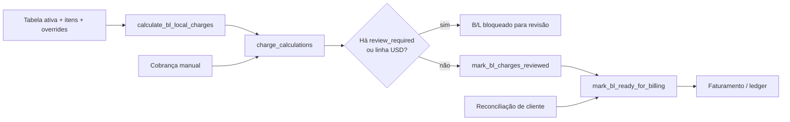

# Taxas Locais

> **Status:** ativo · **Atualizado:** 2026-07-19 · **Rotas:** `/taxas-locais`; ações operacionais também partem de `/revisao`, `/manifestos/:blId` e `/faturamento`

## Propósito e escopo

Este módulo é o dono da configuração de tarifas locais e das operações que
transformam os dados de um B/L em linhas faturáveis. A rota `/taxas-locais`
expõe somente as abas de tabelas e overrides; cálculo, recálculo, revisão,
liberação para faturamento, cobranças manuais e reconciliação de cliente são
operações do mesmo domínio disparadas por outras telas.

- `src/App.tsx` monta `/taxas-locais` dentro da aplicação interna protegida.
- `src/pages/TaxasLocais.tsx` exige as capacidades de interface
  `charge_tables` e `charge_overrides`, definidas em `src/hooks/useAuth.tsx`.
- `src/services/charges/chargeTableService.ts` e
  `src/services/charges/chargeRateService.ts` são donos do CRUD de configuração.
- `src/services/charges/chargeOperationsService.ts` é o dono das operações de
  cálculo e estado; `src/services/charges/chargeReconciliationService.ts` é o
  dono da fila de reconciliação de cliente.
- Para B/Ls de container, o cadastro do CE Mercante é o gatilho único de
  cálculo+emissão automática (ADR 0020). Imports de manifesto/B/L não disparam
  automação; revisão de cliente continua chamando a automação, mas é bloqueada
  enquanto o CE estiver vazio.
- [Faturamento](faturamento.md) consome B/Ls liberados e o ledger; este documento
  não redefine emissão, pagamento ou saldo de invoices.
- Granito aparece na fila operacional unificada, mas usa
  `src/services/graniteCharges.ts` e `granite_bls`; não compartilha o motor
  `calculate_bl_local_charges`.

## Anatomia das telas

### Aba Tabelas em `/taxas-locais`

`src/components/taxasLocais/ChargeTablesTab.tsx` recebe da página os filtros
compartilhados de modo de carga e POD, mantém queries, mutations, validação e
estado local. A renderização é dividida em:

- métricas de tabelas, tabelas ativas, itens e itens somente manuais;
- filtros por `cargo_mode` e POD;
- `src/components/taxasLocais/ChargeTableFormCard.tsx` e
  `src/components/taxasLocais/ChargeTableItemFormCard.tsx`: formulários
  recolhíveis de tabela e item;
- `src/components/taxasLocais/ChargeTablesList.tsx`: lista de
  `charge_tables`, com expansão dos `charge_table_items`;
- edição, ativação/inativação, criação e exclusão de item;
- estados de carregamento, erro e vazio produzidos por
  `useLocalChargeTables`.

Os formulários e defaults vivem em
`src/components/taxasLocais/chargeForms.ts`; validação e normalização vivem em
`src/pages/taxasLocaisHelpers.ts`.

### Aba Overrides em `/taxas-locais`

`src/components/taxasLocais/ChargeOverridesTab.tsx` contém:

- busca de cliente por nome ou documento;
- filtros por modo de carga e POD;
- consulta separada de clientes e itens elegíveis;
- formulário de criação/edição com vigência e observação;
- lista de `customer_rate_overrides`, valor base, valor substituto e estado de
  vigência calculado na interface;
- confirmação antes da exclusão e estados de carregamento, erro e vazio.

### Superfícies operacionais fora da rota

- `src/components/bl/BlCobrancasTab.tsx`, em `/manifestos/:blId`, lista linhas,
  calcula/recalcula um B/L, mantém cobranças manuais e promove os estados
  `reviewed` e `ready_for_billing`.
- `src/pages/Revisao.tsx` e
  `src/services/reviewBillingAutomation.ts` recalculam após a revisão.
- `src/components/billing/ValidacaoTab.tsx`, em `/faturamento`, lista a fila
  operacional, executa ações em lote, resolve reconciliações e emite invoices.
  O passo "Em revisão" do funil conta todo B/L já conciliado que ainda não é
  faturável (`isPendingBillingReview` em `validacaoPipeline.ts`), incluindo os
  presos no gate de revisão (`review_status = pending_review`), e o motivo de
  bloqueio expõe a pendência canônica (ex.: cliente sem e-mail cadastrado) via
  `extractReviewReasons`. B/Ls antigos podem carregar em `notes` a pendência
  "acesso ao portal nao provisionado", que deixou de ser gerada pela migration
  `188`.
- `src/components/billing/PendenciasFaturamentoTab.tsx` recalcula toda a lista
  visível em `review_required`.

## Catálogo de ações

| Tela / ação | Pré-condições | Origem | Orquestração | Persistência | Efeitos e cache | Falhas | Evidência |
|---|---|---|---|---|---|---|---|
| `/taxas-locais` · filtrar/listar tabelas | Capacidade `charge_tables`; filtros opcionais | `TaxasLocais` → `ChargeTablesTab` → `ChargeTablesList` | `useLocalChargeTables` → `listLocalChargeTables` | `SELECT charge_tables` com `charge_table_items` | Query `queryKeys.charges.tables(filters)`; itens são ordenados por `sort_order` e nome | Erro Supabase vira estado de erro da lista | **Código:** `src/pages/TaxasLocais.tsx`, `src/components/taxasLocais/ChargeTablesTab.tsx`, `src/components/taxasLocais/ChargeTablesList.tsx`, `src/services/charges/chargeTableService.ts` |
| `/taxas-locais` · criar/editar tabela | Nome, POD e `valid_from`; vigência final não anterior à inicial | `ChargeTableFormCard` → `handleSaveTable` | `validateTableInput` → `useSaveChargeTable` → `saveChargeTable` | `INSERT` ou `UPDATE charge_tables` | Invalida `queryKeys.charges.tables()` | Toast “Falha ao salvar tabela”; erro de constraint/RLS é propagado | **Código:** `src/components/taxasLocais/ChargeTableFormCard.tsx`, `src/components/taxasLocais/ChargeTablesTab.tsx`, `src/pages/taxasLocaisHelpers.ts`, `src/hooks/useLocalCharges.ts` · **Teste:** `src/pages/__tests__/taxasLocaisHelpers.test.ts` |
| `/taxas-locais` · ativar/inativar tabela | Tabela existente | `ChargeTablesList` → `handleToggleTableActive` | `useSetChargeTableActive` → `setChargeTableActive` | `UPDATE charge_tables.active` | Invalida `queryKeys.charges.tables()` | Toast de falha; não recalcula B/Ls já existentes | **Código:** `src/components/taxasLocais/ChargeTablesList.tsx`, `src/components/taxasLocais/ChargeTablesTab.tsx`, `src/services/charges/chargeTableService.ts` |
| `/taxas-locais` · adicionar/editar item | Tabela, nome, valor não negativo e `sort_order` inteiro não negativo | `ChargeTableItemFormCard` → `handleSaveTableItem` | `validateTableItemInput` → `useSaveChargeTableItem` → `saveChargeTableItem` | `INSERT` ou `UPDATE charge_table_items` | Invalida `charges.tables()`, `bls.manualChargeItems('')` e `charges.overrideItems()` | Toast de falha; constraints de moeda/base/perfil podem rejeitar | **Código:** `src/components/taxasLocais/ChargeTableItemFormCard.tsx`, `src/components/taxasLocais/ChargeTablesTab.tsx`, `src/services/charges/chargeTableService.ts` · **Teste:** `src/pages/__tests__/taxasLocaisHelpers.test.ts` |
| `/taxas-locais` · excluir item | Confirmação; item sem bloqueio referencial | `ChargeTablesList` → `handleDeleteTableItem` | `useDeleteChargeTableItem` → `deleteChargeTableItem` | `DELETE charge_table_items` | Mesmas invalidações do save de item | Mensagem informa possível vínculo com cálculos | **Código:** `src/components/taxasLocais/ChargeTablesList.tsx`, `src/components/taxasLocais/ChargeTablesTab.tsx`, `src/hooks/useLocalCharges.ts` |
| `/taxas-locais` · filtrar/listar overrides | Capacidade `charge_overrides`; limite entre 20 e 500 | `ChargeOverridesTab` | `useCustomerRateOverrides` → `listCustomerRateOverrides` | `SELECT customer_rate_overrides` com `customers`, itens e tabelas | Query `queryKeys.charges.overrides(filters)`; filtros de cliente/modo/POD são aplicados no cliente após a leitura limitada | Erro Supabase vira erro da lista | **Código:** `src/components/taxasLocais/ChargeOverridesTab.tsx`, `src/services/charges/chargeRateService.ts` |
| `/taxas-locais` · buscar cliente/item de override | Busca de cliente vazia ou com pelo menos dois caracteres para filtro remoto; itens ativos e não manuais | Selects do formulário | `useOverrideCustomers` / `useOverrideChargeItems` | `SELECT customers`; `SELECT charge_table_items` + `charge_tables` | Queries `charges.overrideCustomers(search)` e `charges.overrideItems()` | Erro da query impede opções; a tela não cria opção livre | **Código:** `src/components/taxasLocais/ChargeOverridesTab.tsx`, `src/services/charges/chargeRateService.ts` |
| `/taxas-locais` · criar/editar override | Cliente e item válidos; valor maior que zero; vigência coerente | `handleSaveOverride` | `validateOverrideInput` → `useSaveCustomerRateOverride` → `saveCustomerRateOverride` | `INSERT` ou `UPDATE customer_rate_overrides` | Invalida `charges.overrides()` e `bls.localChargeLines('')` | Toast de falha; erro de validação é exibido antes da chamada | **Código:** `src/components/taxasLocais/ChargeOverridesTab.tsx`, `src/pages/taxasLocaisHelpers.ts` · **Teste:** `src/pages/__tests__/taxasLocaisHelpers.test.ts` |
| `/taxas-locais` · excluir override | Confirmação | `handleDeleteOverride` | `useDeleteCustomerRateOverride` → `deleteCustomerRateOverride` | `DELETE customer_rate_overrides` | Mesmas invalidações do save de override | Toast de falha | **Código:** `src/components/taxasLocais/ChargeOverridesTab.tsx`, `src/hooks/useLocalCharges.ts` |
| B/L/revisão · calcular ou recalcular um B/L | B/L existente; usuário ativo; `recalculate` define limpeza/reuso; automação exige CE Mercante para `cargo_mode=container` | `BlCobrancasTab`, `Revisao`, `reviewBillingAutomation`, `ceMercanteImport` | `useCalculateBlLocalCharges` ou chamada direta → `calculateBlLocalCharges`; `maybeAutoBillAfterCeMercante` tenta cálculo+emissão após CE para B/L container reconciliado por documento | RPC `calculate_bl_local_charges` → `charge_calculations`, estado e auditoria do B/L; automação pode emitir invoice | Invalida linhas do B/L, detalhe, lista de B/Ls, `charges.operations()`/`pendencies()` e viagens | RPC propaga ausência de tabela, dados inválidos e demais regras; automação retorna bloqueio enquanto CE estiver vazio; UI mostra toast no cálculo manual. Falha **inesperada** da automação pós-CE é registrada no Histórico do B/L (`bl_auto_billing_failed`) e, na edição da ficha, também num toast; reimport de CE de B/L já faturado é no-op benigno registrado como info (`ce_reimport_already_invoiced`). | **Código:** `src/components/bl/BlCobrancasTab.tsx`, `src/pages/Revisao.tsx`, `src/services/reviewBillingAutomation.ts`, `src/services/ceMercanteImport.ts`, `src/services/operationalEvents.ts`, `src/services/charges/chargeOperationsService.ts` · **Teste:** `src/services/__tests__/localCharges.test.ts`, `src/services/__tests__/reviewBillingAutomation.test.ts`, `src/services/__tests__/ceMercanteImport.test.ts` |
| `/faturamento` · calcular/recalcular selecionados | Seleção não vazia; IDs locais separados de Granito | `ValidacaoTab.runBatchOperation`; `PendenciasFaturamentoTab` | `useBatchCalculateLocalCharges` → `calculateLocalChargesBatch`; Granito chama `calculateGraniteBlCharges` | Uma RPC `calculate_bl_local_charges` por B/L local; persistência própria para Granito | Invalida `charges.operations()`/`pendencies()`, B/Ls, `bls.detail('')` e viagens; a aba também invalida invoices e resumo de B/Ls | Lote continua após erro e retorna contagem/primeiro erro | **Código:** `src/components/billing/ValidacaoTab.tsx`, `src/components/billing/PendenciasFaturamentoTab.tsx`, `src/hooks/useLocalCharges.ts` |
| B/L · adicionar cobrança manual | Item elegível, quantidade válida e B/L não faturado conforme RPC | `BlCobrancasTab` → `ManualChargeFormFields` | `useAddManualBlCharge` → `addManualBlCharge` | RPC `add_manual_bl_charge` → `charge_calculations` e auditoria | Invalida linhas/detalhe/lista do B/L, pendências e viagens | RPC/validação bloqueia item ou estado inválido | **Código:** `src/components/bl/BlCobrancasTab.tsx`, `src/services/charges/chargeOperationsService.ts` · **Teste:** `src/services/__tests__/localCharges.test.ts`, `src/components/billing/__tests__/ManualChargeFormFields.test.tsx` |
| B/L · editar cobrança manual | Linha manual existente e B/L elegível | `BlCobrancasTab` | `useUpdateManualBlCharge` → `updateManualBlCharge` | RPC `update_manual_bl_charge` | Invalida linhas/detalhe/lista do B/L e pendências | RPC rejeita linha automática, ausente ou invoice protegida | **Código:** `src/components/bl/BlCobrancasTab.tsx`, `src/hooks/useLocalCharges.ts`, `supabase/migrations/108_guard_manual_charges_and_clear_pix_on_reversal.sql` |
| B/L · excluir cobrança manual | Linha manual existente e confirmação da tela | `BlCobrancasTab` | `useDeleteManualBlCharge` → `deleteManualBlCharge` | RPC `delete_manual_bl_charge` | Mesmas invalidações da edição | RPC rejeita linha automática, ausente ou invoice protegida | **Código:** `src/components/bl/BlCobrancasTab.tsx`, `src/services/charges/chargeOperationsService.ts`, `supabase/migrations/108_guard_manual_charges_and_clear_pix_on_reversal.sql` |
| B/L ou lote · marcar revisado | Sem regra de seleção além dos IDs; a RPC valida linhas | `BlCobrancasTab` ou `ValidacaoTab` | `markBlChargesReviewed` / `markLocalChargesReviewedBatch` | RPC `mark_bl_charges_reviewed` → status das linhas/B/L e auditoria | Individual invalida linhas, detalhe, B/Ls, pendências e viagens; lote invalida operações, pendências, B/Ls e `bls.detail('')` | Erros do lote são agregados por B/L; Granito trata “review” como sucesso sem escrita | **Código:** `src/hooks/useLocalCharges.ts`, `src/components/billing/ValidacaoTab.tsx`, `src/services/charges/chargeOperationsService.ts` |
| B/L ou lote · marcar pronto para faturar | Cliente vinculado/reconciliado, gate canônico sem pendências, nenhuma linha pendente ou USD, valor BRL positivo e tabela vigente | `BlCobrancasTab` ou `ValidacaoTab` | `markBlReadyForBilling` / `markLocalChargesReadyBatch` | RPC `mark_bl_ready_for_billing`; `charge_calculations`, `bls`, `audit_logs` | Individual também invalida invoices; lote invalida operações, pendências, B/Ls, `bls.detail('')` e viagens | RPC define `billing_hold_reason` e rejeita cada gate | **Código atual:** `src/services/charges/chargeOperationsService.ts`, `supabase/migrations/129_review_gate_hardening.sql` · **Teste de contrato SQL:** `src/services/__tests__/guardInvoiceableReadyStateMigration.test.ts` sobre `supabase/migrations/127_guard_invoiceable_ready_state.sql` |
| `/faturamento` · aprovar reconciliação de cliente | Item pendente com cliente sugerido/vinculado | `ValidacaoTab.handleApproveQueueItem` | `useApproveCustomerReconciliation` → `approveCustomerReconciliation` | RPC `approve_customer_reconciliation` → fila e B/L | Invalida `reconciliation.queue()`, `charges.operations()`, `billingRuns.list(50)`, B/Ls e `bls.detail('')` | Sem cliente, a UI bloqueia; RPC propaga conflito/estado inválido | **Código:** `src/components/billing/ValidacaoTab.tsx`, `src/services/charges/chargeReconciliationService.ts` |
| `/faturamento` · rejeitar reconciliação de cliente | Item pendente | `ValidacaoTab.handleRejectQueueItem` | `useRejectCustomerReconciliation` → `rejectCustomerReconciliation` | RPC `reject_customer_reconciliation` → fila e B/L | Mesmas invalidações da aprovação | RPC propaga conflito/estado inválido | **Código:** `src/components/billing/ValidacaoTab.tsx`, `src/hooks/useLocalCharges.ts` |

## Estado e dados

### Famílias canônicas de query keys

Definidas em `src/services/queryKeys.ts`:

| Família | Forma exata | Conteúdo |
|---|---|---|
| `queryKeys.charges.tables(filters)` | `['local-charge-tables', filters]` | Tabelas e itens |
| `queryKeys.charges.operations(filters?)` | sem filtro: `['local-charge-operations']`; com filtro: `['local-charge-operations', filters]` | Fila operacional local + Granito |
| `queryKeys.charges.overrides(filters)` | `['local-charge-overrides', filters]` | Overrides por cliente |
| `queryKeys.charges.overrideItems()` | `['local-charge-override-items']` | Itens automáticos ativos elegíveis |
| `queryKeys.charges.overrideCustomers(search)` | `['local-charge-override-customers', search]` | Clientes do seletor |
| `queryKeys.charges.pendencies()` | `['local-charge-pendencies']` | Pendências de cálculo |
| `queryKeys.bls.localChargeLines(blId)` | `['bl-local-charge-lines', blId]` | Linhas calculadas/manuais do B/L |
| `queryKeys.bls.manualChargeItems(blId)` | `['manual-charge-items', blId]` | Itens manuais disponíveis para o B/L |
| `queryKeys.billingRuns.list(limit)` | `['billing-runs', limit]` | Runs exibidos após reconciliação |
| `queryKeys.billingRuns.detail(id)` | `['billing-run-detail', id]` | Detalhe de run |
| `queryKeys.reconciliation.queue(status, limit)` | `['customer-reconciliation-queue', status, limit]` | Fila de reconciliação de cliente |

### Invalidações reais das mutations

| Mutation | Invalidações executadas |
|---|---|
| salvar/ativar tabela | `charges.tables()` |
| salvar/excluir item | `charges.tables()`, `bls.manualChargeItems('')`, `charges.overrideItems()` |
| salvar/excluir override | `charges.overrides()`, `bls.localChargeLines('')` |
| adicionar cobrança manual | `bls.localChargeLines(blId)`, `bls.detail(blId)`, `bls.all()`, `charges.pendencies()`, `voyages.all()` |
| editar/excluir cobrança manual | linhas, detalhe e lista do B/L; `charges.pendencies()` |
| revisar um B/L | linhas, detalhe e lista do B/L; pendências e viagens |
| liberar um B/L | linhas, detalhe e lista do B/L; pendências, viagens e `invoices.all()` |
| calcular um B/L | linhas, detalhe e lista do B/L; `charges.operations()`, pendências e viagens |
| calcular/revisar/liberar lote | `charges.operations()`, pendências, B/Ls e `bls.detail('')`; cálculo/liberação também invalidam viagens |
| aprovar/rejeitar reconciliação | `reconciliation.queue()`, `charges.operations()`, `billingRuns.list(50)`, B/Ls e `bls.detail('')` |

### Persistência e ownership

- `charge_tables` possui escopo, vigência e ativação da tabela.
- `charge_table_items` possui categoria, base de aplicação, perfil, moeda e
  valor unitário; `manual_only` separa itens automáticos dos adicionáveis.
- `customer_rate_overrides` possui a substituição por cliente/item/vigência.
- `charge_calculations` possui as linhas efetivamente calculadas ou manuais.
- `bls.charge_status`, timestamps e `billing_hold_reason` resumem o workflow,
  mas as linhas e seus motivos continuam em `charge_calculations`.
- `customer_reconciliation_queue` possui a decisão pendente; o B/L possui o
  estado resumido usado pelos gates.
- `audit_logs` registra transições e operações relevantes; a fila operacional
  lê o último evento quando a policy permite.

## Fluxos e invariantes

- A tabela aplicável é resolvida por modo, POD normalizado e data; overrides
  vigentes substituem o valor do item.
- `calculate_bl_local_charges` é a fronteira de cálculo. Recálculo preserva
  linhas manuais conforme o contrato SQL vigente.
- `mark_bl_ready_for_billing` é a fronteira de promoção: cliente precisa estar
  vinculado e em estado aceito, o gate canônico
  `compute_bl_review_pendencies` precisa estar vazio, não pode haver linha de
  taxa pendente ou em USD e deve existir ao menos uma linha BRL positiva e uma
  tabela vigente. A definição vigente de `mark_bl_ready_for_billing` está em
  `supabase/migrations/129_review_gate_hardening.sql`; a de
  `compute_bl_review_pendencies` está em
  `supabase/migrations/188_review_gate_remove_portal.sql`, que reduziu o gate a
  cliente vinculado, e-mail cadastrado e peso BB — prontidão do Portal deixou de
  bloquear faturamento.
- O estado aceito na migration atual é `matched_document` ou `reconciled`;
  `ValidacaoTab` usa o mesmo helper canônico e mantém `matched_name` como
  pendente até aprovação manual.
- Operações em lote são sequenciais e não atômicas entre B/Ls: cada ID pode
  concluir ou falhar independentemente.
- `listLocalChargeOperationalRows` combina `bls` e `granite_bls`, mas os motores
  e transições de Granito permanecem separados.
- A UI de `/taxas-locais` não exibe a fila operacional. Esse limite é sustentado
  por `src/pages/__tests__/TaxasLocais.test.ts`.

## Testes e validação

O lote comportamental de 2026-06-23 executou 9 arquivos e 37 testes com sucesso.
Além dos contratos existentes, a rota e os componentes foram exercidos para
criação, edição, ativação/inativação, exclusão confirmada, seleção da primeira
aba autorizada e paginação completa antes dos filtros de overrides.

| Arquivo | Evidência coberta |
|---|---|
| `src/pages/__tests__/TaxasLocais.test.ts` | Rota contém somente tabelas e overrides |
| `src/pages/__tests__/taxasLocaisHelpers.test.ts` | Validação de tabela, item e override |
| `src/services/__tests__/localCharges.test.ts` | Cálculo, linhas, itens manuais, fila paginada e promoção para faturamento |
| `src/services/__tests__/financialValidation.test.ts` | Validações financeiras reutilizadas nas superfícies relacionadas |
| `src/components/billing/__tests__/ManualChargeFormFields.test.tsx` | Estados de criação/edição da cobrança manual |
| `src/services/__tests__/guardInvoiceableReadyStateMigration.test.ts` | **Teste de contrato SQL** do gate de valor BRL faturável |
| `src/services/__tests__/guardManualChargesMigration.test.ts` | **Teste de contrato SQL** dos bloqueios de cobranças manuais |
| `src/components/taxasLocais/__tests__/TaxasLocais.behavior.test.tsx` | CRUD comportamental de tabelas, itens e overrides |
| `src/services/__tests__/chargeRateService.test.ts` | Pagina toda a fonte antes de filtrar e limitar overrides |

Comando focado:
`npm test -- --run src/components/taxasLocais/__tests__/TaxasLocais.behavior.test.tsx src/pages/__tests__/TaxasLocais.test.ts src/pages/__tests__/taxasLocaisHelpers.test.ts src/services/__tests__/chargeRateService.test.ts src/services/__tests__/localCharges.test.ts src/services/__tests__/queryKeysPrefix.test.ts src/components/billing/__tests__/ManualChargeFormFields.test.tsx src/services/__tests__/guardInvoiceableReadyStateMigration.test.ts src/services/__tests__/guardManualChargesMigration.test.ts`.

## Notas e divergências

- **Invalidação por prefixo validada.** As factories de tabelas, overrides,
  reconciliação e detalhes agora retornam uma chave-base real quando chamadas
  sem argumento. `src/services/__tests__/queryKeysPrefix.test.ts` protege esse
  contrato.
- **Gate de reconciliação alinhado.** A interface considera resolvidos somente
  `matched_document` e `reconciled`, os mesmos estados aceitos por
  `mark_bl_ready_for_billing`.
- **Overrides são filtrados no cliente após paginação completa.** A consulta
  percorre a fonte em páginas de 500 registros, aplica nome/documento, modo e
  POD e somente então limita a visão. Isso preserva correção sem depender da
  posição do override no histórico.
- **Granito é uma agregação visual, não um único domínio de cobrança.** Revisão
  em lote de Granito retorna sucesso sem escrita, e a liberação usa update
  direto de `granite_bls`.
- `pricing_rule_versions` não participa deste caminho atual; cálculo e
  transições registram evidência principalmente em `audit_logs`.
