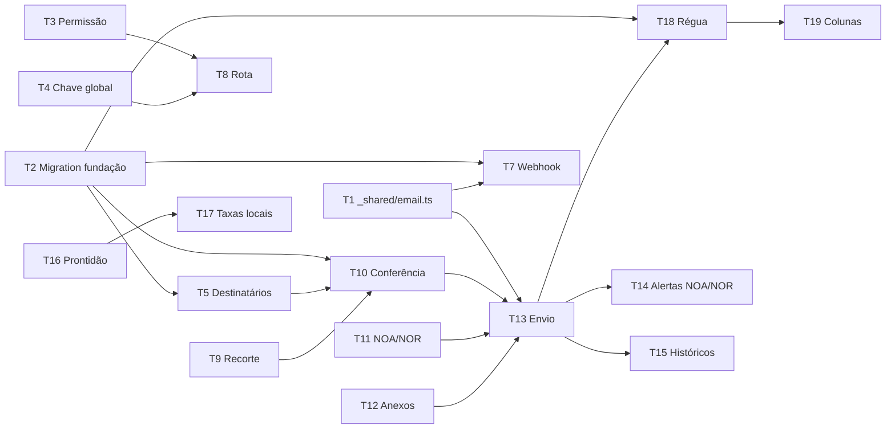

# 2026-08-27 — Comunicação por e-mail com clientes

Plano derivado da spec
[`../spec/2026-08-27-comunicacao-email-clientes-design.md`](../spec/2026-08-27-comunicacao-email-clientes-design.md)
(issue [#556](https://github.com/luccafwlog/transhippingdesk/issues/556)).
Decisões arquiteturais em
[ADR 0058](../adr/0058-canal-de-comunicado-ao-cliente.md) (canal próprio),
[ADR 0059](../adr/0059-chave-global-de-envio-desligada-por-padrao.md) (chave
global) e
[ADR 0060](../adr/0060-primeira-permissao-do-perfil-equipamentos.md)
(permissão). Termos em [`CONTEXT.md`](../../CONTEXT.md), seção "Comunicação com
o cliente".

A spec é a fonte das decisões **funcionais**; este plano decide **como e em que
ordem** implementá-las, e registra o que a leitura do código e a rodada de
perguntas ao produto obrigaram a corrigir nela.

## Problema

A agência envia NOA, NOR, avisos institucionais e cobranças de Demurrage
individualmente, fora do sistema. Não há canal de saída para o Email de Contato
do cliente: o único e-mail que o projeto envia a clientes é transacional do
Portal (convite, recuperação, alteração de e-mail), e a única tentativa de
comunicado — a Edge Function `notify-invoice-issued` — está morta desde sempre.

## Modelo alvo

| Entidade | Identidade | Onde nasce |
|---|---|---|
| **Comunicado** | linha própria, um Cliente, N B/Ls | Disparo manual ou Régua |
| **Tentativa de envio** | `(comunicado, destinatário)` | Cada e-mail efetivamente montado |
| **Chave de idempotência** | `(tipo, cliente, status, âncora, discriminador)` | Antes do envio |
| **Natureza do Comunicado** | um de quatro valores, obrigatório | Mapeada do `kind`, na migration |
| **Preferência de Recebimento** | `(contato, natureza)` | Cadastro do contato |
| **Chave de envio do canal** | linha única de configuração | Migration, `false` |

### Âncora, data e gatilho por comunicado

Fixado depois da rodada de perguntas ao produto — é o que mais mudou em relação
à spec original.

| Comunicado | Natureza | Âncora | Chave no banco | Data que comunica | Quando dispara |
|---|---|---|---|---|---|
| Aviso de Chegada (NOA) | Avisos operacionais | Escala | `(voyage_id, port)` — a Escala **não tem chave substituta** | **ETA** da Escala | **ETA − 5 dias** |
| Aviso de Atracação (NOR) | Avisos operacionais | Atracação | `voyage_escala_terminal_state.id` | **ATB** da Atracação | Dia da atracação, quando o ATB entra |
| Resumo de taxas locais | Documentação | Viagem | `voyages.id` | — | Manual, após a Prontidão |
| Cobrança de Demurrage | Demurrage | Fatura | `demurrage_invoices.id` | — | `first_billed_at`, depois a cada 5 dias |
| Institucional / livre | Avisos gerais | Disparo | id do próprio disparo | — | Manual |

Os dois avisos operacionais saem em **inglês**; todo o resto em **pt-BR**.

## Correções à spec

Oito pontos da spec não sobrevivem ao código, à definição operacional dos avisos
ou à rodada de produto que redefiniu as naturezas. As correções entram no mesmo change deste plano, como notas editoriais
na spec.

### C1 — A metade interna da `notify-invoice-issued` já tem substituto vivo

A spec afirma que apagar a função "silenciaria um aviso interno vivo" e exige
decidir o destino do `alerta_critico` antes da remoção. Ambas as premissas caem:

1. **A metade interna nunca rodou.** O `alerta_critico` está dentro da função,
   depois da autenticação do webhook
   (`supabase/functions/notify-invoice-issued/index.ts`). Sem Database Webhook e
   sem `RESEND_API_KEY` — verificado em produção em 2026-06-24 e registrado em
   `docs/RASTREABILIDADE.md` — o webhook nunca dispara e a metade interna nunca
   executa. É intenção dormente, não aviso vivo.
2. **A mesma condição já produz alerta.** `upsert_portal_invoice_exception()`
   (`supabase/migrations/325_clientes_portal_disputes_alerts.sql`, herdando a
   `189`) roda por trigger na emissão da fatura e grava
   `portal_excecao_critica_fatura` com a mensagem "Invoice emitida sem Portal
   ativo ou email de recuperação utilizável" — a condição idêntica, com ciclo de
   vida completo: fecha sozinha quando o gate passa, tem dispensa temporária e
   abre em `/manifestos/{bl}?tab=faturamento`.

**Decisão:** a `notify-invoice-issued` é apagada **inteira** na T17, e
`portal_excecao_critica_fatura` é registrado como o substituto que já existia
antes da spec. **Evidência: Código.**

A única perda real é de **roteamento**, não de visibilidade: a função morta
mirava `admin`, `administrativo` e `documentacao`, e o alerta tem
`audience_departments = ['documentacao']`. Todos os perfis internos continuam
**vendo** o alerta na fila (leitura interna é global — ADR 0044/0046). A T17
amplia a audiência para `['documentacao','administrativo']`.

### C2 — NOR é ancorado na Atracação, não na Escala

A decisão 6 da spec tem por título "Aviso de Chegada e Aviso de Atracação são
**por escala**", mas o glossário registra Aviso de Atracação como "sempre por
Atracação". O `CONTEXT.md` é inequívoco: a Escala é dona de ETA e ATA; a
Atracação é dona de ETB, ATB, ETD e ATD. Uma Escala com dois terminais tem
**duas** Atracações e dois ATBs — ancorar o NOR na Escala colapsaria os dois num
comunicado só.

**Decisão:** NOA ancora na Escala `(voyage_id, port)`; NOR ancora na Atracação
(`voyage_escala_terminal_state.id`).

### C3 — A Escala não tem chave substituta

A Escala não é tabela: é o par `(Viagem, porto)` projetado de
`voyages.pod_schedule_snapshot` (JSONB por porto, desde
`046_voyage_schedule_snapshot_trigger.sql`). Não há `escala_id` a referenciar.

**Consequência:** a âncora do NOA é a coluna par `(voyage_id, port)`, gravada
como valor — sem FK, pelo motivo que a T2 registra — e com o `port` validado por
CHECK de não-vazio. É a mesma identidade
que o `CONTEXT.md` atribui à Escala e que `voyage_escala_terminal_state` usa.
Nos alertas da T14 o par reusa o `entity_type = 'voyage_pod_schedule'` já
existente (migration `342`), sem inventar entidade nova. **Evidência: Código.**

### C4 — O NOA comunica o ETA, não o ATA, e sai antes da chegada

A spec e a primeira versão deste plano diziam "Chegada é ATA da Escala". Está
errado. Confirmado com o produto:

> NOA = Notice of Arrival, enviado **5 dias antes do ETA**, informando o ETA.
> NOR = Notice of Readiness, enviado **no dia da atracação**, informando data e
> hora da atracação.

O NOA é **antecipatório**. O ATA é a chegada consumada — quando ele existe, o
navio já chegou e o aviso perdeu a função. A variável do NOA é o **ETA da
Escala**, e o gatilho é uma contagem regressiva contra data futura, não uma
reação a dado que entrou. Só o NOR é reativo, ao ATB.

Isso troca a fonte de dados do template (`pod_schedule_snapshot[port].eta`, não
`.ata`) e é o que motiva os alertas da T14: sem eles, ninguém é avisado de que
faltam cinco dias para um ETA.

**ETA que muda depois do NOA enviado: o sistema não faz nada.** Decisão do
produto. O NOA informa o ETA vigente no disparo e encerra. O reenvio manual
continua possível pelo caminho de confirmação da T10 — que incrementa o
discriminador —, mas ninguém é cobrado a fazê-lo.

### C5 — NOA e NOR aceitam anexo

A decisão 5 da spec marca "Anexo: Não" para NOA e NOR, e a decisão 12 restringe
anexo ao institucional e ao livre. O produto decidiu o contrário para os dois
avisos operacionais.

**Isso não fere o invariante 6**, que proíbe anexo e PIX no **resumo de taxas
locais e na cobrança de Demurrage** — esses dois seguem sem anexo, sem PIX e sem
exceção. A restrição existe para manter esse par longe do padrão que golpes de
boleto imitam, e NOA e NOR não se parecem com boleto nenhum.

**Consequência:** os únicos comunicados que continuam proibidos de anexar são
aqueles dois. As decisões 5 e 12 da spec são corrigidas.

Isso também deixou de poder ser dito como "o financeiro": depois da C6, abaixo,
os dois modelos nem dividem mais natureza — um é `documentacao`, o outro é
`demurrage`. Por isso o invariante 6 foi reescrito para nomeá-los, em vez de
nomear o grupo.

### C6 — Quatro Naturezas, e elas não são as três categorias mais uma

Entrou depois da spec, na mesma rodada de produto: o cliente passa a escolher o
que recebe entre **quatro** naturezas — avisos gerais, avisos operacionais,
documentação e demurrage. A spec foi corrigida na decisão 2, e o corte **muda**,
não cresce: o resumo de taxas locais sai do `financeiro` para `documentacao`, e a
cobrança de Demurrage vira natureza própria. Duas categorias que dividiam a mesma
linha passam a ser desligáveis em separado.

O que isso obriga neste plano: T2 (enum, backfill de quatro linhas por contato,
mapeamento `kind`→natureza), T5 (resolução por natureza), T6 (quatro toggles) e
T13 (a guarda de que não se envia sem natureza). Bloco 3 só muda no mapeamento.

**O momento é este, e não depois.** A migration `361` ainda não existe; depois de
aplicada, a mesma mudança é migration de dados sobre uma tabela com uma linha por
contato por natureza, mais reescrita do serviço e da tela.

**A natureza é eixo separado do `kind`.** CE Mercante, disputa e devolução de
container — citados pelo produto — **não existem** entre os seis `kind` de hoje.
Com o mapeamento explícito, cada um deles entra depois como `kind` novo apontando
para natureza existente, sem recortar a tabela de preferências outra vez.

### C7 — O autoatendimento do cliente é issue própria

O mesmo pedido de produto queria que o **cliente** editasse seus contatos e
ditasse o que cada um recebe. Isso não entra aqui: inverte a decisão 2 da spec
(hoje a preferência é roteamento interno) e depende de três coisas que o código
não tem — a Conta de Portal é uma só por cliente
(`customer_portal_accounts.customer_id` é UNIQUE, migration `025`),
`customer_contacts` não tem unicidade (a `119` registra o bug que isso já
causou), e não há double opt-in. Virou a issue
[#609](https://github.com/luccafwlog/transhippingdesk/issues/609), com a decisão
já tomada de que o cliente nunca poderá zerar uma natureza operacional ou de
demurrage.

Deste plano, ela leva uma coisa só, e é por isso que a T2 a inclui: a coluna
`source` da preferência.


### C8 — A Prontidão não olhava o faturamento, e por isso não protegia nada

Apontado no review da PR #604, verificado no código. A Prontidão exigia CE
Mercante e `compute_bl_review_pendencies` vazio. Nenhum dos dois olha estado de
taxa ou de fatura: a `128` confere cliente vinculado, contato, acesso ao Portal
e peso BB em carga solta, e para aí.

Um B/L cuja taxa ainda não foi emitida passa nas duas condições. O resumo sai
sem ele, o cliente paga o que recebeu e acha que quitou a viagem — que é
exatamente o dano que a decisão 7 da spec diz eliminar "inteiramente".

**Decisão:** terceira condição, reusando a coluna que já existe —
`bls.financial_status` (`001_schema.sql`, domínio `pending`, `invoiced`, `paid`,
`cancelled`). O cliente só passa quando **todos** os B/Ls dele na viagem estão
em `invoiced` ou `paid`. `pending` bloqueia; `cancelled` sai do resumo e não
bloqueia. Não é join novo contra `invoices`: a coluna é mantida pelos gatilhos
de faturamento desde a `020`, e é o que as telas de faturamento já leem.
**Evidência: Código.**

A spec recebe a condição 3 na decisão 7, com nota editorial.

---

# Bloco 1 — Fundação

Sem tela e sem envio a cliente real. Ao fim do bloco o canal existe, está
desligado, e a mecânica de envio tem um dono só.

### T1 — Extrair `_shared/email.ts` de `portalEmail.ts`

`sendPortalEmail` (`supabase/functions/_shared/portalEmail.ts`) mistura três
coisas: a mecânica genérica (Resend, `Idempotency-Key`, retry com backoff
`[1000, 3000, 9000]`, classificação transitória/permanente por status HTTP) e
duas coisas específicas do Portal — grava em `portal_email_attempts` com
`account_id`/`invite_id`, e consulta `portal_suppressed_emails`.

Extrair para `_shared/email.ts` um `sendEmail()` que recebe a mecânica e delega
o resto por callbacks:

- `checkSuppression(to): Promise<{ suppressed: boolean; reason?: string }>`
- `recordAttempt(...)` / `updateAttempt(...)`
- remetente e `reply-to` como parâmetros, não lidos de env fixo dentro do módulo

`portalEmail.ts` passa a ser consumidor: mantém a assinatura
`sendPortalEmail(input)` intacta e implementa os callbacks contra as tabelas do
Portal, com `PORTAL_FROM_EMAIL` e `PORTAL_REPLY_TO`. **Nenhuma função do Portal
muda de comportamento.**

**Atenção — a supressão de hoje ignora o motivo.** A consulta atual é
`from('portal_suppressed_emails').select('id').eq('email', ...)`: qualquer linha
bloqueia, sem olhar `reason`. Para o Portal isso está certo e continua. O canal
de Comunicado precisa do contrário (só `bounce_permanente` é compartilhado — ADR
0058), e é por isso que a supressão sai como callback em vez de ficar embutida.
Embutir a regra do Portal no módulo compartilhado quebraria o invariante 7 de
forma silenciosa.

**Check:** teste do `sendEmail()` com um duplo falso de callbacks afirmando
(a) que o backoff só ocorre nos status transitórios `{429,500,502,503,504}`,
(b) que a colisão `23505` no `recordAttempt` retorna `ok` sem chamar a Resend, e
(c) que `checkSuppression` suprimindo aborta antes de gravar tentativa.

### T2 — Migration `361_comunicados_fundacao.sql`

Tabelas do canal:

- `customer_communications` — o Comunicado. `customer_id` NOT NULL,
  `kind` (`aviso_chegada`, `aviso_atracacao`, `resumo_taxas_locais`,
  `cobranca_demurrage`, `institucional`, `livre`), `nature` **NOT NULL**
  (`avisos_gerais`, `avisos_operacionais`, `documentacao`, `demurrage`),
  `anchor_voyage_id`,
  `anchor_port`, `anchor_atracacao_id`, `anchor_invoice_id`,
  `attempt_discriminator` INT NOT NULL DEFAULT 0, `status` (`enviado`,
  `simulado`, `falha`), `dispatch_id`, `created_by`, `created_at`.
- `customer_communication_bls` — o Vínculo do Comunicado, espelhando
  `invoice_bls`. PK composta `(communication_id, bl_id)`.
- `customer_communication_attempts` — a trilha, no molde de
  `portal_email_attempts`: `recipient_masked`, `status`, `retry_count`,
  `provider_message_id`, `last_error`, `idempotency_key`.
- `customer_communication_suppressions` — supressão **do canal**, só para
  `complaint`. `bounce_permanente` **não** entra aqui: é lido e escrito em
  `portal_suppressed_emails`, compartilhado (ADR 0058). A caixa não existir é
  fato da caixa, não opinião de canal.
- `customer_contact_preferences` — `(contact_id, nature)` com `enabled` BOOLEAN
  NOT NULL DEFAULT true e `source` (`interno`, `cliente`) NOT NULL DEFAULT
  `'interno'`. O `source` não tem consumidor neste plano: existe para a issue
  [#609](https://github.com/luccafwlog/transhippingdesk/issues/609), que passa a
  escolha ao cliente e precisa distinguir as duas mãos. Acrescentá-lo agora custa
  uma coluna; acrescentá-lo depois obriga a inventar a procedência das linhas que
  já existirem.
- `app_settings` — a primeira tabela de configuração global do projeto. Linha
  única (`CHECK (id = 1)`), com `communications_enabled BOOLEAN NOT NULL DEFAULT
  false`, `demurrage_dunning_interval_days INT NOT NULL DEFAULT 5` e
  `demurrage_dunning_max_sends INT NOT NULL DEFAULT 6`.

Regras que a migration carrega:

- **Índice único da idempotência:** `UNIQUE (kind, customer_id, status,
  anchor_voyage_id, anchor_port, anchor_atracacao_id, anchor_invoice_id,
  dispatch_id, attempt_discriminator)` com `NULLS NOT DISTINCT`. Sem o `NULLS
  NOT DISTINCT` o Postgres trata cada NULL de âncora como distinto e a chave não
  protege nada — o mesmo defeito que a migration `341` corrigiu com índice
  parcial. **É onde o duplo clique morre.**

  Três colunas da lista estão lá por motivo próprio, e cada uma quebra a chave
  de um jeito diferente se sair:

  - **`dispatch_id`** — institucional e livre não têm âncora: as quatro colunas
    de âncora são NULL e, com `NULLS NOT DISTINCT`, todo comunicado
    institucional de um cliente degeneraria na mesma chave
    `(kind, customer_id, status, 0)`. O segundo comunicado institucional do ano
    seria rejeitado como se fosse duplo clique do primeiro. O disparo **é** a
    âncora desses dois tipos — é o que a tabela de âncoras acima já registra —, e
    por isso a coluna entra no índice; nos tipos ancorados ela é NULL e não muda
    nada.
  - **`status`** — o Bloco 2 inteiro roda com a chave global desligada,
    gravando `simulado` (T13). Sem `status` no índice, cada ensaio queima em
    definitivo a chave do comunicado real: o NOA de verdade, disparado depois de
    alguém ligar a chave, colidiria com o ensaio da véspera sobre a mesma escala
    e nunca sairia — e o operador veria "já enviado" sobre um envio que nunca
    ocorreu. Com `status` no índice, ensaio e envio ocupam chaves distintas, o
    duplo clique continua morrendo (dois `simulado` colidem entre si, dois
    `enviado` também) e uma `falha` não trava a retentativa.
  - **`attempt_discriminator`** — o reenvio confirmado (T10) e a enésima
    cobrança da Régua (T18).
- **Mapeamento `kind` → `nature`, no banco.** Uma tabela de domínio
  `customer_communication_kinds (kind PK, nature NOT NULL)`, semeada com as seis
  linhas da tabela de âncoras deste plano, e `customer_communications` referencia
  o par: FK composta `(kind, nature)` contra ela. Assim um comunicado não pode
  nascer com natureza que não é a do seu modelo, e acrescentar CE Mercante ou
  devolução de container depois é uma linha de `INSERT`, não uma alteração de
  CHECK em duas tabelas. O `livre` é o único cuja natureza é escolhida no
  disparo, então ele entra com uma linha por natureza possível.
- **Âncora é valor registrado, não referência.** As quatro colunas de âncora
  ficam **sem FK**, no mesmo padrão do `entity_id` dos alertas (migration
  `342`). Não é omissão: `save_voyage_escala_terminal_state` (migration `306`)
  **apaga** a linha de `voyage_escala_terminal_state` a cada edição de
  terminais, e `src/services/voyages.ts` apaga viagens. Uma FK com `ON DELETE
  CASCADE` — o que sai quando ninguém escreve a cláusula e alguém copia a tabela
  vizinha — apagaria comunicados já enviados junto com a atracação editada,
  quebrando o invariante 9; `ON DELETE RESTRICT` faria o oposto, travando a
  edição de atracação e a exclusão de viagem por causa de um comunicado de um
  ano atrás. Nenhuma das duas é aceitável, e é por isso que a coluna não é FK. Só
  `customer_id` mantém a sua.
- **Denormalizar o que o histórico lê:** navio, número da viagem, porto e
  terminal são gravados em colunas próprias do Comunicado no momento do disparo.
  Sem FK não há join que sobreviva à exclusão da origem, e o histórico precisa
  continuar legível: ele é o registro do que foi dito ao cliente, não uma
  projeção do estado atual.
- **Backfill das preferências:** toda linha de `customer_contacts` existente
  ganha as **quatro** naturezas ligadas com `source='interno'`, e um trigger
  `AFTER INSERT` faz o mesmo para contatos novos (spec, decisão 2).
- **RLS:** leitura pelos perfis internos ativos via `is_active_read_user()`;
  escrita de comunicado só por `service_role`. A escrita de
  `app_settings.communications_enabled` é restrita a `administrativo` — guarda
  **de servidor**, não de tela (ADR 0059).
- Regenerar `src/types/database.ts` (arquivo protegido — ver
  `.claude/hooks/protect-files.sh`).

Sem backfill de comunicados: o canal nasce vazio.

**Check:** teste de contrato SQL `comunicadosFundacaoMigration.test.ts` afirmando
o `NULLS NOT DISTINCT` no índice único, a presença de `status` e `dispatch_id`
na lista de colunas dele, que nenhuma coluna de âncora tem FK, o default `false`
de `communications_enabled`, o `6` de `demurrage_dunning_max_sends`, o
`CHECK (id = 1)` de `app_settings`, e que a policy de escrita de
`communications_enabled` nomeia `administrativo`. Sobre a natureza: que `nature`
é NOT NULL, que as quatro linhas de preferência nascem por contato, que o
mapeamento tem as seis linhas de `kind`, e que inserir comunicado com natureza
divergente da do seu `kind` é **rejeitado** pela FK composta.

### T3 — Permissão `customer_communications`

Em `src/hooks/useAuth.tsx`: acrescentar à união `Permission` e conceder a
`administrativo`, `documentacao` e `equipamentos`.

**Separar os `case`.** Hoje o `switch` tem literalmente:

```ts
case 'operacoes':
case 'equipamentos': return false
```

Trocar o `return false` no lugar concede a permissão a `operacoes` junto, em
silêncio. A edição correta mantém `case 'operacoes': return false` como ramo
próprio e dá a `equipamentos` um ramo separado. Ver ADR 0060, Consequências.

**Check:** matriz em `src/hooks/__tests__/roleHasPermission.test.ts` cobrindo os
sete papéis contra a nova permissão, com asserção **explícita** de que
`operacoes` continua sem ela.

### T4 — Chave global: leitura, escrita e auditoria

- Serviço `src/services/appSettings.ts` + hook React Query no padrão de
  `src/services/queryKeys.ts`, lendo a linha única.
- Escrita por RPC `set_communications_enabled(p_enabled BOOLEAN)`, `SECURITY
  DEFINER`, que verifica `administrativo` **no servidor** e grava em
  `audit_logs`. A ausência do botão na tela não é a guarda.

**Check:** teste de contrato SQL afirmando que a RPC rejeita `documentacao` e
`equipamentos` e que grava `audit_logs`.

### T5 — Resolução de destinatários (serviço puro)

`src/services/customerCommunications.ts`, sem I/O na parte decidível: dado um
conjunto de contatos, a **natureza**, as supressões e as preferências, devolver
**elegíveis** e **excluídos com motivo** (`preferencia_desligada`,
`email_ausente`, `suprimido_complaint`, `suprimido_bounce`), e marcar o cliente
como **bloqueado** quando não sobra nenhum contato.

Cliente sem contato elegível **nunca some da lista** — vira linha bloqueada com
motivo (invariante 5).

**Check:** teste de tabela cobrindo os quatro motivos de exclusão, o cliente
bloqueado por exclusão total, e a assimetria da supressão — `complaint` do canal
não bloqueia o Portal, `bounce_permanente` bloqueia os dois (invariante 7).
Somado a isso, que desligar `demurrage` num contato **não** o exclui de um
comunicado de `documentacao`: é o corte novo da C6, e era a mesma categoria
antes.

### T6 — Preferência de Recebimento na Ficha do Cliente

**Quatro** toggles por contato na aba Cadastro & Contatos
(`src/components/clientes/CadastroContatosTab.tsx`), no padrão de mutação de
`react-query-pattern`. Não tocar em `purpose` — campo populado pelos
importadores e lido como `'faturamento'` no perfil do Portal (spec, decisão 2).

A escrita da tela interna grava `source='interno'`. Nada nesta task lê o
`source`; ele só passa a ter dois valores na
[#609](https://github.com/luccafwlog/transhippingdesk/issues/609).

**Check:** teste de comportamento — desligar Demurrage num contato não altera
`purpose`, não altera as outras três naturezas, e **não** desliga Documentação,
que era a mesma categoria antes da C6.

### T7 — Bounce e complaint do canal no `portal-email-webhook`

**Furo encontrado ao ler o código, não previsto na spec.** O webhook
(`supabase/functions/portal-email-webhook/index.ts`) resolve o evento assim:

```ts
const { data: attempt } = await admin.from('portal_email_attempts')
  .select('id').eq('provider_message_id', event.data.email_id ?? '').maybeSingle()
if (!attempt) return new Response(null, { status: 200 })
```

Um bounce de **Comunicado** não tem linha em `portal_email_attempts` — a
tentativa está em `customer_communication_attempts`. O webhook não acha, devolve
`200` e o evento **é descartado em silêncio**: nenhuma supressão gravada,
nenhum status atualizado, nenhum alerta.

Isso quebraria o invariante 7 pela metade: bounce do Portal suprimiria os dois
canais, e bounce do Comunicado não suprimiria nada. O canal insistiria para
sempre numa caixa inexistente, a partir do mesmo remetente `portal@` — o dano
exato que a ADR 0058 usa para justificar compartilhar o `bounce_permanente`.

Estender o webhook para procurar nas duas trilhas: não achando em
`portal_email_attempts`, procurar em `customer_communication_attempts`. Achando
lá, atualizar o status, e então:

- `bounce` permanente → `portal_suppressed_emails` (compartilhado, ADR 0058);
- `complaint` → `customer_communication_suppressions` (só o canal).

**Corrigir junto o `ignoreDuplicates` da supressão compartilhada.** A linha 27
do webhook grava hoje com `{ onConflict: 'email', ignoreDuplicates: true }`, e
`portal_suppressed_emails.email` é UNIQUE (migration `178`). Um endereço já
suprimido como `complaint` — do Portal ou, depois desta task, do canal — **nunca
escala** para `bounce_permanente`: o upsert encontra a linha e descarta o evento.
A caixa deixou de existir, a tabela continua dizendo "reclamou", e todo consumidor
que distingue os dois motivos (a T5 distingue, por causa do invariante 7) segue
mandando e-mail para uma caixa morta a partir do remetente compartilhado — que é
o dano exato que a ADR 0058 quer evitar.

O `bounce_permanente` passa a **sobrescrever** o motivo: upsert sem
`ignoreDuplicates`, gravando `reason = 'bounce_permanente'` e renovando
`suppressed_at`. A escalada é de mão única — um `complaint` posterior **não**
rebaixa uma linha já em `bounce_permanente`, porque o fato da caixa não deixa de
valer por causa de uma reclamação. É correção no ponto compartilhado, não uma
guarda por chamador.

A dedup por `provider_event_id` em `portal_email_events` já é genérica e serve
aos dois. A `attempt_id` daquela tabela referencia `portal_email_attempts` e **já
é nulável** (migration `178`), então não falta nulidade: falta **para onde
apontar** o evento de Comunicado. A migration `361` acrescenta
`communication_attempt_id BIGINT` a `portal_email_events`, sem FK — mesma regra
de âncora da T2 —, e um CHECK de que no máximo uma das duas colunas está
preenchida. Nenhuma migration nova entra por causa disto.

**Check:** teste afirmando que um `email.bounced` permanente de uma tentativa de
Comunicado grava em `portal_suppressed_emails`, que um `email.complained` do
mesmo grava só em `customer_communication_suppressions`, que um evento sem
tentativa em nenhuma das duas continua devolvendo `200` sem efeito, e que um
endereço já em `complaint` passa a `bounce_permanente` ao receber o bounce — e
não volta a `complaint` depois disso.

**Encerra o Bloco 1.** PR própria.

---

# Bloco 2 — Disparo manual

Primeira etapa com tela. A chave global continua desligada: todo disparo deste
bloco é registrado como **simulado** até alguém de Administrativo ligar.

### T8 — Rota e casca do módulo

`/clientes/comunicacao`, atrás de `customer_communications`, registrada em
`src/App.tsx` (lista de preload e `<Route>`), `src/lib/pageTitle.ts` e no
cabeçalho de Clientes, ao lado de `/clientes/portal`.

**Faixa permanente** enquanto a chave estiver desligada, dizendo que os disparos
serão registrados como simulados (ADR 0059). Não é banner dispensável.

**Check:** `AdminRoutingFailures.test.tsx` — perfil sem a permissão não alcança a
rota; teste de render afirmando a faixa com a chave desligada.

### T9 — Recorte de Destinatários

Filtros combinados em **E**: navio, viagem, escala, POD, POL, CNPJ. Todos
existem em `bls` (`voyage_id`, `pod`, `pol`, `customer_id`) — nenhuma coluna
nova. CNPJ **restringe**, nunca adiciona.

**O modo carga exige ao menos um filtro de carga.** CNPJ sozinho não serve.
Filtro vazio devolve conferência **vazia com motivo**, nunca a base inteira
(invariante 3).

Modo institucional é separado e explícito, sobre o conjunto **Cliente
Comunicável**: ao menos um contato com e-mail **e** ao menos um B/L cuja Escala
tenha **ETA a partir de doze meses atrás** — `eta >= now() - interval '12
months'`, **sem teto superior**. A janela é medida pelo ETA da Escala do B/L
(`pod_schedule_snapshot`), não por `created_at` nem por `bl_emission_date` —
mede quando houve operação, não quando alguém digitou. O limite é só para trás:
escrever "ETA nos últimos 12 meses" com `eta <= now()` excluiria justamente o
B/L já cadastrado para viagem futura, e é esse B/L que mais claramente diz que o
cliente está ativo.

**Check:** teste afirmando que recorte sem filtro de carga devolve vazio com
motivo — e **não** todos os B/Ls (invariante 3); e que o Cliente Comunicável
inclui um cliente com viagem futura e exclui um cuja última viagem passou de 12
meses.

### T10 — Conferência

Contagem de clientes e e-mails; por cliente, contatos que recebem e contatos
excluídos com motivo; clientes bloqueados com razão; prévia renderizada de um
destinatário real; desmarcar individual.

Aviso de reenvio (camada 1 da decisão 10): "este cliente já recebeu Aviso de
Chegada para esta escala em 27/08 às 14h". **No disparo manual**, confirmar o
reenvio é o único caminho que incrementa `attempt_discriminator`. Duplo clique e
disparo concorrente não confirmam nada, mantêm o discriminador e colidem no
índice único da T2 — comportamento desejado.

A Régua da T18 é o outro produtor do discriminador, e não passa por aqui: lá ele
é o **número da cobrança na régua**, atribuído pelo cron, como a tabela da
decisão 10 da spec já separa. São duas contagens distintas na mesma coluna, cada
uma no seu tipo de comunicado — nenhum comunicado da Régua nasce de confirmação
de operador, e nenhum reenvio manual anda a régua.

**Check:** teste de comportamento — sem conferência não há botão de envio
(invariante 2); confirmar reenvio incrementa o discriminador no disparo manual, e
um segundo disparo sem confirmação não incrementa.

### T11 — Modelos NOA e NOR

Em `supabase/functions/_shared/`, no padrão de `portalEmailTemplates.ts`: fixos
no código, versionados em PR, renderizados **por cliente** com navio, viagem,
escala, datas e os B/Ls do próprio destinatário.

- **NOA** lê o **ETA** da Escala (`pod_schedule_snapshot[port].eta`) — não o
  ATA (C4).
- **NOR** lê o **ATB** da Atracação (`voyage_escala_terminal_state.terminal_atb`).
- Os dois saem em **inglês**; todo o resto do canal em pt-BR.

**O texto final vem do produto.** Esta task entrega a estrutura, as variáveis, a
renderização por cliente e os testes; a redação entra quando o produto mandar o
material. Fazer o inverso — inventar a redação de documentos com peso
quase-contratual e depois trocar — é o caminho para um NOA em produção com voz
que a agência não pratica. **Esta é a última task do Bloco 2 a fechar.**

**Check:** teste de template — NOA de uma viagem com dois portos não vaza o
outro porto; NOR de uma escala com dois terminais gera dois comunicados
distintos, não um; NOA renderiza o ETA e **não** referencia ATA.

### T12 — Anexos

Bucket privado `customer-communications` no molde de `demurrage-disputes`
(migration `325`): `application/pdf`, `image/jpeg`, `image/png`, `text/plain`,
10 MB, **até 3 arquivos somando 10 MB**. Anexo vai como bytes na mensagem — o
destinatário não está autenticado e não abriria bucket privado — e é persistido
para o histórico.

**Aceitam anexo:** institucional, livre, **NOA e NOR** (C5). **Não aceitam:**
resumo de taxas locais e cobrança de Demurrage — esses dois nunca levam anexo nem
PIX (invariante 6), e essa é a única proibição que sobra. A validação é pelo
`kind`, **não** pela natureza: `documentacao` e `demurrage` continuam aceitando
anexo em qualquer outro modelo que venha a existir nelas.

Editor livre; institucional salvável como modelo reutilizável. Migration
`362_comunicados_anexos.sql` para bucket, policies e a tabela de modelos salvos.

**Check:** teste de contrato SQL das policies do bucket; teste de validação
rejeitando o 4º arquivo e a soma acima de 10 MB; teste afirmando que um resumo de
taxas locais e uma cobrança de Demurrage com anexo são **rejeitados**, e que a
recusa é pelo `kind` — um comunicado de mesma natureza e outro `kind` passa.

### T13 — Envio e Edge Function `send-customer-communication`

Consumidora do `_shared/email.ts` da T1, com os callbacks do canal:
`checkSuppression` lendo `bounce_permanente` de `portal_suppressed_emails`
**e** `complaint` de `customer_communication_suppressions`; `recordAttempt`
gravando em `customer_communication_attempts`.

Remetente `portal@` (identidade compartilhada, ADR 0058) e **`reply-to` próprio
do canal**, em `COMMUNICATIONS_REPLY_TO` — variável nova, distinta do
`PORTAL_REPLY_TO`. Resposta a um NOA é conversa operacional ("o navio atrasou?",
"meu B/L está nessa escala?"); cair no suporte do Portal, que trata acesso e
senha, atrasa o cliente e polui a caixa errada. Documentar a variável em
`docs/setup/deploy.md`.

**Um e-mail por cliente, sempre** — nunca dois clientes no mesmo `to:`
(invariante 1), inclusive no institucional. Com a chave desligada, grava
`status='simulado'` e **não** chama a Resend (invariante 4).

**Comunicado sem natureza não é montado** (invariante 10). A guarda é da Edge
Function, não da tela: a natureza decide quem recebe, e um comunicado que
chegasse aqui sem ela sairia para a lista errada de contatos ou para nenhuma. No
banco a coluna já é NOT NULL — esta é a metade que devolve erro legível em vez de
violação de constraint.

**Check:** teste afirmando que `communications_enabled=false` produz linha
`simulado` sem chamada à Resend, que o Portal continua enviando na mesma condição
(as duas metades do invariante 4), e que disparo sem natureza é recusado antes de
montar a mensagem.

### T14 — Alertas de NOA e NOR pendentes

Sem isto o módulo só funciona se alguém lembrar — e o NOA esquecido é a falha
que a issue #556 quer eliminar. O NOA em especial é uma contagem regressiva
contra data futura: ninguém "vê" que faltam cinco dias (C4).

Dois tipos novos no catálogo, no padrão da migration `342` e de
`src/services/alertRulesCatalog.ts`, reusando as entidades que já existem:

| Tipo | Entidade | Abre quando | Fecha quando |
|---|---|---|---|
| `comunicado_noa_pendente` | `voyage_pod_schedule` | `ETA − 5 dias ≤ agora < ETA` e nenhum NOA `enviado` para a Escala | NOA `enviado`, ETA ultrapassado, ou escala omitida/apagada |
| `comunicado_nor_pendente` | `voyage_escala_terminal` | ATB informado **nos últimos 30 dias** e nenhum NOR `enviado` para a Atracação | NOR `enviado`, ou atracação apagada |

**A janela do NOA tem os dois lados, e é isso que impede a enxurrada.** "`ETA −
5 dias` alcançado", sozinho, é verdade para **toda** escala já ocorrida no
histórico: a migration `363` abriria, no primeiro run do produtor, um alerta por
escala de todo o passado — nenhum deles fechável, porque o NOA de uma viagem de
2024 não vai mais ser enviado. O alerta só existe enquanto o disparo ainda faz
sentido, e por isso fecha **pela origem** quando o ETA passa: o navio chegou, e o
aviso antecipatório perdeu a função (C4). O mesmo limite de 30 dias sobre o ATB
guarda o `comunicado_nor_pendente` da mesma enxurrada.

**Só comunicado `enviado` fecha; `simulado` não fecha.** Todo o Bloco 2 roda com
a chave global desligada (T13), e a T14 entra depois — um ensaio silenciar o
lembrete de um NOA que nunca saiu inverteria o propósito do alerta e daria por
resolvido justamente o esquecimento que a issue #556 quer eliminar. Pela mesma
razão, comunicado `simulado` também não conta na condição de abertura: para o
alerta, ensaio não é envio.

`responsible: 'documentacao'`, severidade `normal`, destino
`/clientes/comunicacao`. Fechamento **pela origem**, como manda a ADR 0053 —
não há fechamento manual —, com dispensa temporária no padrão do catálogo.
Migration `363_comunicado_alertas.sql`, com o produtor no runner unificado
(`332_unified_alerts_runner.sql`).

Escala **omitida** não gera NOA pendente: o navio não atraca lá. A migration
`342` já trata omissão e apagamento por `audit_logs` — reusar o mesmo filtro,
não reimplementar.

**Check:** teste de contrato SQL — escala com ETA a 6 dias não abre alerta e a 5
dias abre; escala com ETA no passado não abre, e o alerta aberto fecha quando o
ETA passa; escala omitida nunca abre; NOA `enviado` fecha o alerta pela origem e
um NOA `simulado` **não** fecha nem impede a abertura; atracação com ATB e sem
NOR abre, e o NOR fecha.

### T15 — Superfícies de histórico

Comunicado no Histórico do B/L (`src/components/bl/BlHistoricoTab.tsx`, via
Vínculo), na aba Histórico da Ficha (`src/components/clientes/HistoricoTab.tsx`)
e no histórico de disparos da própria tela. Comunicado simulado aparece
**marcado** — qualquer leitura precisa distinguir enviado de simulado (ADR 0059).

Comunicado é evento de **Histórico**, não de Auditoria: não tem justificativa.

**Check:** teste afirmando que um comunicado com vínculo aparece no histórico de
todos os B/Ls vinculados (invariante 9), e que o simulado aparece com a marca.

**Encerra o Bloco 2.** PR própria.

---

# Bloco 3 — Financeiro

### T16 — Prontidão de Comunicação de Taxas

RPC `customer_local_charges_communication_readiness(p_voyage_id, p_customer_id)`,
`SECURITY DEFINER`, com `EXECUTE` para `service_role` **e `authenticated`**. Um
cliente passa quando,
para **todos** os B/Ls dele naquela viagem: `bls.ce_mercante` preenchido,
`compute_bl_review_pendencies(customer_id, cargo_mode, bb_weight_ton)` vazio
**e** `bls.financial_status` em `invoiced` ou `paid` — o faturamento concluído
(C8). B/L `cancelled` fica fora do resumo e não entra na conta.

Usar a assinatura de três argumentos (viva desde a migration `337`). A variante
`(p_bl_id TEXT)` da `128` existe mas está sem `GRANT` desde a `129` — não usar.

**O `GRANT` a `authenticated` não é frouxidão: é o que faz a T10 e a T19
funcionarem.** As duas leem a Prontidão do **navegador** — a conferência precisa
mostrar o cliente bloqueado com motivo, e a coluna de estado precisa do mesmo
motivo em `/demurrage` e `/taxas-locais`. E as duas variantes de
`compute_bl_review_pendencies` estão revogadas de `authenticated` (migrations
`129`, `188` e `337`): sem `GRANT` na RPC nova, toda chamada de tela devolveria
`42501`. É justamente para isso que ela é `SECURITY DEFINER` — a função é dona
do acesso à `compute_bl_review_pendencies`, que continua fechada, e expõe só o
veredito.

A guarda é **dentro** da função, no servidor: primeira linha valida perfil
interno ativo por `is_active_read_user()` e sai com `42501` se não for. A RPC não
recebe nem devolve nada de outro cliente — o `p_customer_id` já delimita a
resposta.

O gate é **por cliente**: quem não passa fica bloqueado e visível com o motivo, e
os demais clientes da viagem **não são segurados** por ele. Não fundir com o gate
de revisão: a `128` afirma explicitamente que CE Mercante *não* bloqueia a
revisão, e esta exigência é própria da comunicação.

**Check:** teste de contrato SQL — cliente com um B/L sem CE Mercante é
bloqueado com motivo; um segundo cliente da mesma viagem passa mesmo assim; a
RPC tem `EXECUTE` para `authenticated`; e a chamada por usuário sem perfil
interno ativo é rejeitada com `42501`. Sobre a C8: cliente com um B/L em
`financial_status = 'pending'` é bloqueado mesmo com CE Mercante e revisão
limpas, e um B/L `cancelled` **não** bloqueia.

### T17 — Resumo de taxas locais e remoção da `notify-invoice-issued`

Modelo fixo, em pt-BR: B/Ls com valor por B/L, total em BRL, link para o Portal.
**Sem vencimento** (ADR 0055 / migration `348` removeram `invoices.due_date` e o
status `overdue`), **sem PIX e sem anexo** (invariante 6).

Remoção da `notify-invoice-issued`, conforme C1:

- Apagar `supabase/functions/notify-invoice-issued/index.ts` e sua entrada em
  `supabase/config.toml`.
- Migration `364_alerta_excecao_fatura_audiencia.sql`: `audience_departments` de
  `portal_excecao_critica_fatura` passa a `ARRAY['documentacao','administrativo']`,
  com o espelho em `src/services/alertRulesCatalog.ts`.
- Atualizar `docs/RASTREABILIDADE.md` e `docs/ARCHITECTURE.md`: a linha da função
  sai e o substituto é nomeado.
- Remover `invoiceIssuedTemplate` e `invoiceCriticalPendencyTemplate` de
  `_shared/portalEmailTemplates.ts` **se** nenhum outro consumidor restar —
  conferir antes de apagar.

**Check:** o teste de contrato do catálogo de alertas afirma a audiência nova;
grep de repositório afirmando que nenhuma referência a `notify-invoice-issued`
sobrou fora do arquivo histórico de ADRs.

### T18 — Cobrança de Demurrage e Régua

Modelo em pt-BR: `total_usd` como valor da cobrança, BRL informativo com `roe` e
data de referência explícitos, mais a frase de que o valor em reais é
recalculado no dia do pagamento. Link para o Portal, sem PIX e sem anexo.

Régua, em cron no padrão dos detectores de alerta:

- Dispara em `demurrage_invoices.first_billed_at` — **não** `billed_at`, que
  muda a cada refaturamento por recálculo de PTAX e reenviaria cobrança como se
  fosse nova.
- Repete no intervalo de `app_settings.demurrage_dunning_interval_days` (5)
  enquanto `paid_at IS NULL`.
- `dispute_open = true` **pausa**; o fechamento retoma (invariante 8).
- Atingido `demurrage_dunning_max_sends` (6), para e vira pendência interna. Com
  os valores de fábrica isso são **25 dias**, não trinta: a 1ª cobrança sai no
  `first_billed_at` e só as cinco seguintes pagam o intervalo de 5 dias, então a
  6ª cai no 25º dia. Quem for exibir o prazo na tela calcula
  `(max_sends − 1) × interval_days`, nunca `max_sends × interval_days`.
- Discriminador = número da cobrança na régua, atribuído pelo cron. É o que faz
  a 2ª cobrança não colidir com a 1ª no índice único da T2 sobre a mesma fatura.
  É o segundo produtor da coluna, ao lado da confirmação de reenvio da T10, e
  nenhum dos dois anda a contagem do outro.

**Check:** teste do avanço da régua — fatura com disputa aberta não avança;
disputa fechada retoma no número seguinte; atingido o teto não há 7º envio; a 6ª
cobrança cai no 25º dia com os valores de fábrica; e a 2ª cobrança da mesma
fatura **não** colide com a 1ª.

### T19 — Colunas de estado

Em `src/pages/Demurrage.tsx`: ponto da régua e próxima data ("3ª cobrança,
próxima em 02/09"), ou o motivo da pausa. Em `src/pages/TaxasLocais.tsx`: data do
envio e link para o comunicado. Em ambas: o **motivo do bloqueio** quando o
cliente não passou na Prontidão da T16 — a informação não pode se perder entre
duas telas.

**Check:** teste de render afirmando o motivo do bloqueio na coluna, não só um
traço.

### T20 — Encerramento

- `git mv docs/plans/2026-08-27-comunicacao-email-clientes.md docs/archive/plans/`
- `git mv docs/spec/2026-08-27-comunicacao-email-clientes-design.md docs/archive/specs/`
- Remover as linhas de `docs/plans/README.md` e `docs/spec/README.md`.
- Registrar a entrega em `docs/CHANGELOG.md`.
- `npm run docs:check`.

**Encerra o Bloco 3.** PR própria.

---

## Ordem e o que trava o quê



Duas peças concentram o risco:

- **O índice único da T2** faz a idempotência funcionar (duplo clique), o
  reenvio legítimo continuar possível (discriminador) e a Régua sobreviver ao 2º
  envio. Errar o `NULLS NOT DISTINCT` produz um sistema que parece funcionar e
  não protege nada.
- **O webhook da T7** é a única coisa que impede o canal de insistir para sempre
  numa caixa inexistente. Sem ele o invariante 7 vale só metade, e a metade que
  falta é a que degrada a reputação do remetente compartilhado.

## Pendências externas ao código

| Pendência | Trava | Quando |
|---|---|---|
| Texto do NOA e do NOR, em inglês | T11 | Produto envia; T11 é a última task do Bloco 2 a fechar |
| `COMMUNICATIONS_REPLY_TO` provisionada | T13 em envio real | Antes de ligar a chave, não antes do merge |
| Decisão de ligar a chave global | — | Depois de ver a tela rodando em modo simulado |

Nenhuma delas bloqueia o Bloco 1.

## Verificação por PR

`npm run docs:check`, `npm run lint`, `npm test` e `npm run build`. O
`docs:check` é obrigatório em toda PR deste plano: as três acrescentam rotas,
migrations ou ADRs citadas.

## Estado

| Bloco | Status |
|---|---|
| 1 — Fundação (T1–T7) | TODO |
| 2 — Disparo manual (T8–T15) | TODO |
| 3 — Financeiro (T16–T20) | TODO |
