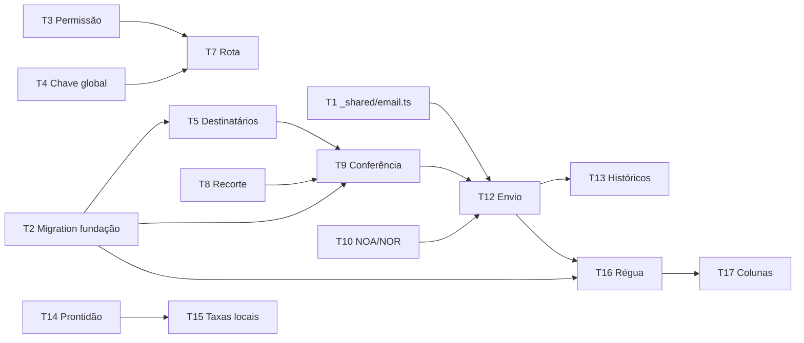

# 2026-08-27 — Comunicação por e-mail com clientes

Plano derivado da spec
[`../spec/2026-08-27-comunicacao-email-clientes-design.md`](../spec/2026-08-27-comunicacao-email-clientes-design.md)
(issue [#556](https://github.com/luccafwlog/transhippingdesk/issues/556)).
Decisões arquiteturais em
[ADR 0056](../adr/0056-canal-de-comunicado-ao-cliente.md) (canal próprio),
[ADR 0057](../adr/0057-chave-global-de-envio-desligada-por-padrao.md) (chave
global) e
[ADR 0058](../adr/0058-primeira-permissao-do-perfil-equipamentos.md)
(permissão). Termos em [`CONTEXT.md`](../../CONTEXT.md), seção "Comunicação com
o cliente".

A spec é a fonte das decisões **funcionais**; este plano decide **como e em que
ordem** implementá-las, e registra o que a leitura do código obrigou a corrigir
na spec.

## Problema

A agência envia NOA, NOR, avisos institucionais e cobranças de Demurrage
individualmente, fora do sistema. Não há canal de saída para o Email de Contato
do cliente: o único e-mail que o projeto envia a clientes é transacional do
Portal (convite, recuperação, alteração de e-mail), e a única tentativa de
comunicado — a Edge Function `notify-invoice-issued` — está morta desde sempre.

## Modelo alvo

| Entidade | Identidade | Onde nasce |
|---|---|---|
| **Comunicado** | linha própria, um Cliente, N B/Ls | Disparo manual ou Régua |
| **Tentativa de envio** | `(comunicado, destinatário)` | Cada e-mail efetivamente montado |
| **Chave de idempotência** | `(tipo, cliente, âncora, discriminador)` | Antes do envio |
| **Preferência de Recebimento** | `(contato, categoria)` | Cadastro do contato |
| **Chave de envio do canal** | linha única de configuração | Migration, `false` |

Âncora por tipo de comunicado — este é o ponto que a leitura do schema obrigou a
fixar antes de qualquer código:

| Comunicado | Âncora | Chave real no banco |
|---|---|---|
| Aviso de Chegada (NOA) | Escala | `(voyage_id, port)` — a Escala **não tem chave substituta** |
| Aviso de Atracação (NOR) | Atracação | `voyage_escala_terminal_state.id` |
| Resumo de taxas locais | Viagem | `voyages.id` |
| Cobrança de Demurrage | Fatura | `demurrage_invoices.id` |
| Institucional / livre | Disparo | id do próprio disparo |

## Correções à spec exigidas pela leitura do código

Três pontos da spec não sobrevivem ao código como estão. As correções entram no
mesmo change deste plano.

### C1 — A metade interna da `notify-invoice-issued` já tem substituto vivo

A spec afirma que apagar a função "silenciaria um aviso interno vivo" e exige
decidir o destino do `alerta_critico` antes da remoção. Ambas as premissas caem:

1. **A metade interna nunca rodou.** O `alerta_critico` está dentro da função,
   depois da autenticação do webhook
   (`supabase/functions/notify-invoice-issued/index.ts`). Sem Database Webhook e
   sem `RESEND_API_KEY` — verificado em produção em 2026-06-24 e registrado em
   `docs/RASTREABILIDADE.md` — o webhook nunca dispara e a metade interna nunca
   executa. É intenção dormente, não aviso vivo.
2. **A mesma condição já produz alerta.** `upsert_portal_invoice_exception()`
   (`supabase/migrations/325_clientes_portal_disputes_alerts.sql`, herdando a
   `189`) roda por trigger na emissão da fatura e grava
   `portal_excecao_critica_fatura` com a mensagem "Invoice emitida sem Portal
   ativo ou email de recuperação utilizável" — a condição idêntica, com ciclo de
   vida completo: fecha sozinha quando o gate passa, tem dispensa temporária e
   abre em `/manifestos/{bl}?tab=faturamento`.

**Decisão:** a `notify-invoice-issued` é apagada **inteira** na T15, e
`portal_excecao_critica_fatura` é registrado como o substituto que já existia
antes da spec. Manter a função pela metade interna ressuscitaria um caminho de
e-mail morto e exigiria provisionar `RESEND_API_KEY` para duplicar um alerta
existente; convertê-la em Notificação Interna é redundante, porque o alerta já
alimenta o sino pelo roteamento. **Evidência: Código.**

A única perda real é de **roteamento**, não de visibilidade: a função morta
mirava `admin`, `administrativo` e `documentacao`, e o alerta tem
`audience_departments = ['documentacao']`. Todos os perfis internos continuam
**vendo** o alerta na fila (leitura interna é global — ADR 0044/0046); só a
notificação ativa é de Documentação. A T15 amplia a audiência para
`['documentacao','administrativo']`, preservando o alcance pretendido.

### C2 — NOR é ancorado na Atracação, não na Escala

A decisão 6 da spec tem por título "Aviso de Chegada e Aviso de Atracação são
**por escala**", mas o próprio corpo diz "atracação é ATB da Atracação", e o
glossário registra Aviso de Atracação como "sempre por Atracação". O
`CONTEXT.md` é inequívoco: a Escala é dona de ETA e ATA; a Atracação é dona de
ETB, ATB, ETD e ATD. Uma Escala com dois terminais tem **duas** Atracações e
dois ATBs — ancorar o NOR na Escala colapsaria os dois num comunicado só, que é
exatamente o erro que a decisão 6 existe para evitar.

**Decisão:** NOA ancora na Escala `(voyage_id, port)`; NOR ancora na Atracação
(`voyage_escala_terminal_state.id`). A spec é corrigida no título da decisão 6.

### C3 — A Escala não tem chave substituta

A Escala não é tabela: é o par `(Viagem, porto)` projetado de
`voyages.pod_schedule_snapshot` (JSONB por porto, com `eta` e `ata`, desde
`046_voyage_schedule_snapshot_trigger.sql`). Não há `escala_id` a referenciar.

**Consequência:** a âncora do NOA é a coluna par `(voyage_id, port)`, com FK só
em `voyage_id`, e o `port` validado por CHECK de não-vazio. É a mesma identidade
que o `CONTEXT.md` já atribui à Escala ("identificada por `(Viagem, porto)`"), e
a mesma que `voyage_escala_terminal_state` usa. Nenhuma tabela nova de Escala
entra por causa deste módulo. **Evidência: Código.**

---

# Bloco 1 — Fundação

Sem tela e sem envio a cliente real. Ao fim do bloco o canal existe, está
desligado, e a mecânica de envio tem um dono só.

### T1 — Extrair `_shared/email.ts` de `portalEmail.ts`

`sendPortalEmail` (`supabase/functions/_shared/portalEmail.ts`) mistura três
coisas: a mecânica genérica (Resend, `Idempotency-Key`, retry com backoff
`[1000, 3000, 9000]`, classificação transitória/permanente por status HTTP) e
duas coisas específicas do Portal — grava em `portal_email_attempts` com
`account_id`/`invite_id`, e consulta `portal_suppressed_emails`.

Extrair para `_shared/email.ts` um `sendEmail()` que recebe a mecânica e delega
o resto por dois callbacks:

- `checkSuppression(to): Promise<{ suppressed: boolean; reason?: string }>`
- `recordAttempt(...)` / `updateAttempt(...)`

`portalEmail.ts` passa a ser consumidor: mantém a assinatura
`sendPortalEmail(input)` intacta e implementa os dois callbacks contra as
tabelas do Portal. **Nenhuma função do Portal muda de comportamento.**

**Atenção — a supressão de hoje ignora o motivo.** A consulta atual é
`from('portal_suppressed_emails').select('id').eq('email', ...)`: qualquer linha
bloqueia, sem olhar `reason`. Para o Portal isso está certo e continua. O canal
de Comunicado precisa do contrário (só `bounce_permanente` é compartilhado — ADR
0056), e é por isso que a supressão sai como callback em vez de ficar embutida.
Embutir a regra do Portal no módulo compartilhado quebraria o invariante 7 da
spec de forma silenciosa.

**Check:** teste do `sendEmail()` com um duplo falso de callbacks afirmando
(a) que o backoff só ocorre nos status transitórios `{429,500,502,503,504}`,
(b) que a colisão `23505` no `recordAttempt` retorna `ok` sem chamar a Resend, e
(c) que `checkSuppression` suprimindo aborta antes de gravar tentativa.

### T2 — Migration `349_comunicados_fundacao.sql`

Tabelas do canal:

- `customer_communications` — o Comunicado. `customer_id` NOT NULL,
  `kind` (`aviso_chegada`, `aviso_atracacao`, `resumo_taxas_locais`,
  `cobranca_demurrage`, `institucional`, `livre`), `category`
  (`operacional`, `financeiro`, `institucional`), `anchor_voyage_id`,
  `anchor_port`, `anchor_atracacao_id`, `anchor_invoice_id`, `attempt_discriminator`
  INT NOT NULL DEFAULT 0, `status` (`enviado`, `simulado`, `falha`),
  `dispatch_id`, `created_by`, `created_at`.
- `customer_communication_bls` — o Vínculo do Comunicado, espelhando
  `invoice_bls`. PK composta `(communication_id, bl_id)`.
- `customer_communication_attempts` — a trilha, no molde de
  `portal_email_attempts`: `recipient_masked`, `status`, `retry_count`,
  `provider_message_id`, `last_error`, `idempotency_key`.
- `customer_communication_suppressions` — supressão **do canal**, só para
  `complaint`. `bounce_permanente` **não** entra aqui: é lido de
  `portal_suppressed_emails`, compartilhado (ADR 0056).
- `customer_contact_preferences` — `(contact_id, category)` com `enabled`
  BOOLEAN NOT NULL DEFAULT true.
- `app_settings` — a primeira tabela de configuração global do projeto. Linha
  única (`CHECK (id = 1)`), com `communications_enabled BOOLEAN NOT NULL DEFAULT
  false`, `demurrage_dunning_interval_days INT NOT NULL DEFAULT 5` e
  `demurrage_dunning_max_sends INT NOT NULL DEFAULT 6`.

Regras que a migration carrega:

- **Índice único da idempotência:** `UNIQUE (kind, customer_id, anchor_voyage_id,
  anchor_port, anchor_atracacao_id, anchor_invoice_id, attempt_discriminator)`.
  Com `NULLS NOT DISTINCT` — sem isso o Postgres trata cada NULL de âncora como
  distinto e a chave não protege nada, que é o mesmo defeito que a migration
  `341` corrigiu com índice parcial. **Este é o ponto onde o duplo clique morre.**
- **Backfill das preferências:** toda linha de `customer_contacts` existente
  ganha as três categorias ligadas, e um trigger `AFTER INSERT` faz o mesmo para
  contatos novos. Contato novo nasce com as três ligadas (spec, decisão 2).
- **RLS:** leitura pelos perfis internos ativos via `is_active_read_user()`;
  escrita de comunicado só por `service_role` (o disparo passa por RPC/Edge). A
  escrita de `app_settings.communications_enabled` é restrita a
  `administrativo` — guarda **de servidor**, não de tela (ADR 0057).
- Regenerar `src/types/database.ts` (arquivo protegido — ver
  `.claude/hooks/protect-files.sh`).

Sem backfill de comunicados: o canal nasce vazio.

**Check:** teste de contrato SQL `comunicadosFundacaoMigration.test.ts` afirmando
o `NULLS NOT DISTINCT` no índice único, o default `false` de
`communications_enabled`, o `CHECK (id = 1)` de `app_settings`, e que a policy de
escrita de `communications_enabled` nomeia `administrativo`.

### T3 — Permissão `customer_communications`

Em `src/hooks/useAuth.tsx`: acrescentar à união `Permission` e conceder a
`administrativo`, `documentacao` e `equipamentos`.

**Separar os `case`.** Hoje o `switch` tem literalmente:

```ts
case 'operacoes':
case 'equipamentos': return false
```

Trocar o `return false` no lugar concede a permissão a `operacoes` junto, em
silêncio. A edição correta mantém `case 'operacoes': return false` como ramo
próprio e dá a `equipamentos` um ramo separado. Ver ADR 0058, seção
Consequências.

**Check:** matriz em `src/hooks/__tests__/roleHasPermission.test.ts` cobrindo os
sete papéis contra a nova permissão, com asserção **explícita** de que
`operacoes` continua sem ela.

### T4 — Chave global: leitura, escrita e auditoria

- Serviço `src/services/appSettings.ts` + hook React Query no padrão de
  `src/services/queryKeys.ts`, lendo a linha única.
- Escrita por RPC `set_communications_enabled(p_enabled BOOLEAN)`, `SECURITY
  DEFINER`, que verifica `administrativo` **no servidor** e grava em
  `audit_logs`. A ausência do botão na tela não é a guarda.

**Check:** teste de contrato SQL afirmando que a RPC rejeita `documentacao` e
`equipamentos` e que grava `audit_logs`.

### T5 — Resolução de destinatários (serviço puro)

`src/services/customerCommunications.ts`, sem I/O na parte decidível: dado um
conjunto de contatos, a categoria, as supressões e as preferências, devolver
**elegíveis** e **excluídos com motivo** (`preferencia_desligada`,
`email_ausente`, `suprimido_complaint`, `suprimido_bounce`), e marcar o cliente
como **bloqueado** quando não sobra nenhum contato.

Cliente sem contato elegível **nunca some da lista** — vira linha bloqueada com
motivo (invariante 5).

**Check:** teste de tabela cobrindo os quatro motivos de exclusão, o cliente
bloqueado por exclusão total, e a assimetria da supressão — `complaint` do canal
não bloqueia o Portal, `bounce_permanente` bloqueia os dois (invariante 7).

### T6 — Preferência de Recebimento na Ficha do Cliente

Três toggles por contato na aba Cadastro & Contatos
(`src/components/clientes/CadastroContatosTab.tsx`), no padrão de mutação de
`react-query-pattern`. Não tocar em `purpose` — campo populado pelos
importadores e lido como `'faturamento'` no perfil do Portal (spec, decisão 2).

**Check:** teste de comportamento — desligar Financeiro num contato não altera
`purpose` nem as outras duas categorias.

**Encerra o Bloco 1.** PR própria.

---

# Bloco 2 — Disparo manual

Primeira etapa com tela. A chave global continua desligada: todo disparo deste
bloco é registrado como **simulado** até alguém de Administrativo ligar.

### T7 — Rota e casca do módulo

`/clientes/comunicacao`, atrás de `customer_communications`, registrada em
`src/App.tsx` (lista de preload e `<Route>`), `src/lib/pageTitle.ts` e no
cabeçalho de Clientes, ao lado de `/clientes/portal`.

**Faixa permanente** enquanto a chave estiver desligada, dizendo que os disparos
serão registrados como simulados (ADR 0057). Não é banner dispensável.

**Check:** `AdminRoutingFailures.test.tsx` — perfil sem a permissão não alcança a
rota; teste de render afirmando a faixa com a chave desligada.

### T8 — Recorte de Destinatários

Filtros combinados em **E**: navio, viagem, escala, POD, POL, CNPJ. Todos
existem em `bls` (`voyage_id`, `pod`, `pol`, `customer_id`) — nenhuma coluna
nova. CNPJ **restringe**, nunca adiciona.

**O modo carga exige ao menos um filtro de carga.** CNPJ sozinho não serve.
Filtro vazio devolve conferência **vazia com motivo**, nunca a base inteira
(invariante 3). Modo institucional é separado e explícito, sobre o conjunto
Cliente Comunicável (≥1 B/L nos últimos 12 meses **e** ≥1 contato com e-mail).

**Check:** teste afirmando que recorte sem filtro de carga devolve vazio com
motivo — e **não** todos os B/Ls. É o invariante 3 e merece teste dedicado.

### T9 — Conferência

Contagem de clientes e e-mails; por cliente, contatos que recebem e contatos
excluídos com motivo; clientes bloqueados com razão; prévia renderizada de um
destinatário real; desmarcar individual.

Aviso de reenvio (camada 1 da decisão 10): "este cliente já recebeu Aviso de
Chegada para esta escala em 27/08 às 14h". Confirmar o reenvio é o **único**
caminho que incrementa `attempt_discriminator`. Duplo clique e disparo
concorrente não confirmam nada, mantêm o discriminador e colidem no índice único
da T2 — comportamento desejado.

**Check:** teste de comportamento — sem conferência não há botão de envio
(invariante 2); confirmar reenvio incrementa o discriminador, e um segundo
disparo sem confirmação não incrementa.

### T10 — Modelos NOA e NOR

Em `supabase/functions/_shared/`, no padrão de `portalEmailTemplates.ts`: fixos
no código, versionados em PR, renderizados **por cliente** com navio, viagem,
escala, datas e os B/Ls do próprio destinatário.

NOA lê a ATA da Escala (`voyages.pod_schedule_snapshot[port].ata`); NOR lê o ATB
da Atracação (`voyage_escala_terminal_state.terminal_atb`). Âncoras conforme C2 e
C3.

**Check:** teste de template — NOA de uma viagem com dois portos não vaza o
outro porto; NOR de uma escala com dois terminais gera dois comunicados
distintos, não um.

### T11 — Comunicado institucional, livre e anexos

Editor livre; institucional salvável como modelo reutilizável. Bucket privado
`customer-communications` no molde de `demurrage-disputes` (migration `325`):
`application/pdf`, `image/jpeg`, `image/png`, `text/plain`, 10 MB, **até 3
arquivos somando 10 MB**. Anexo vai como bytes na mensagem — o destinatário não
está autenticado e não abriria bucket privado — e é persistido para o histórico.

Migration `350_comunicados_anexos.sql` para bucket, policies e a tabela de
modelos salvos.

**Check:** teste de contrato SQL das policies do bucket; teste de validação
rejeitando o 4º arquivo e a soma acima de 10 MB.

### T12 — Envio e Edge Function `send-customer-communication`

Consumidora do `_shared/email.ts` da T1, com os callbacks do canal:
`checkSuppression` lendo `bounce_permanente` de `portal_suppressed_emails`
**e** `complaint` de `customer_communication_suppressions`; `recordAttempt`
gravando em `customer_communication_attempts`.

**Um e-mail por cliente, sempre** — nunca dois clientes no mesmo `to:`
(invariante 1), inclusive no institucional. Com a chave desligada, grava
`status='simulado'` e **não** chama a Resend (invariante 4).

**Check:** teste afirmando que `communications_enabled=false` produz linha
`simulado` sem chamada à Resend, e que o Portal continua enviando na mesma
condição (as duas metades do invariante 4).

### T13 — Superfícies de histórico

Comunicado no Histórico do B/L (`src/components/bl/BlHistoricoTab.tsx`, via
Vínculo), na aba Histórico da Ficha (`src/components/clientes/HistoricoTab.tsx`)
e no histórico de disparos da própria tela. Comunicado simulado aparece
**marcado** — qualquer leitura precisa distinguir enviado de simulado (ADR 0057).

Comunicado é evento de **Histórico**, não de Auditoria: não tem justificativa.

**Check:** teste afirmando que um comunicado com vínculo aparece no histórico de
todos os B/Ls vinculados (invariante 9), e que o simulado aparece com a marca.

**Encerra o Bloco 2.** PR própria.

---

# Bloco 3 — Financeiro

### T14 — Prontidão de Comunicação de Taxas

RPC `customer_local_charges_communication_readiness(p_voyage_id, p_customer_id)`,
`SECURITY DEFINER`, `EXECUTE` só para `service_role`. Um cliente passa quando,
para **todos** os B/Ls dele naquela viagem: `bls.ce_mercante` preenchido **e**
`compute_bl_review_pendencies(customer_id, cargo_mode, bb_weight_ton)` vazio.

Usar a assinatura de três argumentos (viva desde a migration `337`). A variante
`(p_bl_id TEXT)` da `128` existe mas está sem `GRANT` desde a `129` — não usar.

O gate é **por cliente**: quem não passa fica bloqueado e visível com o motivo, e
os demais clientes da viagem **não são segurados** por ele. Não fundir com o gate
de revisão: a `128` afirma explicitamente que CE Mercante *não* bloqueia a
revisão, e esta exigência é própria da comunicação.

**Check:** teste de contrato SQL — cliente com um B/L sem CE Mercante é
bloqueado com motivo, e um segundo cliente da mesma viagem passa mesmo assim.

### T15 — Resumo de taxas locais e remoção da `notify-invoice-issued`

Modelo fixo: B/Ls com valor por B/L, total em BRL, link para o Portal. **Sem
vencimento** (ADR 0055 / migration `348` removeram `invoices.due_date` e o status
`overdue`), **sem PIX e sem anexo** — QR de pagamento em e-mail é o vetor que
golpes de boleto imitam (invariante 6).

Remoção da `notify-invoice-issued`, conforme C1:

- Apagar `supabase/functions/notify-invoice-issued/index.ts` e sua entrada em
  `supabase/config.toml`.
- Migration `351_alerta_excecao_fatura_audiencia.sql`: `audience_departments` de
  `portal_excecao_critica_fatura` passa a `ARRAY['documentacao','administrativo']`,
  com o espelho em `src/services/alertRulesCatalog.ts`.
- Atualizar `docs/RASTREABILIDADE.md` e `docs/ARCHITECTURE.md`: a linha da função
  sai e o substituto é nomeado.
- Remover `invoiceIssuedTemplate` e `invoiceCriticalPendencyTemplate` de
  `_shared/portalEmailTemplates.ts` **se** nenhum outro consumidor restar —
  conferir antes de apagar.

**Check:** o teste de contrato do catálogo de alertas afirma a audiência nova;
grep de repositório afirmando que nenhuma referência a `notify-invoice-issued`
sobrou fora do arquivo histórico de ADRs.

### T16 — Cobrança de Demurrage e Régua

Modelo: `total_usd` como valor da cobrança, BRL informativo com `roe` e data de
referência explícitos, mais a frase de que o valor em reais é recalculado no dia
do pagamento. Link para o Portal, sem PIX e sem anexo.

Régua, em cron no padrão dos detectores de alerta:

- Dispara em `demurrage_invoices.first_billed_at` — **não** `billed_at`, que
  muda a cada refaturamento por recálculo de PTAX e reenviaria cobrança como se
  fosse nova.
- Repete no intervalo de `app_settings.demurrage_dunning_interval_days` enquanto
  `paid_at IS NULL`.
- `dispute_open = true` **pausa**; o fechamento retoma (invariante 8).
- Atingido `demurrage_dunning_max_sends`, para e vira pendência interna.
- Discriminador = número da cobrança na régua. É o que faz a 2ª cobrança não
  colidir com a 1ª no índice único da T2 sobre a mesma fatura.

**Check:** teste do avanço da régua — fatura com disputa aberta não avança;
disputa fechada retoma no número seguinte; atingido o teto não há 7º envio; e a
2ª cobrança da mesma fatura **não** colide com a 1ª.

### T17 — Colunas de estado

Em `src/pages/Demurrage.tsx`: ponto da régua e próxima data ("3ª cobrança,
próxima em 02/09"), ou o motivo da pausa. Em `src/pages/TaxasLocais.tsx`: data do
envio e link para o comunicado. Em ambas: o **motivo do bloqueio** quando o
cliente não passou na Prontidão da T14 — a informação não pode se perder entre
duas telas.

**Check:** teste de render afirmando o motivo do bloqueio na coluna, não só um
traço.

### T18 — Encerramento

- `git mv docs/plans/2026-08-27-comunicacao-email-clientes.md docs/archive/plans/`
- `git mv docs/spec/2026-08-27-comunicacao-email-clientes-design.md docs/archive/specs/`
- Remover as linhas de `docs/plans/README.md` e `docs/spec/README.md`.
- Registrar a entrega em `docs/CHANGELOG.md`.
- `npm run docs:check`.

**Encerra o Bloco 3.** PR própria.

---

## Ordem e o que trava o quê



O índice único da T2 é a peça mais cara de errar: ele é o que faz a idempotência
funcionar (duplo clique), o reenvio legítimo continuar possível (discriminador) e
a Régua sobreviver ao 2º envio. Errar o `NULLS NOT DISTINCT` ali produz um
sistema que parece funcionar e não protege nada.

## Verificação por PR

`npm run docs:check`, `npm run lint`, `npm test` e `npm run build`. O
`docs:check` é obrigatório em toda PR deste plano: as três acrescentam rotas,
migrations ou ADRs citadas.

## Estado

| Bloco | Status |
|---|---|
| 1 — Fundação (T1–T6) | TODO |
| 2 — Disparo manual (T7–T13) | TODO |
| 3 — Financeiro (T14–T18) | TODO |
