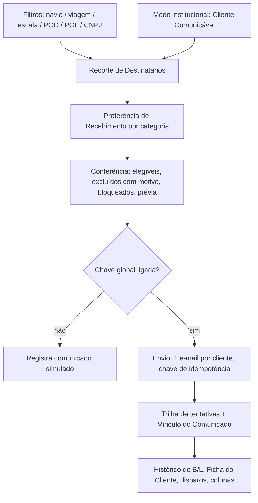
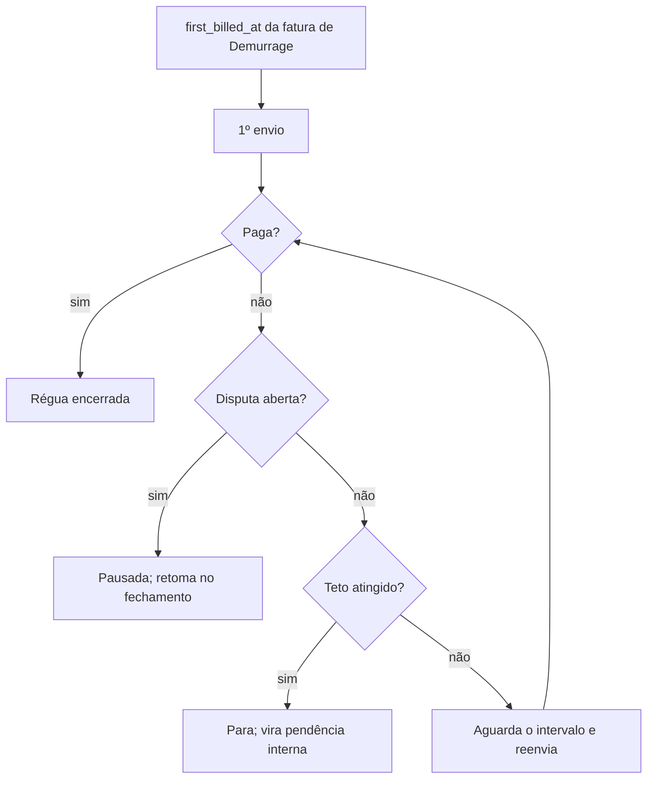

# Comunicação por e-mail com clientes — spec funcional

Issue [#556](https://github.com/luccafwlog/transhippingdesk/issues/556).
Decisões desta spec derivam de uma sessão de grilling com o produto em
2026-08-27. Enquanto o plano derivado não for executado, esta spec é a fonte
das decisões — o código ainda não existe.

## Propósito e escopo

O Portal do Cliente responde o que o cliente vai buscar. Falta o caminho
inverso: a Transhipping enviar mensagem ao **Email de Contato** do cliente.
Hoje esses comunicados saem individualmente, fora do sistema.

Esta spec define um módulo de **Comunicação** dentro de Clientes, com uma tela
onde o usuário interno recorta destinatários por carga, escolhe um Modelo de
Comunicado (ou escreve do zero), **confere a lista** e dispara.

Entram no escopo dois mecanismos:

- **Disparo manual filtrado** — Aviso de Chegada (NOA), Aviso de Atracação
  (NOR), comunicado institucional, e-mail livre, e o resumo de faturas de taxas
  locais por viagem.
- **Régua de Cobrança de Demurrage** — envio recorrente automático a partir do
  primeiro faturamento até a quitação.

Ficam **fora** do escopo:

- O `status='overdue'` de taxas locais. Confirmado com o produto que a taxa
  local **não tem data de vencimento praticada**; o cron
  `mark_overdue_invoices()` (`supabase/migrations/031_overdue_enforcement.sql`)
  classifica faturas por uma regra que a operação não usa. Issue própria. Esta
  spec determina que a comunicação de taxas locais **ignora deliberadamente**
  `invoices.due_date` e `invoices.status='overdue'` — quem alterar isso depois
  precisa reabrir a decisão, não "corrigir" a omissão. **Evidência: Código.**
- Notificação In-App do Portal, que continua existindo e não é substituída.

## Ponto de partida no código

| Fato | Onde | Consequência |
|---|---|---|
| `notify-invoice-issued` existe, está inativa, e há decisão registrada de não enviar e-mail a clientes | `supabase/functions/notify-invoice-issued/index.ts`; `docs/RASTREABILIDADE.md`; `docs/ARCHITECTURE.md` | Esta spec reverte a decisão (ADR 0056). A função é apagada quando o comunicado financeiro entrar |
| Mecânica de envio madura, porém acoplada ao Portal | `supabase/functions/_shared/portalEmail.ts` | Extrair para `_shared/email.ts`; `portalEmail.ts` passa a ser consumidor |
| Pendências de B/L já computadas de forma canônica | `compute_bl_review_pendencies`, migration `128` | Reusar como parte do gate de taxas locais, sem reimplementar |
| Cobertura de CE Mercante já calculada | `voyageCeCoverage()`, `src/services/voyageSummaries.ts` | Reusar o sinal; o gate novo é por cliente, não por viagem |
| Bucket privado com teto e mime types já validado | migration `325`, bucket `demurrage-disputes` | Molde do bucket de anexos |
| `demurrage_invoices.total_usd` é o valor autoritativo; BRL é derivado do PTAX | `src/types/database.ts`; `recalc-demurrage-ptax` | A cobrança comunica USD; BRL é informativo |
| Perfil `equipamentos` não tem nenhuma permissão | `src/hooks/useAuth.tsx` | Esta spec concede a primeira (ADR 0058) |
| Não existe tabela de configuração global | busca em `src/types/database.ts` | A chave de envio nasce como conceito novo (ADR 0057) |

**Evidência: Código** para todas as linhas acima.

## Decisões

### 1. Canal próprio, identidade compartilhada

O Comunicado ao Cliente é canal **distinto** do e-mail transacional do Portal:
trilha própria, lista de supressão própria e chave de envio própria. Compartilha
com o Portal a mecânica de envio, o remetente `portal@` e a identidade visual —
o cliente não deve perceber duas entidades.

Consequência que motiva a separação: um endereço que deu bounce num Convite do
Portal **continua recebendo** Aviso de Chegada, e vice-versa. Supressão de
acesso e supressão de entregabilidade operacional são decisões diferentes.

Registrada na ADR 0056.

### 2. Destinatários e Preferência de Recebimento

Destinatário é o **Email de Contato** (`customer_contacts`), nunca o Email de
Recuperação do Portal — o glossário já separa os dois conceitos.

Cada contato ganha uma **Preferência de Recebimento** em três categorias:

| Categoria | Cobre |
|---|---|
| Operacional | Aviso de Chegada, Aviso de Atracação, avisos operacionais livres |
| Financeiro | Resumo de taxas locais, cobrança de Demurrage |
| Institucional | Funcionamento da agência, recebimento de BLs, comunicados gerais |

Regras:

- Contato novo nasce com as três categorias **ligadas**.
- A preferência é editada na aba Cadastro & Contatos da Ficha do Cliente
  (`src/components/clientes/CadastroContatosTab.tsx`).
- A preferência é **roteamento interno**, não opt-out do cliente: ela nunca
  substitui a conferência.
- O campo `purpose` existente **não** é reaproveitado para isso. Ele é populado
  pelos importadores e lido como `'faturamento'` no perfil do Portal;
  sobrecarregá-lo quebraria significado em uso. **Evidência: Código.**
- Cliente cujos contatos estão todos fora da categoria aparece na conferência
  como **bloqueado, com motivo**. Nunca some da lista em silêncio.

### 3. Recorte de Destinatários

O universo padrão é **carga**, não a tabela `customers`: parte-se de `bls`
filtrada, resolvendo `customer_id` distintos.

Filtros disponíveis, combinados em **E**:

- navio · viagem · escala · porto de descarga (POD) · porto de embarque (POL)
- CNPJ, que **restringe** o resultado; nunca adiciona destinatário fora do
  recorte de carga

O comunicado **institucional** não usa recorte de carga. Ele é um modo separado
e explícito sobre o conjunto **Cliente Comunicável**: cliente com ao menos um
B/L nos últimos 12 meses **e** ao menos um contato com e-mail. Filtro limpo
nunca dispara para a base inteira — o alcance amplo é uma escolha visível.

O termo "manifesto" citado na issue foi retirado: não existe manifesto de
container no sistema (só `granite_manifests`, `vazios_manifests`,
`vazios_importacao_manifests`), e o `CONTEXT.md` é explícito que, para
container, o manifesto não é fonte de ingestão. O refinamento equivalente é a
seleção explícita de B/Ls na própria lista. **Evidência: Código.**

### 4. Conferência antes do disparo

Nenhum disparo é irreversível sem conferência. A etapa mostra:

- contagem de clientes e de e-mails resolvidos;
- por cliente: contatos que recebem, e contatos **excluídos com o motivo**
  (preferência desligada, e-mail ausente, endereço suprimido);
- clientes **bloqueados** com a razão do bloqueio;
- prévia renderizada de um destinatário real;
- desmarcar individual antes de enviar.

Nunca há `to:` com mais de um cliente. Um e-mail por cliente, sempre — mesmo no
comunicado institucional.

### 5. Modelos de Comunicado

| Modelo | Origem do texto | Anexo | Categoria |
|---|---|---|---|
| Aviso de Chegada (NOA) | Fixo no código, versionado em PR | Não | Operacional |
| Aviso de Atracação (NOR) | Fixo no código, versionado em PR | Não | Operacional |
| Resumo de taxas locais | Fixo no código | Não | Financeiro |
| Cobrança de Demurrage | Fixo no código | Não | Financeiro |
| Institucional | Livre, salvável como modelo reutilizável | Sim | Institucional |
| Livre (sem modelo) | Escrito no momento | Sim | Escolhida no disparo |

NOA e NOR são documentos operacionais com peso quase-contratual; deixá-los
editáveis em produção convida a um NOA sem ETA. Ficam no padrão de
`supabase/functions/_shared/portalEmailTemplates.ts`.

O "aviso de atraso" citado na issue **não** é modelo próprio: é e-mail livre.

Todos os modelos renderizam **por cliente**, com variáveis de navio, viagem,
escala, datas e B/Ls do próprio destinatário.

### 6. Unidade dos avisos operacionais

Aviso de Chegada e Aviso de Atracação são **por escala**, nunca por viagem.
Chegada é ATA da Escala; atracação é ATB da Atracação, e ambos são por terminal
— uma viagem com dois terminais tem dois momentos distintos. Enviar NOA de
viagem a quem descarrega em outro porto é comunicado errado.

### 7. Prontidão de Comunicação de Taxas

O resumo de taxas locais é **disparo manual agregado por viagem**, com gate
**por cliente**. Um cliente entra no disparo quando, para **todos** os B/Ls dele
naquela viagem:

1. `bls.ce_mercante` está preenchido; **e**
2. `compute_bl_review_pendencies(bl)` retorna vazio — cliente vinculado,
   cliente com e-mail, acesso ao Portal ativo, peso BB presente em carga solta.

Cliente que não passa fica bloqueado e visível, com o motivo. Os demais clientes
da mesma viagem **não são segurados** por ele.

O risco que o gate protege não é o atraso: é o cliente receber um resumo
**parcial** das faturas dele e pagar achando que quitou a viagem. Gate por
cliente elimina isso inteiramente.

Este gate é **distinto** do gate de revisão. A migration `128` afirma
explicitamente que CE Mercante *não* bloqueia a revisão; a comunicação adiciona
essa exigência por conta própria. Os dois não devem ser fundidos.
**Evidência: Código.**

### 8. Conteúdo dos comunicados financeiros

**Taxas locais.** Lista de B/Ls com valor por B/L, total em BRL, link para o
Portal. **Sem data de vencimento** (não existe vencimento praticado), **sem
PIX** e **sem anexo**: o pagamento acontece no Portal, e QR de pagamento em
e-mail é o vetor que golpes de boleto imitam.

**Demurrage.** `total_usd` como valor da cobrança, mais BRL informativo com
`roe` e data de referência explícitos, e a frase de que o valor em reais é
recalculado no dia do pagamento. Link para o Portal, sem PIX e sem anexo.

### 9. Régua de Cobrança

Único mecanismo automático da spec.

- Dispara em `demurrage_invoices.first_billed_at` — o primeiro faturamento.
  `billed_at` não serve: cada refaturamento por recálculo de PTAX reenviaria
  cobrança como se fosse nova.
- Repete a cada **5 dias** enquanto a cobrança não for paga.
- Intervalo **e teto de envios** são configuráveis na tela do módulo, por
  Administrativo — não por disparo, para não virar decisão de cada operador.
- Atingido o teto, a régua **para** e a cobrança vira pendência interna. Régua
  sem teto gera dezenas de e-mails ao mesmo endereço a partir de `portal@`; a
  reclamação do destinatário pune o domínio inteiro, derrubando junto os
  convites do Portal e os avisos operacionais.
- `dispute_open = true` **pausa** a régua. O fechamento da disputa retoma.
  Cobrar quem está formalmente contestando é problema jurídico, e o dado para
  evitá-lo já está na tabela.

### 10. Deduplicação e reenvio

Em duas camadas:

- **Aviso na conferência** — "este cliente já recebeu Aviso de Chegada para esta
  escala em 27/08 às 14h", e o operador decide. Reenvio legítimo existe (o
  cliente pediu de novo; o endereço estava errado e foi corrigido).
- **Chave de idempotência** por (tipo de comunicado, cliente, âncora), onde a
  âncora é a escala, a viagem ou a fatura. Protege duplo clique e disparo
  concorrente de dois operadores.

Só a primeira camada permitiria a corrida; só a segunda impediria o reenvio
legítimo.

### 11. Vínculo do Comunicado e rastro

Um Comunicado tem **um cliente** e **N B/Ls**, em tabela de ligação espelhando
`invoice_bls`. O comunicado institucional é o **único** sem vínculo — ausência
esperada, não defeito.

Quatro superfícies de leitura:

| Superfície | Pergunta que responde | Onde |
|---|---|---|
| Histórico do B/L | "avisaram da chegada desse B/L?" | `src/components/bl/BlHistoricoTab.tsx` |
| Aba Histórico da Ficha | "o que já comunicamos a este cliente?" | `src/components/clientes/HistoricoTab.tsx` |
| Histórico de disparos | "o que saiu no lote de ontem?" | tela de Comunicação |
| Coluna de estado | "esta fatura já foi comunicada?" | `src/pages/TaxasLocais.tsx`, `src/pages/Demurrage.tsx` |

A coluna de estado mostra:

- em **Demurrage**: o ponto da régua e a próxima data ("3ª cobrança, próxima em
  02/09"), ou o motivo da pausa;
- em **Taxas locais**: data do envio e link para o comunicado;
- em ambos: o **motivo do bloqueio** quando o cliente não passou na Prontidão de
  Comunicação de Taxas. A informação não pode se perder entre duas telas.

Comunicado enviado é evento de **Histórico**, não de **Auditoria** — não tem
justificativa. O glossário já distingue os dois.

### 12. Anexos

Só o comunicado **sem modelo fixo** (institucional e livre) aceita anexo. Isso
mantém o financeiro livre do padrão que golpes imitam.

- Tipos e teto copiam o bucket já validado: `application/pdf`, `image/jpeg`,
  `image/png`, `text/plain`, 10 MB.
- Até **3 arquivos** por comunicado, somando no máximo 10 MB — disparo em massa
  multiplica o peso por destinatário.
- Bucket privado novo `customer-communications`, com policies no molde de
  `demurrage-disputes` (migration `325`).
- O arquivo vai **anexado à mensagem** (bytes), não como link: o destinatário
  não está autenticado e não abriria um bucket privado.
- O arquivo é **persistido** e visível no histórico do comunicado. Sem isso,
  "o que exatamente mandamos para esse cliente em março?" fica sem resposta.

### 13. Chave global de envio

Uma chave única, com **default desligado**, controlada por Administrativo.

- **Escopo:** desliga **todo** o canal de Comunicado — manual e automático.
  Meio-termo não protege: durante o desenvolvimento é justamente o disparo
  manual que alguém clica por engano.
- **Não afeta o Portal.** Convite, reenvio, recuperação de senha e alteração de
  e-mail continuam saindo normalmente. Um canal desligado nunca pode congelar o
  provisionamento do Portal.
- **Comportamento desligado:** a tela funciona inteira — filtros, conferência,
  prévia — e no lugar de enviar **registra o comunicado como simulado**,
  visível no histórico com essa marca. Permite validar o fluxo completo sem
  tocar em cliente real.
- **Faixa permanente** na tela enquanto desligada. Um operador que confere 40
  destinatários, clica em enviar e acha que enviou é pior do que a tela não
  existir.
- Ligar e desligar é auditado em `audit_logs`.

Registrada na ADR 0057.

### 14. Permissão

Uma permissão `customer_communications`, concedida a `administrativo`,
`documentacao` e `equipamentos`. Sem restrição por categoria: qualquer um dos
três dispara qualquer comunicado, e a trilha registra quem fez.

É a **primeira permissão do perfil `equipamentos`**, hoje intencionalmente
vazio. Registrada na ADR 0058.

Reusar `portal_provisioning` amarraria comunicação operacional à governança do
Portal — exatamente o acoplamento que a decisão 1 desfaz.

## Fluxos

## Invariantes

1. Nenhum e-mail sai com mais de um cliente no `to:`.
2. Nenhum disparo manual acontece sem conferência.
3. Filtro vazio nunca resolve para "todos os clientes".
4. A chave global desligada impede **todo** envio do canal e **nenhum** envio do
   Portal.
5. Cliente excluído ou bloqueado sempre aparece na conferência com o motivo.
6. Comunicado financeiro nunca leva PIX nem anexo.
7. A supressão do canal de Comunicado é independente da supressão do Portal.
8. A Régua de Cobrança nunca envia com disputa aberta.
9. Todo comunicado com vínculo aparece no Histórico dos B/Ls vinculados.

## Termos novos

Promovidos ao `CONTEXT.md` neste mesmo change: Comunicado ao Cliente, Modelo de
Comunicado, Disparo de Comunicado, Recorte de Destinatários, Vínculo do
Comunicado, Preferência de Recebimento, Prontidão de Comunicação de Taxas,
Cliente Comunicável, Régua de Cobrança. Aviso de Chegada (NOA) e Aviso de
Atracação (NOR) entram com o termo em português como canônico e a sigla como
sinônimo.

## Decisões arquiteturais

| ADR | Decisão |
|---|---|
| [0056](../adr/0056-canal-de-comunicado-ao-cliente.md) | Canal de Comunicado ao Cliente, revertendo a decisão de não enviar e-mail a clientes |
| [0057](../adr/0057-chave-global-de-envio-desligada-por-padrao.md) | Chave global de envio, desligada por padrão, sem afetar o Portal |
| [0058](../adr/0058-primeira-permissao-do-perfil-equipamentos.md) | Primeira permissão do perfil Equipamentos |

## Execução

O plano derivado ainda não foi escrito. A ordem sugerida, quando for:

1. **Fundação** — extração de `_shared/email.ts`, canal, trilha, supressão,
   Preferência de Recebimento, chave global, permissão, migrations.
2. **Manual** — tela, filtros, conferência, NOA, NOR, institucional, livre,
   anexos, históricos.
3. **Financeiro** — Prontidão de Comunicação de Taxas, resumo por viagem, Régua
   de Cobrança, colunas de estado, remoção de `notify-invoice-issued`.

Nenhuma etapa envia e-mail a cliente real antes de a conferência existir, e a
chave global nasce desligada na etapa 1.

## Notas e divergências

- A issue #556 previa filtro por "manifesto específico". Retirado na decisão 3,
  com a justificativa registrada ali.
- A issue #556 listava "aviso de atraso" entre os modelos. Confirmado com o
  produto que é e-mail livre, não modelo (decisão 5).
- O teto da Régua de Cobrança foi decidido depois de ser levantado como risco de
  entregabilidade; a alternativa sem teto foi considerada e descartada.
- `docs/RASTREABILIDADE.md` e `docs/ARCHITECTURE.md` foram corrigidos neste
  change para apontar esta spec como a reversão da decisão de 2026-06-24.
