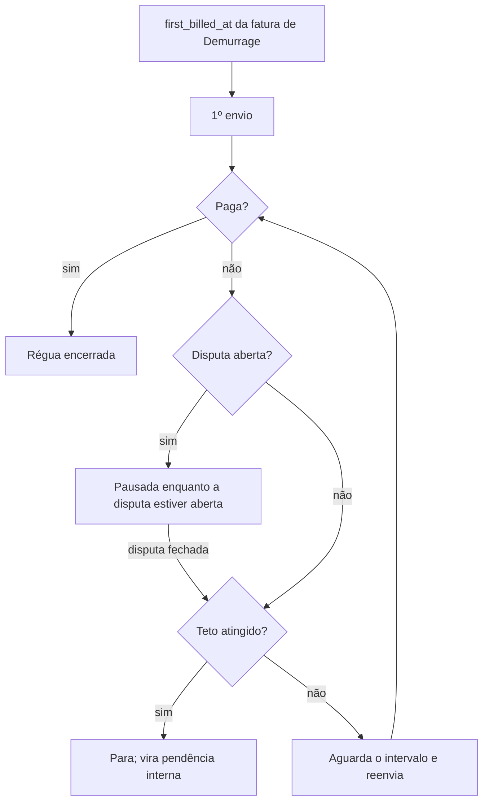

# Comunicação por e-mail com clientes — spec funcional

Issue [#556](https://github.com/luccafwlog/transhippingdesk/issues/556).
Decisões desta spec derivam de uma sessão de grilling com o produto em
2026-08-27. Enquanto o plano derivado não for executado, esta spec é a fonte
das decisões — o código ainda não existe. O plano está em
[`../plans/2026-08-27-comunicacao-email-clientes.md`](../plans/2026-08-27-comunicacao-email-clientes.md),
que registra em "Correções à spec" os três pontos que a leitura do código
obrigou a ajustar aqui.

## Propósito e escopo

O Portal do Cliente responde o que o cliente vai buscar. Falta o caminho
inverso: a Transhipping enviar mensagem ao **Email de Contato** do cliente.
Hoje esses comunicados saem individualmente, fora do sistema.

Esta spec define um módulo de **Comunicação** dentro de Clientes, com uma tela
onde o usuário interno recorta destinatários por carga, escolhe um Modelo de
Comunicado (ou escreve do zero), **confere a lista** e dispara.

Entram no escopo dois mecanismos:

- **Disparo manual filtrado** — Aviso de Chegada (NOA), Aviso de Atracação
  (NOR), comunicado institucional, e-mail livre, e o resumo de faturas de taxas
  locais por viagem.
- **Régua de Cobrança de Demurrage** — envio recorrente automático a partir do
  primeiro faturamento até a quitação.

Ficam **fora** do escopo:

- O `status='overdue'` de taxas locais. Confirmado com o produto que a taxa
  local **não tem data de vencimento praticada**. Levantado aqui, virou a issue
  [#605](https://github.com/luccafwlog/transhippingdesk/issues/605) e **já foi
  resolvido**: a migration `348`, sob a
  [ADR 0055](../adr/0055-taxa-local-sem-vencimento-praticado.md), desagendou o
  cron `mark_overdue_invoices()`, aposentou o detector e **removeu a coluna
  `invoices.due_date` e o status `overdue`**. A comunicação de taxas locais não
  os ignora mais por decisão — eles deixaram de existir. **Evidência: Código.**
- Notificação In-App do Portal, que continua existindo e não é substituída.
- **O autoatendimento do cliente** — o cliente editar seus Emails de Contato e
  escolher quais Naturezas cada um recebe. Levantado com o produto em
  2026-08-27, virou a issue
  [#609](https://github.com/luccafwlog/transhippingdesk/issues/609), com a
  decisão de que ele nunca poderá zerar uma Natureza operacional ou de
  Demurrage. Depende das quatro Naturezas desta spec e entra depois de o canal
  provar que envia. Enquanto isso, a Preferência de Recebimento tem dono
  **interno** (decisão 2).

## Ponto de partida no código

| Fato | Onde | Consequência |
|---|---|---|
| `notify-invoice-issued` existe, está inativa, e há decisão registrada de não enviar e-mail a clientes | `supabase/functions/notify-invoice-issued/index.ts`; `docs/RASTREABILIDADE.md`; `docs/ARCHITECTURE.md` | Esta spec reverte a decisão (ADR 0058). A função é apagada quando o comunicado financeiro entrar |
| Mecânica de envio madura, porém acoplada ao Portal | `supabase/functions/_shared/portalEmail.ts` | Extrair para `_shared/email.ts`; `portalEmail.ts` passa a ser consumidor |
| Pendências de B/L já computadas de forma canônica | `compute_bl_review_pendencies(p_customer_id, p_cargo_mode, p_bb_weight_ton)`, nascida na migration `128` e vigente na `337` | Reusar como parte do gate de taxas locais, sem reimplementar. `EXECUTE` só para `service_role`: o gate é avaliado no servidor, não no cliente |
| Cobertura de CE Mercante já calculada | `voyageCeCoverage()`, `src/services/voyageSummaries.ts` | Reusar o sinal; o gate novo é por cliente, não por viagem |
| Bucket privado com teto e mime types já validado | migration `325`, bucket `demurrage-disputes` | Molde do bucket de anexos |
| `demurrage_invoices.total_usd` é o valor autoritativo; BRL é derivado do PTAX | `src/types/database.ts`; `recalc-demurrage-ptax` | A cobrança comunica USD; BRL é informativo |
| Perfil `equipamentos` não tem nenhuma permissão | `src/hooks/useAuth.tsx` | Esta spec concede a primeira (ADR 0060) |
| Não existe tabela de configuração global | busca em `src/types/database.ts` | A chave de envio nasce como conceito novo (ADR 0059) |

**Evidência: Código** para todas as linhas acima.

## Decisões

### 1. Canal próprio, identidade compartilhada

O Comunicado ao Cliente é canal **distinto** do e-mail transacional do Portal:
trilha própria, lista de supressão própria e chave de envio própria. Compartilha
com o Portal a mecânica de envio, o remetente `portal@` e a identidade visual —
o cliente não deve perceber duas entidades.

Consequência que motiva a separação: um endereço marcado como spam num Convite
do Portal **continua recebendo** Aviso de Chegada, e vice-versa. Supressão de
acesso e supressão de entregabilidade operacional são decisões diferentes.

**Exceção: o bounce permanente é compartilhado.** `portal_suppressed_emails`
já distingue os dois motivos (`reason IN ('bounce_permanente','complaint')`,
migration `178`). Um `bounce_permanente` diz que a caixa **não existe**, e isso
não é opinião de canal nenhum: continuar mirando esse endereço pelo Comunicado
degrada a reputação do domínio de `portal@`, que é o mesmo remetente — o risco
exato que o teto da decisão 9 existe para evitar. Endereço com
`bounce_permanente` em qualquer canal fica bloqueado nos dois; `complaint` e
Preferência de Recebimento permanecem por canal. **Evidência: Código.**

Registrada na ADR 0058.

### 2. Destinatários e Preferência de Recebimento

Destinatário é o **Email de Contato** (`customer_contacts`), nunca o Email de
Recuperação do Portal — o glossário já separa os dois conceitos.

**Todo Comunicado tem exatamente uma Natureza.** É a Natureza — não o modelo —
que decide se um contato recebe, e são quatro:

| Natureza | Cobre | Modelos de hoje |
|---|---|---|
| **Avisos gerais** | Funcionamento da agência, recebimento de B/Ls, comunicados da empresa | institucional, livre |
| **Avisos operacionais** | Movimento do navio | Aviso de Chegada (NOA), Aviso de Atracação (NOR) |
| **Documentação** | O que nasce do despacho | Resumo de taxas locais; CE Mercante quando existir |
| **Demurrage** | Ciclo da sobre-estadia | Cobrança de Demurrage; disputa e devolução de container quando existirem |

A Natureza é eixo **separado** do modelo, não sinônimo dele: cada Modelo de
Comunicado mapeia para exatamente uma Natureza, e o mapeamento é dado explícito,
não regra na cabeça de quem dispara. É isso que permite acrescentar CE Mercante,
disputa e devolução de container depois, como Modelo novo apontando para Natureza
existente, **sem recortar a tabela de preferências outra vez**.

Cada contato ganha uma **Preferência de Recebimento** por Natureza.

Regras:

- Comunicado sem Natureza não é montado nem enviado.
- Contato novo nasce com as quatro Naturezas **ligadas**.
- A preferência é editada na aba Cadastro & Contatos da Ficha do Cliente
  (`src/components/clientes/CadastroContatosTab.tsx`).
- A preferência é, **nesta spec**, roteamento interno: ela nunca substitui a
  conferência. O dono passa a ser o cliente na issue
  [#609](https://github.com/luccafwlog/transhippingdesk/issues/609), que só entra
  depois — e mesmo lá o cliente não poderá zerar uma Natureza operacional ou de
  Demurrage. Para que aquela issue distinga as duas mãos sem inventar histórico,
  `customer_contact_preferences` já nasce com a coluna `source`
  (`interno` | `cliente`).
- O campo `purpose` existente **não** é reaproveitado para isso. Ele é populado
  pelos importadores e lido como `'faturamento'` no perfil do Portal;
  sobrecarregá-lo quebraria significado em uso. **Evidência: Código.**
- Cliente cujos contatos estão todos fora da Natureza aparece na conferência
  como **bloqueado, com motivo**. Nunca some da lista em silêncio.

### 3. Recorte de Destinatários

O universo padrão é **carga**, não a tabela `customers`: parte-se de `bls`
filtrada, resolvendo `customer_id` distintos.

Filtros disponíveis, combinados em **E**:

- navio · viagem · escala · porto de descarga (POD) · porto de embarque (POL)
- CNPJ, que **restringe** o resultado; nunca adiciona destinatário fora do
  recorte de carga

**Nenhum filtro selecionado não resolve para todos os B/Ls.** No modo carga, o
recorte exige ao menos um filtro de carga (navio, viagem, escala, POD ou POL);
CNPJ sozinho não serve, porque ele só restringe. Sem isso o invariante 3 não
teria mecanismo neste modo: `bls` sem `WHERE` é a base inteira, e o alcance
amplo deixaria de ser escolha visível. Filtro vazio deixa a conferência vazia,
com o motivo — nunca com a base toda.

O comunicado **institucional** não usa recorte de carga. Ele é um modo separado
e explícito sobre o conjunto **Cliente Comunicável**: cliente com ao menos um
B/L cuja Escala tenha **ETA a partir de doze meses atrás** — a janela tem
limite só para trás, nenhum para frente — **e** ao menos um contato com e-mail.
A janela é medida pelo **ETA da Escala** do B/L, não por data de cadastro nem
por data de emissão do conhecimento: mede quando houve operação, e um B/L já
cadastrado para viagem futura conta, porque o cliente está ativo. Ler a janela
como "ETA nos últimos doze meses", com teto em `now()`, excluiria exatamente
esse B/L futuro. Filtro limpo
nunca dispara para a base inteira — o alcance amplo é uma escolha visível.

O termo "manifesto" citado na issue foi retirado: não existe manifesto de
container no sistema (só `granite_manifests`, `vazios_manifests`,
`vazios_importacao_manifests`), e o `CONTEXT.md` é explícito que, para
container, o manifesto não é fonte de ingestão. O refinamento equivalente é a
seleção explícita de B/Ls na própria lista. **Evidência: Código.**

### 4. Conferência antes do disparo

Nenhum disparo é irreversível sem conferência. A etapa mostra:

- contagem de clientes e de e-mails resolvidos;
- por cliente: contatos que recebem, e contatos **excluídos com o motivo**
  (preferência desligada, e-mail ausente, endereço suprimido);
- clientes **bloqueados** com a razão do bloqueio;
- prévia renderizada de um destinatário real;
- desmarcar individual antes de enviar.

Nunca há `to:` com mais de um cliente. Um e-mail por cliente, sempre — mesmo no
comunicado institucional.

### 5. Modelos de Comunicado

| Modelo | Origem do texto | Anexo | Natureza |
|---|---|---|---|
| Aviso de Chegada (NOA) | Fixo no código, versionado em PR | Sim | Avisos operacionais |
| Aviso de Atracação (NOR) | Fixo no código, versionado em PR | Sim | Avisos operacionais |
| Resumo de taxas locais | Fixo no código | Não | Documentação |
| Cobrança de Demurrage | Fixo no código | Não | Demurrage |
| Institucional | Livre, salvável como modelo reutilizável | Sim | Avisos gerais |
| Livre (sem modelo) | Escrito no momento | Sim | Escolhida no disparo |

NOA e NOR são documentos operacionais com peso quase-contratual; deixá-los
editáveis em produção convida a um NOA sem ETA. Ficam no padrão de
`supabase/functions/_shared/portalEmailTemplates.ts`.

O "aviso de atraso" citado na issue **não** é modelo próprio: é e-mail livre.

NOA e NOR saem em **inglês** — são documentos de mercado marítimo. Todos os
demais comunicados saem em pt-BR.

**Nota editorial de 2026-08-27** (plano derivado): a tabela marcava "Anexo: Não"
para NOA e NOR. O produto decidiu o contrário — os dois aceitam anexo. Isso não
fere o invariante 6, que proíbe anexo e PIX apenas no **resumo de taxas locais e
na cobrança de Demurrage**; ver a nota da decisão 12.

Todos os modelos renderizam **por cliente**, com variáveis de navio, viagem,
escala, datas e B/Ls do próprio destinatário.

### 6. Unidade dos avisos operacionais

Nenhum dos dois avisos é por viagem. Enviar NOA de viagem a quem descarrega em
outro porto é comunicado errado.

Eles não têm, porém, a **mesma** unidade — o `CONTEXT.md` separa as duas donas:
a Escala é dona de ETA e ATA, a Atracação é dona de ETB, ATB, ETD e ATD.

- **Aviso de Chegada é por Escala**, ancorado no **ETA** da Escala.
- **Aviso de Atracação é por Atracação**, ancorado no ATB — uma Escala com dois
  terminais tem duas Atracações, dois ATBs e **dois** Avisos de Atracação.

Ancorar o NOR na Escala colapsaria os dois terminais num comunicado só, que é o
mesmo erro que esta decisão existe para evitar, um nível abaixo.

**O Aviso de Chegada é antecipatório e comunica o ETA.** Ele sai **cinco dias
antes do ETA** da Escala, informando essa previsão. Não é o ATA: quando o ATA
existe, o navio já chegou e o aviso perdeu a função. O Aviso de Atracação é o
único reativo, disparado no dia da atracação com a data e hora do ATB.

| Aviso | Unidade | Data que comunica | Quando sai |
|---|---|---|---|
| Aviso de Chegada (NOA) | Escala | ETA da Escala | ETA − 5 dias |
| Aviso de Atracação (NOR) | Atracação | ATB da Atracação | Dia da atracação |

**ETA que muda depois do envio não refaz nada.** O Comunicado informa o ETA
vigente no disparo e encerra. O reenvio manual continua disponível pela
confirmação da decisão 10, que incrementa o discriminador, mas o sistema não
cobra nem dispara sozinho.

Como o Aviso de Chegada é uma contagem regressiva contra data futura, ninguém
percebe sozinho que faltam cinco dias: o plano derivado cria os alertas
`comunicado_noa_pendente` e `comunicado_nor_pendente` para cobrar os dois
disparos.

**Notas editoriais de 2026-08-27** (plano derivado), três correções nesta
decisão:

1. A redação anterior dizia "ambos são por escala" no título e "ATB da
   Atracação" no corpo. A leitura do `CONTEXT.md` forçou a distinção acima entre
   as duas unidades.
2. A redação anterior dizia "Chegada é ATA da Escala". Está errado: confirmado
   com o produto que o NOA sai cinco dias **antes** do ETA e comunica o ETA.
3. A Escala **não tem chave substituta**: é o par `(Viagem, porto)` projetado de
   `voyages.pod_schedule_snapshot`, e é esse par que serve de âncora do NOA.
   **Evidência: Código.**

### 7. Prontidão de Comunicação de Taxas

O resumo de taxas locais é **disparo manual agregado por viagem**, com gate
**por cliente**. Um cliente entra no disparo quando, para **todos** os B/Ls dele
naquela viagem:

1. `bls.ce_mercante` está preenchido; **e**
2. `compute_bl_review_pendencies(customer_id, cargo_mode, bb_weight_ton)` do
   B/L retorna vazio — cliente vinculado, cliente com e-mail, acesso ao Portal
   ativo, peso BB presente em carga solta. Essa é a assinatura viva (migration
   `337`); a variante `(p_bl_id TEXT)` da `128` existe mas está sem `GRANT`
   desde a `129`, e não deve ser usada. Como o `EXECUTE` é só de
   `service_role`, o gate roda no servidor. **Evidência: Código.**
3. o **faturamento do B/L está concluído** — `bls.financial_status` é
   `invoiced` ou `paid`. B/L ainda em `pending` segura o cliente; B/L
   `cancelled` fica fora do resumo e não segura ninguém.

> **Nota editorial (2026-08-28).** A condição 3 não estava na primeira versão
> desta decisão, e sem ela o gate não cumpria o que o parágrafo seguinte
> promete: `compute_bl_review_pendencies` (migration `128`) olha cliente,
> contato, Portal e peso BB, e **não** olha estado de taxa nem de fatura. Um
> B/L com taxa ainda não emitida passava nas duas primeiras condições e saía
> ausente do resumo — o resumo parcial que o gate existe para impedir. Apontado
> no review da PR #604. **Evidência: Código.**

Cliente que não passa fica bloqueado e visível, com o motivo. Os demais clientes
da mesma viagem **não são segurados** por ele.

O risco que o gate protege não é o atraso: é o cliente receber um resumo
**parcial** das faturas dele e pagar achando que quitou a viagem. Gate por
cliente elimina isso inteiramente.

Este gate é **distinto** do gate de revisão. A migration `128` afirma
explicitamente que CE Mercante *não* bloqueia a revisão; a comunicação adiciona
essa exigência por conta própria. Os dois não devem ser fundidos.
**Evidência: Código.**

### 8. Conteúdo dos comunicados financeiros

**Taxas locais.** Lista de B/Ls com valor por B/L, total em BRL, link para o
Portal. **Sem data de vencimento** (a taxa local não tem vencimento: ADR 0055,
migration `348`), **sem PIX** e **sem anexo**: o pagamento acontece no Portal, e QR de pagamento em
e-mail é o vetor que golpes de boleto imitam.

**Demurrage.** `total_usd` como valor da cobrança, mais BRL informativo com
`roe` e data de referência explícitos, e a frase de que o valor em reais é
recalculado no dia do pagamento. Link para o Portal, sem PIX e sem anexo.

### 9. Régua de Cobrança

Único mecanismo automático da spec.

- Dispara em `demurrage_invoices.first_billed_at` — o primeiro faturamento.
  `billed_at` não serve: cada refaturamento por recálculo de PTAX reenviaria
  cobrança como se fosse nova.
- Repete a cada **5 dias** enquanto a cobrança não for paga.
- Intervalo **e teto de envios** são configuráveis na tela do módulo, por
  Administrativo — não por disparo, para não virar decisão de cada operador. Os
  valores de fábrica são **5 dias** e **6 envios**: a 1ª cobrança sai no
  `first_billed_at` e as cinco seguintes a cada 5 dias, de modo que a 6ª cai no
  **25º dia** e a fatura vira pendência interna a partir dali.
- Atingido o teto, a régua **para** e a cobrança vira pendência interna. Régua
  sem teto gera dezenas de e-mails ao mesmo endereço a partir de `portal@`; a
  reclamação do destinatário pune o domínio inteiro, derrubando junto os
  convites do Portal e os avisos operacionais.
- `dispute_open = true` **pausa** a régua. O fechamento da disputa retoma.
  Cobrar quem está formalmente contestando é problema jurídico, e o dado para
  evitá-lo já está na tabela.

**Nota editorial de 2026-08-27** (plano derivado): a redação anterior somava
"trinta dias" a partir de 5 dias × 6 envios. São **25**: o primeiro envio é o
`first_billed_at`, e só os cinco restantes pagam o intervalo. O número de
envios continua sendo o parâmetro configurável; o total de dias é consequência
dele, não um segundo ajuste.

### 10. Deduplicação e reenvio

Em duas camadas:

- **Aviso na conferência** — "este cliente já recebeu Aviso de Chegada para esta
  escala em 27/08 às 14h", e o operador decide. Reenvio legítimo existe (o
  cliente pediu de novo; o endereço estava errado e foi corrigido).
- **Chave de idempotência** por (tipo de comunicado, cliente, âncora,
  **discriminador de tentativa**), onde a âncora é a escala, a viagem ou a
  fatura. Protege duplo clique e disparo concorrente de dois operadores.

O discriminador não é detalhe de implementação: sem ele a chave é constante por
âncora, e a Régua de Cobrança da decisão 9 fica **impossível a partir do segundo
envio** — a âncora é a fatura, a régua repete a cada 5 dias sobre a mesma
fatura, e a 2ª cobrança reusaria a chave da 1ª. O reenvio legítimo que a
primeira camada existe para permitir cairia junto.

| Comunicado | Discriminador |
|---|---|
| Régua de Cobrança | número da cobrança na régua (1ª, 2ª, 3ª…) |
| Demais comunicados | número do reenvio, `0` no primeiro disparo |

O número do reenvio só incrementa quando o operador **confirma** o reenvio no
aviso da primeira camada. Duplo clique e disparo concorrente não confirmam nada,
continuam com o mesmo discriminador e continuam colidindo — que é o
comportamento desejado.

Só a primeira camada permitiria a corrida; só a segunda, sem discriminador,
impediria o reenvio legítimo e a própria régua.

### 11. Vínculo do Comunicado e rastro

Um Comunicado tem **um cliente** e **N B/Ls**, em tabela de ligação espelhando
`invoice_bls`. O comunicado institucional é o **único** sem vínculo — ausência
esperada, não defeito.

Quatro superfícies de leitura:

| Superfície | Pergunta que responde | Onde |
|---|---|---|
| Histórico do B/L | "avisaram da chegada desse B/L?" | `src/components/bl/BlHistoricoTab.tsx` |
| Aba Histórico da Ficha | "o que já comunicamos a este cliente?" | `src/components/clientes/HistoricoTab.tsx` |
| Histórico de disparos | "o que saiu no lote de ontem?" | tela de Comunicação |
| Coluna de estado | "esta fatura já foi comunicada?" | `src/pages/TaxasLocais.tsx`, `src/pages/Demurrage.tsx` |

A coluna de estado mostra:

- em **Demurrage**: o ponto da régua e a próxima data ("3ª cobrança, próxima em
  02/09"), ou o motivo da pausa;
- em **Taxas locais**: data do envio e link para o comunicado;
- em ambos: o **motivo do bloqueio** quando o cliente não passou na Prontidão de
  Comunicação de Taxas. A informação não pode se perder entre duas telas.

Comunicado enviado é evento de **Histórico**, não de **Auditoria** — não tem
justificativa. O glossário já distingue os dois.

### 12. Anexos

Todo comunicado aceita anexo, **exceto o resumo de taxas locais e a cobrança de
Demurrage**. É esse par que fica livre do padrão que golpes de boleto imitam, e
essa é a única razão de a restrição existir. A proibição é dos **dois modelos**,
não da Natureza que os agrupa — depois da decisão 2 eles nem dividem mais
Natureza, e o resto de Documentação e de Demurrage aceita anexo normalmente.

**Nota editorial de 2026-08-27** (plano derivado): esta decisão restringia o
anexo ao institucional e ao livre. O produto liberou NOA e NOR, que são
operacionais, e a proibição não é sobre finanças em geral. A que sobra é a dos
dois modelos nomeados acima, e o invariante 6 continua intacto.

- Tipos e teto copiam o bucket já validado: `application/pdf`, `image/jpeg`,
  `image/png`, `text/plain`, 10 MB.
- Até **3 arquivos** por comunicado, somando no máximo 10 MB — disparo em massa
  multiplica o peso por destinatário.
- Bucket privado novo `customer-communications`, com policies no molde de
  `demurrage-disputes` (migration `325`).
- O arquivo vai **anexado à mensagem** (bytes), não como link: o destinatário
  não está autenticado e não abriria um bucket privado.
- O arquivo é **persistido** e visível no histórico do comunicado. Sem isso,
  "o que exatamente mandamos para esse cliente em março?" fica sem resposta.

### 13. Chave global de envio

Uma chave única, com **default desligado**, controlada por Administrativo.

- **Escopo:** desliga **todo** o canal de Comunicado — manual e automático.
  Meio-termo não protege: durante o desenvolvimento é justamente o disparo
  manual que alguém clica por engano.
- **Não afeta o Portal.** Convite, reenvio, recuperação de senha e alteração de
  e-mail continuam saindo normalmente. Um canal desligado nunca pode congelar o
  provisionamento do Portal.
- **Comportamento desligado:** a tela funciona inteira — filtros, conferência,
  prévia — e no lugar de enviar **registra o comunicado como simulado**,
  visível no histórico com essa marca. Permite validar o fluxo completo sem
  tocar em cliente real.
- **Faixa permanente** na tela enquanto desligada. Um operador que confere 40
  destinatários, clica em enviar e acha que enviou é pior do que a tela não
  existir.
- Ligar e desligar é auditado em `audit_logs`.

Registrada na ADR 0059.

### 14. Permissão

Uma permissão `customer_communications`, concedida a `administrativo`,
`documentacao` e `equipamentos`. Sem restrição por Natureza: qualquer um dos
três dispara qualquer comunicado, e a trilha registra quem fez.

**Disparar não é ligar o canal.** Ligar e desligar a chave global da decisão 13
é ato exclusivo de `administrativo`, e `customer_communications` não o autoriza:
sem uma segunda guarda, um usuário de `documentacao` com acesso ao módulo
ligaria o envio real. A chave é lida por todos os três perfis — a faixa
permanente depende disso — e escrita apenas por `administrativo`, verificado no
servidor, não só na tela. `financeiro` fica de fora do módulo por ora: o
Comunicado financeiro é redação operacional de quem opera a viagem e a cobrança,
não lançamento contábil, e a permissão pode ser estendida sem ADR nova se o
produto decidir o contrário.

É a **primeira permissão do perfil `equipamentos`**, hoje intencionalmente
vazio. Registrada na ADR 0060.

Reusar `portal_provisioning` amarraria comunicação operacional à governança do
Portal — exatamente o acoplamento que a decisão 1 desfaz.

## Fluxos

## Invariantes

1. Nenhum e-mail sai com mais de um cliente no `to:`.
2. Nenhum disparo manual acontece sem conferência.
3. Filtro vazio nunca resolve para "todos os clientes".
4. A chave global desligada impede **todo** envio do canal e **nenhum** envio do
   Portal.
5. Cliente excluído ou bloqueado sempre aparece na conferência com o motivo.
6. Resumo de taxas locais e cobrança de Demurrage nunca levam PIX nem anexo.
   O invariante é ancorado nesses **dois modelos**, não no nome da categoria que
   os agrupa: quando "financeiro" se dividiu em Documentação e Demurrage
   (decisão 2), um invariante escrito sobre o nome teria deixado de cobrir os
   dois sem ninguém decidir isso. E a regra nunca foi sobre finanças em geral —
   é sobre não imitar o padrão de golpe de boleto, que é próprio desses dois.
7. A supressão por `complaint` do canal de Comunicado é independente da do
   Portal; a supressão por `bounce_permanente` vale para os dois canais.
8. A Régua de Cobrança nunca envia com disputa aberta.
9. Todo comunicado com vínculo aparece no Histórico dos B/Ls vinculados.
10. Todo Comunicado tem exatamente uma Natureza, e cada Modelo mapeia para uma
    só. Comunicado sem Natureza não é montado nem enviado.

## Termos novos

Treze termos promovidos ao `CONTEXT.md` neste mesmo change: Comunicado ao
Cliente, Natureza do Comunicado, Modelo de Comunicado, Disparo de Comunicado,
Recorte de Destinatários, Vínculo do Comunicado, Preferência de Recebimento,
Prontidão de Comunicação de Taxas, Cliente Comunicável, Régua de Cobrança e
Chave de envio de Comunicados.
Aviso de Chegada (NOA) e Aviso de Atracação (NOR) entram com o termo em
português como canônico e a sigla como sinônimo.

## Decisões arquiteturais

| ADR | Decisão |
|---|---|
| [0058](../adr/0058-canal-de-comunicado-ao-cliente.md) | Canal de Comunicado ao Cliente, revertendo a decisão de não enviar e-mail a clientes |
| [0059](../adr/0059-chave-global-de-envio-desligada-por-padrao.md) | Chave global de envio, desligada por padrão, sem afetar o Portal |
| [0060](../adr/0060-primeira-permissao-do-perfil-equipamentos.md) | Primeira permissão do perfil Equipamentos |

## Execução

O plano derivado está em
[`../plans/2026-08-27-comunicacao-email-clientes.md`](../plans/2026-08-27-comunicacao-email-clientes.md),
em três blocos, uma PR por bloco:

1. **Fundação** — extração de `_shared/email.ts`, canal, trilha, supressão,
   Preferência de Recebimento, chave global, permissão, migrations.
2. **Manual** — tela, filtros, conferência, NOA, NOR, institucional, livre,
   anexos, históricos.
3. **Financeiro** — Prontidão de Comunicação de Taxas, resumo por viagem, Régua
   de Cobrança, colunas de estado, remoção de `notify-invoice-issued`.

**Nota editorial de 2026-08-27 — a `notify-invoice-issued` é apagada inteira.**
Esta seção exigia dar destino explícito à metade interna da função, o
`alerta_critico` enviado a `admin`, `administrativo` e `documentacao` quando a
fatura sai sem Conta de Portal ativa, e afirmava que apagá-la silenciaria um
aviso vivo. O plano derivado leu o código e as duas premissas caem:

- **A metade interna nunca rodou.** O `alerta_critico` está dentro da função,
  depois da autenticação do webhook. Sem Database Webhook e sem
  `RESEND_API_KEY`, o webhook nunca dispara. É intenção dormente, não aviso vivo.
- **A mesma condição já produz alerta.** `upsert_portal_invoice_exception()`
  (migration `325`, herdando a `189`) roda por trigger na emissão e grava
  `portal_excecao_critica_fatura` — "Invoice emitida sem Portal ativo ou email
  de recuperação utilizável" —, com ciclo de vida completo e destino no B/L.

A função é apagada por inteiro, e o alerta existente é o substituto. A única
perda é de roteamento, não de visibilidade: todo perfil interno já **vê** o
alerta (leitura interna é global, ADR 0044/0046), e o plano amplia
`audience_departments` para incluir `administrativo`. **Evidência: Código.**

Nenhuma etapa envia e-mail a cliente real antes de a conferência existir, e a
chave global nasce desligada na etapa 1.

## Notas e divergências

- A issue #556 previa filtro por "manifesto específico". Retirado na decisão 3,
  com a justificativa registrada ali.
- A issue #556 listava "aviso de atraso" entre os modelos. Confirmado com o
  produto que é e-mail livre, não modelo (decisão 5).
- O teto da Régua de Cobrança foi decidido depois de ser levantado como risco de
  entregabilidade; a alternativa sem teto foi considerada e descartada.
- Cinco pontos foram corrigidos por notas editoriais de 2026-08-27, ao escrever
  o plano derivado e na rodada de perguntas ao produto que o precedeu: a unidade
  do Aviso de Atracação e a ausência de chave substituta da Escala (decisão 6),
  a âncora do Aviso de Chegada no ETA e não no ATA (decisão 6), o anexo em NOA e
  NOR (decisões 5 e 12) e o destino da `notify-invoice-issued` (seção Execução).
- O idioma dos avisos operacionais, os valores de fábrica da Régua e a janela do
  Cliente Comunicável foram definidos na mesma rodada e estão registrados nas
  decisões 5, 9 e 3.
- `docs/RASTREABILIDADE.md` e `docs/ARCHITECTURE.md` foram corrigidos neste
  change para apontar esta spec como a reversão da decisão de 2026-06-24.
